# Fundamentals of Machine Learning: A Comprehensive Curriculum

Welcome to the **Fundamentals of Machine Learning** course materials. This document serves as a complete, step-by-step teaching guide designed to introduce students to the core paradigms, algorithms, mathematics, and practical implementations of machine learning.

---

## Course Roadmap

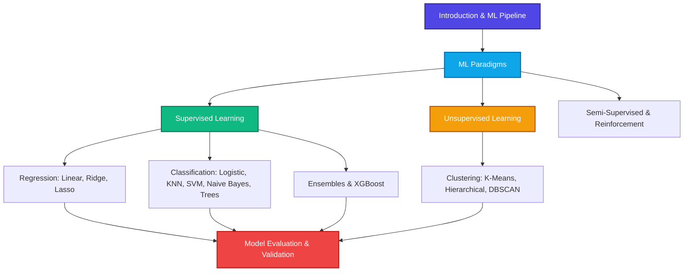

---

## Module 1: Introduction to Machine Learning

### 1.1 What is Machine Learning?
Traditional programming requires a human developer to write explicit rules (code) that process inputs to produce outputs. In contrast, **Machine Learning (ML)** is a paradigm where an algorithm learns the underlying rules directly from data.

```
Traditional Programming:
[Data] + [Rules/Algorithms] ---> (Computer) ---> [Results]

Machine Learning:
[Data] + [Results/Labels]     ---> (Computer) ---> [Rules/Model]
```

### 1.2 The Machine Learning Pipeline
Every ML project follows a structured workflow:

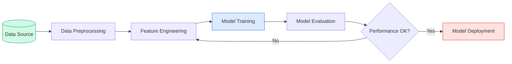

1. **Data Acquisition**: Collecting raw data (structured tables, text, images).
2. **Preprocessing**: Handling missing values, removing duplicates, and scaling numerical features.
3. **Feature Engineering**: Creating new variables or transforming existing ones (e.g., one-hot encoding categorical variables) to help the model learn.
4. **Model Training**: Feeding data to the algorithm to optimize its internal weights.
5. **Model Evaluation**: Testing the model on unseen data using metrics like Accuracy or Mean Squared Error.
6. **Deployment**: Integrating the trained model into a production environment.

---

## Module 2: The Four Learning Paradigms

Machine learning is broadly categorized into four paradigms based on the presence and nature of feedback during training.

| Paradigm | Data Input | Core Goal | Common Algorithms | Real-World Example |
| :--- | :--- | :--- | :--- | :--- |
| **Supervised** | Labeled Data $(X, y)$ | Predict target $y$ from features $X$ | Linear Regression, SVM, Random Forest | Credit scoring, Spam filtering |
| **Unsupervised** | Unlabeled Data $(X)$ | Find hidden patterns or groupings | K-Means, PCA, DBSCAN | Customer segmentation |
| **Semi-Supervised** | Tiny Labeled + Large Unlabeled | Leverage unlabeled data to boost learning | Label Propagation, Self-Training | Medical imaging annotation |
| **Reinforcement** | Environment & Rewards | Learn optimal policy via trial-and-error | Q-Learning, Deep Q-Networks (DQN) | Autonomous driving, AlphaGo |

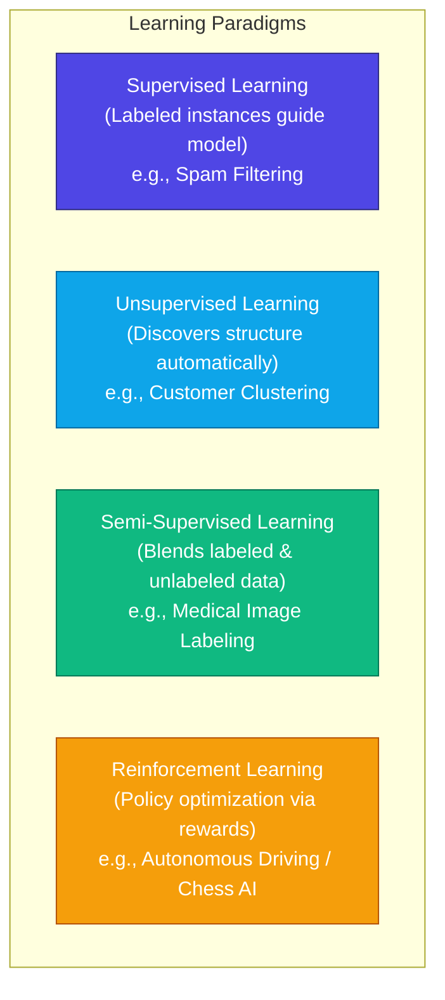

---

## Module 3: Supervised Learning - Regression

Regression models predict a continuous numeric output (e.g., salary, temperature, house prices).

### 3.1 Simple and Multiple Linear Regression
Linear Regression assumes a linear relationship between the input features $X$ and the target $y$.

#### Mathematical Formulation
The prediction equation is:
$$\hat{y} = \theta_0 + \theta_1 x_1 + \theta_2 x_2 + \dots + \theta_n x_n = \theta^T X$$

Where:
* $\hat{y}$ is the predicted value.
* $\theta_0$ is the intercept (bias).
* $\theta_j$ are the feature weights (coefficients).
* $x_j$ are the feature values.

The model is optimized by minimizing the **Mean Squared Error (MSE)** cost function:
$$J(\theta) = \frac{1}{2m} \sum_{i=1}^{m} \left( h_\theta(x^{(i)}) - y^{(i)} \right)^2$$

Using **Gradient Descent**, parameters are updated iteratively:
$$\theta_j := \theta_j - \alpha \frac{\partial}{\partial \theta_j} J(\theta)$$

### 3.2 Regularization: Ridge & Lasso
When a model has too many parameters, it might overfit. **Regularization** adds a penalty term to the cost function to constrain the weights.

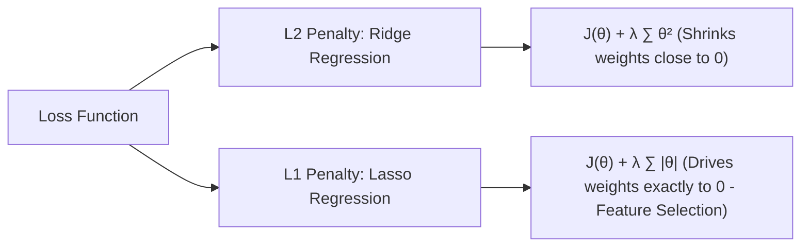

#### Ridge Regression ($L_2$ Regularization)
Adds the sum of squared weights as a penalty:
$$J_{\text{Ridge}}(\theta) = J(\theta) + \lambda \sum_{j=1}^{n} \theta_j^2$$
* **Effect**: Shrinks coefficients toward zero, reducing variance, but never makes them exactly zero.

#### Lasso Regression ($L_1$ Regularization)
Adds the sum of absolute weights as a penalty:
$$J_{\text{Lasso}}(\theta) = J(\theta) + \lambda \sum_{j=1}^{n} |\theta_j|$$
* **Effect**: Drives less important feature weights to exactly zero. Useful for **feature selection**.

### 3.3 Python Implementation
```python
import numpy as np
from sklearn.linear_model import LinearRegression, Ridge, Lasso
from sklearn.model_selection import train_test_split
from sklearn.metrics import mean_squared_error

# Generate synthetic dataset
X = np.random.rand(100, 5)
y = 3 * X[:, 0] + 1.5 * X[:, 1] + np.random.randn(100) * 0.1

X_train, X_test, y_train, y_test = train_test_split(X, y, test_size=0.2, random_state=42)

# Fit Ordinary Least Squares Linear Regression
ols = LinearRegression()
ols.fit(X_train, y_train)
print(f"OLS MSE: {mean_squared_error(y_test, ols.predict(X_test)):.4f}")

# Fit Ridge Regression (L2)
ridge = Ridge(alpha=1.0)
ridge.fit(X_train, y_train)
print(f"Ridge MSE: {mean_squared_error(y_test, ridge.predict(X_test)):.4f}")

# Fit Lasso Regression (L1)
lasso = Lasso(alpha=0.1)
lasso.fit(X_train, y_train)
print(f"Lasso MSE: {mean_squared_error(y_test, lasso.predict(X_test)):.4f}")
```

---

## Module 4: Supervised Learning - Classification

Classification models predict discrete class labels (e.g., Spam vs. Not Spam, Cat vs. Dog vs. Bird).

### 4.1 Logistic Regression
Despite its name, Logistic Regression is used for binary classification. It maps real-valued outputs to probabilities between $0$ and $1$ using the **Sigmoid function**.

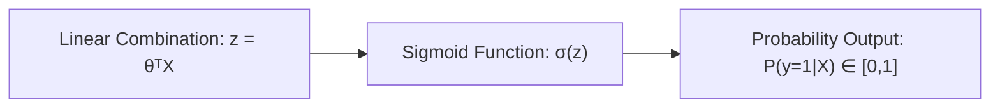

#### Mathematical Formulation
The Sigmoid function $\sigma(z)$ is defined as:
$$\sigma(z) = \frac{1}{1 + e^{-z}}$$

The objective is to minimize the **Binary Cross-Entropy Loss (Log Loss)**:
$$J(\theta) = -\frac{1}{m} \sum_{i=1}^{m} \left[ y^{(i)} \log(\hat{y}^{(i)}) + (1 - y^{(i)}) \log(1 - \hat{y}^{(i)}) \right]$$

### 4.2 K-Nearest Neighbors (KNN)
KNN is a **lazy learning** algorithm. It does not learn an explicit model; instead, it stores the dataset and classifies new samples by voting among the $K$ closest instances.

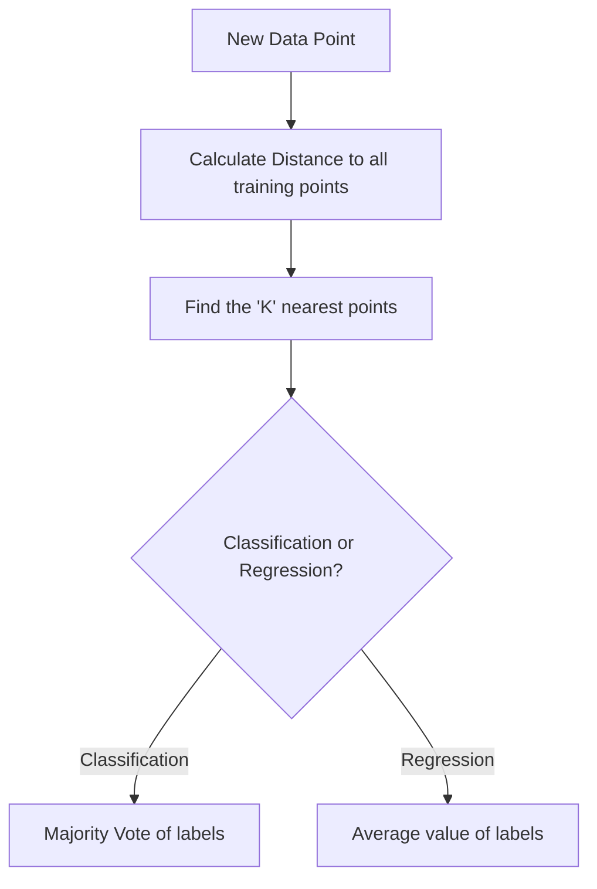

#### Distance Metrics
* **Euclidean Distance**:
  $$d(p, q) = \sqrt{\sum_{i=1}^{n} (p_i - q_i)^2}$$
* **Manhattan Distance**:
  $$d(p, q) = \sum_{i=1}^{n} |p_i - q_i|$$

### 4.3 Support Vector Machines (SVM)
SVM finds the optimal hyperplane that separates classes with the maximum **margin**.

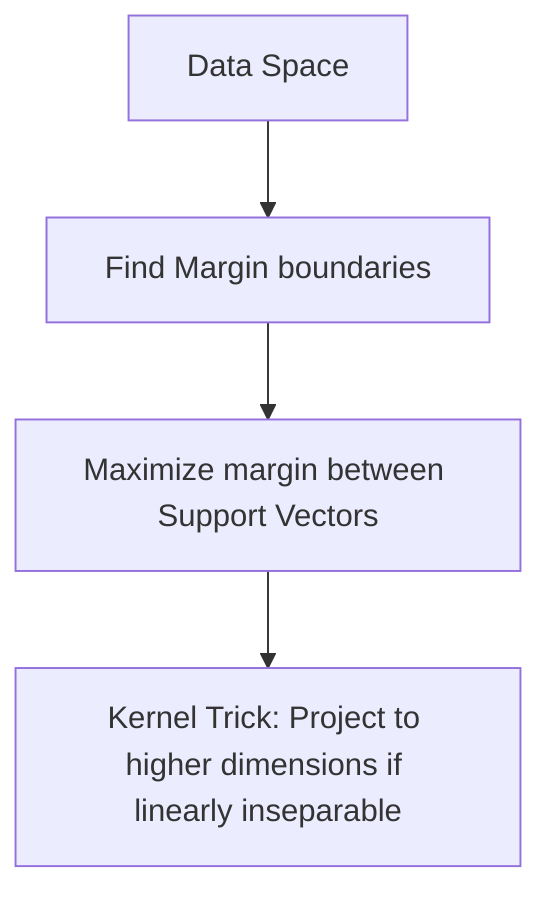

* **Support Vectors**: The data points closest to the hyperplane.
* **Kernel Trick**: Projects non-linearly separable data into a higher-dimensional space where it becomes linearly separable (e.g., Radial Basis Function `RBF` kernel).

### 4.4 Naive Bayes
Naive Bayes is a probabilistic classifier based on **Bayes' Theorem**, applying the "naive" assumption of conditional independence between features.

#### Mathematical Formulation
$$P(C_k \mid x) = \frac{P(x \mid C_k) P(C_k)}{P(x)}$$

With the naive conditional independence assumption:
$$P(C_k \mid x_1, \dots, x_n) \propto P(C_k) \prod_{i=1}^{n} P(x_i \mid C_k)$$

### 4.5 Decision Trees & Random Forests
* **Decision Trees**: Split data recursively based on feature thresholds that maximize homogeneity in resulting child nodes.
  * **Splitting Criteria**:
    * **Entropy (Information Gain)**:
      $$H(S) = -\sum_{i=1}^{C} p_i \log_2(p_i)$$
    * **Gini Impurity**:
      $$I_G(p) = 1 - \sum_{i=1}^{C} p_i^2$$
* **Random Forests**: An ensemble of independent Decision Trees trained on random subsets of features and bootstrap data samples (a method called **Bagging**).

### 4.6 Python Implementation
```python
from sklearn.datasets import load_iris
from sklearn.linear_model import LogisticRegression
from sklearn.neighbors import KNeighborsClassifier
from sklearn.svm import SVC
from sklearn.ensemble import RandomForestClassifier
from sklearn.metrics import accuracy_score

# Load Iris Dataset
iris = load_iris()
X, y = iris.data, iris.target
X_train, X_test, y_train, y_test = train_test_split(X, y, test_size=0.2, random_state=42)

# Models
classifiers = {
    "Logistic Regression": LogisticRegression(max_iter=200),
    "KNN (K=3)": KNeighborsClassifier(n_neighbors=3),
    "SVM (RBF Kernel)": SVC(kernel='rbf'),
    "Random Forest": RandomForestClassifier(n_estimators=100, random_state=42)
}

for name, clf in classifiers.items():
    clf.fit(X_train, y_train)
    y_pred = clf.predict(X_test)
    print(f"{name} Accuracy: {accuracy_score(y_test, y_pred):.4f}")
```

---

## Module 5: Ensemble Learning & XGBoost

Ensemble methods combine predictions from multiple base models to produce a more robust generalizer.

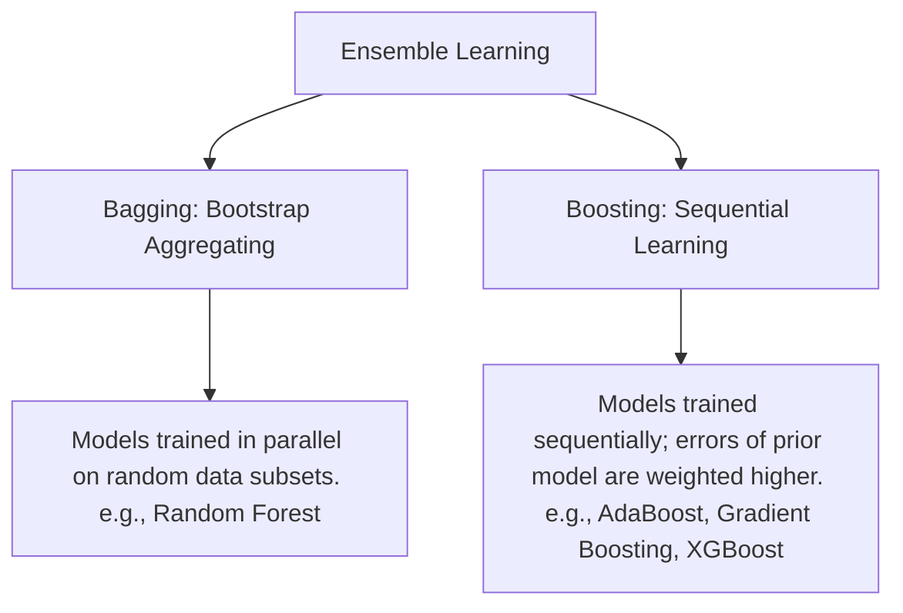

### 5.1 Bagging vs. Boosting
* **Bagging**: Trains independent base learners in parallel. Reduces **Variance** (reduces overfitting).
* **Boosting**: Trains base learners sequentially. Each new model corrects the residual errors of its predecessor. Reduces **Bias** (improves fit).

### 5.2 XGBoost (Extreme Gradient Boosting)
XGBoost is an optimized, highly efficient implementation of gradient boosted decision trees.

* **Key Strengths**:
  * **Regularization**: Includes L1 ($L_1$) and L2 ($L_2$) regularization inside the objective function to control overfitting.
  * **Parallel/Distributed Computing**: Highly optimized node splitting.
  * **Handling Sparsity**: Automatic direction routing for missing values.

#### Mathematical Formulation
The objective function at step $t$:
$$\mathcal{L}^{(t)} = \sum_{i=1}^{m} l\left(y_i, \hat{y}_i^{(t-1)} + f_t(x_i)\right) + \Omega(f_t)$$

Where $\Omega(f_t) = \gamma T + \frac{1}{2}\lambda \sum_{j=1}^{T} w_j^2$ is the tree complexity regularization.

### 5.3 Python Implementation
```python
import xgboost as xgb
from sklearn.datasets import make_classification

# Generate binary dataset
X, y = make_classification(n_samples=1000, n_features=20, random_state=42)
X_train, X_test, y_train, y_test = train_test_split(X, y, test_size=0.2, random_state=42)

# Fit XGBoost Classifier
xgb_model = xgb.XGBClassifier(
    n_estimators=100,
    learning_rate=0.1,
    max_depth=5,
    eval_metric='logloss',
    random_state=42
)
xgb_model.fit(X_train, y_train)

print(f"XGBoost Accuracy: {accuracy_score(y_test, xgb_model.predict(X_test)):.4f}")
```

---

## Module 6: Unsupervised Learning - Clustering

Clustering groups unlabeled data points so that items in the same cluster are similar, and items in different clusters are distinct.

### 6.1 K-Means Clustering
K-Means partitions data into $K$ distinct clusters by minimizing the distance between points and their assigned cluster centroid.

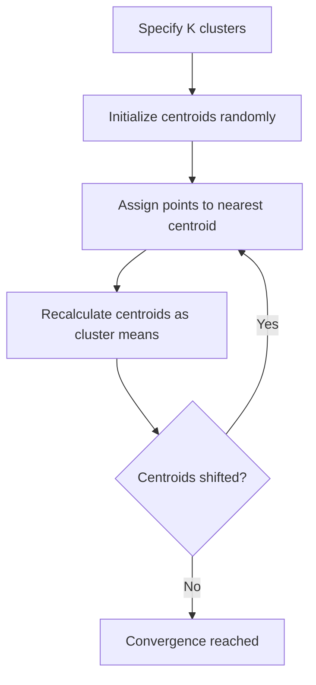

#### Algorithm Steps
1. Randomly place $K$ centroids.
2. Assign each data point to its closest centroid.
3. Compute the mean of all points in each cluster and move the centroid there.
4. Repeat steps 2 and 3 until centroids stabilize (convergence).

#### Choosing K
* **Elbow Method**: Plot the Sum of Squared Errors (SSE/Inertia) vs. $K$ and find the "elbow" point.
* **Silhouette Analysis**: Measures how close each point in one cluster is to points in the neighboring clusters.

### 6.2 Hierarchical Clustering
Constructs a tree-like structure (dendrogram) of clusters.
* **Agglomerative**: Bottom-up approach. Start with individual points and merge the closest clusters.
* **Linkage Criteria**: Defines how distance between clusters is measured:
  * *Single*: Minimum distance between points.
  * *Complete*: Maximum distance between points.
  * *Average*: Mean distance between all pairs.
  * *Ward*: Minimizes variance increase when merging.

### 6.3 DBSCAN
**Density-Based Spatial Clustering of Applications with Noise** groups points based on density, identifying outliers as noise.

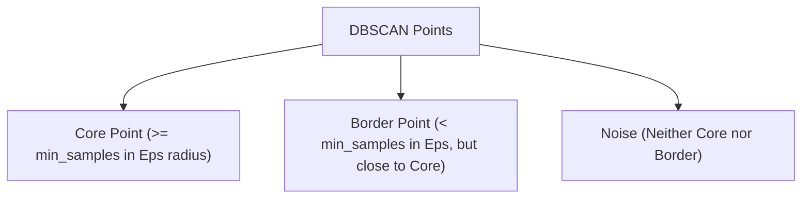

* **Core Points**: Have at least `min_samples` within distance `eps`.
* **Border Points**: Have fewer than `min_samples` in `eps` distance, but reside close to a core point.
* **Noise**: Neither core nor border points.

### 6.4 Python Implementation
```python
from sklearn.cluster import KMeans, AgglomerativeClustering, DBSCAN
from sklearn.datasets import make_blobs
from sklearn.preprocessing import StandardScaler

# Generate 2D clusters
X, _ = make_blobs(n_samples=300, centers=4, cluster_std=0.60, random_state=0)
X = StandardScaler().fit_transform(X)

# K-Means
kmeans = KMeans(n_clusters=4, random_state=42)
kmeans_labels = kmeans.fit_predict(X)

# Agglomerative
hierarchical = AgglomerativeClustering(n_clusters=4)
hc_labels = hierarchical.fit_predict(X)

# DBSCAN
dbscan = DBSCAN(eps=0.3, min_samples=5)
dbscan_labels = dbscan.fit_predict(X)

print("Clustering completed successfully.")
```

---

## Module 7: Evaluation & Validation

To ensure our models generalize to new data, we must evaluate them carefully.

### 7.1 Bias-Variance Tradeoff
* **Bias**: Error due to simplistic assumptions. High bias leads to **Underfitting** (model is too simple).
* **Variance**: Error due to capturing noise in the training data. High variance leads to **Overfitting** (model fits training data perfectly but fails on test data).

```
   Low Bias, High Variance          High Bias, Low Variance          Low Bias, Low Variance
        (Overfitting)                    (Underfitting)               (Optimal Generalization)
   +-----------------------+        +-----------------------+        +-----------------------+
   |   *   x     *         |        |         /             |        |   *   x *             |
   |     *   *   x    x    |        |        /              |        |    * * x  x           |
   |  x      *      x      |        |       /               |        |  x   *   x           |
   +-----------------------+        +-----------------------+        +-----------------------+
```

### 7.2 Cross-Validation
Instead of a single train/test split, **K-Fold Cross-Validation** splits the data into $K$ subsets. The model is trained on $K-1$ subsets and evaluated on the remaining subset. This is repeated $K$ times.

```
Iteration 1: [ Test ] [ Train ] [ Train ] [ Train ]
Iteration 2: [ Train ] [ Test ] [ Train ] [ Train ]
Iteration 3: [ Train ] [ Train ] [ Test ] [ Train ]
Iteration 4: [ Train ] [ Train ] [ Train ] [ Test ]
```

### 7.3 Performance Metrics

#### Regression Metrics
* **Mean Absolute Error (MAE)**:
  $$\text{MAE} = \frac{1}{m} \sum_{i=1}^{m} |y^{(i)} - \hat{y}^{(i)}|$$
* **Mean Squared Error (MSE)**:
  $$\text{MSE} = \frac{1}{m} \sum_{i=1}^{m} (y^{(i)} - \hat{y}^{(i)})^2$$
* **R-squared ($R^2$)**:
  $$R^2 = 1 - \frac{\sum (y^{(i)} - \hat{y}^{(i)})^2}{\sum (y^{(i)} - \bar{y})^2}$$

#### Classification Metrics (Confusion Matrix)
```
                  Predicted Positive    Predicted Negative
Actual Positive         TP                    FN (Type II Error)
Actual Negative   FP (Type I Error)           TN
```

* **Accuracy**: $\frac{TP + TN}{TP + TN + FP + FN}$
* **Precision**: $\frac{TP}{TP + FP}$ (Quality of positive predictions)
* **Recall (Sensitivity)**: $\frac{TP}{TP + FN}$ (Model's coverage of actual positives)
* **F1-Score**: $2 \times \frac{\text{Precision} \times \text{Recall}}{\text{Precision} + \text{Recall}}$ (Harmonic mean)
* **ROC-AUC**: Graphing True Positive Rate vs. False Positive Rate; Area Under the Curve (AUC) measures class separation capability.

---

## Appendix: Glossary of Key Terminologies

To help students quickly grasp machine learning jargon, here is a consolidated list of key terms with examples and illustrative diagrams:

### 1. Centroid
* **Definition**: The geometric center of a cluster, calculated as the arithmetic mean (average) of all coordinate vectors of the data points in that cluster. Used heavily in K-Means.
* **Example**: For three 2D points in a cluster: $P_1(1, 5)$, $P_2(2, 4)$, and $P_3(3, 1)$.
  $$\text{Centroid } C = \left( \frac{1+2+3}{3}, \frac{5+4+1}{3} \right) = (2, 3.33)$$
* **Diagram**:
```
     y-axis
     ^   * P1(1, 5)
     |          * P2(2, 4)
     |       C (2, 3.33)  <-- Centroid (mean coordinate)
     |   * P3(3, 1)
     +---------------------------> x-axis
```

---

### 2. Hyperplane, Margin, & Support Vectors (SVM Concepts)
* **Definitions**:
  * **Hyperplane**: A decision boundary that splits space into regions representing different classes (e.g., a line in 2D space, a flat plane in 3D, and a high-dimensional surface in 4D or higher).
  * **Margin**: The distance between the decision boundary (hyperplane) and the closest training points from either class. Maximizing this margin is the core objective of SVMs.
  * **Support Vectors**: The critical data points that lie closest to the decision boundary. Changing or removing these points would alter the position of the boundary.
* **Diagram**:
```
      Class A (Stars)                   Class B (Crosses)
        *      *           |         |       x      x
            *   [SV *] --->|         |<--- [SV x]     x
                           |         |
      - - - - - - - - - - -+---------+ - - - - - - - - - - - <-- Margin Boundary
                           | Hyperplane (Optimal separating line)
               <---------->|         |<---------->
                  Margin                 Margin
```

---

### 3. Weak Learner
* **Definition**: A simple classifier or regressor that performs only slightly better than random guessing. Boosting algorithms sequentially combine weak learners to construct a strong model.
* **Example**: A **Decision Stump** is a decision tree with a depth of exactly 1 (it makes a decision based on only a single feature threshold split).
* **Diagram**:
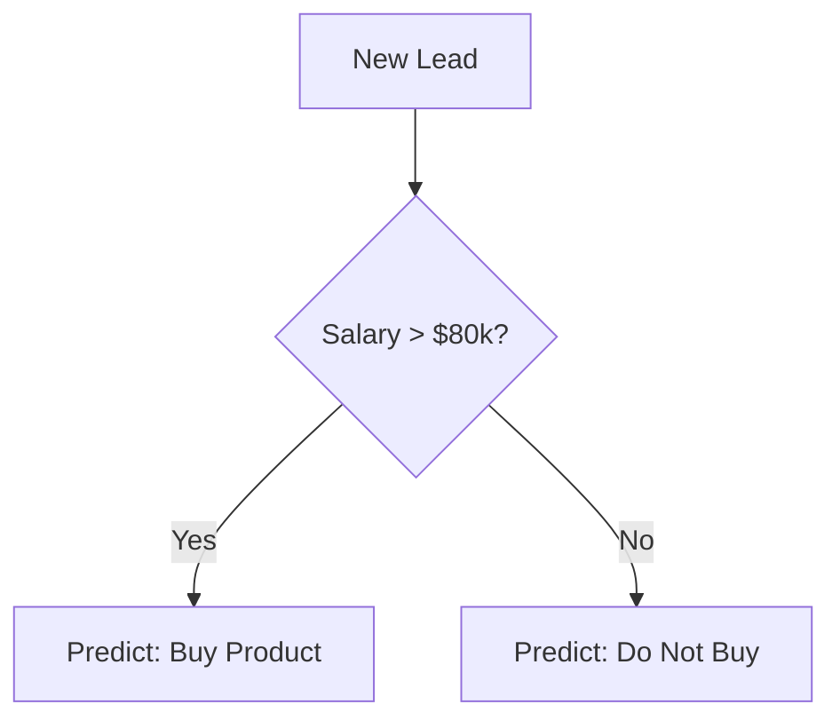

---

### 4. Residual
* **Definition**: The difference between the actual observed value and the value predicted by the model ($y - \hat{y}$). Boosting models focus on training subsequent trees to predict these residuals.
* **Example**: If a house sells for $400k ($y = 400$) and a linear model predicts it will sell for $380k ($\hat{y} = 380$):
  $$\text{Residual} = y - \hat{y} = 400 - 380 = 20$$
* **Diagram**:
```
      y-axis (Price)
      ^            * Actual Value (y = 400)
      |           /|
      |          / |  <-- Residual (Error = +20)
      |         /  |
      |--------/---v--- <-- Predicted Line (y_hat = 380)
      |       /
      |      /
      +------------------------------> x-axis (Size)
```

---

### 5. Regularization ($L_1$ / $L_2$)
* **Definition**: A technique that prevents overfitting by adding a mathematical penalty to the cost function to constrain the size of model parameters ($\theta$).
* **Comparison**:
  * **$L_1$ (Lasso)**: Adds $\lambda \sum |\theta_j|$ penalty. Drives coefficients to exactly zero, eliminating features (performs feature selection).
  * **$L_2$ (Ridge)**: Adds $\lambda \sum \theta_j^2$ penalty. Shrinks coefficients close to zero but keeps them active.

---

### 6. Inductive Bias
* **Definition**: The underlying assumptions an algorithm makes about the target function to generalize from training data to unseen data.
* **Example**: Linear Regression's inductive bias is that the relationship between features and target is strictly linear ($y = \theta X$). KNN's inductive bias is that nearby points are highly likely to share the same label.

---

### 7. Lazy Learning
* **Definition**: Algorithms that do not construct a generalized model during the training phase (which is fast), but instead defer computations until a query is made (which is slow).
* **Example**: **K-Nearest Neighbors (KNN)** is a lazy learner. Training simply stores the raw points. Prediction computes distances to all stored points, making prediction computationally expensive for large datasets.

---

### 8. Bootstrapping & Feature Subspacing (Ensemble Concepts)
* **Definitions**:
  * **Bootstrapping**: A statistical sampling technique that generates new datasets by drawing samples from the original dataset with replacement. Used in Bagging (e.g., Random Forests).
  * **Feature Subspacing**: A technique where only a random subset of features is considered at each split in a decision tree. This helps decorrelate individual trees in a Random Forest.

---

### 9. Gradient
* **Definition**: The vector of partial derivatives representing the direction of steepest ascent of a function. In optimization, we move in the opposite direction (gradient descent) to minimize the loss.
* **Analogy**: Imagine being blindfolded on a foggy hill. To find the valley (minimum loss), you feel the slope of the ground with your foot and take a step in the direction that slopes downward (negative gradient).


