# Fundamentals of Machine Learning: A Comprehensive Curriculum

Welcome to the **Fundamentals of Machine Learning** course materials. This document serves as a complete, step-by-step teaching guide designed to introduce students to the core paradigms, algorithms, mathematics, and practical implementations of machine learning.

## Table of Contents
- [Course Roadmap](#course-roadmap)
- [Runnable Code Examples](#runnable-code-examples)
  - [1. Framework Examples](#1-framework-examples-using-scikit-learn--xgboost)
  - [2. From-Scratch Examples](#2-from-scratch-examples-pure-python-no-frameworks)
- [Module 1: Introduction to Machine Learning](#module-1-introduction-to-machine-learning)
  - [1.1 What is Machine Learning?](#11-what-is-machine-learning)
  - [1.2 The Machine Learning Pipeline](#12-the-machine-learning-pipeline)
- [Module 2: The Four Learning Paradigms](#module-2-the-four-learning-paradigms)
  - [2.2 Case Study: Where do Large Language Models (LLMs) fit?](#22-case-study-where-do-large-language-models-llms-fit)
- [Module 3: Supervised Learning - Regression](#module-3-supervised-learning---regression)
  - [3.1 Simple and Multiple Linear Regression](#31-simple-and-multiple-linear-regression)
  - [3.2 Regularization: Ridge & Lasso](#32-regularization-ridge--lasso)
  - [3.3 Python Implementation](#33-python-implementation)
- [Module 4: Supervised Learning - Classification](#module-4-supervised-learning---classification)
  - [4.1 Logistic Regression](#41-logistic-regression)
  - [4.2 K-Nearest Neighbors (KNN)](#42-k-nearest-neighbors-knn)
  - [4.3 Support Vector Machines (SVM)](#43-support-vector-machines-svm)
  - [4.4 Naive Bayes](#44-naive-bayes)
  - [4.5 Decision Trees & Random Forests](#45-decision-trees--random-forests)
  - [4.6 Python Implementation](#46-python-implementation)
- [Module 5: Ensemble Learning & XGBoost](#module-5-ensemble-learning--xgboost)
  - [5.1 Bagging (Bootstrap Aggregating)](#51-bagging-bootstrap-aggregating)
  - [5.2 Boosting](#52-boosting)
  - [5.3 XGBoost (Extreme Gradient Boosting)](#53-xgboost-extreme-gradient-boosting)
  - [5.4 Python Implementation](#54-python-implementation)
- [Module 6: Unsupervised Learning - Clustering](#module-6-unsupervised-learning---clustering)
  - [6.1 K-Means Clustering](#61-k-means-clustering)
  - [6.2 Hierarchical Clustering](#62-hierarchical-clustering)
  - [6.3 DBSCAN](#63-dbscan)
  - [6.4 Python Implementation](#64-python-implementation)
- [Module 7: Evaluation & Validation](#module-7-evaluation--validation)
  - [7.1 Bias-Variance Tradeoff](#71-bias-variance-tradeoff)
  - [7.2 Cross-Validation](#72-cross-validation)
  - [7.3 Performance Metrics](#73-performance-metrics)
- [Module 8: Code Walkthroughs & Implementation Steps](#module-8-code-walkthroughs--implementation-steps)
  - [8.1 Regression (Housing Prices Example)](#81-regression-housing-prices-example)
  - [8.2 Classification (Student Exam Pass/Fail)](#82-classification-student-exam-passfail)
  - [8.3 K-Nearest Neighbors (Offer Acceptance)](#83-k-nearest-neighbors-offer-acceptance)
  - [8.4 Decision Trees & Random Forests (Churn)](#84-decision-trees--random-forests-churn)
  - [8.5 Ensemble Boosting (XGBoost Loan Defaults)](#85-ensemble-boosting-xgboost-loan-defaults)
  - [8.6 K-Means Clustering (Customer Segments)](#86-kmeans-clustering-customer-segments)
  - [8.7 DBSCAN Density Clustering (Outlier Detection)](#87-dbscan-density-clustering-outlier-detection)
  - [8.8 Model Evaluation & Performance Metrics](#88-model-evaluation--performance-metrics)
- [Module 9: Introduction to Large Language Models (LLMs) & Transformers](#module-9-introduction-to-large-language-models-llms--transformers)
  - [9.1 Tokenization: Byte Pair Encoding (BPE)](#91-tokenization-byte-pair-encoding-bpe)
  - [9.2 Vector Semantics: Word Embeddings (Word2Vec)](#92-vector-semantics-word-embeddings-word2vec)
  - [9.3 The Encoder: Self-Attention & Positional Encoding](#93-the-encoder-self-attention--positional-encoding)
  - [9.4 The Decoder: Causal Masking & Cross-Attention](#94-the-decoder-causal-masking--cross-attention)
  - [9.5 End-to-End LLM Python Implementation](#95-end-to-end-llm-python-implementation)
- [Appendix: Glossary of Key Terminologies](#appendix-glossary-of-key-terminologies)

---

## Course Roadmap

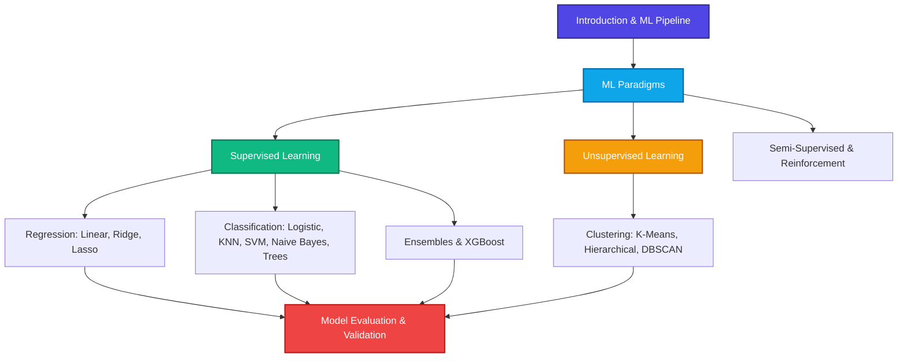

---

## Runnable Code Examples

This course features two sets of runnable, self-contained Python examples for each core concept:

1. **Framework Examples (`examples/`)**: Standard implementations using industry-standard libraries like `scikit-learn` and `xgboost`.
2. **From-Scratch Examples (`scratch/`)**: Pure Python implementations of the same subjects written without *any* external ML libraries to teach the mathematical inner workings step-by-step.

### 1. Framework Examples (using Scikit-Learn / XGBoost)
You can run them in your terminal using:
```bash
python3 examples/<script_name>.py
```

| Lesson / Topic | Concept | Python Example Link | Output Plot Link |
| :--- | :--- | :--- | :--- |
| **Module 3: Regression** | House Value per Sq Ft | [1_regression_housing.py](examples/1_regression_housing.py) | [examples_1_regression.png](plots/examples_1_regression.png) |
| **Module 4: Classification** | Student Exam Pass/Fail | [2_classification_exam.py](examples/2_classification_exam.py) | [examples_2_classification.png](plots/examples_2_classification.png) |
| **Module 4: KNN** | Credit Card Offer Acceptance | [3_knn_classification.py](examples/3_knn_classification.py) | [examples_3_knn.png](plots/examples_3_knn.png) |
| **Module 4: Decision Trees** | Customer Churn tree rules & Random Forest | [4_decision_tree_rf.py](examples/4_decision_tree_rf.py) | [examples_4_decision_tree.png](plots/examples_4_decision_tree.png) |
| **Module 5: Ensemble** | Loan Default risk forecasting with XGBoost | [5_xgboost_ensemble.py](examples/5_xgboost_ensemble.py) | [examples_5_xgboost.png](plots/examples_5_xgboost.png) |
| **Module 6: K-Means** | Customer Income & Spend Segmentation | [6_kmeans_clustering.py](examples/6_kmeans_clustering.py) | [examples_6_kmeans.png](plots/examples_6_kmeans.png) |
| **Module 6: DBSCAN** | Density Coordinate Point Classification | [7_dbscan_clustering.py](examples/7_dbscan_clustering.py) | [examples_7_dbscan.png](plots/examples_7_dbscan.png) |
| **Module 7: Evaluation** | MAE/MSE/RMSE, Confusion Matrix, Precision/Recall | [8_model_evaluation.py](examples/8_model_evaluation.py) | [examples_8_evaluation.png](plots/examples_8_evaluation.png) |

### 2. From-Scratch Examples (Pure Python, No Frameworks)
You can run them in your terminal using:
```bash
python3 scratch/<script_name>.py
```

| Lesson / Topic | Concept | From-Scratch Python Link | Output Plot Link |
| :--- | :--- | :--- | :--- |
| **Module 3: Regression** | Gradient Descent Line Fitting | [1_linear_regression.py](scratch/1_linear_regression.py) | [scratch_1_regression.png](plots/scratch_1_regression.png) |
| **Module 4: Classification** | Sigmoid & Log Loss updates | [2_logistic_regression.py](scratch/2_logistic_regression.py) | [scratch_2_logistic.png](plots/scratch_2_logistic.png) |
| **Module 4: KNN** | Standard Scaling & Euclidean distances | [3_knn_classification.py](scratch/3_knn_classification.py) | [scratch_3_knn.png](plots/scratch_3_knn.png) |
| **Module 4: Decision Trees** | Gini Impurity split searches | [4_decision_tree.py](scratch/4_decision_tree.py) | [scratch_4_decision_tree.png](plots/scratch_4_decision_tree.png) |
| **Module 6: K-Means** | Distance centroid updates | [5_kmeans_clustering.py](scratch/5_kmeans_clustering.py) | [scratch_5_kmeans.png](plots/scratch_5_kmeans.png) |
| **Module 6: DBSCAN** | Density point neighborhood & BFS | [6_dbscan_clustering.py](scratch/6_dbscan_clustering.py) | [scratch_6_dbscan.png](plots/scratch_6_dbscan.png) |
| **Module 7: Evaluation** | Metrics loop logic (F1, MSE, $R^2$) | [7_model_evaluation.py](scratch/7_model_evaluation.py) | [scratch_7_evaluation.png](plots/scratch_7_evaluation.png) |

### 3. Large Language Model (LLM) Examples
You can run them in your terminal using:
```bash
python3 llm/<script_name>.py
```

| Lesson / Topic | Concept | Python Script Link | Output Plot Link |
| :--- | :--- | :--- | :--- |
| **Module 9.1: Tokenizer** | Byte Pair Encoding (BPE) from scratch | [1_bpe_tokenizer.py](llm/1_bpe_tokenizer.py) | [llm_1_bpe_vocab.png](plots/llm_1_bpe_vocab.png) |
| **Module 9.2: Embeddings** | Skip-gram Word2Vec (Adam Optimizer) | [2_word2vec.py](llm/2_word2vec.py) | [llm_2_word2vec.png](plots/llm_2_word2vec.png) |
| **Module 9.3: Encoder** | Multi-Head Self-Attention & Positional Encoding | [3_encoder.py](llm/3_encoder.py) | [llm_3_positional_encoding.png](plots/llm_3_positional_encoding.png) |
| **Module 9.4: Decoder** | Causal Masked Self-Attention & Cross-Attention | [4_decoder.py](llm/4_decoder.py) | [llm_4_causal_mask.png](plots/llm_4_causal_mask.png) |
| **Module 9.5: Transformer** | End-to-End Translator (Seq2Seq Model) | [5_transformer_llm.py](llm/5_transformer_llm.py) | [llm_5_attention_alignment.png](plots/llm_5_attention_alignment.png) |

---

## Module 1: Introduction to Machine Learning

### 1.1 What is Machine Learning?
Traditional programming requires a human developer to write explicit rules (code) that process inputs to produce outputs. In contrast, **Machine Learning (ML)** is a paradigm where an algorithm learns the underlying rules directly from data.

```
Traditional Programming:
[Data] + [Rules/Algorithms] ---> (Computer) ---> [Results]

Machine Learning:
[Data] + [Results/Labels]     ---> (Computer) ---> [Rules/Model]
```

### 1.2 The Machine Learning Pipeline
Every ML project follows a structured workflow:

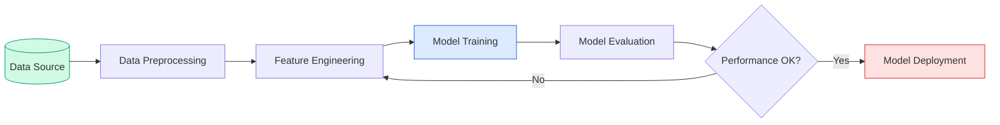

1. **Data Acquisition**: Collecting raw data (structured tables, text, images).
2. **Preprocessing**: Handling missing values, removing duplicates, and scaling numerical features.
3. **Feature Engineering**: Creating new variables or transforming existing ones (e.g., one-hot encoding categorical variables) to help the model learn.
4. **Model Training**: Feeding data to the algorithm to optimize its internal weights.
5. **Model Evaluation**: Testing the model on unseen data using metrics like Accuracy or Mean Squared Error.
6. **Deployment**: Integrating the trained model into a production environment.

---

## Module 2: The Four Learning Paradigms

Machine learning is broadly categorized into four paradigms based on the presence and nature of feedback during training.

| Paradigm | Data Input | Core Goal | Common Algorithms | Real-World Example |
| :--- | :--- | :--- | :--- | :--- |
| **Supervised** | Labeled Data $(X, y)$ | Predict target $y$ from features $X$ | Linear Regression, SVM, Random Forest | Credit scoring, Spam filtering |
| **Unsupervised** | Unlabeled Data $(X)$ | Find hidden patterns or groupings | K-Means, PCA, DBSCAN | Customer segmentation |
| **Semi-Supervised** | Tiny Labeled + Large Unlabeled | Leverage unlabeled data to boost learning | Label Propagation, Self-Training | Medical imaging annotation |
| **Reinforcement** | Environment & Rewards | Learn optimal policy via trial-and-error | Q-Learning, Deep Q-Networks (DQN) | Autonomous driving, AlphaGo |

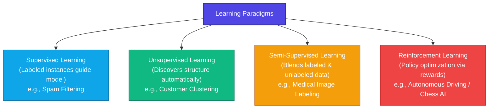

### 2.2 Case Study: Where do Large Language Models (LLMs) fit?
Modern LLMs (like GPT, Claude, Llama, and Gemini) do not fit neatly into a single learning paradigm. Instead, they are trained using a **multi-paradigm pipeline** that combines self-supervised learning, supervised learning, and reinforcement learning:

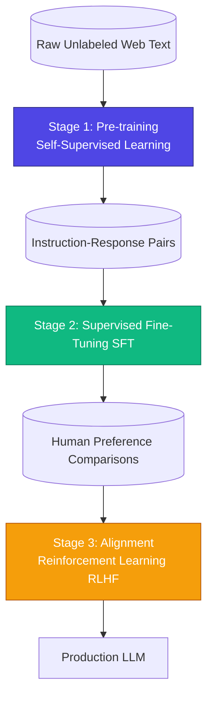

1. **Pre-Training (Self-Supervised / Unsupervised)**:
   * **Process**: The model reads billions of words of raw, unlabeled text and learns to predict the next word.
   * **Connection**: While the dataset is unlabeled (unsupervised), the training creates target labels ($y$) automatically from the next word in the text (self-supervised).
2. **Supervised Fine-Tuning (SFT)**:
   * **Process**: The model is trained on human-curated datasets of instruction-answer pairs.
   * **Connection**: This is a direct application of **supervised learning**, training the model to align its outputs with high-quality labeled examples.
3. **Reinforcement Learning from Human Feedback (RLHF)**:
   * **Process**: The model generates responses, and a reward model scores them based on human preferences. The LLM updates its weights to maximize this reward.
   * **Connection**: This is **reinforcement learning**, where the LLM acts as the agent, the reward model acts as the environment, and the human preference criteria act as the reward signal.

---

## Module 3: Supervised Learning - Regression

Regression models predict a continuous numeric output (e.g., salary, temperature, house prices).

### 3.1 Simple and Multiple Linear Regression
Linear Regression assumes a linear relationship between the input features $X$ and the target $y$.

#### Mathematical Formulation
The prediction equation is:

$$\hat{y} = \theta_0 + \theta_1 x_1 + \theta_2 x_2 + \dots + \theta_n x_n = \theta^T X$$

Where:
* $\hat{y}$ is the predicted value.
* $\theta_0$ is the intercept (bias).
* $\theta_j$ are the feature weights (coefficients).
* $x_j$ are the feature values.

The model is optimized by minimizing the **Mean Squared Error (MSE)** cost function:

$$J(\theta) = \frac{1}{2m} \sum_{i=1}^{m} \left( h_\theta(x^{(i)}) - y^{(i)} \right)^2$$

##### Parameter Breakdown:
* **$J(\theta)$**: The **Cost (or Loss) Function** value. It measures how much the model's predictions deviate from the actual targets. The goal of training is to find the parameters $\theta$ that minimize this value.
* **$\theta$ (Theta)**: The vector of model parameters (coefficients/weights and bias).
* **$m$**: The total number of **training examples** (data samples) in the dataset.
* **$\frac{1}{2m}$**: A scaling factor. The $m$ in the denominator averages the errors across all samples. The $2$ in the denominator is a mathematical convenience: during derivative calculation in gradient descent, it cancels out the exponent $2$ from the squared term, leaving a simpler derivative.
* **$\sum_{i=1}^{m}$**: The summation symbol, instructing to compute the squared error for each training sample from $1$ to $m$ and sum them all together.
* **$h_\theta(x^{(i)})$**: The **Hypothesis function** (predicted value $\hat{y}^{(i)}$) for the $i$-th training sample, computed using the current parameters $\theta$ and inputs $x^{(i)}$.
* **$x^{(i)}$**: The input feature vector for the **$i$-th training example** (the superscript $(i)$ is an index, not an exponent).
* **$y^{(i)}$**: The actual target value (ground truth label) for the **$i$-th training example**.
* **$(h_\theta(x^{(i)}) - y^{(i)})^2$**: The **squared prediction error** for the $i$-th sample. Squaring the error ensures that negative and positive errors don't cancel each other out, and heavily penalizes larger errors.

Using **Gradient Descent**, parameters are updated iteratively:

$$\theta_j := \theta_j - \alpha \frac{\partial}{\partial \theta_j} J(\theta)$$

### 3.2 Regularization: Ridge & Lasso
When a model has too many parameters, it might overfit. **Regularization** adds a penalty term to the cost function to constrain the weights.

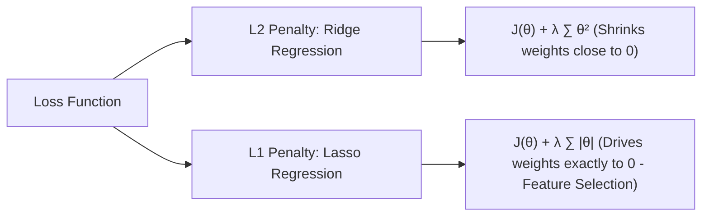

#### Ridge Regression ($L_2$ Regularization)
Adds the sum of squared weights as a penalty:

$$J_{\text{Ridge}}(\theta) = J(\theta) + \lambda \sum_{j=1}^{n} \theta_j^2$$

* **Effect**: Shrinks coefficients toward zero, reducing variance, but never makes them exactly zero.

#### Lasso Regression ($L_1$ Regularization)
Adds the sum of absolute weights as a penalty:

$$J_{\text{Lasso}}(\theta) = J(\theta) + \lambda \sum_{j=1}^{n} |\theta_j|$$

* **Effect**: Drives less important feature weights to exactly zero. Useful for **feature selection**.

#### Conceptual Example: The "Biased Word" in Spam Detection
Suppose we are training a model to predict the probability that an email is spam, using features $x_j$ representing the frequency of specific words (e.g., $x_1 = \text{"win"}$, $x_2 = \text{"free"}$, $x_3 = \text{"hello"}$).

* **The Problem (Overfitting & High Variance)**:
  In a small training dataset of 20 emails, the word **"win"** only appears in spam messages. An unregularized model (OLS) will assign an excessively high, biased positive weight to "win" (e.g., $\theta_{\text{win}} = +15.0$). Later, if a user receives a legitimate email like *"Did our team win the game?"*, the model will incorrectly flag it as spam because of this massive weight.
* **How Ridge ($L_2$) Solves It**:
  Ridge penalizes squared weights. A weight of $+15.0$ contributes a massive penalty ($15^2 = 225.0$). Ridge forces this weight to shrink drastically (e.g., to $\theta_{\text{win}} = +1.2$). "Win" remains a positive spam indicator but is no longer large enough to override standard vocabulary.
* **How Lasso ($L_1$) Solves It**:
  Lasso penalizes absolute weights. It identifies that common words like "hello" ($\theta\_{\text{hello}} = +0.1$) add noise but have almost zero actual predictive capability. Lasso drives their weights to **exactly zero** ($\theta\_{\text{hello}} = 0$), performing feature selection and removing noise features completely from the equation.

### 3.3 Python Implementation
```python
import numpy as np
from sklearn.linear_model import LinearRegression, Ridge, Lasso
from sklearn.model_selection import train_test_split
from sklearn.metrics import mean_squared_error

# Generate synthetic dataset
X = np.random.rand(100, 5)
y = 3 * X[:, 0] + 1.5 * X[:, 1] + np.random.randn(100) * 0.1

X_train, X_test, y_train, y_test = train_test_split(X, y, test_size=0.2, random_state=42)

# Fit Ordinary Least Squares Linear Regression
ols = LinearRegression()
ols.fit(X_train, y_train)
print(f"OLS MSE: {mean_squared_error(y_test, ols.predict(X_test)):.4f}")

# Fit Ridge Regression (L2)
ridge = Ridge(alpha=1.0)
ridge.fit(X_train, y_train)
print(f"Ridge MSE: {mean_squared_error(y_test, ridge.predict(X_test)):.4f}")

# Fit Lasso Regression (L1)
lasso = Lasso(alpha=0.1)
lasso.fit(X_train, y_train)
print(f"Lasso MSE: {mean_squared_error(y_test, lasso.predict(X_test)):.4f}")
```

---

## Module 4: Supervised Learning - Classification

Classification models predict discrete class labels (e.g., Spam vs. Not Spam, Cat vs. Dog vs. Bird). While regression estimates continuous target values, classification divides the feature space into distinct regions separated by **decision boundaries**.


---

### 4.1 Logistic Regression

Despite its name, Logistic Regression is the baseline algorithm for binary classification. It calculates a linear combination of inputs (similar to linear regression) but projects the result through a squashing function—the **Sigmoid function**—to produce a probability value between $0$ and $1$.

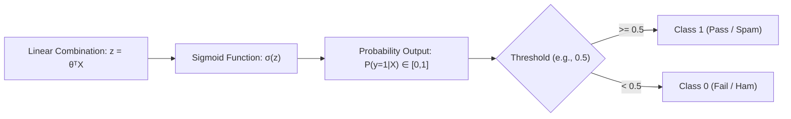

#### Mathematical Formulation
The Sigmoid function $\sigma(z)$ is defined as:

$$\sigma(z) = \frac{1}{1 + e^{-z}}$$

Where $z = \theta^T X = \theta_0 + \theta_1 x_1 + \dots + \theta_n x_n$.
The probability that a sample belongs to the positive class ($y=1$) is given by:

$$P(y=1 \mid X) = \hat{y} = \sigma(\theta^T X)$$

To find the optimal parameter weights $\theta$, the model is trained by minimizing the **Binary Cross-Entropy Loss (Log Loss)**:

$$J(\theta) = -\frac{1}{m} \sum_{i=1}^{m} \left[ y^{(i)} \log(\hat{y}^{(i)}) + (1 - y^{(i)}) \log(1 - \hat{y}^{(i)}) \right]$$

#### Concrete Example: Student Pass/Fail Prediction
Suppose we want to classify whether a student passes an exam ($y=1$) or fails ($y=0$) based on a single feature: **Hours Studied ($x_1$)**.
* **Model Learning**: Through training, the model learns the parameters $\theta_0 = -4.0$ (intercept) and $\theta_1 = 1.0$ (coefficient for hours studied).
* **Case A: Studied 2 Hours**:
  * Compute linear combination: $z = -4.0 + 1.0(2) = -2.0$.
  * Apply Sigmoid: $P(y=1) = \sigma(-2.0) = \frac{1}{1 + e^{2.0}} \approx 0.119$ (11.9% pass probability).
  * Prediction: Since $0.119 < 0.5$, the student is predicted to **Fail**.
* **Case B: Studied 6 Hours**:
  * Compute linear combination: $z = -4.0 + 1.0(6) = 2.0$.
  * Apply Sigmoid: $P(y=1) = \sigma(2.0) = \frac{1}{1 + e^{-2.0}} \approx 0.881$ (88.1% pass probability).
  * Prediction: Since $0.881 \ge 0.5$, the student is predicted to **Pass**.
* **Decision Boundary**: The boundary lies where $z = 0 \implies -4.0 + 1.0(x_1) = 0 \implies x_1 = 4.0$ hours. Any student studying $> 4$ hours passes, and $< 4$ hours fails.

---

### 4.2 K-Nearest Neighbors (KNN)

KNN is a non-parametric, **lazy learning** algorithm. It does not train a model or find coefficients. Instead, it memorizes the entire training dataset. When predicting the class of a new query point, it locates the $K$ closest training points in the feature space and assigns the class label that has the majority vote.


#### Distance Metrics
* **Euclidean Distance**:

  $$d(p, q) = \sqrt{\sum_{i=1}^{n} (p_i - q_i)^2}$$

* **Manhattan Distance**:

  $$d(p, q) = \sum_{i=1}^{n} |p_i - q_i|$$


#### Concrete Example: Fruit Classification (Apple vs. Orange)
Suppose we classify fruits based on two features: **Sweetness ($x_1$)** and **Roundness ($x_2$)**. We set $K = 3$.
* **Training Data**:
  * $P_1(8, 9)$ &rarr; Orange
  * $P_2(7, 8)$ &rarr; Orange
  * $P_3(2, 3)$ &rarr; Apple
* **Query Point**: A new fruit $Q(6, 7)$ has unknown label.
* **Calculate Euclidean Distances**:
  * Distance to $P_1$: $\sqrt{(8-6)^2 + (9-7)^2} = \sqrt{4+4} = \sqrt{8} \approx 2.83$
  * Distance to $P_2$: $\sqrt{(7-6)^2 + (8-7)^2} = \sqrt{1+1} = \sqrt{2} \approx 1.41$
  * Distance to $P_3$: $\sqrt{(2-6)^2 + (3-7)^2} = \sqrt{16+16} = \sqrt{32} \approx 5.66$
* **Identify K=3 Nearest Neighbors**: The three closest points are $P_2$ (dist: 1.41), $P_1$ (dist: 2.83), and $P_3$ (dist: 5.66).
* **Majority Vote**:
  * Labels of the neighbors: $P_2$ (Orange), $P_1$ (Orange), $P_3$ (Apple).
  * Votes: Orange = 2, Apple = 1.
  * Prediction: The query fruit $Q$ is classified as an **Orange**.

---

### 4.3 Support Vector Machines (SVM)

SVM finds a decision boundary (hyperplane) that separates classes with the maximum possible margin. The boundary is positioned to maximize the distance between the hyperplane and the closest training points from either class, which are called **support vectors**.

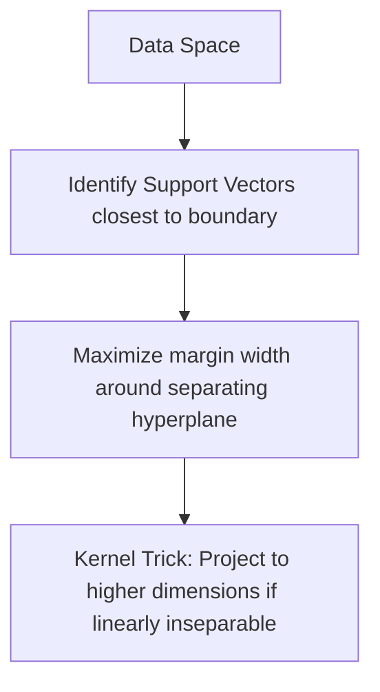

#### The Kernel Trick
When data is not linearly separable in its original space, SVM projects the data points into a higher-dimensional space where a linear boundary can separate them. The **Kernel Function** computes the relationship between vectors in this higher-dimensional space without requiring the explicit, computationally expensive transformation coordinates:
* **Linear Kernel**: $K(x, x') = x^T x'$
* **Radial Basis Function (RBF) Kernel**: $K(x, x') = \exp(-\gamma ||x - x'||^2)$

#### Concrete Example: Credit Card Fraud Detection
Suppose we want to flag transactions as Fraudulent or Legitimate based on **Transaction Amount ($x_1$)** and **Distance from Home ($x_2$)**.
* **Linear Case**: Most transactions fit a clean profile. SVM positions the separating line such that the gap (margin) between the nearest legitimate transaction (Support Vector A) and the nearest fraudulent transaction (Support Vector B) is maximized.
* **Non-Linear Case (Kernel Trick)**: Imagine regular transactions occur in a tight medium-sized circle around the home location, while fraud occurs both very close (stolen physical cards) and very far (online overseas hacks). In 2D, the classes look like concentric rings and cannot be split by a straight line. 
  * SVM uses the **RBF kernel** to bend the feature space upwards (forming a dome/3D shape).
  * A flat 3D cutting plane (hyperplane) now easily slices through the dome, separating the concentric rings in 3D. When mapped back to the 2D plane, this decision boundary forms a neat circle around the home location.

---

### 4.4 Naive Bayes

Naive Bayes is a probabilistic classifier based on **Bayes' Theorem**. It is called **"naive"** because it assumes that all features are conditionally independent of each other given the class label. Despite this unrealistic simplification, it is extremely fast and works remarkably well for text classification.

#### Mathematical Formulation

$$P(C_k \mid x) = \frac{P(x \mid C_k) P(C_k)}{P(x)}$$

Applying the conditional independence assumption, we multiply individual feature probabilities:

$$P(C_k \mid x_1, \dots, x_n) \propto P(C_k) \prod_{i=1}^{n} P(x_i \mid C_k)$$

During prediction, we select the class $C_k$ that yields the highest probability value (argmax).

#### Concrete Example: Spam Email Filtering
Suppose we want to classify an incoming email as **Spam** ($S$) or **Ham** (legitimate, $H$) based on the occurrence of two words: **"win"** ($x_1$) and **"free"** ($x_2$).
* **Known Training Probabilities**:
  * Prior probability: $P(S) = 0.4$, $P(H) = 0.6$
  * Word probabilities given class:
    * $P(\text{"win"} \mid S) = 0.8$, $P(\text{"win"} \mid H) = 0.1$
    * $P(\text{"free"} \mid S) = 0.9$, $P(\text{"free"} \mid H) = 0.2$
* **Query Email**: Contains the words "win" and "free".
* **Calculate Posterior Probabilities**:
  * **For Spam ($S$)**:
    $$P(S \mid \text{"win", "free"}) \propto P(S) \cdot P(\text{"win"} \mid S) \cdot P(\text{"free"} \mid S) = 0.4 \cdot 0.8 \cdot 0.9 = 0.288$$
  * **For Ham ($H$)**:
    $$P(H \mid \text{"win", "free"}) \propto P(H) \cdot P(\text{"win"} \mid H) \cdot P(\text{"free"} \mid H) = 0.6 \cdot 0.1 \cdot 0.2 = 0.012$$
* **Comparison**: Since $0.288 \gg 0.012$, the email is classified as **Spam**.

---

### 4.5 Decision Trees & Random Forests

* **Decision Trees**: Split data recursively based on feature thresholds that maximize homogeneity in resulting child nodes.
  * **Splitting Criteria**:
    * **Entropy (Information Gain)**: Measures the degree of disorder/impurity in a node. A split that maximizes the reduction in entropy is chosen.

      $$H(S) = -\sum_{i=1}^{C} p_i \log_2(p_i)$$

    * **Gini Impurity**: Measures how often a randomly chosen element from the set would be incorrectly labeled if it were randomly labeled according to the distribution of labels in the subset.

      $$I_G(p) = 1 - \sum_{i=1}^{C} p_i^2$$

* **Random Forests**: An ensemble of independent Decision Trees. It reduces overfitting by training each tree on a random bootstrap sample of the dataset (**Bagging**) and selecting a random subset of features at each split point (**Feature Subspacing**). The final prediction is a majority vote of all trees.

#### Concrete Example: Customer Churn Prediction
Suppose a telecom company wants to predict if a customer will cancel their service (**Churn**) based on: **Contract Type** (Month-to-Month vs. One-Year) and **Customer Service Calls**.
* **Decision Tree Split Logic**:
  * **Root Node**: The tree checks the feature that splits the data cleanest. It chooses "Contract Type".
    * *If contract is One-Year*: Node becomes homogeneous &rarr; Predicts **No Churn**.
    * *If contract is Month-to-Month*: The data is still mixed, so it creates a child node.
  * **Child Node (Month-to-Month)**: The tree splits on the next best feature: "Customer Service Calls > 3".
    * *If Yes (> 3 calls)*: Predicts **Churn**.
    * *If No (<= 3 calls)*: Predicts **No Churn**.
* **Ensemble (Random Forest) Enhancement**:
  Instead of relying on this single tree (which might be overly simple or fit the training noise), a Random Forest builds 100 different trees:
  * Tree 1 might split on Contract Type and Customer Service Calls.
  * Tree 2 might split on Monthly Charges and Data Usage.
  * If a customer is evaluated, 85 trees vote "Churn" and 15 vote "No Churn". The forest outputs a robust prediction of **Churn**.

---

### 4.6 Python Implementation
```python
from sklearn.datasets import load_iris
from sklearn.model_selection import train_test_split
from sklearn.linear_model import LogisticRegression
from sklearn.neighbors import KNeighborsClassifier
from sklearn.svm import SVC
from sklearn.ensemble import RandomForestClassifier
from sklearn.metrics import accuracy_score

# Load Iris Dataset
iris = load_iris()
X, y = iris.data, iris.target
X_train, X_test, y_train, y_test = train_test_split(X, y, test_size=0.2, random_state=42)

# Models
classifiers = {
    "Logistic Regression": LogisticRegression(max_iter=200),
    "KNN (K=3)": KNeighborsClassifier(n_neighbors=3),
    "SVM (RBF Kernel)": SVC(kernel='rbf'),
    "Random Forest": RandomForestClassifier(n_estimators=100, random_state=42)
}

for name, clf in classifiers.items():
    clf.fit(X_train, y_train)
    y_pred = clf.predict(X_test)
    print(f"{name} Accuracy: {accuracy_score(y_test, y_pred):.4f}")
```

---

## Module 5: Ensemble Learning & XGBoost

Ensemble methods combine predictions from multiple base models (often weak learners like decision trees) to produce a single, highly robust predictive model. This approach is based on the **"Wisdom of the Crowd"**: while individual models may make errors, their collective average or majority vote is much less likely to be wrong.


---

### 5.1 Bagging (Bootstrap Aggregating)

Bagging aims to reduce **Variance** (overfitting). It builds multiple independent models in **parallel** and averages their predictions. 

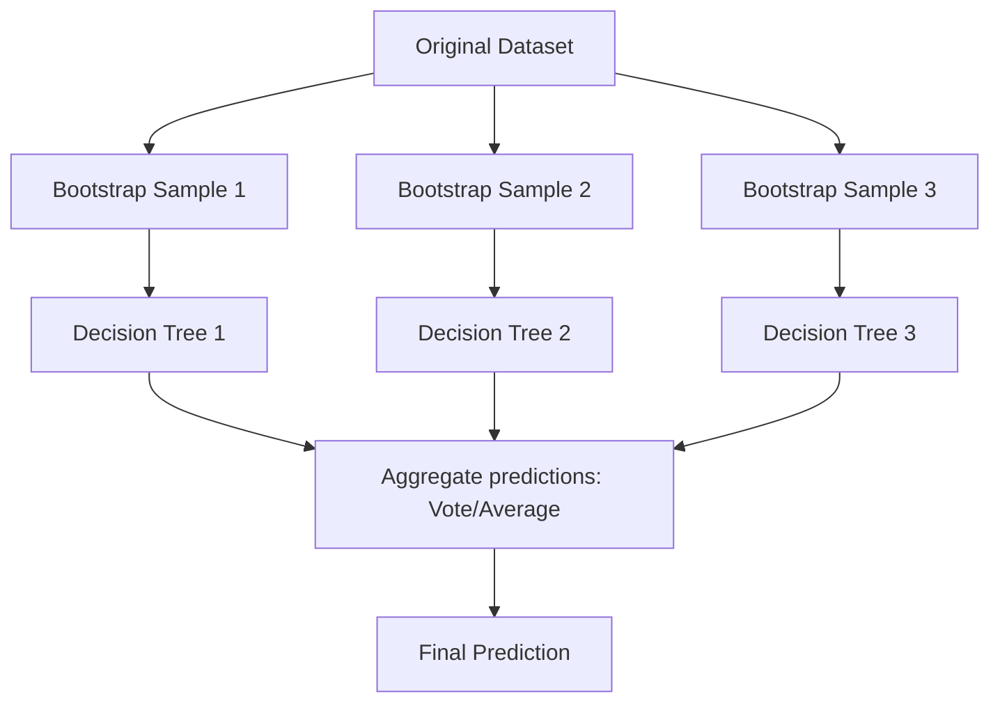

1. **Bootstrapping**: We create $N$ new datasets of the same size as the original by randomly sampling rows with replacement (meaning the same row can be picked multiple times).
2. **Parallel Training**: We train a separate decision tree on each bootstrap sample. Because each tree sees a slightly different subset of data, their errors are uncorrelated.
3. **Aggregating**: 
   * **For Classification**: Take a majority vote across all trees.
   * **For Regression**: Average the outputs of all trees.
   
#### Concrete Example of Bagging (Random Forest):
Suppose we want to predict a house's value ($y$). Our training set has 100 houses.
* **Bootstrapping**: We draw 10 random samples of size 100 with replacement.
* **Training**: We train 10 separate deep decision trees.
  * Tree 1 is trained on Sample 1 and predicts the house value is $450k.
  * Tree 2 is trained on Sample 2 and predicts the house value is $420k.
  * ...
  * Tree 10 is trained on Sample 10 and predicts the house value is $440k.
* **Aggregation**: We average the 10 predictions: $\frac{450 + 420 + \dots + 440}{10} = \$438\text{k}$. 
* **Why it works**: If one tree overfits to a specific outlier house in the training set, its extreme prediction is washed out by the other 9 trees that did not see that outlier.

---

### 5.2 Boosting

Boosting aims to reduce **Bias** (underfitting). Instead of training models in parallel, it trains them **sequentially** (one after another). Each new model is specifically trained to correct the mistakes (errors or **residuals**) made by the cumulative ensemble of previous models.

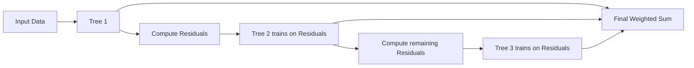

#### Step-by-Step Mathematical Intuition of Boosting:
1. Train a base model $f_1(x)$ on the target values $y$.
2. Compute the prediction error (residual) for each sample: $r_1 = y - f_1(x)$.
3. Train a second model $f_2(x)$ to predict the *residual* $r_1$ (not the original target $y$).
4. The ensemble's combined prediction is now $\hat{y} = f_1(x) + f_2(x)$.
5. Repeat this process: train $f_3(x)$ to predict the remaining residual $r_2 = y - (f_1(x) + f_2(x))$.
6. After $T$ steps, the final prediction is a weighted sum: $\hat{y} = \sum_{t=1}^T \eta \cdot f_t(x)$ (where $\eta$ is the learning rate).

#### Concrete Example of Boosting:
Suppose a house actually sells for **$400k**.
* **Step 1 (Tree 1)**: Trains on the raw data. It makes a simple prediction of **$350k**.
  * Residual (Error): $400k - $350k = **+$50k**. (The model underpredicted).
* **Step 2 (Tree 2)**: Is trained to predict the residual (**+$50k**). It predicts the error is **+$40k**.
  * Combine predictions: $350k + $40k = $390k.
  * Remaining Residual: $400k - $390k = **+$10k**.
* **Step 3 (Tree 3)**: Is trained to predict the remaining residual (**+$10k**). It predicts **+$8k**.
  * Final Combined Prediction: $350k + $40k + $8k = **$398k**.
By focusing sequentially on errors, the boosting model gets closer and closer to the actual target.

---

### 5.3 XGBoost (Extreme Gradient Boosting)

XGBoost is a highly optimized, state-of-the-art implementation of Gradient Boosting. It is widely considered the most powerful algorithm for tabular structured datasets.

#### What makes it "Extreme"?
1. **Regularization**: Unlike standard gradient boosting, XGBoost penalizes complex trees directly in the loss function, preventing overfitting.
2. **Second-Order Derivatives (Taylor Expansion)**: Standard gradient boosting only uses the first derivative (gradient) of the loss function. XGBoost uses both the first derivative (gradient, $g_i$) and the second derivative (Hessian, $h_i$). This allows it to optimize the objective function much faster and more accurately.
3. **Sparsity-Aware Splitting**: It automatically learns how to handle missing values by determining a default direction (left or right branch) for missing data points at each split.
4. **Weighted Quantile Sketch**: An advanced algorithm that finds optimal split points on huge datasets by creating histograms of feature values.

#### Mathematical Formulation
The regularized objective function to minimize at step $t$ is:

$$\mathcal{L}^{(t)} = \sum_{i=1}^{m} l\left(y_i, \hat{y}_i^{(t-1)} + f_t(x_i)\right) + \Omega(f_t)$$

##### Formula Breakdown:
* **$\mathcal{L}^{(t)}$**: The total objective function value we want to minimize in step $t$.
* **$\sum_{i=1}^{m}$**: Summation over all $m$ training samples.
* **$l\left(y_i, \hat{y}_i^{(t-1)} + f_t(x_i)\right)$**: The loss function (e.g., Mean Squared Error) evaluating the difference between the true label $y_i$ and the new prediction.
  * **$\hat{y}_i^{(t-1)}$**: The ensemble's accumulated prediction from the *previous* step $t-1$. This term is constant at step $t$.
  * **$f_t(x_i)$**: The output of the new decision tree $f_t$ we are currently training.
* **$\Omega(f_t)$**: The **Regularization penalty** controlling the complexity of the new tree:

  $$\Omega(f_t) = \gamma T + \frac{1}{2}\lambda \sum_{j=1}^{T} w_j^2$$

  * **$T$**: The number of terminal nodes (leaves) in the tree. $\gamma$ (gamma) penalizes adding more leaves.
  * **$w_j$**: The leaf weights (output values). $\lambda$ (lambda) penalizes large leaf weights, shrinking them toward zero (similar to Ridge L2 regularization).

### 5.4 Python Implementation
```python
import xgboost as xgb
from sklearn.datasets import make_classification
from sklearn.model_selection import train_test_split
from sklearn.metrics import accuracy_score

# Generate binary dataset
X, y = make_classification(n_samples=1000, n_features=20, random_state=42)
X_train, X_test, y_train, y_test = train_test_split(X, y, test_size=0.2, random_state=42)

# Fit XGBoost Classifier
xgb_model = xgb.XGBClassifier(
    n_estimators=100,
    learning_rate=0.1,
    max_depth=5,
    eval_metric='logloss',
    random_state=42
)
xgb_model.fit(X_train, y_train)

print(f"XGBoost Accuracy: {accuracy_score(y_test, xgb_model.predict(X_test)):.4f}")
```

---

## Module 6: Unsupervised Learning - Clustering

Clustering groups unlabeled data points so that items in the same cluster are similar, and items in different clusters are distinct.

### 6.1 K-Means Clustering
K-Means partitions data into $K$ distinct clusters by minimizing the distance between points and their assigned cluster centroid.

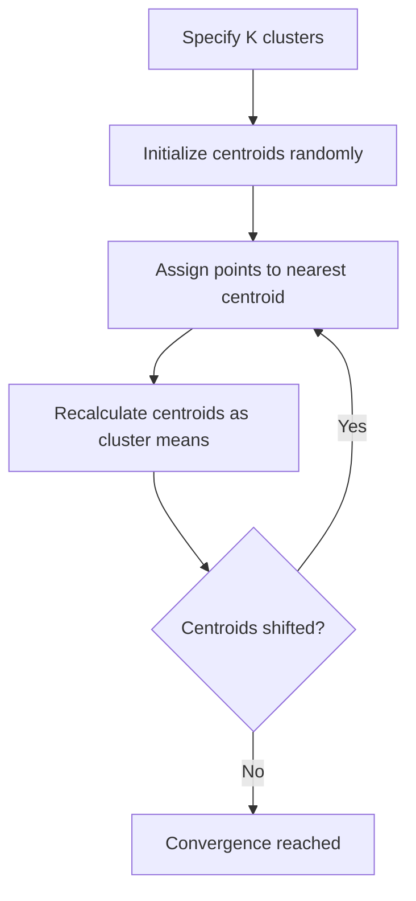

#### Algorithm Steps
1. Randomly place $K$ centroids.
2. Assign each data point to its closest centroid.
3. Compute the mean of all points in each cluster and move the centroid there.
4. Repeat steps 2 and 3 until centroids stabilize (convergence).

#### Choosing K
* **Elbow Method**: Plot the Sum of Squared Errors (SSE/Inertia) vs. $K$ and find the "elbow" point.
* **Silhouette Analysis**: Measures how close each point in one cluster is to points in the neighboring clusters.

### 6.2 Hierarchical Clustering
Constructs a tree-like structure (dendrogram) of clusters.
* **Agglomerative**: Bottom-up approach. Start with individual points and merge the closest clusters.
* **Linkage Criteria**: Defines how distance between clusters is measured:
  * *Single*: Minimum distance between points.
  * *Complete*: Maximum distance between points.
  * *Average*: Mean distance between all pairs.
  * *Ward*: Minimizes variance increase when merging.

### 6.3 DBSCAN
**Density-Based Spatial Clustering of Applications with Noise** groups points based on density, identifying outliers as noise.

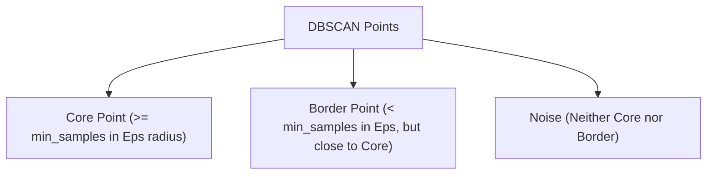

* **Core Points**: Have at least `min_samples` within distance `eps`.
* **Border Points**: Have fewer than `min_samples` in `eps` distance, but reside close to a core point.
* **Noise**: Neither core nor border points.

### 6.4 Python Implementation
```python
from sklearn.cluster import KMeans, AgglomerativeClustering, DBSCAN
from sklearn.datasets import make_blobs
from sklearn.preprocessing import StandardScaler

# Generate 2D clusters
X, _ = make_blobs(n_samples=300, centers=4, cluster_std=0.60, random_state=0)
X = StandardScaler().fit_transform(X)

# K-Means
kmeans = KMeans(n_clusters=4, random_state=42)
kmeans_labels = kmeans.fit_predict(X)

# Agglomerative
hierarchical = AgglomerativeClustering(n_clusters=4)
hc_labels = hierarchical.fit_predict(X)

# DBSCAN
dbscan = DBSCAN(eps=0.3, min_samples=5)
dbscan_labels = dbscan.fit_predict(X)

print("Clustering completed successfully.")
```

---

## Module 7: Evaluation & Validation

To ensure our models generalize to new data, we must evaluate them carefully.

### 7.1 Bias-Variance Tradeoff
* **Bias**: Error due to simplistic assumptions. High bias leads to **Underfitting** (model is too simple).
* **Variance**: Error due to capturing noise in the training data. High variance leads to **Overfitting** (model fits training data perfectly but fails on test data).

```
   Low Bias, High Variance          High Bias, Low Variance          Low Bias, Low Variance
        (Overfitting)                    (Underfitting)               (Optimal Generalization)
   +-----------------------+        +-----------------------+        +-----------------------+
   |   *   x     *         |        |         /             |        |   *   x *             |
   |     *   *   x    x    |        |        /              |        |    * * x  x           |
   |  x      *      x      |        |       /               |        |  x   *   x           |
   +-----------------------+        +-----------------------+        +-----------------------+
```

### 7.2 Cross-Validation
Instead of a single train/test split, **K-Fold Cross-Validation** splits the data into $K$ subsets. The model is trained on $K-1$ subsets and evaluated on the remaining subset. This is repeated $K$ times.

```
Iteration 1: [ Test ] [ Train ] [ Train ] [ Train ]
Iteration 2: [ Train ] [ Test ] [ Train ] [ Train ]
Iteration 3: [ Train ] [ Train ] [ Test ] [ Train ]
Iteration 4: [ Train ] [ Train ] [ Train ] [ Test ]
```

### 7.3 Performance Metrics

#### Regression Metrics
* **Mean Absolute Error (MAE)**:

  $$\text{MAE} = \frac{1}{m} \sum_{i=1}^{m} |y^{(i)} - \hat{y}^{(i)}|$$

* **Mean Squared Error (MSE)**:

  $$\text{MSE} = \frac{1}{m} \sum_{i=1}^{m} (y^{(i)} - \hat{y}^{(i)})^2$$

* **R-squared ($R^2$)**:

  $$R^2 = 1 - \frac{\sum (y^{(i)} - \hat{y}^{(i)})^2}{\sum (y^{(i)} - \bar{y})^2}$$

#### Classification Metrics (Confusion Matrix)
```
                  Predicted Positive    Predicted Negative
Actual Positive         TP                    FN (Type II Error)
Actual Negative   FP (Type I Error)           TN
```

* **Accuracy**: $\frac{TP + TN}{TP + TN + FP + FN}$
* **Precision**: $\frac{TP}{TP + FP}$ (Quality of positive predictions)
* **Recall (Sensitivity)**: $\frac{TP}{TP + FN}$ (Model's coverage of actual positives)
* **F1-Score**: $2 \times \frac{\text{Precision} \times \text{Recall}}{\text{Precision} + \text{Recall}}$ (Harmonic mean)
* **ROC-AUC**: Graphing True Positive Rate vs. False Positive Rate; Area Under the Curve (AUC) measures class separation capability.

---

## Module 8: Code Walkthroughs & Implementation Steps

This module breaks down the code structure, execution steps, and logic for both the **Framework (Scikit-Learn/XGBoost)** and **From-Scratch (Pure Python)** scripts.

---

### 8.1 Regression (Housing Prices Example)
* **Target Concept**: Predict continuous house prices based on square footage.
* **Runnable Files & Output Plots**:
  * **Framework**: [examples/1_regression_housing.py](examples/1_regression_housing.py) &rarr; Output Plot: [examples_1_regression.png](plots/examples_1_regression.png)
  * **From-Scratch**: [scratch/1_linear_regression.py](scratch/1_linear_regression.py) &rarr; Output Plot: [scratch_1_regression.png](plots/scratch_1_regression.png)

#### Step-by-Step Logic Breakdown:
1. **Data Prep**: Define size array ($X$) and price array ($y$).
   * *From-Scratch Difference*: To prevent gradient descent number overflow, size features are normalized by dividing by 1000 ($1.5$ instead of $1500$).
2. **Train/Test Splitting**: The framework uses `train_test_split(X, y, test_size=0.2)` to set aside 2 samples for validation.
3. **Model Initialization & Fitting**:
   * *Framework*: Calls `.fit(X_train, y_train)` on `LinearRegression()`, `Ridge()`, and `Lasso()`.
   * *From-Scratch*: Manually initializes `weight = 0.0` and `bias = 0.0`. Runs a loop for `1000` epochs. Inside the loop, it calculates the prediction error ($h_\theta(x^{(i)}) - y^{(i)}$) for each sample, aggregates the gradients (sum of error $\times$ input size, and sum of errors), updates parameters, and prints MSE loss.
4. **Predicting**:
   * *Framework*: Calls `.predict([[2200]])` on all models.
   * *From-Scratch*: Computes prediction directly: `price = weight * (2200/1000) + bias`.

---

### 8.2 Classification (Student Exam Pass/Fail)
* **Target Concept**: Predict binary pass (1) or fail (0) status based on study hours.
* **Runnable Files & Output Plots**:
  * **Framework**: [examples/2_classification_exam.py](examples/2_classification_exam.py) &rarr; Output Plot: [examples_2_classification.png](plots/examples_2_classification.png)
  * **From-Scratch**: [scratch/2_logistic_regression.py](scratch/2_logistic_regression.py) &rarr; Output Plot: [scratch_2_logistic.png](plots/scratch_2_logistic.png)

#### Step-by-Step Logic Breakdown:
1. **Data Prep**: Inputs hours studied $1$ to $10$; targets are $0$ for hours $\le 5$, and $1$ for hours $\ge 6$.
2. **Probability Mapping (Sigmoid)**:
   * *Framework*: Handled internally by `LogisticRegression()`.
   * *From-Scratch*: Implements `sigmoid(z) = 1 / (1 + exp(-z))` with bounds checks to prevent mathematical float overflow.
3. **Training Updates**:
   * *Framework*: Fits coefficients using coordinate descent solver.
   * *From-Scratch*: Runs a `2000` epoch loop. Computes $z = weight \times hours + bias$, passes it to `sigmoid()`, calculates prediction error, updates parameters via negative gradients, and computes Log Loss to monitor convergence.
4. **Decision Boundaries**:
   * *Both*: Classify as Pass (1) if probability $\ge 0.5$ ($z \ge 0$), otherwise Fail (0).

---

### 8.3 K-Nearest Neighbors (Offer Acceptance)
* **Target Concept**: Classify card offer acceptance based on [Age, Income].
* **Runnable Files & Output Plots**:
  * **Framework**: [examples/3_knn_classification.py](examples/3_knn_classification.py) &rarr; Output Plot: [examples_3_knn.png](plots/examples_3_knn.png)
  * **From-Scratch**: [scratch/3_knn_classification.py](scratch/3_knn_classification.py) &rarr; Output Plot: [scratch_3_knn.png](plots/scratch_3_knn.png)

#### Step-by-Step Logic Breakdown:
1. **Feature Scaling (Standardization)**:
   * *Framework*: Uses `StandardScaler().fit_transform(X)`.
   * *From-Scratch*: Computes the exact mean and standard deviation of Age and Income across the dataset. Standardizes points using: `scaled = (val - mean) / std`.
2. **Distance Matrix Calculation**:
   * *Framework*: Handled internally by `KNeighborsClassifier()`.
   * *From-Scratch*: For the query point, calculates the Euclidean distance to every training point: $d = \sqrt{(x_1 - x_2)^2 + (y_1 - y_2)^2}$.
3. **Sorting & Voting**:
   * *Both*: Select the $K$ points with the smallest distances.
   * *From-Scratch*: Sorts a list of `(distance, index)` tuples using `.sort()`, retrieves the top $K$ items, tallies classification votes, and outputs the majority class.

---

### 8.4 Decision Trees & Random Forests (Churn)
* **Target Concept**: Predict customer churn based on Age, Support Calls, and Tenure.
* **Runnable Files & Output Plots**:
  * **Framework**: [examples/4_decision_tree_rf.py](examples/4_decision_tree_rf.py) &rarr; Output Plot: [examples_4_decision_tree.png](plots/examples_4_decision_tree.png)
  * **From-Scratch**: [scratch/4_decision_tree.py](scratch/4_decision_tree.py) &rarr; Output Plot: [scratch_4_decision_tree.png](plots/scratch_4_decision_tree.png)

#### Step-by-Step Logic Breakdown:
1. **Splitting Metric (Gini Impurity)**:
   * *Framework*: Evaluates splits using internal C libraries.
   * *From-Scratch*: Implements `calculate_gini(labels)`: counts zeros and ones, calculates probability proportions ($p_0, p_1$), and computes $1 - (p_0^2 + p_1^2)$.
2. **Exhaustive Threshold Search**:
   * *Framework*: Automatically tests splits to build a full multi-level tree.
   * *From-Scratch*: Loops through each feature column. For each feature, sorts the values, identifies unique midpoints, splits the dataset, calculates the weighted Gini impurity of the left and right child nodes, and selects the feature and threshold that minimize Gini impurity.
3. **Ensemble Aggregation**:
   * *Framework*: Fits `RandomForestClassifier` which trains multiple independent trees on bootstrapped samples and random features, returning averaged votes.

---

### 8.5 Ensemble Boosting (XGBoost Loan Defaults)
* **Target Concept**: Predict default probability using gradient boosted trees.
* **Runnable Files & Output Plots**:
  * **Framework**: [examples/5_xgboost_ensemble.py](examples/5_xgboost_ensemble.py) &rarr; Output Plot: [examples_5_xgboost.png](plots/examples_5_xgboost.png)

#### Step-by-Step Logic Breakdown:
1. **Dataset Scaling**: Replicates sample indices to produce a robust $100$-sample training set.
2. **Sequential Fitting**: `XGBClassifier` fits trees sequentially. The first tree makes baseline predictions, calculates residuals, and subsequent trees are trained to fit these residuals.
3. **Regularized Complexity**: XGBoost checks leaves count ($T$) and weights ($w$) to penalize model complexity directly during node splits.

---

### 8.6 K-Means Clustering (Customer Segments)
* **Target Concept**: Group customers based on Income and Spending Score.
* **Runnable Files & Output Plots**:
  * **Framework**: [examples/6_kmeans_clustering.py](examples/6_kmeans_clustering.py) &rarr; Output Plot: [examples_6_kmeans.png](plots/examples_6_kmeans.png)
  * **From-Scratch**: [scratch/5_kmeans_clustering.py](scratch/5_kmeans_clustering.py) &rarr; Output Plot: [scratch_5_kmeans.png](plots/scratch_5_kmeans.png)

#### Step-by-Step Logic Breakdown:
1. **Centroid Initialization**: Set initial coordinates for $K=3$ cluster centers.
2. **Iterative Updates**:
   * **Distance & Assignment**: Compute distance from each coordinate point to all 3 centroids. Assign the point to the cluster index of the closest centroid.
   * **Centroid Moving**: Group points by cluster index. Recalculate the centroid coordinate as the average (mean) of all points in that cluster.
   * **Convergence Check**:
     * *Framework*: Continues until coordinate shifts fall below tolerance.
     * *From-Scratch*: Compares new centroid coordinates with previous coordinates. If they are identical, it breaks the loop early.

---

### 8.7 DBSCAN Density Clustering (Outlier Detection)
* **Target Concept**: Density-based clustering that automatically flags outlier points as noise.
* **Runnable Files & Output Plots**:
  * **Framework**: [examples/7_dbscan_clustering.py](examples/7_dbscan_clustering.py) &rarr; Output Plot: [examples_7_dbscan.png](plots/examples_7_dbscan.png)
  * **From-Scratch**: [scratch/6_dbscan_clustering.py](scratch/6_dbscan_clustering.py) &rarr; Output Plot: [scratch_6_dbscan.png](plots/scratch_6_dbscan.png)

#### Step-by-Step Logic Breakdown:
1. **Neighborhood Discovery**:
   * *From-Scratch*: Calculates Euclidean distance between all coordinate pairs. Builds a list of indices representing neighbors within distance `eps = 0.5`.
2. **Core Point Identification**:
   * *Both*: If a point has at least `min_samples = 3` neighbors, it is classified as a **Core Point**.
3. **Queue Expansion (BFS)**:
   * *From-Scratch*: Loops through the points. When an unvisited core point is found, it initializes a new cluster and uses a list-based queue to traverse its neighbors. If any neighbor in the queue is also a core point, its own neighbors are appended to the search queue.
4. **Outlier Labeling**:
   * *Both*: Any point not reachable from a core point remains labeled as `-1` (Noise/Outlier).

---

### 8.8 Model Evaluation & Performance Metrics
* **Target Concept**: Compute metrics for classification and regression models.
* **Runnable Files & Output Plots**:
  * **Framework**: [examples/8_model_evaluation.py](examples/8_model_evaluation.py) &rarr; Output Plot: [examples_8_evaluation.png](plots/examples_8_evaluation.png)
  * **From-Scratch**: [scratch/7_model_evaluation.py](scratch/7_model_evaluation.py) &rarr; Output Plot: [scratch_7_evaluation.png](plots/scratch_7_evaluation.png)

#### Step-by-Step Logic Breakdown:
1. **Classification Metrics (Confusion Matrix)**:
   * *From-Scratch*: Sets counters `tp, fp, tn, fn = 0`. Loops through actual and predicted pairs, updating counters.
   * *Ratios*: Compute Accuracy: `(tp+tn)/total`, Precision: `tp/(tp+fp)`, Recall: `tp/(tp+fn)`, and F1-Score: `2 * p * r / (p + r)`.
2. **Regression Metrics**:
   * *From-Scratch*: Loops through actual and predicted prices. Aggregates absolute differences (`abs(act - pred)`) and squared differences (`(act - pred)**2`).
   * *Ratios*: Compute MAE: `sum_abs/n`, MSE: `sum_sq/n`, RMSE: `sqrt(MSE)`.
   * **R-squared ($R^2$)*: Computes the mean price, calculates total variance sum (`(act - mean)**2`), and returns `1.0 - (sum_squared_error / sum_total_variance)`.

---

## Module 9: Introduction to Large Language Models (LLMs) & Transformers

This module covers the core components of modern generative AI and Large Language Models (LLMs), moving from subword tokenization to continuous word semantics, and finally to the complete Sequence-to-Sequence (Seq2Seq) Transformer architecture.

### 9.1 Tokenization: Byte Pair Encoding (BPE)
Traditional tokenizers split text by whitespace or punctuation, leading to two major flaws: massive vocabulary sizes (which demand huge embedding memory) and an inability to handle unseen or misspelled words (out-of-vocabulary). 

**Byte Pair Encoding (BPE)** solves this by breaking words down into dynamic subwords. It is trained as follows:
1. Initialize the vocabulary ($V$) with all individual characters present in the training corpus, plus a special end-of-word marker `</w>`.
2. Segment the training corpus into space-separated characters.
3. Count frequencies of all adjacent token pairs (bigrams).
4. Identify the most frequent bigram $(s_1, s_2)$ and merge it into a single new subword token $s_{1\_2}$. Add $s_{1\_2}$ to $V$.
5. Repeat steps 3 and 4 for a pre-determined number of merge iterations.

When tokenizing new text, the learned merge rules are applied in the exact order they were trained, slicing words into the largest possible subwords found in the vocabulary.

#### Concrete Example of BPE Merging:
Suppose we train BPE on a simple corpus containing only four words with their respective frequencies:
* `"low"` (freq: 5)
* `"lower"` (freq: 2)
* `"newest"` (freq: 6)
* `"widest"` (freq: 3)

1. **Vocabulary Initialization**:

   $$V = \{\text{'l'}, \text{'o'}, \text{'w'}, \text{'e'}, \text{'r'}, \text{'n'}, \text{'s'}, \text{'t'}, \text{'i'}, \text{'d'}, \text{'</w>'}\}$$


2. **Corpus Segmentation**:
   * `"l o w </w>"` (5 times)
   * `"l o w e r </w>"` (2 times)
   * `"n e w e s t </w>"` (6 times)
   * `"w i d e s t </w>"` (3 times)

3. **Counting Adjacent Pairs**:
   * The bigram `('e', 's')` occurs $6 \text{ (newest)} + 3 \text{ (widest)} = 9$ times.
   * The bigram `('s', 't')` occurs $6 \text{ (newest)} + 3 \text{ (widest)} = 9$ times.
   * The bigram `('l', 'o')` occurs $5 \text{ (low)} + 2 \text{ (lower)} = 7$ times.
   * The bigram `('o', 'w')` occurs $5 \text{ (low)} + 2 \text{ (lower)} = 7$ times.

4. **Iterative Merge**:
   * **Merge 1**: We select the most frequent pair `('e', 's')` (frequency 9) and merge it into a new token `'es'`.
     * Vocabulary expands: $V = V \cup \{\text{'es'}\}$.
     * Corpus segments update: `"newest"` becomes `"n e w es t </w>"`, `"widest"` becomes `"w i d es t </w>"`.
   * **Merge 2**: Now, the pair `('es', 't')` has the highest remaining frequency ($6 + 3 = 9$). We merge it to form `'est'`.
     * Vocabulary expands: $V = V \cup \{\text{'est'}\}$.
     * Corpus segments update: `"newest"` becomes `"n e w est </w>"`, `"widest"` becomes `"w i d est </w>"`.

5. **Tokenization Result**:
   If we encounter a new unseen word `"lowest"`, the learned rules will look for `'low'` (after subsequent merges) and `'est'`, tokenizing it as `["low", "est"]` instead of treating it as an Out-of-Vocabulary error.

---

### 9.2 Vector Semantics: Word Embeddings (Word2Vec)
Computers cannot process raw strings; words must be represented as continuous, dense numerical vectors where semantic similarity translates to geometric closeness (e.g. cosine similarity).

The **Word2Vec Skip-gram** model learns these embeddings by training a simple neural network to predict surrounding context words given a target input word:

$$\mathcal{L} = -\log \sigma({v'_{c_{pos}}}^T v_w) - \sum_{i=1}^k \log \sigma(-{v'_{c_{neg_i}}}^T v_w)$$

Where:
- $v_w \in \mathbb{R}^d$ is the input representation vector of the target word $w$.
- $v'_c \in \mathbb{R}^d$ is the output context representation vector of a candidate word $c$.
- $\sigma(z) = \frac{1}{1 + e^{-z}}$ is the sigmoid activation function representing probability.
- $k$ is the number of randomly selected "negative samples" (words that are not in the target context) used to transform the expensive softmax calculation into efficient binary classifications.

During training, gradient updates adjust the word vectors directly, causing semantically related words to group together in the vector space.

#### Optimization: The Adam Optimizer from Scratch
Rather than standard Gradient Descent, we train the embeddings using the **Adaptive Moment Estimation (Adam)** optimizer implemented from scratch. Adam calculates adaptive learning rates for each parameter by maintaining exponential moving averages of both the gradients ($m_t$) and the squared gradients ($v_t$):

$$m_t = \beta_1 m_{t-1} + (1 - \beta_1) g_t$$
$$v_t = \beta_2 v_{t-1} + (1 - \beta_2) g_t^2$$

Where $g_t$ is the parameter gradient at time step $t$. Because $m_t$ and $v_t$ are initialized as zeros, they are biased toward zero, particularly during early time steps and when the decay rates are close to 1 (i.e. $\beta_1 \approx 0.9$ and $\beta_2 \approx 0.999$). To counteract this, we apply bias-correction to obtain:

$$\hat{m}_t = \frac{m_t}{1 - \beta_1^t}, \quad \hat{v}_t = \frac{v_t}{1 - \beta_2^t}$$

The embedding parameter weights $\theta_t$ are updated using these bias-corrected moments:

$$\theta_t = \theta_{t-1} - \frac{\eta}{\sqrt{\hat{v}_t} + \epsilon} \hat{m}_t$$

Where:
- $\eta$ is the learning rate (step size).
- $\beta_1$ and $\beta_2$ are decay hyperparameters.
- $\epsilon$ is a small constant (e.g. $10^{-8}$) to prevent division by zero.

#### Concrete Example of Skip-gram with Negative Sampling:
Suppose our training sentence is: `"the quick brown fox jumps over the lazy dog"`.
We choose a context window size of 1, a target word **"fox"**, and set $k = 2$ negative samples.

1. **Context Pair Generation (Positive Samples)**:
   Looking at one token left and right of `"fox"`, the actual context words are `"brown"` and `"jumps"`.
   * Positive Training Pairs: `("fox", "brown")` and `("fox", "jumps")`.

2. **Negative Pair Selection (Negative Samples)**:
   We randomly select $k=2$ words from the vocabulary that are *not* in the target word's context window.
   * Selected Negative Words: `"lazy"` and `"the"`.
   * Negative Training Pairs: `("fox", "lazy")` and `("fox", "the")`.

3. **Loss Function Objective**:
   The objective is to maximize the probability of actual context words while minimizing the probability of random negative words:
   * **Maximize Similarity**: Drive the dot product $v\_{\text{fox}}^T v'\_{\text{brown}}$ and $v\_{\text{fox}}^T v'\_{\text{jumps}}$ to be highly positive (making the word vectors point in the same direction in vector space).
   * **Minimize Similarity**: Drive the dot product $v\_{\text{fox}}^T v'\_{\text{lazy}}$ and $v\_{\text{fox}}^T v'\_{\text{the}}$ to be highly negative or zero (pushing their word vectors far apart).

---

### 9.3 The Encoder: Self-Attention & Positional Encoding
The Transformer Encoder processes all token embeddings in parallel. To preserve sequence order, we add a wave-like **Positional Encoding (PE)** vector to each token embedding before the self-attention layer:

$$PE_{(pos, 2i)} = \sin\left(\frac{pos}{10000^{2i/d_{model}}}\right), \quad PE_{(pos, 2i+1)} = \cos\left(\frac{pos}{10000^{2i/d_{model}}}\right)$$

Where $pos$ is the token position in the sequence, and $i$ represents the dimension index.

#### Scaled Dot-Product Self-Attention
For a sequence of input vectors $X \in \mathbb{R}^{T \times d_{model}}$, we project it into Queries ($Q$), Keys ($K$), and Values ($V$) using weight matrices $W^Q, W^K, W^V$:

$$Q = X W^Q, \quad K = X W^K, \quad V = X W^V$$

We compute attention alignment weights by taking the dot product of queries and keys, scaling by the dimension size $\sqrt{d_k}$ to prevent gradient vanishing, and applying softmax:

$$\text{Attention}(Q, K, V) = \text{softmax}\left(\frac{QK^T}{\sqrt{d_k}}\right)V$$

Where $d_k$ is the dimension of keys per attention head.

#### Concrete Example of Self-Attention Alignment:
Consider how self-attention resolves the contextual meaning of the homonym word **"bank"** in two different sentences:
* **Sentence 1**: *"The bank of the river was muddy."*
* **Sentence 2**: *"I deposited money in the bank."*

1. **Input Projections**:
   When processing the token `"bank"`, the model projects its input embedding into a query vector $Q_{\text{bank}}$. Every other word in the sequence is projected into key vectors $K_{\text{river}}$, $K_{\text{deposited}}$, $K_{\text{money}}$, etc.

2. **Computing Attention Scores**:
   * In **Sentence 1**, taking the dot products $Q\_{\text{bank}} K\_{\text{river}}^T$ and $Q\_{\text{bank}} K\_{\text{muddy}}^T$ yields high values because the model has learned that "bank" frequently associates with "river" and "muddy" in geographic contexts.
   * In **Sentence 2**, the dot products $Q\_{\text{bank}} K\_{\text{money}}^T$ and $Q\_{\text{bank}} K\_{\text{deposited}}^T$ yield high values due to their financial co-occurrences.

3. **Softmax Output & Weighted Representation**:
   * After applying softmax, the attention weights in **Sentence 1** will be high for `"river"` and `"muddy"`. The resulting representation for `"bank"` is calculated as a weighted sum of value vectors, heavily incorporating $V\_{\text{river}}$ and $V\_{\text{muddy}}$. This mathematically shifts the embedding of `"bank"` toward a geographic context.
   * In **Sentence 2**, the representation for `"bank"` incorporates $V\_{\text{money}}$ and $V\_{\text{deposited}}$, shifting the context of the token toward a financial institution.

#### Multi-Head Attention (MHA)
Rather than computing attention once, we split $Q, K, V$ into $H$ heads, compute attention on each head in parallel, concatenate the outputs, and project back using an output matrix $W^O$. This allows the model to attend to information from different representation subspaces simultaneously.

The encoder layer output is finalized using residual connections and Layer Normalization:

$$X_{attn} = \text{LayerNorm}(X + \text{MultiHeadAttention}(X))$$

$$X_{output} = \text{LayerNorm}(X_{attn} + \text{FeedForward}(X_{attn}))$$

Where the Feed-Forward Network is a simple two-layer MLP with ReLU activation:

$$\text{FeedForward}(x) = \max(0, x W_1 + b_1) W_2 + b_2$$

---

### 9.4 The Decoder: Causal Masking & Cross-Attention
The Transformer Decoder generates target tokens autoregressively. It features two special attention layers:

**1. Causal Masked Self-Attention**
To prevent the model from looking at future target tokens during training, we add a causal mask matrix $M$ to the dot-product attention scores before softmax:

$$
M_{i, j} = \begin{cases} 0 & \text{if } j \le i \\ -\infty & \text{if } j > i \end{cases}
$$

$$\text{Attention}_{masked}(Q, K, V) = \text{softmax}\left(\frac{QK^T}{\sqrt{d_k}} + M\right)V$$

When softmax is applied, the $-\infty$ values become exactly 0, preventing attention to future positions.

**2. Encoder-Decoder Cross-Attention**
The Queries ($Q$) come from the decoder's masked self-attention representation, whereas the Keys ($K$) and Values ($V$) come from the encoder's final output representations. This maps target words directly back to the source words.

#### Concrete Example of Causal Masking:
Suppose we are training a decoder on a 3-token target sequence: `["I", "love", "AI"]`.

**1. Compute raw attention scores**
Calculating the dot product scores $\frac{QK^T}{\sqrt{d_k}}$ yields a $3 \times 3$ logit matrix representing matching strengths between all tokens:

$$\text{Logits} = \begin{pmatrix} S_{1,1} & S_{1,2} & S_{1,3} \\ S_{2,1} & S_{2,2} & S_{2,3} \\ S_{3,1} & S_{3,2} & S_{3,3} \end{pmatrix}$$

**2. Apply the causal mask**
We add the causal mask matrix $M$ to the logit matrix:

$$
\text{Logits} + M = \begin{pmatrix} S_{1,1} & S_{1,2} & S_{1,3} \\ S_{2,1} & S_{2,2} & S_{2,3} \\ S_{3,1} & S_{3,2} & S_{3,3} \end{pmatrix} + \begin{pmatrix} 0 & -\infty & -\infty \\ 0 & 0 & -\infty \\ 0 & 0 & 0 \end{pmatrix} = \begin{pmatrix} S_{1,1} & -\infty & -\infty \\ S_{2,1} & S_{2,2} & -\infty \\ S_{3,1} & S_{3,2} & S_{3,3} \end{pmatrix}
$$

**3. Softmax Output**
When softmax is applied row-wise:
* **Row 1 ("I")**: The values at column 2 and 3 become exactly $0$. The token `"I"` can *only* attend to itself.
* **Row 2 ("love")**: The value at column 3 becomes $0$. The token `"love"` can attend to `"I"` and `"love"`.
* **Row 3 ("AI")**: No masking is applied. `"AI"` can attend to all three tokens.

This mathematically restricts the model from looking ahead during training, forcing it to learn to predict the next token based only on past context.

---

### 9.5 End-to-End LLM Python Implementation
We have created five pure Python scripts inside the `llm/` directory showing how these pieces operate together step-by-step:

1. **[llm/1_bpe_tokenizer.py](llm/1_bpe_tokenizer.py)**: Trains BPE merge rules on a corpus, segments out-of-vocabulary words, and saves [llm_1_bpe_vocab.png](plots/llm_1_bpe_vocab.png).
2. **[llm/2_word2vec.py](llm/2_word2vec.py)**: Trains semantic 2D embeddings on context pairs using the Adam optimizer implemented from scratch, and saves [llm_2_word2vec.png](plots/llm_2_word2vec.png) (showing semantic word clusters).
3. **[llm/3_encoder.py](llm/3_encoder.py)**: Implements positional encoding math, Q/K/V projections, Multi-Head self-attention, LayerNorm, and FFN, saving the wave positional encoding heatmap to [llm_3_positional_encoding.png](plots/llm_3_positional_encoding.png).
4. **[llm/4_decoder.py](llm/4_decoder.py)**: Implements causal masking, cross-attention alignment, and saves the causal mask visual boundary heatmap to [llm_4_causal_mask.png](plots/llm_4_causal_mask.png).
5. **[llm/5_transformer_llm.py](llm/5_transformer_llm.py)**: Assembles the tokenizer, embeddings, encoder, and decoder layers. Translates English inputs to Spanish step-by-step using greedy autoregressive decoding, saving the cross-attention alignment map to [llm_5_attention_alignment.png](plots/llm_5_attention_alignment.png).

---

## Appendix: Glossary of Key Terminologies

To help students quickly grasp machine learning jargon, here is a consolidated list of key terms with comprehensive mathematical foundations, step-by-step examples, and high-resolution dark-mode diagrams:

---

### 1. Centroid
* **Mathematical Definition**: The geometric center of a cluster of data points. For a cluster $S = \{\mathbf{x}^{(1)}, \mathbf{x}^{(2)}, \dots, \mathbf{x}^{(N)}\}$ containing $N$ samples in $D$-dimensional space (where each $\mathbf{x}^{(i)} \in \mathbb{R}^D$), the centroid vector $\mathbf{\mu}$ is the arithmetic mean of all point vectors:

  $$\mathbf{\mu} = \frac{1}{N} \sum_{i=1}^N \mathbf{x}^{(i)}$$

* **Step-by-Step Example**:
  Consider a cluster $S$ containing four 3D data points:
  1. $\mathbf{x}^{(1)} = [2.0, 3.0, 5.0]$
  2. $\mathbf{x}^{(2)} = [4.0, 6.0, 8.0]$
  3. $\mathbf{x}^{(3)} = [1.0, 2.0, 3.0]$
  4. $\mathbf{x}^{(4)} = [5.0, 9.0, 12.0]$
  
  We calculate the arithmetic mean independently along each of the three dimensions:
  * **Dimension 1 ($x$)**: $\frac{2.0 + 4.0 + 1.0 + 5.0}{4} = \frac{12.0}{4} = 3.0$
  * **Dimension 2 ($y$)**: $\frac{3.0 + 6.0 + 2.0 + 9.0}{4} = \frac{20.0}{4} = 5.0$
  * **Dimension 3 ($z$)**: $\frac{5.0 + 8.0 + 3.0 + 12.0}{4} = \frac{28.0}{4} = 7.0$
  
  The calculated Centroid is:
  
  $$\mathbf{\mu} = [3.0, 5.0, 7.0]$$

* **Visual Demonstration**: Refer to the left panel of `plots/glossary_math_concepts.png` to see how the centroid acts as the geometric gravity center of clustered coordinates.

  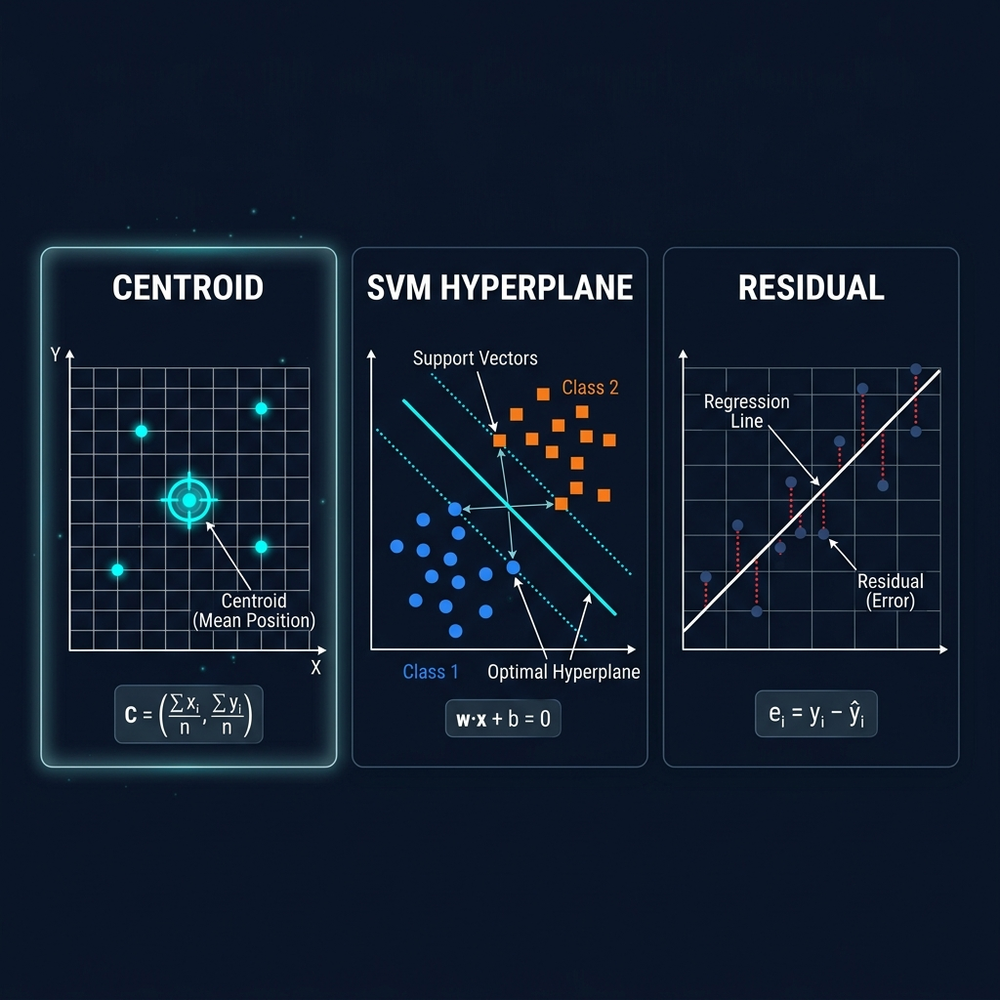

---

### 2. Hyperplane, Margin, & Support Vectors (SVM Concepts)
* **Mathematical Definitions**:
  * **Hyperplane**: An affine decision boundary of dimension $D - 1$ that separates a $D$-dimensional space into two half-spaces representing different classes. It is defined by the linear equation:
  
    $$\mathbf{w}^T \mathbf{x} + b = 0$$
  
    where $\mathbf{w}$ is a weight vector perpendicular to the hyperplane, and $b$ is the bias offset.
  * **Margin**: The perpendicular distance between the separating hyperplane and the closest training points from either class. The geometric margin is formulated as:
  
    $$\text{Margin} = \frac{2}{\|\mathbf{w}\|}$$
  
    SVM algorithms aim to maximize this margin to reduce generalization error.
  * **Support Vectors**: The critical training instances $\mathbf{x}^{(i)}$ that lie exactly on the boundary of the margin. They satisfy the active constraint equation:
  
    $$y\_i(\mathbf{w}^T \mathbf{x}^{(i)} + b) = 1$$
  
    where $y\_i \in \{-1, 1\}$ is the class label. Changing or removing non-support vectors does not affect the decision boundary, whereas modifying a support vector changes the hyperplane.
* **Step-by-Step Example**:
  Consider a 2D space where the optimal separating hyperplane is $x\_1 - x\_2 + 1 = 0$ (so $\mathbf{w} = [1, -1]^T$ and $b = 1$). We have two support vectors:
  1. Positive class support vector ($y\_1 = +1$): $\mathbf{x}^{(1)} = [2.0, 2.0]^T$. Checking the constraint:
  
     $$(+1) \cdot (1(2.0) - 1(2.0) + 1) = 1 \quad \text{(Active Constraint)}$$
  
  2. Negative class support vector ($y\_2 = -1$): $\mathbf{x}^{(2)} = [0.0, 2.0]^T$. Checking the constraint:
  
     $$(-1) \cdot (1(0.0) - 1(2.0) + 1) = (-1)(-1) = 1 \quad \text{(Active Constraint)}$$
  
  The width of the margin is:
  
  $$\text{Margin} = \frac{2}{\sqrt{1^2 + (-1)^2}} = \frac{2}{\sqrt{2}} = \sqrt{2} \approx 1.414$$

* **Visual Demonstration**: Refer to the center panel of `plots/glossary_math_concepts.png` to inspect the hyperplane, parallel margins, and highlighted support vectors.

---

### 3. Weak Learner
* **Conceptual Definition**: A simple machine learning model that performs only slightly better than random guessing (i.e., has an error rate strictly less than $0.5$ on a binary classification task). Ensembles (like Boosting) sequentially combine many weak learners to build a strong predictive model.
* **Mathematical Concept**:
  In AdaBoost, a weak classifier $h\_t(\mathbf{x})$ is trained on a distribution of weights $D\_t(i)$ over the dataset. The weighted error $\epsilon\_t$ of the weak learner must satisfy:
  
  $$\epsilon\_t = \sum_{i=1}^N D\_t(i) \mathbb{I}(y\_i \neq h\_t(\mathbf{x}^{(i)})) < 0.5$$

* **Step-by-Step Example**:
  A **Decision Stump** (a tree of depth 1) splits a dataset on a single feature threshold.
  Suppose we have 5 data points with labels $y = [1, 1, -1, -1, 1]$ and feature $x\_1 = [5.0, 6.0, 3.0, 2.0, 4.0]$.
  We train a decision stump with the rule:
  * Predict $+1$ if $x\_1 > 4.5$
  * Predict $-1$ if $x\_1 \le 4.5$
  
  Applying this rule gives predictions $\hat{y} = [1, 1, -1, -1, -1]$. 
  Comparing with true labels, the model misclassifies only the last sample (true label is $1$, predicted is $-1$).
  With uniform sample weights $D(i) = 0.2$, the error rate is:
  
  $$\epsilon = 1 \cdot 0.2 = 0.2$$
  
  Since $0.2 < 0.5$, this decision stump is a valid weak learner.
* **Visual Demonstration**: Refer to `plots/bagging_vs_boosting.png` to see how weak learners are chained sequentially (boosting) or trained in parallel (bagging).

  

---

### 4. Residual
* **Mathematical Definition**: The difference between the actual observed value $y\_i$ and the model's predicted value $\hat{y}\_i$ for a given training sample $i$:
  
  $$e\_i = y\_i - \hat{y}\_i$$
  
  In Gradient Boosting, fitting a model to residuals is mathematically equivalent to taking a step along the negative gradient of the Mean Squared Error (MSE) loss function:
  
  $$L = \frac{1}{2}(y\_i - \hat{y}\_i)^2 \implies -\frac{\partial L}{\partial \hat{y}\_i} = y\_i - \hat{y}\_i = e\_i$$

* **Step-by-Step Example**:
  Suppose we train a baseline regression model to predict electricity bill amounts:
  * **Sample 1**: Actual bill $y\_1 = \$150$, predicted $\hat{y}\_1 = \$135 \implies e\_1 = 150 - 135 = \$15$ (Under-prediction)
  * **Sample 2**: Actual bill $y\_2 = \$90$, predicted $\hat{y}\_2 = \$105 \implies e\_2 = 90 - 105 = -\$15$ (Over-prediction)
  * **Sample 3**: Actual bill $y\_3 = \$210$, predicted $\hat{y}\_3 = \$200 \implies e\_3 = 210 - 200 = \$10$ (Under-prediction)
  
  The residual vector is $[15, -15, 10]^T$. The next weak learner in the boosting chain is trained specifically to predict these residuals, refining the master model's sum-of-predictions.
* **Visual Demonstration**: Refer to the right panel of `plots/glossary_math_concepts.png` showing the residual distances between actual points and the regression line.

---

### 5. Regularization ($L\_1$ / $L\_2$)
* **Mathematical Definition**: A technique used to prevent overfitting by adding a penalty term to the loss function that constrains the magnitude of the model parameters (weights $\mathbf{w}$):
  
  $$J(\mathbf{w}) = L(\mathbf{w}) + \lambda \Omega(\mathbf{w})$$
  
  where $L(\mathbf{w})$ is the standard training loss, $\lambda \ge 0$ is the regularization strength hyperparameter, and $\Omega(\mathbf{w})$ is the penalty term:
  * **$L\_1$ Regularization (Lasso)**: Adds the sum of absolute values of weights:
  
    $$\Omega(\mathbf{w}) = \|\mathbf{w}\|\_1 = \sum_{j=1}^D |w\_j|$$
  
    It creates diamond-shaped constraints that drive non-essential feature weights to exactly zero, performing feature selection.
  * **$L\_2$ Regularization (Ridge)**: Adds the sum of squared values of weights:
  
    $$\Omega(\mathbf{w}) = \frac{1}{2}\|\mathbf{w}\|\_2^2 = \frac{1}{2}\sum_{j=1}^D w\_j^2$$
  
    It creates spherical constraints that shrink all weights close to zero but keeps all features active.
* **Step-by-Step Example**:
  To see exactly how regularized weights are calculated, suppose our baseline training loss $L(\mathbf{w})$ is defined as:

  $$L(\mathbf{w}) = \frac{1}{2}(w\_1 - 10.0)^2 + \frac{1}{2}(w\_2 - 0.05)^2$$

  If there is no regularization ($\lambda = 0$), the optimizer minimizes $L(\mathbf{w})$ by setting its partial derivatives to zero:

  $$\frac{\partial L}{\partial w\_1} = w\_1 - 10.0 = 0 \implies w\_1^* = 10.0$$

  $$\frac{\partial L}{\partial w\_2} = w\_2 - 0.05 = 0 \implies w\_2^* = 0.05$$

  This yields the unregularized optimal weights $\mathbf{w}^* = [10.0, 0.05]^T$. Now we introduce regularization with strength $\lambda = 1.5$:

  * **Lasso ($L\_1$) Penalty**:
    The regularized objective to minimize is:

    $$J(\mathbf{w}) = \left[ \frac{1}{2}(w\_1 - 10.0)^2 + \frac{1}{2}(w\_2 - 0.05)^2 \right] + 1.5(|w\_1| + |w\_2|)$$

    Since the parameters are decoupled, we solve for each weight $w\_j$ independently using the analytical **Soft-Thresholding Operator**:

    $$w\_j^* = S\_{\lambda}(w\_{j,\text{unreg}}) = \text{sign}(w\_{j,\text{unreg}}) \cdot \max(|w\_{j,\text{unreg}}| - \lambda, 0)$$

    Applying this operator:
    * For $w\_1$:
      
      $$w\_1^* = S\_{1.5}(10.0) = \text{sign}(10.0) \cdot \max(|10.0| - 1.5, 0) = 1 \cdot 8.5 = 8.5$$

    * For $w\_2$:
      
      $$w\_2^* = S\_{1.5}(0.05) = \text{sign}(0.05) \cdot \max(|0.05| - 1.5, 0) = 1 \cdot \max(-1.45, 0) = 0.0$$

    The resulting optimal Lasso weight vector is $\mathbf{w}^* = [8.5, 0.0]^T$, which is sparse since $w\_2$ was driven to exactly zero.

  * **Ridge ($L\_2$) Penalty**:
    The regularized objective to minimize (using the standard quadratic penalty) is:

    $$J(\mathbf{w}) = \left[ \frac{1}{2}(w\_1 - 10.0)^2 + \frac{1}{2}(w\_2 - 0.05)^2 \right] + \frac{1.5}{2}(w\_1^2 + w\_2^2)$$

    We take the partial derivative of $J(\mathbf{w})$ with respect to each parameter and set them to zero:
    * For $w\_1$:
      
      $$\frac{\partial J}{\partial w\_1} = (w\_1 - 10.0) + 1.5w\_1 = 2.5w\_1 - 10.0 = 0 \implies w\_1^* = \frac{10.0}{2.5} = 4.0$$

    * For $w\_2$:
      
      $$\frac{\partial J}{\partial w\_2} = (w\_2 - 0.05) + 1.5w\_2 = 2.5w\_2 - 0.05 = 0 \implies w\_2^* = \frac{0.05}{2.5} = 0.02$$

    The resulting optimal Ridge weight vector is $\mathbf{w}^* = [4.0, 0.02]^T$. Note that both weights are shrunk toward zero, but $w\_2$ remains active (non-zero), illustrating how $L\_2$ preserves all features.
* **Visual Demonstration**: Refer to the bottom panels of `plots/glossary_normalization_regularization.png` to examine the geometry of L1 (diamond) and L2 (circle) constraint boundaries.

  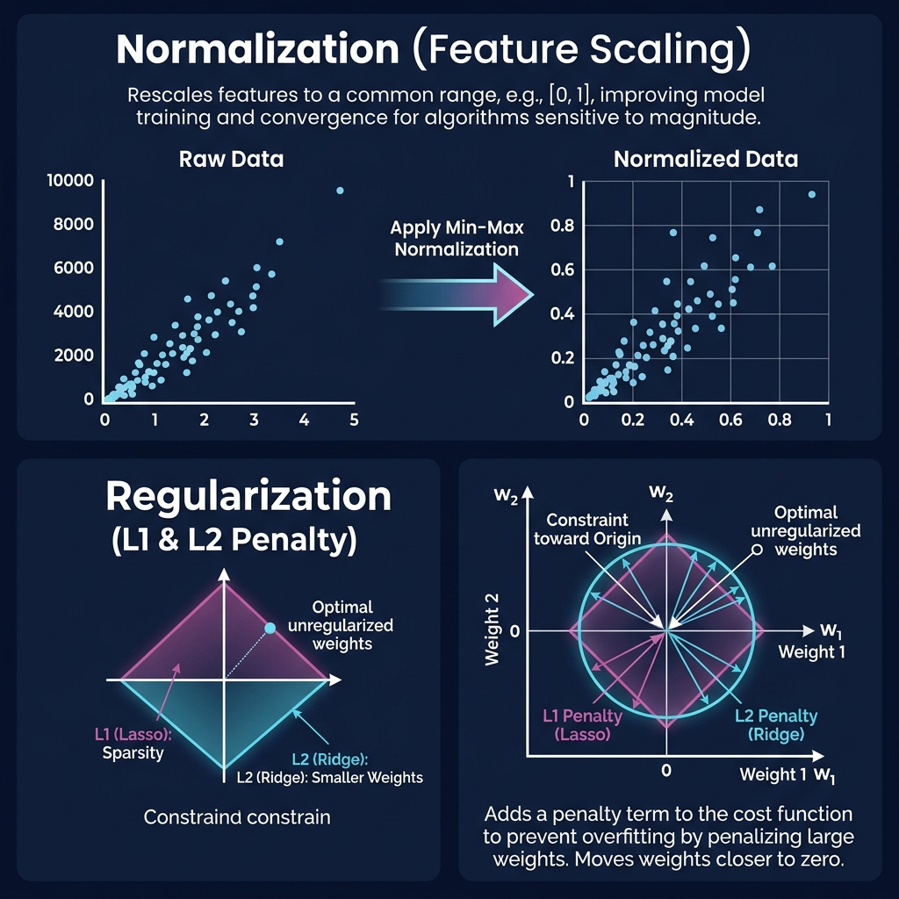

---

### 6. Normalization
* **Mathematical Definition**: The process of scaling numerical feature vectors to a standard scale. This prevents features with large magnitudes (e.g., salary) from dominating features with small magnitudes (e.g., age) in distance-based calculations or gradient steps.
  * **Min-Max Scaling**: Rescales the values to a fixed range, typically $[0, 1]$:
  
    $$x\_{\text{norm}} = \frac{x - x\_{\text{min}}}{x\_{\text{max}} - x\_{\text{min}}}$$
  
  * **Standardization (Z-Score Normalization)**: Centers the feature distribution around a mean ($\mu$) of $0$ with a standard deviation ($\sigma$) of $1$:
  
    $$x\_{\text{std}} = \frac{x - \mu}{\sigma}$$

* **Step-by-Step Example**:
  Suppose we have a feature representing house sizes (in sq ft): $X = [1000, 1500, 2000, 2500]$.
  * **Min-Max Scaling**:
    * $x\_{\text{min}} = 1000$, $x\_{\text{max}} = 2500$
    * For $x = 1000$: $x\_{\text{norm}} = \frac{1000 - 1000}{2500 - 1000} = 0.0$
    * For $x = 1500$: $x\_{\text{norm}} = \frac{1500 - 1000}{1500} = 0.333$
    * For $x = 2000$: $x\_{\text{norm}} = \frac{2000 - 1000}{1500} = 0.667$
    * For $x = 2500$: $x\_{\text{norm}} = \frac{2500 - 1000}{1500} = 1.0$
    
    The normalized feature values are $[0.0, 0.333, 0.667, 1.0]$.
  * **Standardization**:
    * Mean $\mu = \frac{1000 + 1500 + 2000 + 2500}{4} = 1750$
    * Variance $\sigma^2 = \frac{(1000-1750)^2 + (1500-1750)^2 + (2000-1750)^2 + (2500-1750)^2}{4} = 312500 \implies \sigma \approx 559.02$
    * For $x = 1000$: $x\_{\text{std}} = \frac{1000 - 1750}{559.02} = -1.34$
    * For $x = 2500$: $x\_{\text{std}} = \frac{2500 - 1750}{559.02} = 1.34$
    
    The standardized feature values are $[-1.34, -0.45, 0.45, 1.34]$.
* **Visual Demonstration**: Refer to the top panels of `plots/glossary_normalization_regularization.png` to view the original raw distribution vs. the scaled Min-Max and Standardized outputs.

---

### 7. Inductive Bias
* **Conceptual Definition**: The set of assumptions an algorithm makes to predict outputs for unseen query inputs. Without inductive bias, a model could only memorize training facts and would fail to generalize.
* **Examples of Algorithmic Bias**:
  * **Linear Regression**: Assumes the true target relationship is a linear combination of features ($y = \mathbf{w}^T \mathbf{x} + b$).
  * **K-Nearest Neighbors**: Assumes locality—data points close to each other in feature space are highly likely to share the same target value.
  * **Convolutional Neural Networks (CNNs)**: Assume translation invariance (an object is the same regardless of its position in the image) and spatial locality.
* **Step-by-Step Example**:
  Imagine we are given three training points: $(1.0, 2.0)$, $(2.0, 4.0)$, $(3.0, 6.0)$. We query the prediction for a new input $x = 4.0$.
  * **Eager Linear Model**: Due to its linear inductive bias, it infers the underlying target function is $y = 2x$, and outputs $y = 8.0$.
  * **Nearest Neighbor Model**: Due to its locality bias, it finds the nearest coordinate $x = 3.0$ (associated with $y=6.0$) and outputs $y = 6.0$.
  * **A Model with Zero Inductive Bias** (e.g. a literal database lookup table): Simply fails to predict anything or outputs an error because $x=4.0$ was not present in the training set.
* **Visual Demonstration**: Refer to the top-right panel of `plots/glossary_gradient_bias_lazy.png` to see how linear and local inductive bias assumptions shape decision boundaries.

  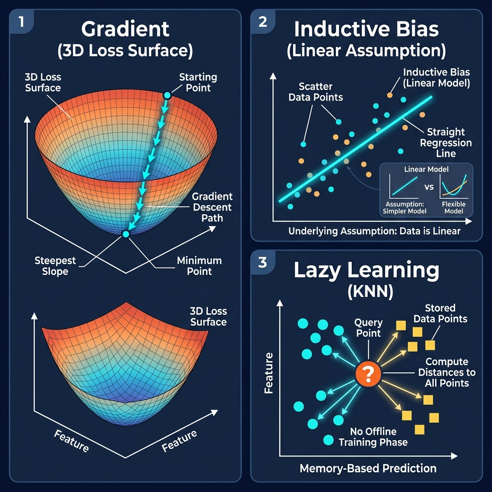

---

### 8. Lazy Learning
* **Conceptual Definition**: A class of learning algorithms that defer the training/generalization phase until a prediction query is made. Eager learners (like Neural Networks or Decision Trees) train offline to build an input-independent formula and discard raw data. Lazy learners perform zero offline generalization, instead storing the entire dataset in memory.
  * **Training Time Complexity**: $O(1)$ (raw data ingestion).
  * **Prediction Time Complexity**: $O(N \cdot D)$ where $N$ is the number of samples and $D$ is the dimension. This makes inference computationally expensive for large datasets.
* **Step-by-Step Example**:
  Consider a 1-Nearest Neighbor classifier with a stored training set of 3 points:
  * $A = (1.0, 1.0)$ [Class: Red]
  * $B = (2.0, 2.0)$ [Class: Blue]
  * $C = (5.0, 5.0)$ [Class: Red]
  
  When a query point $Q = (1.5, 1.2)$ is input:
  1. **Lazy Step 1**: Compute Euclidean distances from $Q$ to all points:
     * $d(Q, A) = \sqrt{(1.5-1)^2 + (1.2-1)^2} = \sqrt{0.25 + 0.04} \approx 0.54$
     * $d(Q, B) = \sqrt{(1.5-2)^2 + (1.2-2)^2} = \sqrt{0.25 + 0.64} \approx 0.94$
     * $d(Q, C) = \sqrt{(1.5-5)^2 + (1.2-5)^2} = \sqrt{12.25 + 14.44} \approx 5.17$
  2. **Lazy Step 2**: Identify the shortest distance: point $A$ ($0.54$).
  3. **Lazy Step 3**: Output class of $A$: Red.
* **Visual Demonstration**: Refer to the bottom panel of `plots/glossary_gradient_bias_lazy.png` showing how query coordinates evaluate distances against stored data coordinates on the fly.

---

### 9. Bootstrapping & Feature Subspacing (Ensemble Concepts)
* **Conceptual Definitions**:
  * **Bootstrapping**: A sampling method that generates $B$ new datasets from an original dataset of size $N$ by drawing $N$ samples uniformly *with replacement*. 
    Mathematically, the probability of a specific sample *not* being chosen in a bootstrap sample of size $N$ is:
  
    $$\lim_{N \to \infty} \left(1 - \frac{1}{N}\right)^N = \frac{1}{e} \approx 0.368$$
  
    This means each bootstrap sample contains roughly $63.2\%$ of the original unique samples, while the remaining $36.8\%$ form the Out-of-Bag (OOB) validation set.
  * **Feature Subspacing**: A method where only a random subset of $m$ features (typically $m = \sqrt{D}$ for classification, where $D$ is the total features) is made available at each node split in a decision tree. This forces individual trees to split on different variables, decorrelating their errors and reducing the ensemble's overall variance.
* **Step-by-Step Example**:
  Let our training set be $D = [A, B, C, D]$ with features $F = [f\_1, f\_2, f\_3, f\_4]$.
  * **Bootstrap Sampling**: We draw a sample 4 times with replacement:
    1. Draw 1: $B$
    2. Draw 2: $D$
    3. Draw 3: $B$ (duplicate)
    4. Draw 4: $A$
    
    The resulting bootstrap dataset is $D^* = [B, D, B, A]$. Point $C$ was never chosen and is designated as an Out-of-Bag sample.
  * **Feature Subspace Selection**: At the root node of tree $T\_1$, we randomly select $\sqrt{4} = 2$ features: e.g., $F_{\text{sub}} = [f\_2, f\_4]$. The node can only evaluate splitting criteria on $f\_2$ and $f\_4$. At the root node of tree $T\_2$, the subset might be $F_{\text{sub}} = [f\_1, f\_3]$.
* **Visual Demonstration**: Refer to `plots/bagging_vs_boosting.png` which shows how independent parallel models use bootstrap samples and randomized feature splits.

---

### 10. Gradient
* **Mathematical Definition**: The vector of partial derivatives of a scalar function $f(\mathbf{w})$ with respect to its input weight variables $\mathbf{w} = [w\_1, w\_2, \dots, w\_D]^T$:
  
  $$\nabla f(\mathbf{w}) = \left[ \frac{\partial f}{\partial w\_1}, \frac{\partial f}{\partial w\_2}, \dots, \frac{\partial f}{\partial w\_D} \right]^T$$
  
  The gradient points in the direction of the steepest rate of increase of the function. In optimization, we update weights in the opposite direction (gradient descent) to find the local minimum of a loss function:
  
  $$\mathbf{w}\_{t+1} = \mathbf{w}\_t - \eta \nabla f(\mathbf{w}\_t)$$
  
  where $\eta > 0$ is the learning rate.
* **Step-by-Step Example**:
  Let our objective loss function be $f(w\_1, w\_2) = w\_1^2 + 3w\_2^2$.
  1. The gradient vector formula is:
  
     $$\nabla f(w\_1, w\_2) = [2w\_1, 6w\_2]^T$$
  
  2. Suppose our current weights are $\mathbf{w}\_t = [4.0, 1.0]^T$, and the learning rate is $\eta = 0.1$.
  3. Evaluate the gradient at $\mathbf{w}\_t$:
  
     $$\nabla f(4.0, 1.0) = [2(4.0), 6(1.0)]^T = [8.0, 6.0]^T$$
  
  4. Perform the update:

$$
\mathbf{w}_{t+1} = \begin{bmatrix} 4.0 \\ 1.0 \end{bmatrix} - 0.1 \begin{bmatrix} 8.0 \\ 6.0 \end{bmatrix} = \begin{bmatrix} 4.0 - 0.8 \\ 1.0 - 0.6 \end{bmatrix} = \begin{bmatrix} 3.2 \\ 0.4 \end{bmatrix}
$$
  
  Our loss decreases from $f(4.0, 1.0) = 19.0$ to $f(3.2, 0.4) = (3.2)^2 + 3(0.4)^2 = 10.24 + 0.48 = 10.72$.
* **Visual Demonstration**: Refer to the top-left panel of `plots/glossary_gradient_bias_lazy.png` to see how the gradient vector guides a point down a 3D loss valley.

---

### 11. Token
* **Conceptual Definition**: The basic atomic unit of text that a language model processes. Tokenizers translate strings of text into a sequence of integer token IDs mapping to a fixed vocabulary.
  * **Word-level**: Every distinct word gets its own ID.
  * **Character-level**: Every unique character (e.g., 'a', 'b', '!') is an ID.
  * **Subword-level (e.g. Byte Pair Encoding)**: Text is broken into frequent subwords (e.g. "pre", "ing"), allowing the model to handle unseen words by breaking them down.
* **Step-by-Step Example**:
  Suppose a BPE tokenizer has the vocabulary: `{"h": 0, "e": 1, "l": 2, "o": 3, "lo": 4, "hel": 5}`.
  We want to tokenize the word `"hello"`.
  1. The string is split into individual characters: `['h', 'e', 'l', 'l', 'o']`
  2. BPE merges the most frequent pairs in the vocabulary:
     * Merge `"h"`, `"e"`, `"l"` to form `"hel"` $\to$ `["hel", "l", "o"]`
     * Merge `"l"` and `"o"` to form `"lo"` $\to$ `["hel", "lo"]`
  3. Lookup IDs: `"hel"` maps to ID `5`, `"lo"` maps to ID `4`.
  
  The token output sequence is `[5, 4]`.
* **Visual Demonstration**: Refer to the top panel of `plots/glossary_llm_concepts.png` showing subword splits and vocabulary index matching.

  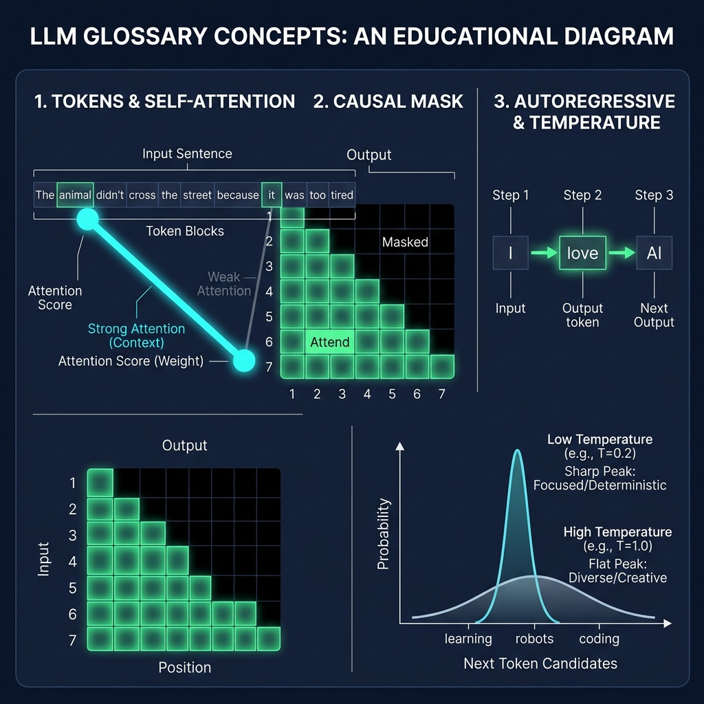

---

### 12. Self-Attention
* **Mathematical Definition**: An attention mechanism relating different positions of a single sequence to compute a representation of the sequence. Given input embeddings $\mathbf{X}$, we project them into Query ($\mathbf{Q}$), Key ($\mathbf{K}$), and Value ($\mathbf{V}$) matrices using learned weights:
  
  $$\mathbf{Q} = \mathbf{X}\mathbf{W}\_Q, \quad \mathbf{K} = \mathbf{X}\mathbf{W}\_K, \quad \mathbf{V} = \mathbf{X}\mathbf{W}\_V$$
  
  The output representation is calculated using the scaled dot-product:
  
  $$\text{Attention}(\mathbf{Q}, \mathbf{K}, \mathbf{V}) = \text{Softmax}\left(\frac{\mathbf{Q}\mathbf{K}^T}{\sqrt{d\_k}}\right)\mathbf{V}$$
  
  where $d\_k$ is the dimensionality of the keys, serving as a scaling factor to keep softmax gradients stable.
* **Step-by-Step Example**:
  Consider self-attention for 2 tokens with queries, keys, and values:

$$
\mathbf{Q} = \begin{bmatrix} 1.0 & 0.0 \\ 0.0 & 1.0 \end{bmatrix}, \quad \mathbf{K} = \begin{bmatrix} 1.0 & 1.0 \\ 0.0 & 1.0 \end{bmatrix}, \quad \mathbf{V} = \begin{bmatrix} 10.0 & 20.0 \\ 30.0 & 40.0 \end{bmatrix}
$$

  Let $d_k = 2 \implies \sqrt{d_k} \approx 1.414$.
  1. Compute similarity matrix $\mathbf{Q}\mathbf{K}^T$:

$$
\mathbf{A}_{\text{raw}} = \begin{bmatrix} 1.0 & 0.0 \\ 0.0 & 1.0 \end{bmatrix} \begin{bmatrix} 1.0 & 0.0 \\ 1.0 & 1.0 \end{bmatrix} = \begin{bmatrix} 1.0 & 0.0 \\ 1.0 & 1.0 \end{bmatrix}
$$

  2. Scale by $\sqrt{d_k}$:

$$
\mathbf{A}_{\text{scaled}} = \begin{bmatrix} 0.707 & 0.0 \\ 0.707 & 0.707 \end{bmatrix}
$$

  3. Apply Softmax row-wise:
     * **Row 1**: $\text{Softmax}([0.707, 0.0]) = [0.67, 0.33]$
     * **Row 2**: $\text{Softmax}([0.707, 0.707]) = [0.5, 0.5]$
  4. Compute weighted value sum $\mathbf{A}_{\text{softmax}} \mathbf{V}$:

$$
\text{Output} = \begin{bmatrix} 0.67 & 0.33 \\ 0.5 & 0.5 \end{bmatrix} \begin{bmatrix} 10.0 & 20.0 \\ 30.0 & 40.0 \end{bmatrix} = \begin{bmatrix} 16.6 & 26.6 \\ 20.0 & 30.0 \end{bmatrix}
$$

* **Visual Demonstration**: Refer to the middle-left panel of `plots/glossary_llm_concepts.png` showing how queries map to key alignments to aggregate values.

---

### 13. Causal Mask
* **Mathematical Definition**: A lower-triangular matrix $\mathbf{M}$ applied in decoder self-attention layers to prevent the model from attending to future tokens during training. It is added to similarity scores before softmax:
  
  $$\text{Attention}(\mathbf{Q}, \mathbf{K}, \mathbf{V}) = \text{Softmax}\left(\frac{\mathbf{Q}\mathbf{K}^T}{\sqrt{d\_k}} + \mathbf{M}\right)\mathbf{V}$$
  
  The mask elements are defined as:

$$
M_{i,j} = \begin{cases} 0 & \text{if } j \le i \\ -\infty & \text{if } j > i \end{cases}
$$

  Since $e^{-\infty} = 0$, this mathematically zeros out the attention weight assigned to future positions.
* **Step-by-Step Example**:
  Suppose a sequence has 3 tokens. The scaled similarity scores are:

$$
\mathbf{S} = \begin{bmatrix} 2.0 & 1.0 & 0.5 \\ 1.5 & 3.0 & 2.0 \\ 0.8 & 1.2 & 2.5 \end{bmatrix}
$$

  1. Add causal mask $\mathbf{M}$ to $\mathbf{S}$:

$$
\mathbf{M} = \begin{bmatrix} 0.0 & -\infty & -\infty \\ 0.0 & 0.0 & -\infty \\ 0.0 & 0.0 & 0.0 \end{bmatrix}
$$

$$
\mathbf{S} + \mathbf{M} = \begin{bmatrix} 2.0 & -\infty & -\infty \\ 1.5 & 3.0 & -\infty \\ 0.8 & 1.2 & 2.5 \end{bmatrix}
$$
  
  2. Compute Softmax row-wise:
     * **Row 1**: $\text{Softmax}([2.0, -\infty, -\infty]) = [1.0, 0.0, 0.0]$
     * **Row 2**: $\text{Softmax}([1.5, 3.0, -\infty]) = [0.18, 0.82, 0.0]$
     * **Row 3**: $\text{Softmax}([0.8, 1.2, 2.5]) = [0.13, 0.19, 0.69]$
     
     The model attending to position 1 has zero knowledge of positions 2 and 3.
* **Visual Demonstration**: Refer to the middle-right panel of `plots/glossary_llm_concepts.png` showing the diagonal heatmap separating allowed and masked attention zones.

---

### 14. Autoregressive Decoding
* **Conceptual Definition**: A generation loop where a model produces sequence tokens one-by-step. The output token generated at step $t$ is appended to the input sequence $\mathbf{x}\_{<t+1}$ and fed back into the model to predict the next token at step $t+1$.
* **Mathematical Concept**:
  The joint probability of a sequence is factorized conditionally:
  
  $$P(x\_1, x\_2, \dots, x\_T) = \prod_{t=1}^T P(x\_t \mid x\_{<t})$$

* **Step-by-Step Example**:
  Suppose we are generating text starting with the prompt `"Artificial"`:
  * **Iteration 1**:
    * Input: `["Artificial"]`
    * Model outputs logits $\to$ Softmax gives highest probability to `"intelligence"`.
  * **Iteration 2**:
    * Input: `["Artificial", "intelligence"]` (the previous output is appended)
    * Model outputs logits $\to$ highest probability is `"is"`.
  * **Iteration 3**:
    * Input: `["Artificial", "intelligence", "is"]`
    * Model outputs logits $\to$ highest probability is `"transforming"`.
  
  This cycle continues until a special stop token (e.g. `"<EOS>"`) is predicted.
* **Visual Demonstration**: Refer to the bottom-left panel of `plots/glossary_llm_concepts.png` to follow the loop trajectory of feedback tokens.

---

### 15. Temperature
* **Mathematical Definition**: A positive scaling hyperparameter $T$ applied to raw model logit outputs $z\_i$ before the softmax function to control prediction randomness:
  
  $$P(x\_i) = \frac{e^{z\_i / T}}{\sum_{j} e^{z\_j / T}}$$
  
  * **Low Temperature ($T \to 0$)**: Amplifies differences between logits, making the distribution highly peaky and deterministic (approaching greedy argmax selection).
  * **High Temperature ($T \to \infty$)**: Smooths out differences, making the output probability distribution approach a flat uniform distribution (maximizing entropy and variety).
* **Step-by-Step Example**:
  Suppose our model predicts logits for three candidate tokens: $\mathbf{z} = [4.0, 2.0, 1.0]$.
  * **Default ($T = 1.0$)**:
  
    $$P = \text{Softmax}([4.0, 2.0, 1.0]) = \left[ \frac{e^4}{e^4+e^2+e^1}, \frac{e^2}{e^4+e^2+e^1}, \frac{e^1}{e^4+e^2+e^1} \right] \approx [0.84, 0.11, 0.04]$$
  
  * **Low Temperature ($T = 0.5$)**: Scale logits by $\frac{1}{0.5} = 2 \implies \mathbf{z}\_{\text{scaled}} = [8.0, 4.0, 2.0]$
  
    $$P = \text{Softmax}([8.0, 4.0, 2.0]) \approx [0.98, 0.02, 0.00]$$
  
    The highest-scoring token is almost guaranteed to be chosen.
  * **High Temperature ($T = 2.0$)**: Scale logits by $\frac{1}{2.0} = 0.5 \implies \mathbf{z}\_{\text{scaled}} = [2.0, 1.0, 0.5]$
  
    $$P = \text{Softmax}([2.0, 1.0, 0.5]) \approx [0.62, 0.23, 0.15]$$
  
    The probability is distributed more evenly, giving lower-scoring words a higher chance of selection.
* **Visual Demonstration**: Refer to the bottom-right panel of `plots/glossary_llm_concepts.png` showing probability curves flattening as $T$ increases.

---

### 16. Adam Optimizer
* **Mathematical Definition**: A popular first-order gradient-based optimization algorithm that computes adaptive learning rates for individual parameters. By tracking both the first moment $m_t$ (exponential moving average of gradients, tracking momentum) and the second moment $v_t$ (exponential moving average of squared gradients, tracking gradient variance), it scales updates on a per-parameter basis:

  $$m_t = \beta_1 m_{t-1} + (1 - \beta_1) g_t$$
  $$v_t = \beta_2 v_{t-1} + (1 - \beta_2) g_t^2$$

  To correct for early-stage initialization bias towards zero:

  $$\hat{m}_t = \frac{m_t}{1 - \beta_1^t}, \quad \hat{v}_t = \frac{v_t}{1 - \beta_2^t}$$

  The parameter update is then:

  $$\theta_t = \theta_{t-1} - \frac{\eta}{\sqrt{\hat{v}_t} + \epsilon} \hat{m}_t$$

* **Step-by-Step Example**:
  Suppose a parameter $\theta$ has current value $\theta_{t-1} = 0.50$ and we compute gradient $g_t = 0.10$. Let's assume prior moments are $m_{t-1} = 0.0$ and $v_{t-1} = 0.0$, at step $t=1$.
  We use hyperparameters: $\beta_1 = 0.9$, $\beta_2 = 0.999$, learning rate $\eta = 0.01$, and $\epsilon = 10^{-8}$.
  1. **Compute moments**:
     * $m_1 = 0.9 \cdot 0.0 + (1 - 0.9) \cdot 0.10 = 0.01$
     * $v_1 = 0.999 \cdot 0.0 + (1 - 0.999) \cdot (0.10)^2 = 0.001 \cdot 0.01 = 0.00001$
  2. **Apply bias correction**:
     * $\hat{m}_1 = \frac{0.01}{1 - 0.9^1} = \frac{0.01}{0.1} = 0.10$
     * $\hat{v}_1 = \frac{0.00001}{1 - 0.999^1} = \frac{0.00001}{0.001} = 0.01$
  3. **Update parameter**:
     * $\theta_1 = 0.50 - \frac{0.01}{\sqrt{0.01} + 10^{-8}} \cdot 0.10$
     * Since $\sqrt{0.01} = 0.1$, the update term is: $\frac{0.01}{0.1} \cdot 0.10 = 0.01$
     * $\theta_1 = 0.50 - 0.01 = 0.49$
* **Visual Demonstration**: Refer to `plots/llm_2_word2vec.png` (Right panel) to see the BCE loss convergence curve of Skip-gram training powered by the Adam optimizer.


