# Complete Illustrated Machine Learning & AI Coursebook

Welcome to the **Complete Illustrated Machine Learning & AI Coursebook**. This textbook consolidates foundational mathematics, optimization mechanics, classical machine learning models, deep learning, building large language models from scratch, and agentic AI architectures into a single, cohesive, and pedagogically ordered learning pathway.

---

## Module 1: Mathematics & Calculus Foundations

This module covers the core mathematical building blocks of artificial intelligence: descriptive statistics, vector spaces, matrix operations, derivatives, differentiation rules, and the multi-variable Chain Rule.

### Part 1.1: Foundations of Machine Learning Mathematics

This document provides a detailed, step-by-step mathematical and visual guide to the foundational mathematics used in typical Machine Learning (ML) and Artificial Intelligence (AI) models. It covers basic statistics, vector operations, matrix algebra, calculus gradients, regularization principles, and normalization techniques.


---

### 1. Basic Descriptive Statistics

Descriptive statistics summarize and describe the features of a dataset. They form the basis for data preprocessing, understanding feature distributions, and calculating loss metrics.

#### 1.1 Core Statistics Definitions
*   **Mean ($\mu$):** The arithmetic average of all values in a dataset. It is calculated by summing all data points and dividing by the total count:
    
    $$\mu = \frac{\sum_{i=1}^N x_i}{N}$$

*   **Median:** The middle value in a dataset when the numbers are arranged in ascending or descending order. If the dataset has an even number of values, the median is the average of the two middle numbers.
*   **Mode:** The value that appears most frequently in a dataset. A dataset can have one mode (unimodal), multiple modes (multimodal), or no mode at all if all values are unique.
*   **Range:** The difference between the maximum and minimum values in a dataset:
    
    $$\text{Range} = \text{Max}(x) - \text{Min}(x)$$

*   **Variance ($\sigma^2$):** A measure of how spread out the values in a dataset are around their mean. It shows whether the data points are clustered closely around the average or spread far from it:
    
    $$\sigma^2 = \frac{\sum_{i=1}^N (x_i - \mu)^2}{N}$$

*   **Standard Deviation ($\sigma$):** The square root of the variance, expressing the spread in the same units as the original data points:
    
    $$\sigma = \sqrt{\frac{\sum_{i=1}^N (x_i - \mu)^2}{N}}$$


*   **Variance Interpretation:**
    *   **Small Variance:** Data points are clustered tightly around the mean (low variability).
    *   **Large Variance:** Data points are spread out widely from the mean (high variability).

---

#### 1.2 Data Distributions & Skewness
Understanding the distribution of features is essential for choosing the right ML algorithms. Many algorithms (such as linear regression) assume that features are normally distributed.

*   **Normal (Gaussian) Distribution:** A symmetric, bell-shaped distribution where the mean, median, and mode are all equal and located at the exact center of the distribution.


*   **Symmetric Distribution:** A distribution where the left side of the distribution is a mirror image of the right side.


*   **Left-Skewed (Negatively Skewed) Distribution:** The tail of the distribution extends to the left, meaning there is a concentration of data points on the right side with a few exceptionally small values pulling the mean down.
    
    $$\text{Mean} < \text{Median} < \text{Mode}$$


*   **Right-Skewed (Positively Skewed) Distribution:** The tail of the distribution extends to the right, meaning there is a concentration of data points on the left side with a few exceptionally large values pulling the mean up.
    
    $$\text{Mode} < \text{Median} < \text{Mean}$$


---

#### 1.3 The Empirical Rule (68-95-99.7 Rule)
For normally distributed data, the spread of data points around the mean is governed by the standard deviation ($\sigma$). The **Empirical Rule** dictates that:
1.  Approximately **68%** of the data falls within one standard deviation of the mean ($\mu \pm \sigma$).
2.  Approximately **95%** of the data falls within two standard deviations of the mean ($\mu \pm 2\sigma$).
3.  Approximately **99.7%** of the data falls within three standard deviations of the mean ($\mu \pm 3\sigma$).


---

### 2. Vectors, Dot Products, and Cosine Similarity

Vectors represent points or directions in multi-dimensional space, and vector operations are the backbone of computing neural network activations and semantic embeddings.

#### 2.1 The Vector Dot Product
The **dot product** (or scalar product) of two vectors $\vec{v}$ and $\vec{w}$ of dimension $N$ calculates a single scalar value. 

*   **Algebraic Definition:**
    
    $$\vec{v} \cdot \vec{w} = \sum_{i=1}^N v_i w_i = v_1 w_1 + v_2 w_2 + \dots + v_N w_N$$

For example, given:

$$\vec{v} = \begin{bmatrix} 1 \\ 2 \end{bmatrix}, \quad \vec{w} = \begin{bmatrix} 3 \\ 4 \end{bmatrix}$$

$$\vec{v} \cdot \vec{w} = 1 \cdot 3 + 2 \cdot 4 = 3 + 8 = 11$$


---

#### 2.2 Geometric Meaning of the Dot Product
Geometrically, the dot product represents the length of the projection of vector $\vec{w}$ onto vector $\vec{v}$ multiplied by the length of vector $\vec{v}$:

$$\vec{v} \cdot \vec{w} = (\text{Length of projected } \vec{w}) \cdot (\text{Length of } \vec{v}) = \|\vec{w}\|_{\text{proj}} \cdot \|\vec{v}\|$$

Where:
*   $\|\vec{v}\|$ is the magnitude (length) of vector $\vec{v}$.
*   $\|\vec{w}\|_{\text{proj}} = \|\vec{w}\| \cos(\theta)$ is the length of the projection of $\vec{w}$ along the direction of $\vec{v}$.

This yields the geometric formula:

$$\vec{v} \cdot \vec{w} = \|\vec{v}\| \|\vec{w}\| \cos(\theta)$$

Where $\theta$ is the angle between the two vectors.

*   **Positive Projection Case:** If the angle $\theta$ between the vectors is acute ($< 90^\circ$), the projection lies in the same direction as $\vec{v}$, resulting in a positive dot product.


*   **Negative Projection Case:** If the angle $\theta$ is obtuse ($> 90^\circ$), the projection lies in the opposite direction of $\vec{v}$, making the dot product negative.


---

#### 2.3 Dot Product Directional Relationships
The sign of the dot product reveals the relative direction of two vectors:

*   **Similar Directions ($\vec{v} \cdot \vec{w} > 0$):** The vectors point generally in the same half-space (angle $\theta < 90^\circ$).


*   **Perpendicular / Orthogonal ($\vec{v} \cdot \vec{w} = 0$):** The vectors are at a right angle ($\theta = 90^\circ$). One vector has zero projection onto the other.


*   **Opposing Directions ($\vec{v} \cdot \vec{w} < 0$):** The vectors point generally in opposite directions (angle $\theta > 90^\circ$).


---

#### 2.4 Cosine Similarity
In AI and Natural Language Processing (NLP), we use **Cosine Similarity** to measure the semantic similarity between two embedding vectors. Because cosine similarity normalizes for vector length (magnitude), it focuses purely on the direction (angle) of the vectors rather than their scale.

*   **Formula:**
    
    $$\text{Similarity}(A, B) = \cos(\theta) = \frac{A \cdot B}{\|A\| \cdot \|B\|}$$

Where:
*   $A \cdot B$ is the dot product of vectors $A$ and $B$.
*   $\|A\| = \sqrt{\sum A_i^2}$ is the Euclidean ($L_2$) norm (length) of vector $A$.
*   $\|B\| = \sqrt{\sum B_i^2}$ is the Euclidean ($L_2$) norm (length) of vector $B$.

*   **Range:** The output is bound between $[-1, 1]$:
    *   **$1$:** Vectors point in exactly the same direction ($\theta = 0^\circ$).
    *   **$0$:** Vectors are perpendicular ($\theta = 90^\circ$), meaning no similarity.
    *   **$-1$:** Vectors point in opposite directions ($\theta = 180^\circ$).


---

### 3. Matrices and Linear Algebra

Matrices represent linear transformations. In neural networks, layers are formulated as matrix multiplications, where inputs are mapped to outputs using weight matrices.

#### 3.1 Matrix Multiplication
To multiply two matrices $A$ and $B$ (forming product $C = AB$), the number of columns in matrix $A$ must equal the number of rows in matrix $B$. If $A$ is of size $m \times n$ and $B$ is of size $n \times p$, the resulting matrix $C$ is of size $m \times p$.

The element at row $i$, column $j$ in the product matrix is the dot product of row $i$ of the first matrix and column $j$ of the second matrix:

$$c_{ij} = \sum_{k=1}^n a_{ik} b_{kj}$$

*   **2x2 Matrix Multiplication Example:**
    
    $$\begin{bmatrix} a_1 & b_1 \\ c_1 & d_1 \end{bmatrix} \begin{bmatrix} a_2 & b_2 \\ c_2 & d_2 \end{bmatrix} = \begin{bmatrix} a_1 a_2 + b_1 c_2 & a_1 b_2 + b_1 d_2 \\ c_1 a_2 + d_1 c_2 & c_1 b_2 + d_1 d_2 \end{bmatrix}$$


*   **3x3 Matrix Multiplication Example:**
    
    $$\begin{bmatrix} a & b & c \\ d & e & f \\ g & h & i \end{bmatrix} \begin{bmatrix} j & k & l \\ m & n & o \\ p & q & r \end{bmatrix} = \begin{bmatrix} (aj+bm+cp) & (ak+bn+cq) & (al+bo+cr) \\ (dj+em+fp) & (dk+en+fq) & (dl+eo+fr) \\ (gj+hm+ip) & (gk+hn+iq) & (gl+ho+ir) \end{bmatrix}$$


---

#### 3.2 Non-Commutativity of Matrix Multiplication
Unlike scalar multiplication (where $2 \times 3 = 3 \times 2 = 6$), matrix multiplication is **not commutative**. This means that order matters:

$$AB \neq BA$$

For instance, let:

$$A = \begin{bmatrix} 1 & 2 \\ 3 & 4 \end{bmatrix}, \quad B = \begin{bmatrix} 2 & 0 \\ 1 & 2 \end{bmatrix}$$

*   Computing $AB$:
    
    $$AB = \begin{bmatrix} 1 \times 2 + 2 \times 1 & 1 \times 0 + 2 \times 2 \\ 3 \times 2 + 4 \times 1 & 3 \times 0 + 4 \times 2 \end{bmatrix} = \begin{bmatrix} 4 & 4 \\ 10 & 8 \end{bmatrix}$$

*   Computing $BA$:
    
    $$BA = \begin{bmatrix} 2 \times 1 + 0 \times 3 & 2 \times 2 + 0 \times 4 \\ 1 \times 1 + 2 \times 3 & 1 \times 2 + 2 \times 4 \end{bmatrix} = \begin{bmatrix} 2 & 4 \\ 7 & 10 \end{bmatrix}$$

Because the results are different, we confirm that $AB \neq BA$.


---

#### 3.3 Identity Matrices
An **Identity Matrix** ($I$) is a square matrix with ones on the main diagonal and zeros elsewhere. Multiplying any matrix by the identity matrix leaves the original matrix unchanged:

$$A I = I A = A$$

Identity matrices serve as the matrix equivalent of the number $1$. Here are the identity matrices for dimensions 2, 3, and 4:

$$I_2 = \begin{bmatrix} 1 & 0 \\ 0 & 1 \end{bmatrix}, \quad I_3 = \begin{bmatrix} 1 & 0 & 0 \\ 0 & 1 & 0 \\ 0 & 0 & 1 \end{bmatrix}, \quad I_4 = \begin{bmatrix} 1 & 0 & 0 & 0 \\ 0 & 1 & 0 & 0 \\ 0 & 0 & 1 & 0 \\ 0 & 0 & 0 & 1 \end{bmatrix}$$


---

#### 3.4 Matrix Transpose
The **transpose** of a matrix $A$ is an operation that flips the matrix over its diagonal, swapping its row and column indices. The transpose of matrix $A$ is denoted as $A^T$, $A'$, or $A^t$.

$$\left(A^T\right)_{ij} = A_{ji}$$

If $A$ is of size $m \times n$, then $A^T$ is of size $n \times m$.


*   **Transpose Example:**
    
    $$A = \begin{bmatrix} a & b & c \\ d & e & f \end{bmatrix}_{2 \times 3} \implies A^T = \begin{bmatrix} a & d \\ b & e \\ c & f \end{bmatrix}_{3 \times 2}$$


---

### 4. Calculus and Gradients

In optimization, we define a loss function that measures our model's error. We minimize this loss by taking partial derivatives with respect to each model parameter.

#### 4.1 What is the Gradient?
For a single-variable function $f(x)$, the derivative represents the rate of change. For a multi-variable function $f(x_1, x_2, \dots, x_n)$, the **Gradient** (denoted by $\nabla f$ or "del $f$") is a vector of its partial derivatives:

$$\nabla f = \left( \frac{\partial f}{\partial x_1}, \frac{\partial f}{\partial x_2}, \dots, \frac{\partial f}{\partial x_n} \right)$$

Each component $\frac{\partial f}{\partial x_i}$ measures the rate of change of the function $f$ when we nudge variable $x_i$, keeping all other variables constant.


*   **2D and 3D Gradients:**
    *   For a function $f(x, y)$ of two variables, the gradient is a 2D vector:
        
        $$\nabla f = \left( \frac{\partial f}{\partial x}, \frac{\partial f}{\partial y} \right)$$

    *   For a function $f(x, y, z)$ of three variables, the gradient is a 3D vector:
        
        $$\nabla f = \left( \frac{\partial f}{\partial x}, \frac{\partial f}{\partial y}, \frac{\partial f}{\partial z} \right)$$


*   **Steepest Ascent:**
    The gradient vector points in the direction of **steepest ascent**—the direction in which the function value increases most rapidly. Conversely, the negative gradient ($-\nabla f$) points in the direction of steepest descent, which we follow in Gradient Descent to minimize model loss.

---

#### 4.2 Gradient Field Visualization
We can plot the gradient vectors at various coordinate locations to visualize a **Gradient Field**. For example, the gradient field of the function $f(x, y) = x^2 + 3y^2$ consists of vectors that point away from the origin (where the function value is at its minimum, $0$), growing longer as the steepness increases.


---

#### 4.3 Numerical Gradient Example
Let's compute the gradient of the function:

$$f(x, y) = x^2 + 3y^2$$

1.  **Compute the Partial Derivatives:**
    *   With respect to $x$ (treating $y$ as a constant):
        
        $$\frac{\partial f}{\partial x} = 2x$$

    *   With respect to $y$ (treating $x$ as a constant):
        
        $$\frac{\partial f}{\partial y} = 6y$$

    *   This gives the gradient function:
        
        $$\nabla f = (2x, 6y)$$

2.  **Evaluate at a specific point, say $(1, 2)$:**
    
    $$\nabla f(1, 2) = (2(1), 6(2)) = (2, 12)$$

This tells us that at coordinates $(1, 2)$, the function $f(x, y)$ increases most rapidly if we move in the direction of the vector $(2, 12)$.


---

### 5. Regularization Techniques

Deep learning models contain millions or billions of parameters, making them highly susceptible to **overfitting** (where a model memorizes the noise in the training set and fails to generalize to new, unseen test data). **Regularization** adds constraints or noise to the training process to prevent overfitting.

#### 5.1 Dropout
Dropout is a regularization technique commonly used during the training of Deep Neural Networks and Large Language Models (LLMs).

*   **How it works:** During each training iteration, dropout randomly deactivates (sets to zero) a predefined fraction of neurons (e.g., 20% or 50%) in a layer.
*   **The Co-adaptation Problem:** Without dropout, neighboring neurons can develop codependency ("co-adaptation"), where one neuron compensates for errors in another. 
*   **Benefits:** By deactivating random neurons, the network cannot rely on any single connection. Each neuron is forced to learn robust, independent features. Dropout also acts as a form of **ensemble learning**, as a different sub-network is trained in each iteration.

---

#### 5.2 Weight Decay (L2 Regularization)
Weight Decay prevents overfitting by penalizing large parameters in the neural network.

*   **How it works:** It adds a penalty term to the network's loss function proportional to the sum of the squared weights:
    
    $$\text{Total Loss} = \text{Loss}_{\text{Data}} + \lambda \sum_{j} w_j^2$$

    Where $\lambda$ (lambda) is a regularization strength hyperparameter.
*   **The Bias Example:** Consider a movie review classifier predicting whether a review is positive or negative:
    *   **Without Weight Decay:** If a word like "boring" appears in many negative reviews in a small training set, the model might assign an excessively large negative weight to it. The model overfits to this word, ignoring other critical indicators (like "uninspired" or "predictable").
    *   **With Weight Decay:** The model is penalized for assigning excessively large weights to any single feature. This forces the model to distribute weight more evenly across multiple predictive words, leading to a more balanced and generalizable model.

---

### 6. Normalization Techniques

Features in real-world datasets often have completely different ranges (scales). For example, if we predict a person's height using features like **Age** (range: 0–100 years) and **Weight** (range: 50–300 pounds), the weight values will dominate calculations because of their larger scale. Normalizing features to a consistent scale (such as $[0, 1]$ or standard normal scaling) ensures all inputs contribute equally.

In deep networks, we normalize the activations between layers to stabilize training and accelerate convergence. The two most common techniques are **Batch Normalization** and **Layer Normalization**.

```
Batch Normalization (Normalizes across the batch dimension):
      Feature 1   Feature 2   Feature 3
      +---------+ +---------+ +---------+
Batch |  x11    | |  x12    | |  x13    |  <-- Sample 1
Batch |  x21    | |  x22    | |  x23    |  <-- Sample 2
Batch |  x31    | |  x32    | |  x33    |  <-- Sample 3
      +---------+ +---------+ +---------+
         Mean &      Mean &      Mean &
        Var calculated vertically

Layer Normalization (Normalizes across the feature dimension):
      Feature 1   Feature 2   Feature 3
      +---------------------------------+
Batch |  x11         x12         x13    |  <-- Sample 1 (Mean & Var calculated horizontally)
      +---------------------------------+
Batch |  x21         x22         x23    |  <-- Sample 2 (Mean & Var calculated horizontally)
      +---------------------------------+
Batch |  x31         x32         x33    |  <-- Sample 3 (Mean & Var calculated horizontally)
      +---------------------------------+
```

#### 6.1 Batch Normalization (Batch Norm)
*   **Scope:** Batch normalization operates on mini-batches of data and normalizes activations across the batch dimension.
*   **Calculation:** For each feature channel in the mini-batch, it computes the mean and variance across all samples in the batch, then normalizes those activations.
*   **Effect:** It stabilizes training by reducing *internal covariate shift* (changes in the distribution of layer inputs during training), enabling higher learning rates and faster convergence.
*   **Use Cases:** Batch Norm is highly effective in Feedforward and Convolutional Neural Networks (CNNs) with large, consistent batch sizes.
*   **Limitations:** It depends on batch statistics, which can make it unstable when using very small batch sizes or during inference.

---

#### 6.2 Layer Normalization (Layer Norm)
*   **Scope:** Layer normalization operates on individual samples and normalizes across the feature dimension for each layer.
*   **Calculation:** It computes the mean and variance for all features *within a single training sample*, making the normalization completely independent of the batch size.
*   **Effect:** Layer Norm is robust to changes in input distribution and batch size.
*   **Use Cases:** It is preferred for Recurrent Neural Networks (RNNs) and Transformer-based models (such as LLMs), where batch sizes vary, sequence lengths differ, and features within a single sequence are highly correlated.

---

#### 6.3 Comparison of Batch Norm and Layer Norm

| Feature / Aspect | Batch Normalization | Layer Normalization |
| :--- | :--- | :--- |
| **Scope of Normalization** | Across the batch dimension (for each feature independently). | Across the feature dimension (for each sample independently). |
| **Dependency on Batch Size** | Highly dependent; requires large, stable batch sizes. | Completely independent of batch size. |
| **Primary Use Cases** | Convolutional Neural Networks (CNNs), Feedforward Networks. | Recurrent Neural Networks (RNNs), Transformers (LLMs). |
| **Handling Sequence Data** | Ineffective due to varying sequence lengths in a batch. | Very effective; handles variable sequence lengths easily. |
| **Inference Behavior** | Uses pre-calculated running statistics of the training set. | Calculates statistics on-the-fly for each test sample. |


---

### Part 1.2: Visualizing Derivatives & The Chain Rule

This document provides a detailed, step-by-step explanation of derivatives, fundamental differentiation rules, and an intuitive derivation of the **Chain Rule** using both computer screen (nudge propagation) and gear train models. 


---

### 1. Introduction to the Derivative

#### 1.1 Geometric Meaning: Tangents and Local Steepness
A derivative represents the instantaneous rate of change of a function with respect to its input. Geometrically, the derivative of a function $y(x)$ at a specific point $x_0$ is the **slope of the tangent line** (representing the local steepness of the curve at that point).

Mathematically, we define it as the limit of the secant slope as the interval $\Delta x$ approaches zero:

$$\frac{dy}{dx} = \lim_{\Delta x \to 0} \frac{\Delta y}{\Delta x}$$


#### 1.2 Mapping Functions to their Derivative Alter-Egos
Every continuous function has a corresponding "derivative alter-ego" that maps the slope of the original function at every point:

*   **S-Curve / Logistic Function (Yellow/Orange):** Starts flat (slope $\approx 0$), rises steeply in the middle (slope reaches maximum), and flattens out again (slope $\approx 0$). Its derivative maps to a **bell-shaped curve** that peaks at the steepest point.
*   **Sub-linear Growth (Red):** Starts extremely steep and slowly bends over, with its slope continuously decreasing toward zero. Its derivative is a **monotonically decaying curve** ($1/x$-like).
*   **Oscillating Wave (Blue):** Alternates between positive slopes, peaks/troughs (slope $= 0$), and negative slopes. Its derivative is a **phase-shifted wave** (cosine wave for a sine wave).


#### 1.3 Derivatives as Optimization Signals
In machine learning and statistics, we define a **Loss Function** (e.g., $Loss(k_1)$) to measure how well our model fits the data. We want to find the parameter values that minimize this loss. 

Because the derivative represents slope:
1.  When the loss is decreasing, the derivative is negative.
2.  When the loss is increasing, the derivative is positive.
3.  **At the minimum point**, the loss landscape is flat, meaning the derivative is **exactly zero** ($\frac{dLoss}{dk_1} = 0$).

Thus, the derivative serves as a compass (or signal) telling us which way to adjust our parameters to reach the minimum (gradient descent).


---

### 2. Fundamental Differentiation Building Blocks

To differentiate complex functions, we break them down into fundamental "building blocks" whose derivatives are already known.


Below is the complete list of the **19 standard building block derivative rules** (using the chain rule helper variable $u$ where applicable):

| No. | Rule | No. | Rule |
| :--- | :--- | :--- | :--- |
| **1** | $\frac{d}{dx} e^x = e^x$ | **11** | $\frac{d}{dx} \cot u = -\csc^2 u \frac{du}{dx}$ |
| **2** | $\frac{d}{dx} e^{ax} = a e^{ax}$ | **12** | $\frac{d}{dx} \sec u = \tan u \sec u \frac{du}{dx}$ |
| **3** | $\frac{d}{dx} e^u = e^u \frac{du}{dx}$ | **13** | $\frac{d}{dx} \csc u = -\cot u \csc u \frac{du}{dx}$ |
| **4** | $\frac{d}{dx} e^{au} = a e^{au} \frac{du}{dx}$ | **14** | $\frac{d}{dx} \sin^{-1} u = \frac{1}{\sqrt{1-u^2}} \frac{du}{dx}$ |
| **5** | $\frac{d}{dx} a^u = a^u (\ln a) \frac{du}{dx}$ | **15** | $\frac{d}{dx} \cos^{-1} u = \frac{-1}{\sqrt{1-u^2}} \frac{du}{dx}$ |
| **6** | $\frac{d}{dx} \ln u = \frac{1}{u} \frac{du}{dx}$ | **16** | $\frac{d}{dx} \tan^{-1} u = \frac{1}{1+u^2} \frac{du}{dx}$ |
| **7** | $\frac{d}{dx} \log_a u = \frac{1}{u \ln a} \frac{du}{dx}$ | **17** | $\frac{d}{dx} \cot^{-1} u = \frac{-1}{1+u^2} \frac{du}{dx}$ |
| **8** | $\frac{d}{dx} \sin u = \cos u \frac{du}{dx}$ | **18** | $\frac{d}{dx} \sec^{-1} u = \frac{1}{u \sqrt{u^2-1}} \frac{du}{dx}$ |
| **9** | $\frac{d}{dx} \cos u = -\sin u \frac{du}{dx}$ | **19** | $\frac{d}{dx} \csc^{-1} u = \frac{-1}{u \sqrt{u^2-1}} \frac{du}{dx}$ |
| **10** | $\frac{d}{dx} \tan u = \sec^2 u \frac{du}{dx}$ | | |

#### 2.1 Power Rule Visualized
*   **Quadratic ($y = x^2$):** The derivative is $\frac{dy}{dx} = 2x$, which is a straight line through the origin.
*   **General Power Rule ($y = x^n$):** Differentiating a power function yields $\frac{dy}{dx} = n x^{n-1}$.


#### 2.2 Exponential and Logarithmic Rules Visualized
*   **Exponential ($y = e^x$):** The derivative is $\frac{dy}{dx} = e^x$. The exponential function is unique because its slope at any point is exactly equal to its current value.
*   **Logarithmic ($y = \log x$):** The derivative is $\frac{dy}{dx} = \frac{1}{x}$, showing how the rate of increase rapidly drops as $x$ grows large.


---

### 3. Rules to Combine Building Blocks

We can combine these basic building blocks using standard arithmetic combination rules.

#### 3.1 Sum and Product Rules
*   **Sum Rule:** The derivative of a sum is the sum of the derivatives:
    $$\frac{d}{dx}\left( \text{Red} + \text{Blue} \right) = \frac{d}{dx}(\text{Red}) + \frac{d}{dx}(\text{Blue})$$
*   **Product Rule:** The derivative of a product requires taking the derivative of one block at a time:
    $$\frac{d}{dx}\left( \text{Red} \cdot \text{Blue} \right) = \text{Blue} \cdot \frac{d}{dx}(\text{Red}) + \text{Red} \cdot \frac{d}{dx}(\text{Blue})$$


#### 3.2 Linearity Combination Example
Combining the sum rule and constant multiple rule gives us **linearity**:

$$\frac{d}{dx}\left(3x^2 - e^x\right) = 3\frac{d}{dx}(x^2) - \frac{d}{dx}(e^x) = 6x - e^x$$


#### 3.3 The Need for a Chain Rule
What happens when functions are nested inside one another rather than added or multiplied? For example, how do we differentiate:

$$y = \left(\sin \frac{e^{x^{\pi x}}}{\log \sqrt{x}}\right)^n$$

For such composite functions, we cannot use simple sum or product rules. We must use the **Chain Rule**.


---

### 4. The Chain Rule: Step-by-Step Derivation

Our goal is to compute the rate of change of a nested composite function:

$$\frac{d}{dx}f(g(x)) = ?$$


#### 4.1 Chained Computer Screens (Function Machines)
Let's represent the functions $g(x)$ and $f(x)$ as computer screens/machines:
*   **Machine $g$** takes an input $x$ and outputs a value $g(x)$.
*   **Machine $f$** takes an input $u$ and outputs a value $f(u)$.


When we chain these machines together:
1.  We feed $x$ into the first machine $g$.
2.  The output $g(x)$ is fed directly as the input to the second machine $f$.
3.  The second machine outputs $f(g(x))$.


From an external perspective, this entire chained setup acts as a single, combined machine that maps $x$ directly to $f(g(x))$.


---

#### 4.2 The "Nudge" Derivation Step-by-Step
To find the derivative of this combined machine, we introduce a tiny change (a "nudge") $\Delta$ to the input variable $x$, updating it to $x + \Delta$. We track how this nudge propagates through the chained system.

##### Step 1: Initial Setup
We have the two chained machines. The first has value $g(x)$ and derivative $g'(x)$. The second has value $f(g(x))$ and derivative $f'(g(x))$.


##### Step 2: Nudge the Input
We nudge the initial input $x$ by a tiny amount $\Delta$ to $x + \Delta$.


##### Step 3: Nudge Amplification by the First Machine
As the nudge passes through the first machine, it is amplified by the local derivative (rate of change) $g'(x)$.


##### Step 4: First Machine Output Change
The resulting change in the output of the first machine is $g'(x) \cdot \Delta$.


##### Step 5: Input to the Second Machine
The output nudge $g'(x)\Delta$ from the first machine acts as the input nudge to the second machine.


##### Step 6: Second Machine Amplification
This input nudge $g'(x)\Delta$ is further amplified by the second machine's local derivative, $f'(g(x))$.


##### Step 7: Final Output Nudge
The final change in the output of the system is the product of the input nudge and the second amplification factor:
$$\text{Output Change} \approx f'(g(x)) \cdot g'(x) \cdot \Delta$$


##### Step 8: Deducing the Chain Rule
Dividing the total change in the output by the initial input nudge $\Delta$ yields the derivative:
$$\frac{d}{dx}f(g(x)) = f'(g(x)) \cdot g'(x)$$


---

### 5. The Gear Train Analogy

Another powerful way to visualize the Chain Rule is through a **gear train** consisting of three interlinked gears: gear $x$, gear $g$, and gear $f$.

*   **Gear $x$** is turned by an input rotation of $\Delta$.
*   **Gear $g$** is driven by gear $x$. The ratio of rotation (local speed multiplier) is $g'(x)$.
    *   Thus, when gear $x$ turns by $\Delta$, gear $g$ turns by $g'(x)\Delta$.
*   **Gear $f$** is driven by gear $g$. The ratio of rotation (local speed multiplier) is $f'(g(x))$.
    *   Thus, when gear $g$ turns by $g'(x)\Delta$, gear $f$ turns by $f'(g(x)) \cdot g'(x)\Delta$.


The overall gear ratio (the derivative of the final gear $f$ relative to the input gear $x$) is simply the product of the individual gear ratios:

$$\frac{d}{dx}f(g(x)) = f'(g(x)) \cdot g'(x)$$

---

### 6. Summary: Connecting Derivatives to Curve Fitting

By studying the relationships of fundamental functions and their derivatives, we can map out how inputs drive outputs across complex networks:

*   **Linear ($y = kx$):** Slope is constant ($\frac{dy}{dx} = k$).
*   **Quadratic ($y = x^2$):** Slope changes linearly ($\frac{dy}{dx} = 2x$).
*   **Exponential ($y = e^x$):** Slope grows exponentially ($\frac{dy}{dx} = e^x$).
*   **Logarithmic ($y = \log x$):** Slope decays hyperbolically ($\frac{dy}{dx} = 1/x$).


#### 6.1 Finding the Best-Fitting Curve (Machine Learning Context)
How do we use this calculus to find the best-fitting curve for data?

In deep neural networks, every layer represents a mathematical function. The entire network is a massive composite function:
$$Output = f_L(f_{L-1}(\dots f_1(Input)\dots))$$

To optimize the weights of this network to fit data (minimize the loss function):
1.  We compute the local derivative of each layer (each "machine" or "gear").
2.  We apply the **Chain Rule** to propagate the error backwards from the output layer to the input layer.
3.  By multiplying these local derivatives (just like chained gear ratios), we determine how a small nudge to any weight in the network will affect the final loss.

This process is called **Backpropagation**, and it is the mathematical backbone of modern Artificial Intelligence.


---

## Module 2: Classical Machine Learning & Optimization

This module covers supervised and unsupervised classical machine learning paradigms, regression model fitting, optimization via gradient descent, performance metrics, classification boundaries, and clustering.


This document provides a comprehensive, step-by-step mathematical and visual explanation of the foundational concepts of Machine Learning (ML). It is based on `/Users/donthireddy/code/ai-course/002-ML Basics.pdf` and integrates the extracted high-resolution diagrams to explain algorithms, mathematical structures, and optimization techniques used in typical AI/ML models.


---

### 1. Classical Machine Learning Paradigms

Machine Learning is a branch of Artificial Intelligence (AI) that focuses on developing models and algorithms that allow computers to learn from data and improve their performance without being explicitly programmed for every single task.

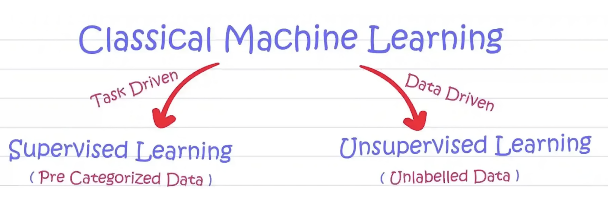

Classical machine learning is primarily divided into two main paradigms:

#### 1.1 Supervised Learning
In **Supervised Learning**, a model is trained on **labeled data**. The dataset contains input features paired with the correct output target. The model learns a mapping function from inputs to outputs to predict or classify new, unseen data.

$$\text{Dataset: } \mathcal{D} = \{(\mathbf{x}_i, y_i)\}_{i=1}^N$$

*   **Regression:** Predicting a continuous numeric value (e.g., predicting house prices based on features like area and bedrooms).
*   **Classification:** Predicting a discrete class label or category (e.g., classifying whether an email is spam or not spam, or identifying animals).

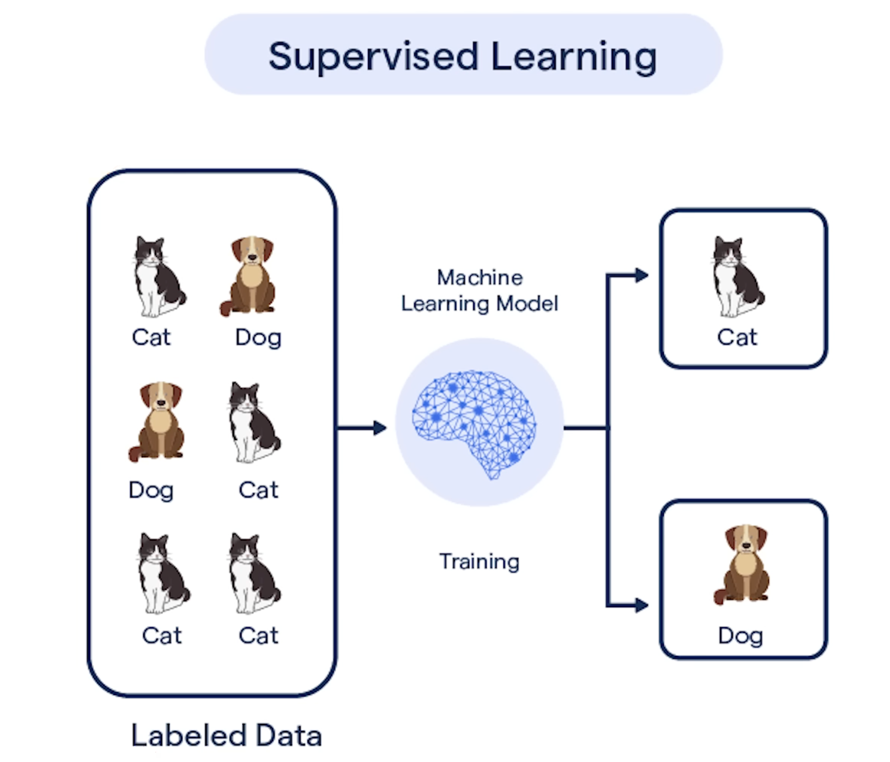

#### 1.2 Unsupervised Learning
In **Unsupervised Learning**, the model is trained on **unlabeled data**. The dataset only contains input features without corresponding target labels. The model learns to find hidden structures, groups, or patterns directly from the input distribution.

$$\text{Dataset: } \mathcal{D} = \{\mathbf{x}_i\}_{i=1}^N$$

*   **Clustering:** Grouping similar data points together based on distance or density (e.g., customer segmentation).
*   **Dimensionality Reduction:** Compressing high-dimensional feature spaces into lower-dimensional representations while preserving key features or variance (e.g., Principal Component Analysis).

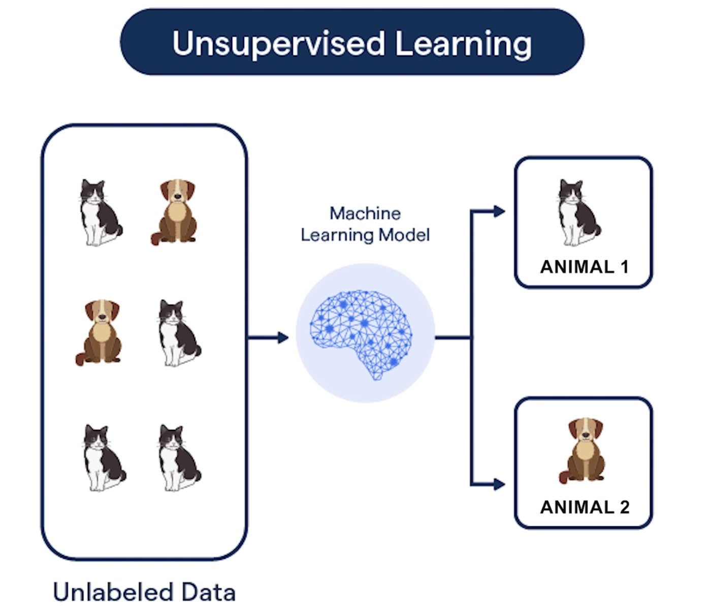

#### 1.3 Other Learning Paradigms
*   **Semi-Supervised Learning:** Combines a small amount of labeled data with a large amount of unlabeled data. This is highly useful when labeling data is expensive or time-consuming.
*   **Self-Supervised Learning:** The model generates its own labels directly from the structure of the input data (e.g., masking words in a sentence and training a model to predict the missing words). It has grown into its own field and forms the basis for training large-scale foundation models (such as LLMs).
*   **Reinforcement Learning:** An agent learns through trial and error by interacting with an environment to maximize cumulative rewards. It is ideal for decision-making and sequence control tasks (e.g., playing chess, robotics control, RLHF).

---

### 2. Mathematical Structures: Tensors

In machine learning, data and parameters are represented using multi-dimensional numerical arrays called **Tensors**. Tensors are classified by their **rank** (the number of dimensions/axes).

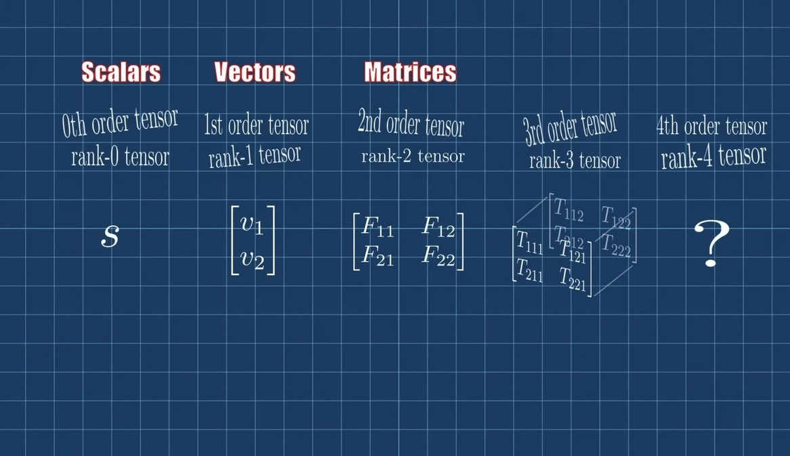

#### 2.1 Tensor Classifications
1.  **Scalar (Rank-0 Tensor):** A single number representing magnitude.
    
    $$s \in \mathbb{R}$$
    
2.  **Vector (Rank-1 Tensor):** A 1D array of numbers representing points or directions in a multi-dimensional space.
    
    $$\mathbf{v} = \begin{bmatrix} v_1 \\ v_2 \\ \dots \\ v_d \end{bmatrix} \in \mathbb{R}^d$$
    
3.  **Matrix (Rank-2 Tensor):** A 2D grid of numbers with rows and columns, representing datasets, linear transformations, or image channels.
    
    $$\mathbf{M} = \begin{bmatrix} M_{11} & M_{12} \\ M_{21} & M_{22} \end{bmatrix} \in \mathbb{R}^{h \times w}$$
    
4.  **Tensor (Rank-3 Tensor & Higher):** Array structures with 3 or more dimensions (e.g., RGB images with shape `[Height, Width, Channels]`, or mini-batches of video sequences with shape `[Batch, Frames, Height, Width, Channels]`).

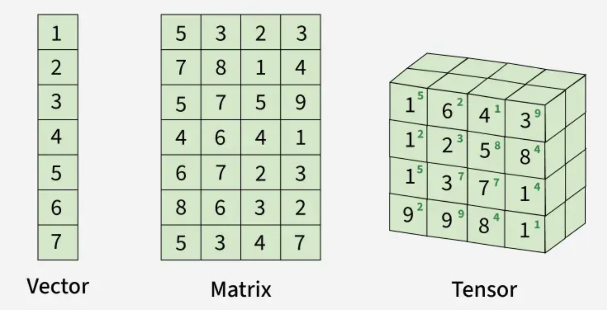

#### 2.2 Application Example: Image Data as Matrices
Digital images are stored as matrices (or 3D tensors for color images). For a grayscale image, each pixel intensity is stored as a numerical value inside a matrix grid.

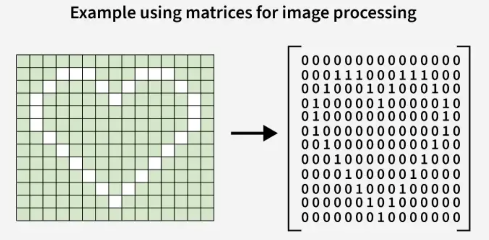

---

### 3. Linear Regression & Sum of Squared Errors (SSE)

**Linear Regression** models the relationship between a continuous dependent target variable $y$ and one or more independent predictor features $x$ by fitting a linear equation to the observed data.

#### 3.1 Simple Linear Regression
For a single input feature $x$, the regression line is defined as:

$$f(x) = mx + b$$

where:
*   $m$ is the **slope** (weight parameter), determining the direction and steepness of the line.
*   $b$ is the **y-intercept** (bias parameter), determining the point where the line crosses the vertical axis.

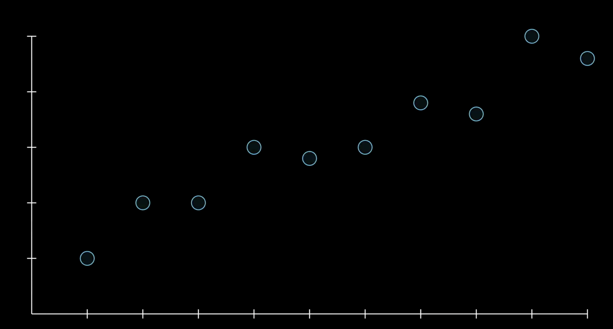

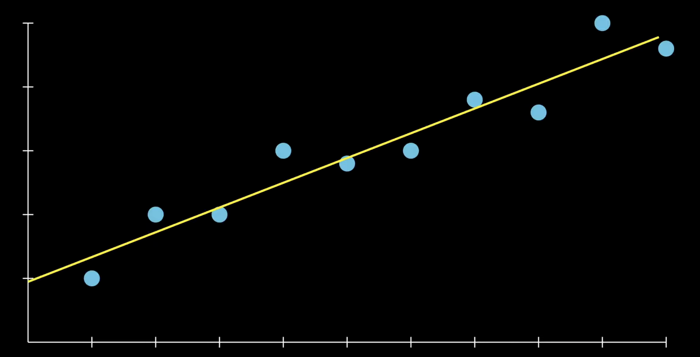

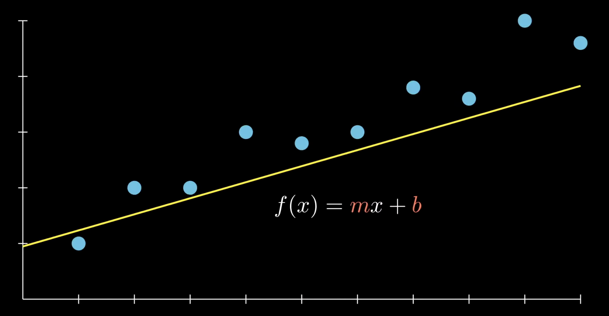

#### 3.2 Multiple Linear Regression
When there are multiple predictor features ($x_1, x_2, \dots, x_p$), the model generalizes to a hyper-plane equation:

$$y = \beta_p x_p + \dots + \beta_1 x_1 + \beta_0$$

or in vector form:

$$y = \mathbf{w}^T \mathbf{x} + b$$

For a model with two independent variables ($x_1$ and $x_2$), the regression boundary is a 3D plane:

$$y = \beta_2 x_2 + \beta_1 x_1 + \beta_0$$

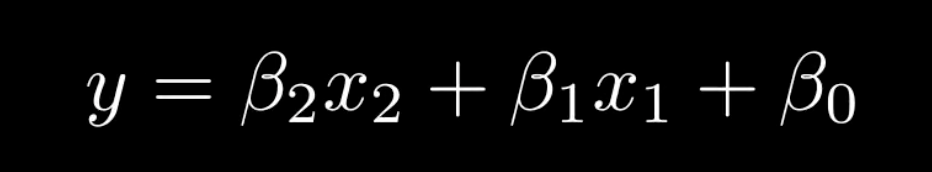

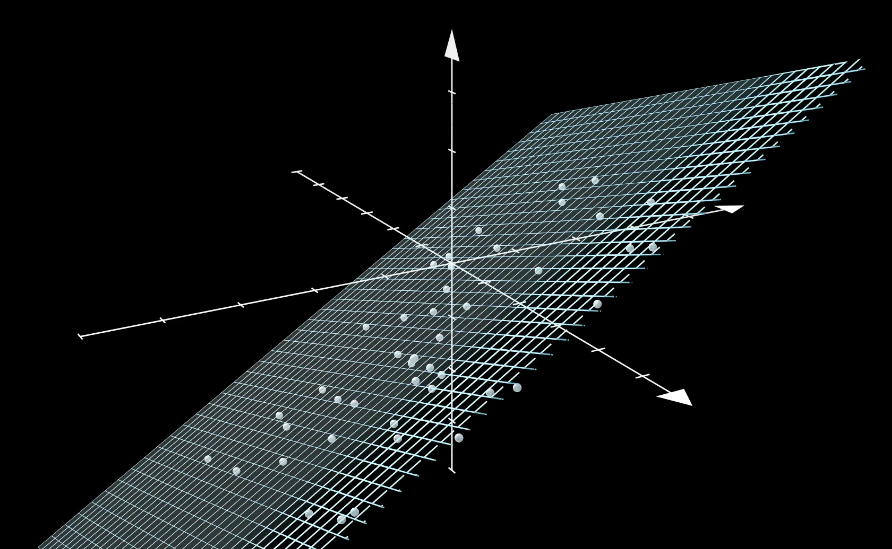

#### 3.3 Sum of Squared Errors (SSE) Loss
To find the optimal weight and bias parameters, we must define a loss function that measures how far the model's predictions are from the actual values.

The vertical distance from an observed data point $y_i$ to the predicted regression value $\hat{y}_i$ is called the **residual** or **error**:

$$e_i = y_i - \hat{y}_i$$

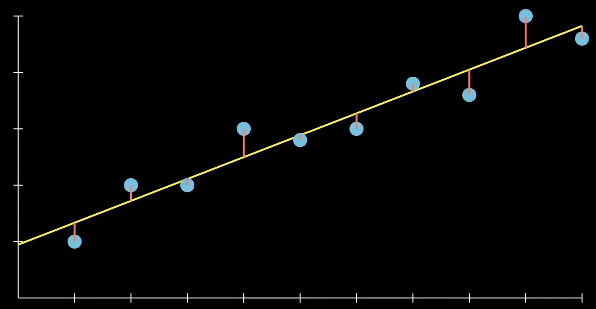

The **Sum of Squared Errors (SSE)** squares each residual and sums them up. Squaring ensures that positive and negative errors do not cancel each other out, and heavily penalizes larger errors:

$$\text{SSE} = \sum_{i=1}^n (y_i - \hat{y}_i)^2 = \sum_{i=1}^n e_i^2$$

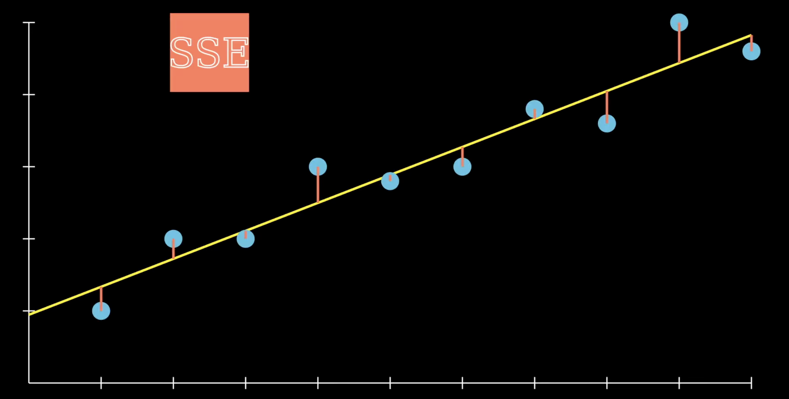

##### Visualizing Least Squares Optimization
Fitting a regression line is the process of finding parameters that minimize the total area of the error squares.

*   **Best Fit (Minimized SSE):** The regression line passes directly through the center of the point cloud, making the total area of the error squares as small as possible.
*   **Poor Fit (High SSE):** The line deviates from the true trend, increasing the areas of the individual error squares.
*   **Worst Fit (Maximum SSE):** The line is completely misaligned, creating massive error squares.

| Best Fit (Optimal) | Poor Fit (High Loss) | Worst Fit (Very High Loss) |
|:---:|:---:|:---:|
| 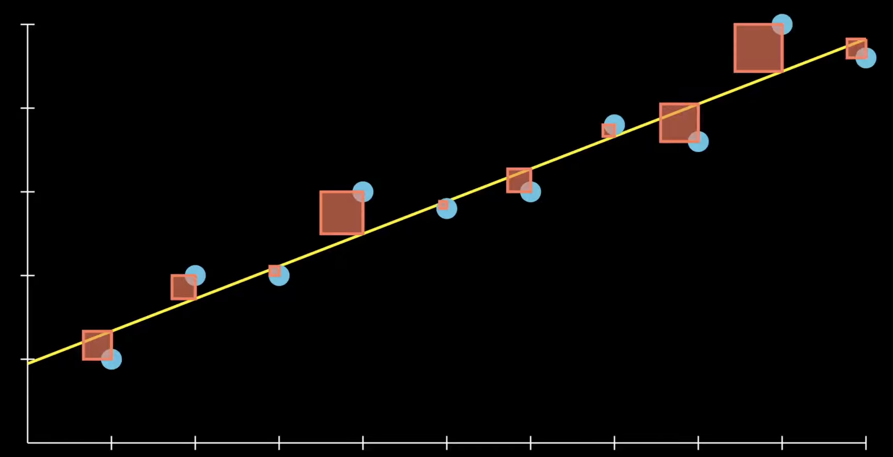 | 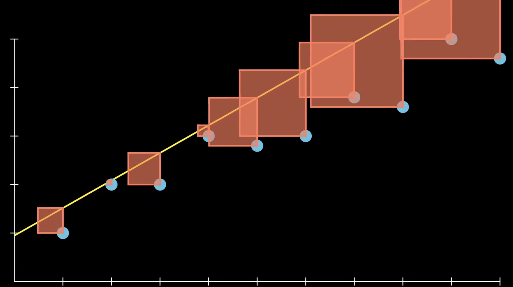 | 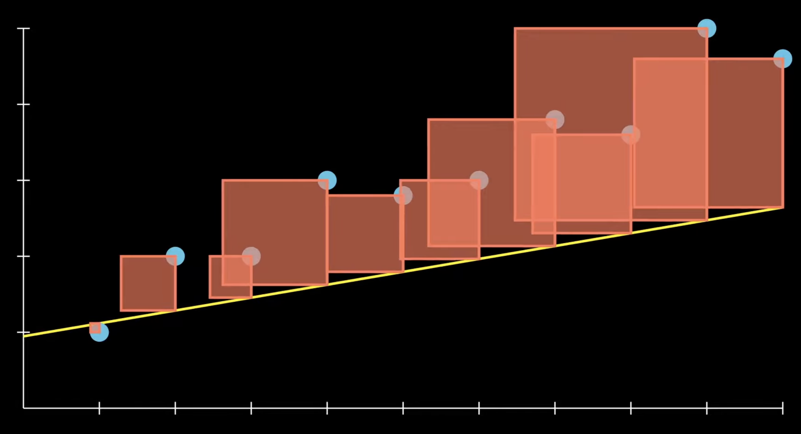 |

#### 3.4 Mean Squared Error (MSE)
Dividing the SSE by the number of data points $n$ gives the **Mean Squared Error (MSE)**, which represents the average squared distance of predictions from the target labels:

$$\text{MSE} = \frac{1}{n} \sum_{i=1}^n (Y_i - \hat{Y}_i)^2$$

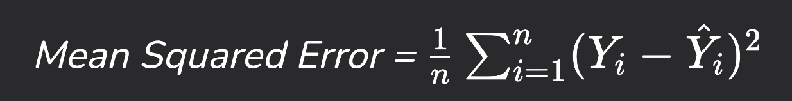

---

### 4. Optimization: Gradient Descent & Chain Rule

To find the parameters that minimize the MSE loss, models use an iterative optimization algorithm called **Gradient Descent**.

#### 4.1 Loss Surface and Updates
For linear regression, the loss function plotted against parameters (like weight $m$ and bias $b$) forms a convex 3D parabolic bowl. The bottom of this bowl represents the global minimum loss.

At each step, we calculate the partial derivatives of the loss with respect to each parameter to find the direction of steepest ascent. We then move in the opposite direction (steepest descent) by subtracting the gradient scaled by a **learning rate** ($\alpha$):

$$\theta_j := \theta_j - \alpha \frac{\partial L}{\partial \theta_j}$$

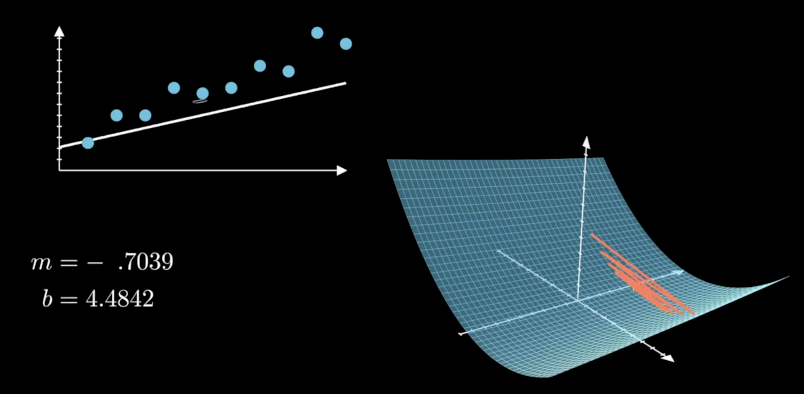

#### 4.2 Linear Regression Backpropagation via the Chain Rule
For a single input data point with feature $\text{area}$, target $y$, prediction $\hat{y}$, and weights $w_1, w_2, b$:

$$\hat{y} = w_1 \cdot \text{area} + w_2 \cdot \text{br} + b$$

$$\text{Error } e = y - \hat{y}$$

$$\text{Loss } L = e^2$$

To calculate the gradient of the loss with respect to the weight $w_1$, we apply the calculus **Chain Rule**:

$$\frac{\partial L}{\partial w_1} = \frac{\partial L}{\partial e} \cdot \frac{\partial e}{\partial \hat{y}} \cdot \frac{\partial \hat{y}}{\partial w_1}$$

Let's calculate each individual derivative:
1.  **Loss with respect to Error:** $\frac{\partial L}{\partial e} = \frac{d}{de} (e^2) = 2e$
2.  **Error with respect to Prediction:** $\frac{\partial e}{\partial \hat{y}} = \frac{\partial}{\partial \hat{y}} (y - \hat{y}) = -1$
3.  **Prediction with respect to Weight $w_1$:** $\frac{\partial \hat{y}}{\partial w_1} = \frac{\partial}{\partial w_1} (w_1 \cdot \text{area} + w_2 \cdot \text{br} + b) = \text{area}$

Multiplying them together yields the gradient:

$$\frac{\partial L}{\partial w_1} = 2e \cdot (-1) \cdot \text{area} = -2e \cdot \text{area}$$

$$\frac{\partial L}{\partial w_1} = -2(y - \hat{y}) \cdot \text{area}$$

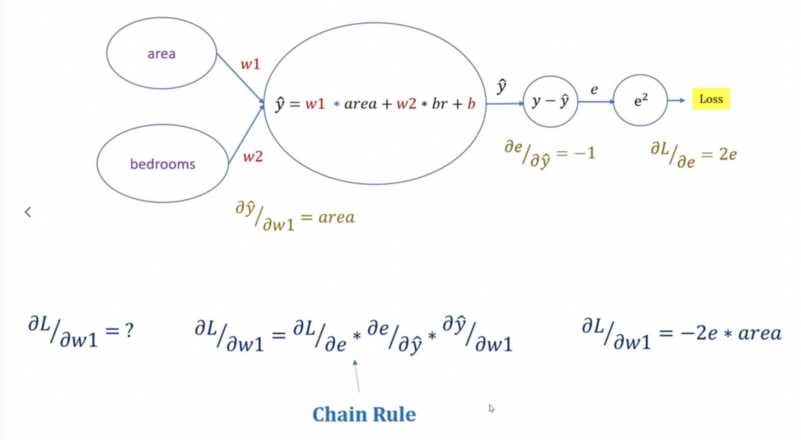

---

### 5. Regression Performance Metrics

To evaluate how well a regression model fits the data, several metrics are used:

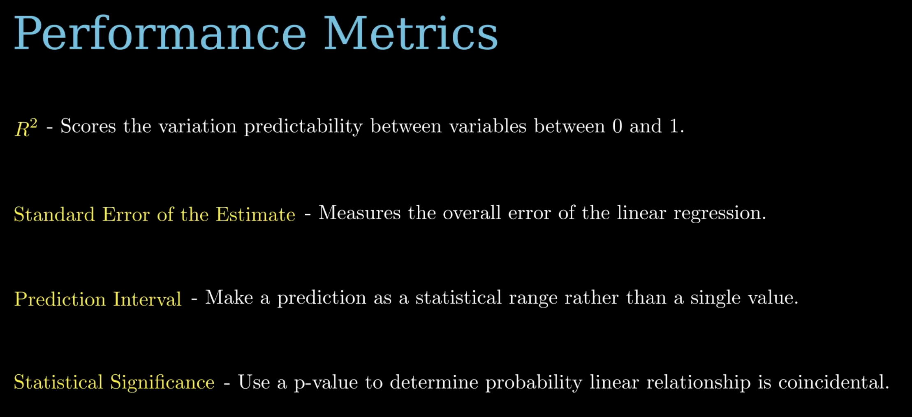

*   **Coefficient of Determination ($R^2$):** Measures the proportion of variance in the dependent variable that is predictable from the independent variables. Scores range from $0$ to $1$:
    
    $$R^2 = 1 - \frac{\text{SS}_{\text{res}}}{\text{SS}_{\text{tot}}} = 1 - \frac{\sum (y_i - \hat{y}_i)^2}{\sum (y_i - \bar{y})^2}$$
    
*   **Standard Error of the Estimate:** Measures the standard deviation of the residuals, indicating the average distance that the observed values fall from the regression line.
*   **Prediction Interval:** An estimate of the interval in which future individual observations will fall with a certain probability (e.g., $95\%$), expressing prediction uncertainty as a range rather than a single point.
*   **Statistical Significance (p-value):** Used to determine if the relationship observed between variables is statistically significant or if it could have occurred by random chance. A threshold of $p < 0.05$ is commonly used to reject the null hypothesis.

---

### 6. Logistic Regression & Binary Classification

**Logistic Regression** is a supervised learning classification algorithm used to predict the probability of a binary outcome ($y \in \{0, 1\}$).

#### 6.1 The Sigmoid Function
Instead of fitting a straight line which can output values from $-\infty$ to $+\infty$, logistic regression passes the linear combination of inputs through the **Sigmoid (logistic) function**, wrapping the output values strictly between $0$ and $1$:

$$\sigma(z) = \frac{1}{1 + e^{-z}}$$

Where the log-odds input $z$ is:

$$z = \beta_1 x + \beta_0$$

Thus, the probability model is:

$$f(x) = \frac{1}{1 + e^{-(\beta_1 x + \beta_0)}}$$

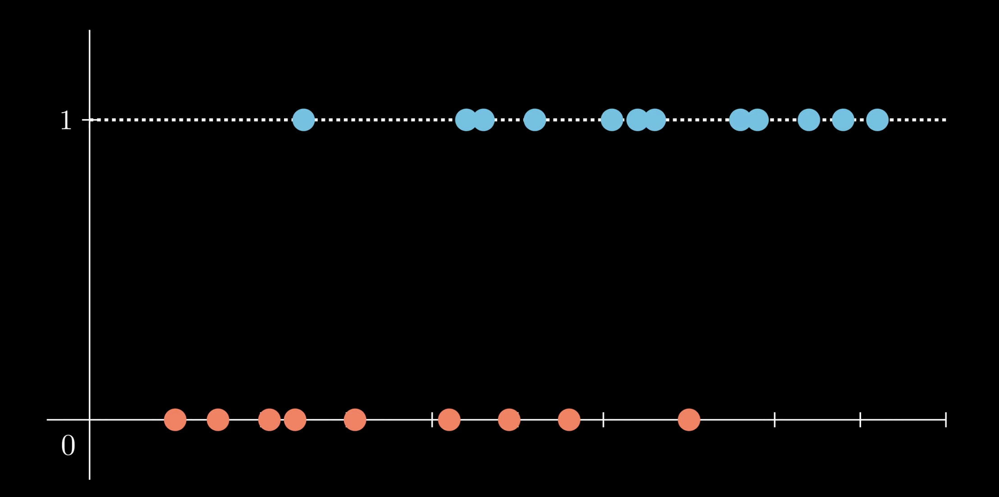

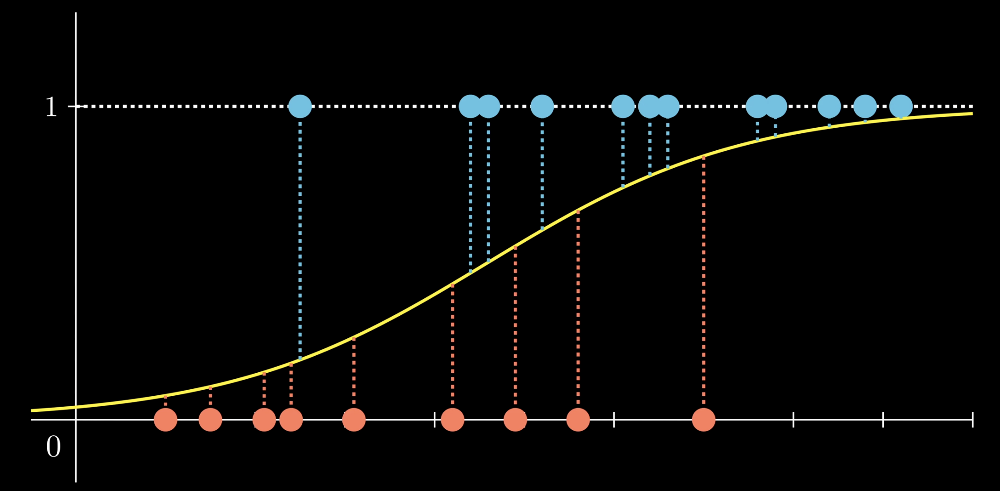

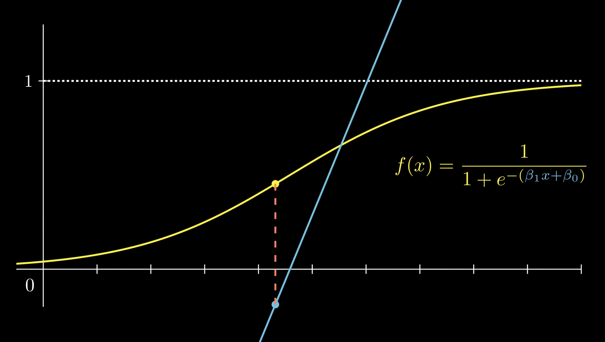

#### 6.2 Multiple Logistic Regression
When there are multiple predictor features, the log-odds linear boundary generalizes in 3D space to form a sigmoid probability surface:

$$p(x_1, x_2) = \frac{1}{1 + e^{-(\beta_0 + \beta_1 x_1 + \beta_2 x_2)}}$$

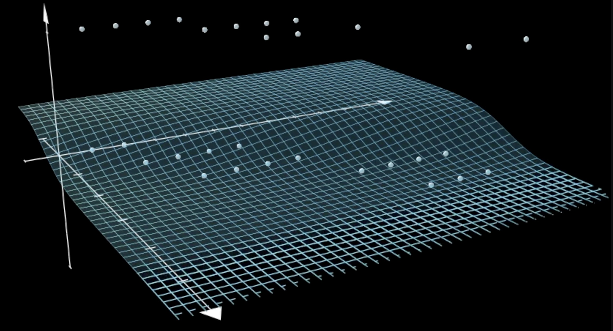

#### 6.3 Decision Boundary and Shaded Regions
To perform binary classification, the predicted probability $p$ is compared against a decision threshold (typically $0.5$ or $0.75$).

$$\text{Class} = \begin{cases} \text{TRUE (1)} & \text{if } f(x) \ge \text{Threshold} \\ \text{FALSE (0)} & \text{if } f(x) < \text{Threshold} \end{cases}$$

For instance, using a threshold of $0.75$ at input $x = 6.2$:

| Sigmoid Curve with Query Point | Classified Shaded Regions |
|:---:|:---:|
| 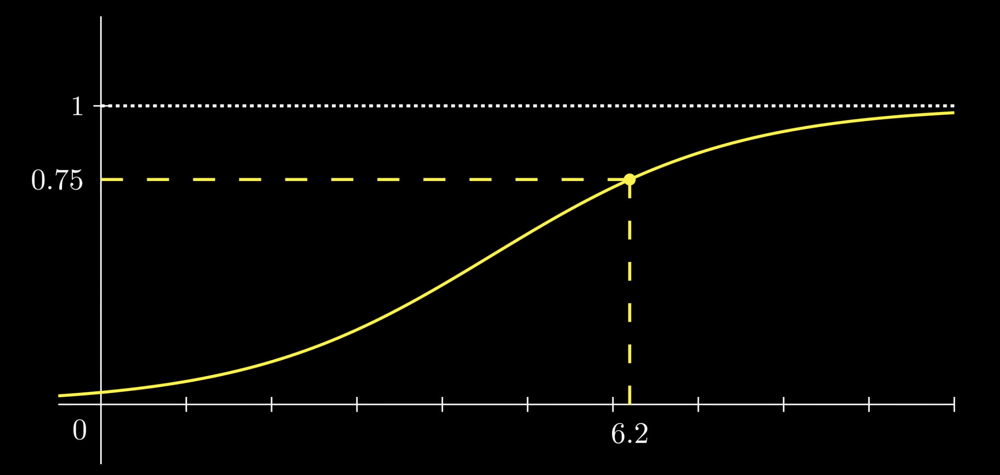 | 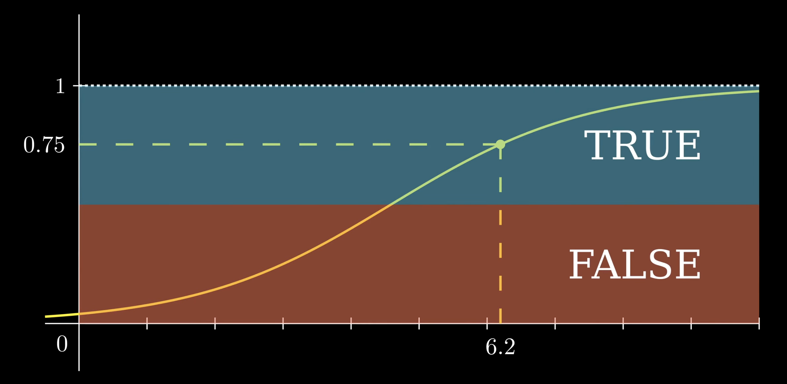 |

---

### 7. K-Nearest Neighbors (KNN)

**K-Nearest Neighbors (KNN)** is a simple, non-parametric, instance-based supervised learning algorithm used for classification and regression. It makes predictions for a query point based on the labels of its closest neighboring data points.

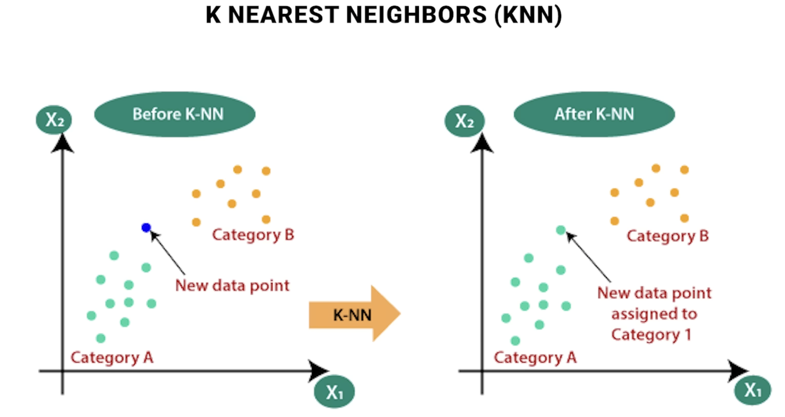

#### 7.1 Euclidean Distance Metric
To find the "nearest" neighbors, KNN calculates the geometric distance between points. The most common metric is **Euclidean Distance**:

$$d(\mathbf{x}_1, \mathbf{x}_2) = \sqrt{\sum_{j=1}^D (x_{1j} - x_{2j})^2}$$

In 2D space:

$$d = \sqrt{(x_1 - x_2)^2 + (y_1 - y_2)^2}$$

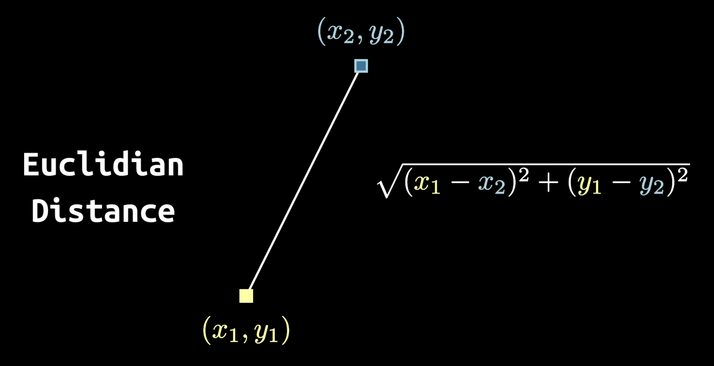

#### 7.2 Step-by-Step KNN Classification ($k=5$)
Here is a visual step-by-step example showing how KNN classifies a new unlabelled data point:

1.  **Define the Problem:** We have a dataset of red and blue data points, and we introduce a new unlabelled yellow query point.
2.  **Determine the Number of Neighbors ($k$):** We select the value of $k$ (e.g., $k = 5$), which specifies the number of nearby points to consider.
3.  **Draw Search Boundary:** We identify the closest 5 neighbors to our query point. Visually, this is equivalent to expanding a circle centered on the query point until it encloses exactly 5 data points.
4.  **Measure Distances:** Calculate the Euclidean distances from the query point to all points in the dataset and identify the 5 smallest values.
5.  **Majority Vote:** Count the classes of the 5 nearest neighbors. The query point is assigned to the class with the highest frequency.
    *   Red Neighbors: $3$
    *   Blue Neighbors: $2$
    *   **Result:** The query point is classified as **Red**!

| Step 1: Query Input | Step 2: Set K | Step 3: Search Circle |
|:---:|:---:|:---:|
| 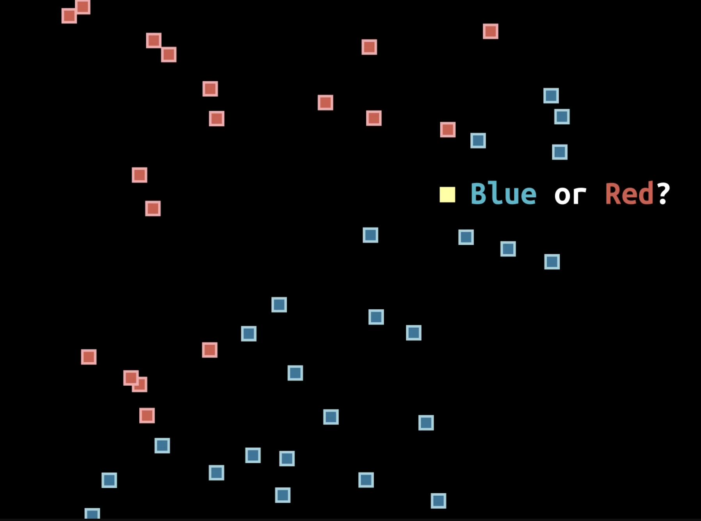 | 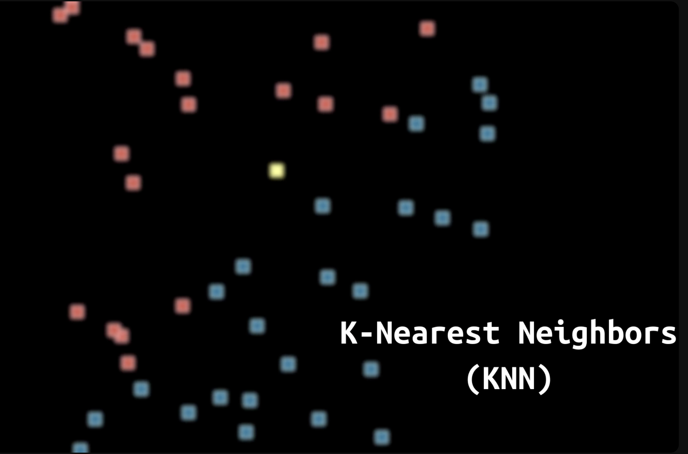 | 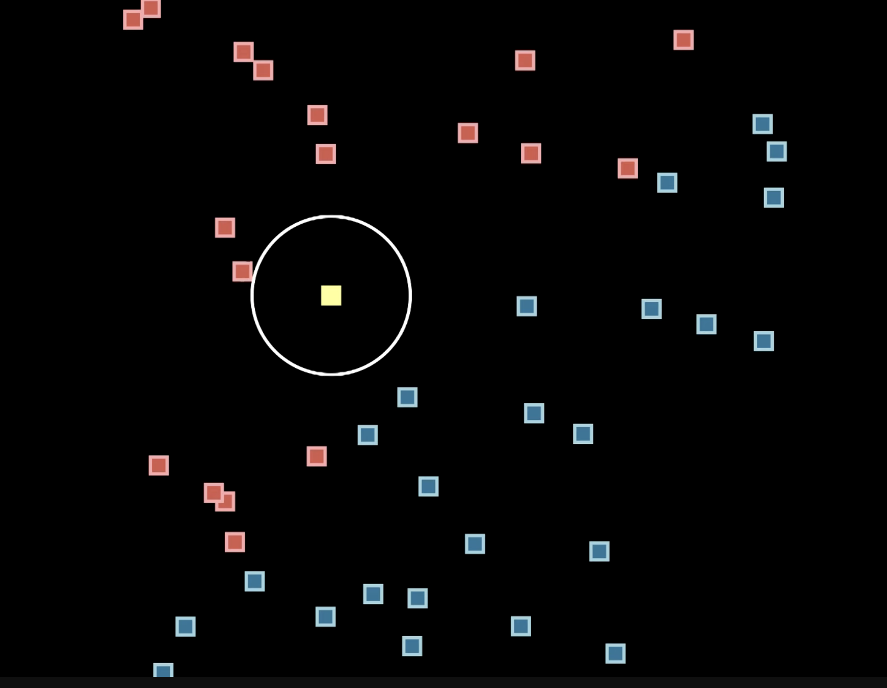 |

| Step 4: Measure Distances | Step 5: Majority Vote |
|:---:|:---:|
| 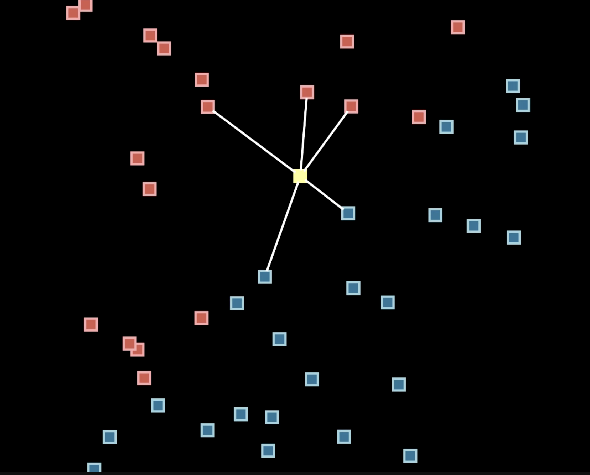 | 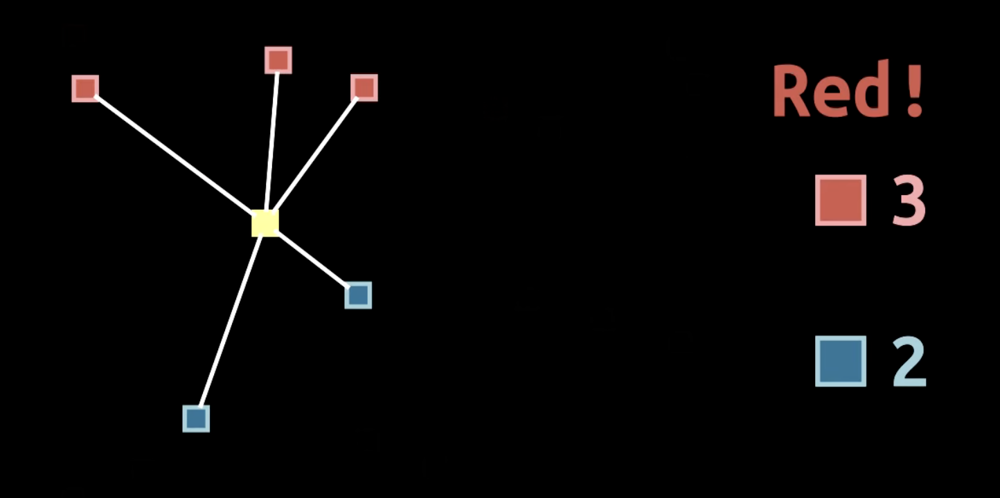 |

---

### 8. K-Means Clustering

**K-Means Clustering** is an unsupervised learning algorithm used to partition a dataset into $K$ distinct, non-overlapping subgroups (clusters). It groups data points so that points in the same cluster are as similar as possible, while points in different clusters are distinct.

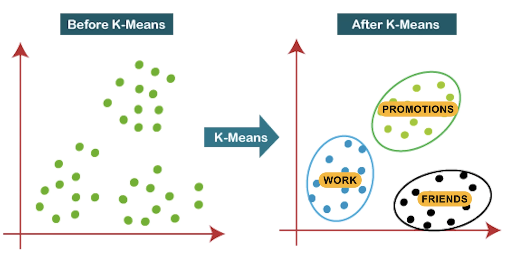

#### 8.1 The K-Means Objective Function
K-Means minimizes the **Within-Cluster Sum of Squares (WCSS)**, also known as inertia:

$$J = \sum_{k=1}^K \sum_{\mathbf{x}_i \in S_k} \|\mathbf{x}_i - \boldsymbol{\mu}_k\|^2$$

where:
*   $K$ is the number of clusters.
*   $S_k$ is the set of data points assigned to cluster $k$.
*   $\boldsymbol{\mu}_k$ is the centroid (mean vector) of cluster $k$.

#### 8.2 Step-by-Step K-Means Iterations
K-Means uses an expectation-maximization heuristic that alternates between two steps: assigning points to clusters, and updating centroids.

##### Step 1: Choose Initial Centroids
Randomly select $K$ data points from the dataset to act as the initial cluster centers (centroids).

$$\text{Initial Centroids: } \{\boldsymbol{\mu}_1, \boldsymbol{\mu}_2, \dots, \boldsymbol{\mu}_K\}$$

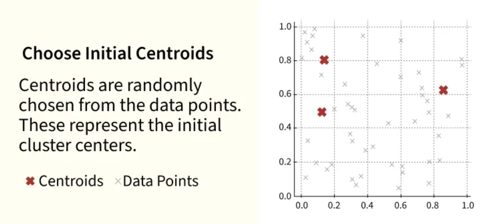

##### Step 2: Assign Points to Nearest Centroid
Calculate the distance from each data point $\mathbf{x}_i$ to all $K$ centroids, and assign the point to the cluster of the closest centroid.

$$S_k^{(t)} = \left\{ \mathbf{x}_i : \|\mathbf{x}_i - \boldsymbol{\mu}_k^{(t)}\|^2 \le \|\mathbf{x}_i - \boldsymbol{\mu}_j^{(t)}\|^2 \quad \forall j, 1 \le j \le K \right\}$$

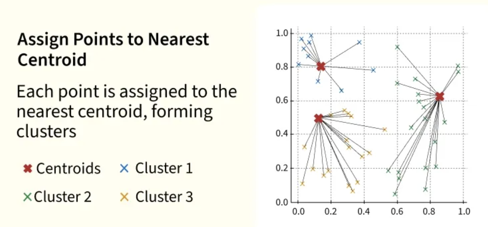

##### Step 3: Update Centroids
Recalculate the position of each centroid as the arithmetic mean of all data points currently assigned to that cluster.

$$\boldsymbol{\mu}_k^{(t+1)} = \frac{1}{|S_k^{(t)}|} \sum_{\mathbf{x}_i \in S_k^{(t)}} \mathbf{x}_i$$

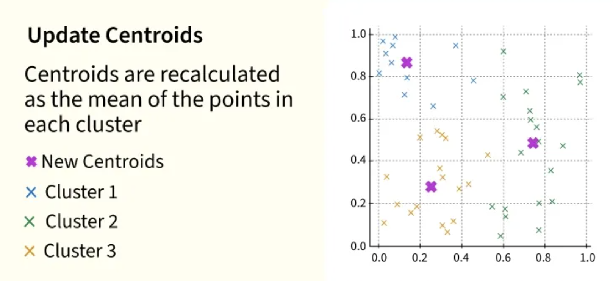

##### Step 4: Repeat Until Convergence
Repeat Steps 2 and 3 iteratively. The algorithm converges when the centroids stabilize and do not move further, or when cluster assignments stop changing.

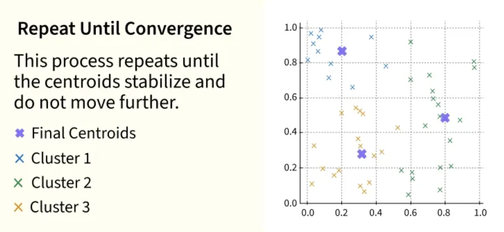


---

## Module 3: Deep Learning, CNNs & Backpropagation Mechanics

This module covers deep learning foundations, starting from single artificial neurons and activation functions, through multi-layer architectures, backpropagation gradient calculations, Convolutional Neural Networks (CNNs), and Transformer blocks.

### Part 3.1: Visualizing Backpropagation & Gradient Descent

This document provides a detailed, step-by-step mathematical and visual explanation of the **Backpropagation** algorithm and **Gradient Descent** in deep neural networks. By examining the flow of information forward and errors backward, we show how networks calculate parameter gradients using the **Chain Rule** to learn from data.


---

### 1. Introduction: The Simplest Neural Network (1 Neuron, 1 Weight)

To understand backpropagation, we begin with the simplest possible neural network: a single input, a single weight, a single output neuron, and no bias.

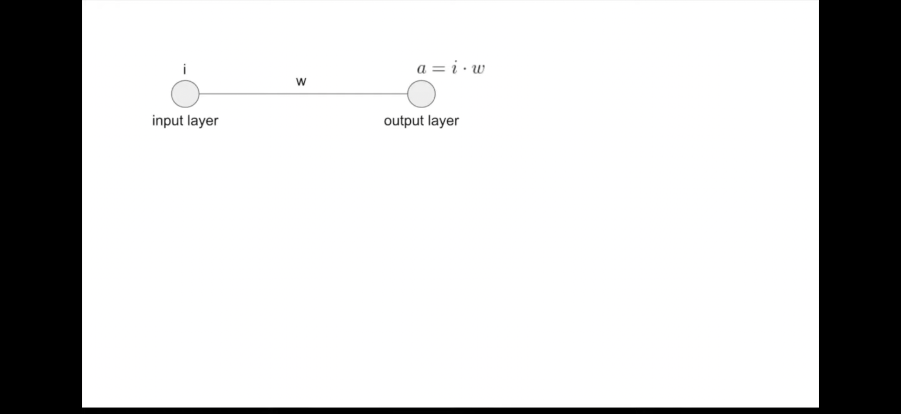

#### 1.1 The Forward Pass
In our toy model, we feed an input ($i$) through a connection with weight ($w$) to produce a predicted output activation ($a$):

$$a = i \cdot w$$

Suppose we set our initial values as:
*   Input ($i$) = $1.5$
*   Weight ($w$) = $0.8$

Using these values, we perform a **forward pass** to calculate the prediction:

$$a = 1.5 \cdot 0.8 = 1.2$$

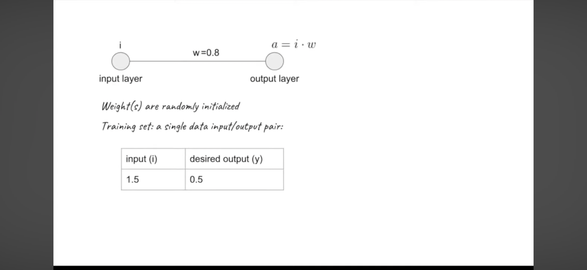

#### 1.2 Defining the Cost (Loss)
To measure how accurate our prediction is, we compare the prediction ($a$) to a desired target value ($y$). Suppose the target value is:

$$y = 0.5$$

Because our prediction $a = 1.2$ is larger than the target $y = 0.5$, the model has made an error.

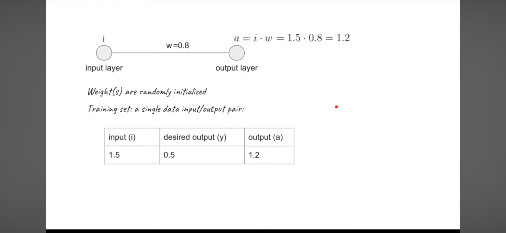

We quantify this error using a **Cost Function** ($C$). In this case, we use the **Squared Error** cost function:

$$C = (a - y)^2$$

Substituting our values ($a = 1.2$ and $y = 0.5$) yields the cost:

$$C = (1.2 - 0.5)^2 = 0.7^2 = 0.49$$

The goal of learning is to find a weight ($w$) that makes this cost as close to $0$ as possible.

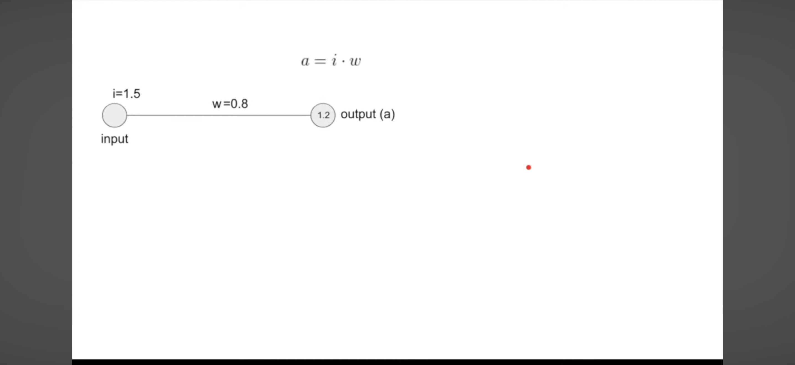

#### 1.3 Nudging the Weight
To see how we can minimize the cost, let's explore what happens when we modify ("nudge") the weight $w$:

*   **Case A: Increasing $w$**
    If we increase $w$ from $0.8$ to $0.9$:
    *   The prediction increases: $a = 1.5 \cdot 0.9 = 1.35$
    *   The error increases: $a - y = 1.35 - 0.5 = 0.85$
    *   The cost increases: $C = 0.85^2 = 0.7225$ (up from $0.49$)
    
    This tells us that increasing the weight moves us further away from our goal.

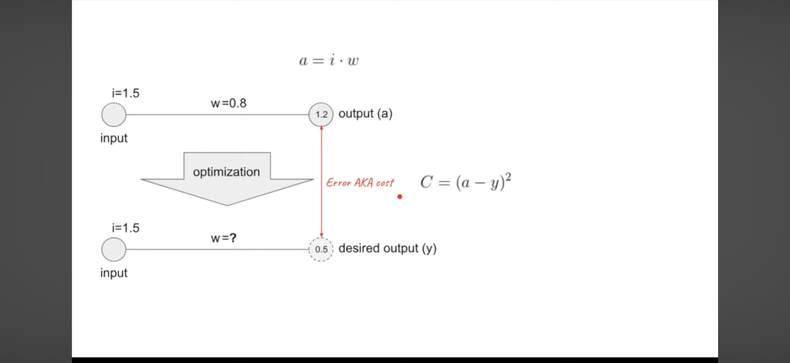

*   **Case B: Decreasing $w$**
    If we decrease $w$ from $0.8$ to $0.7$:
    *   The prediction decreases: $a = 1.5 \cdot 0.7 = 1.05$
    *   The error decreases: $a - y = 1.05 - 0.5 = 0.55$
    *   The cost decreases: $C = 0.55^2 = 0.3025$ (down from $0.49$)
    
    This shows that decreasing the weight successfully reduces the cost.

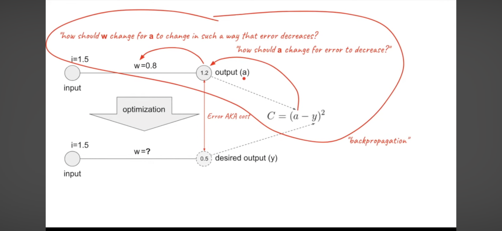

#### 1.4 The Optimization Challenge
While manually trying weight values works for a single parameter, complex networks contain millions of parameters. We need a mathematical way to calculate exactly how a nudge to any given weight affects the final cost.

This is the core problem of optimization: how do we calculate the derivative of the cost with respect to the weight ($\frac{\partial C}{\partial w}$)?

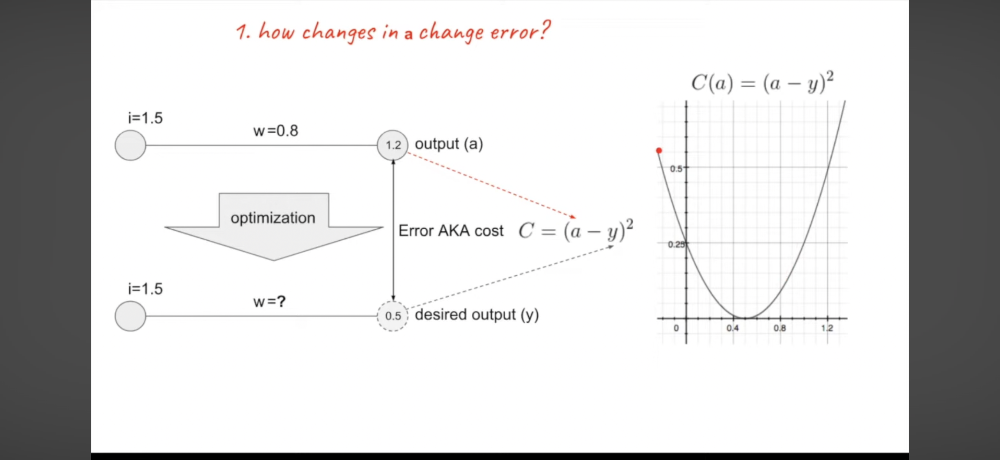

---

### 2. Connecting Parameters to Cost: The Chain Rule

In our toy model, the cost ($C$) does not directly depend on the weight ($w$). Instead, we have a chain of dependencies:
1.  The weight $w$ determines the activation output $a$.
2.  The activation output $a$ determines the cost $C$.

This nested relationship can be written as a composite function: $C(a(w))$. We can visualize these dependencies as two separate mathematical curves:
*   The cost curve $C(a)$ is a parabola centered at the target value $y$.
*   The activation curve $a(w)$ is a straight line with a slope equal to the input $i$.

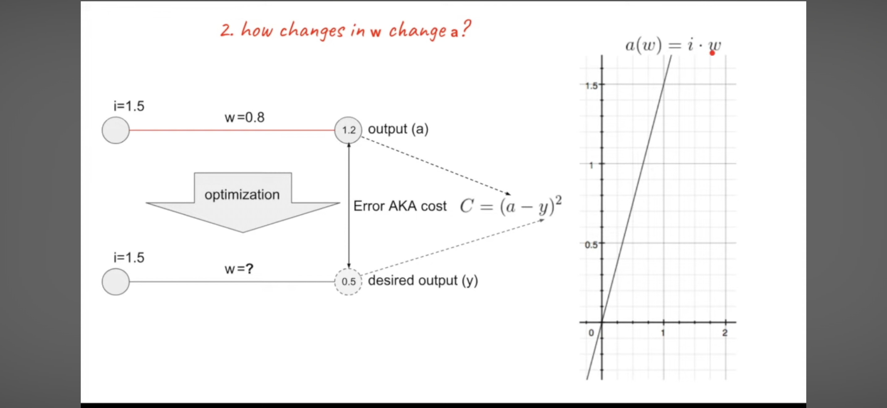

To find the rate of change of the cost with respect to the weight, we use the **Chain Rule** of calculus. The chain rule states that to find the derivative of a nested composite function, we multiply the local derivatives along the dependency chain:

$$\frac{\partial C}{\partial w} = \frac{\partial C}{\partial a} \cdot \frac{\partial a}{\partial w}$$

*   $\frac{\partial C}{\partial a}$ represents how a nudge to the activation $a$ affects the cost $C$.
*   $\frac{\partial a}{\partial w}$ represents how a nudge to the weight $w$ affects the activation $a$.

By multiplying these two factors, we determine how a nudge to $w$ propagates through the intermediate variable $a$ to ultimately affect the cost $C$.

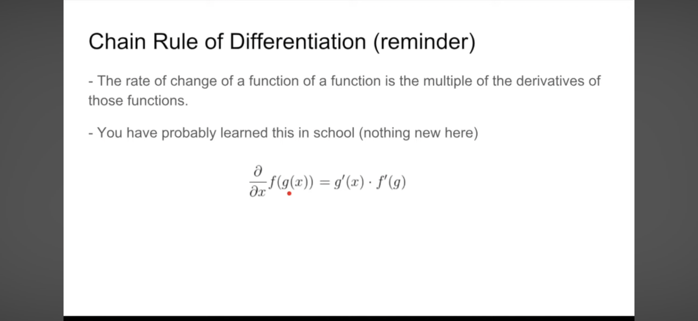

---

### 3. Generalizing to Multi-Input Neurons and Activation Functions

To move from our toy model to deep neural networks, we must build a generalized mathematical model of an artificial neuron.

#### 3.1 Anatomy of a Neuron
A single neuron in a neural network layer receives outputs from multiple neurons in the preceding layer.

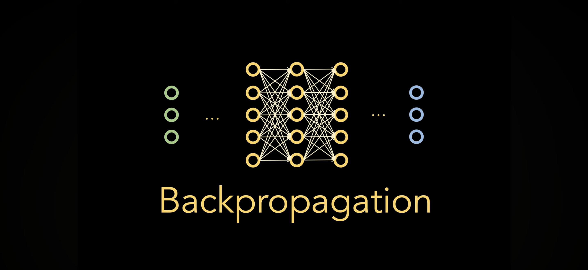

Let's break down the mathematical assembly of a neuron step-by-step:

1.  **Weighted Sum (Pre-activation Input):**
    Each input $x_i$ is multiplied by its corresponding weight $\omega_i$. A constant **bias** ($b$) is added to shift the activation threshold. This combined sum is called the **pre-activation net input** (denoted $\hat{x}$):
    
    $$\hat{x} = b + \sum_{i} x_i \omega_i$$

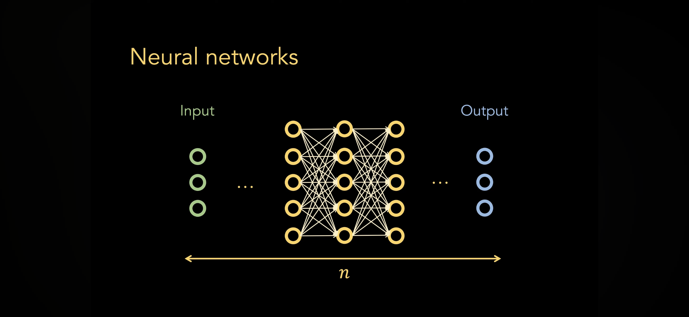

2.  **Activation Function:**
    To introduce non-linearity into the network, the pre-activation input $\hat{x}$ is passed through an **activation function** (denoted $\phi$):

$$\phi(\hat{x})$$

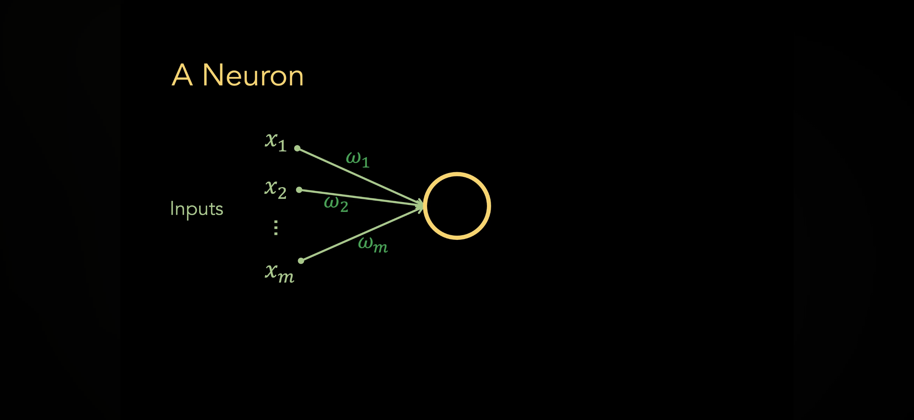

3.  **Final Neuron Output:**
    The final output activation ($y$) of the neuron is:
    
    $$y = \phi(\hat{x}) = \phi\left(b + \sum_{i} x_i \omega_i\right)$$


#### 3.2 Common Activation Functions
Activation functions determine the behavior and capabilities of the neural network. Here are the three most common activation functions and their derivatives:

##### 1. Linear Activation Function
The output is directly proportional to the input:

$$\phi(x) = x$$

Its derivative is constant:

$$\phi'(x) = 1$$


##### 2. Rectified Linear Unit (ReLU)
The output is $0$ for negative inputs and equals the input for positive inputs:

$$\phi(x) = \max(0, x)$$

Its derivative is a step function:

$$\phi'(x) = \begin{cases} 1 & \text{if } x > 0 \\ 0 & \text{if } x < 0 \end{cases}$$

*(Note: The derivative is technically undefined at $x=0$, but in practice, it is set to $0$.)*


##### 3. Sigmoid (Logistic) Function
The output is squashed to a smooth S-curve between $0$ and $1$:

$$\phi(x) = \sigma(x) = \frac{1}{1 + e^{-x}}$$

Its derivative can be expressed elegantly in terms of its output:

$$\phi'(x) = \phi(x)(1 - \phi(x))$$


---

#### 3.3 Visualizing Activation Implementations
Let's see how a neuron behaves under each of these activation functions:

*   **Linear Neuron:** Passing a linear combination through a linear activation simply returns the weighted sum plus bias. It cannot learn non-linear relationships.


*   **ReLU Neuron:** If the pre-activation sum is negative, the neuron output is completely deactivated ($0$). If positive, the output scales linearly.


*   **Sigmoid Neuron:** Regardless of how large or small the pre-activation input is, the output is smoothly mapped to the range $(0, 1)$.


Below is the summary table of these three core activation functions:

| Activation | Equation | Derivative |
| :--- | :--- | :--- |
| **Linear** | $\phi(x) = x$ | $\phi'(x) = 1$ |
| **ReLU** | $\phi(x) = \max(0, x)$ | $\phi'(x) = \begin{cases} 1 & \text{if } x > 0 \\ 0 & \text{if } x \le 0 \end{cases}$ |
| **Sigmoid** | $\phi(x) = \frac{1}{1 + e^{-x}}$ | $\phi'(x) = \phi(x)(1 - \phi(x))$ |


#### 3.4 Standard Layer Notation
To write mathematical derivations for multi-layer networks, we establish standard indexing notation:
*   Let neuron $i$ belong to an earlier layer, producing output activation $y_i$.
*   Let neuron $j$ belong to the next layer.
*   The connection between neuron $i$ and neuron $j$ has weight $\omega_{ij}$.
*   Neuron $j$ has bias $b_j$ and pre-activation net input $\hat{x}_j = b_j + \sum_k y_k \omega_{kj}$.
*   The final output of neuron $j$ is $y_j = \phi(\hat{x}_j)$.


---

### 4. Multi-Layer Networks and Optimization Landscapes

When we stack multiple layers of these neurons together, we build a **Multi-Layer Perceptron (MLP)** or deep feedforward neural network.


#### 4.1 The Global Loss Function
For a network with $n$ layers, the inputs pass forward through the layers to produce a final network output vector $\mathbf{y}_n$. We evaluate the accuracy of the entire network using a global **Loss Function** ($L$):

$$Loss = L(\mathbf{y}_n)$$

The loss function compares the network's predictions $\mathbf{y}_n$ against the true training labels.


#### 4.2 Gradient Descent
To minimize the global loss $L$, we update all network weights iteratively in the opposite direction of the gradient of the loss. This optimization algorithm is called **Gradient Descent**:

$$\mathbf{w}_{t+1} = \mathbf{w}_t - \eta \frac{\partial L}{\partial \mathbf{w}}$$

Where:
*   $\mathbf{w}_t$ represents the weights at the current step $t$.
*   $\mathbf{w}_{t+1}$ represents the updated weights at step $t+1$.
*   $\eta$ (eta) is the **learning rate**, controlling the step size of each update.
*   $\frac{\partial L}{\partial \mathbf{w}}$ is the gradient vector containing the partial derivatives of the loss with respect to all weights.


*   **The Role of the Learning Rate ($\eta$):**
    *   If $\eta$ is **too small**, weight updates are minuscule, causing training to take an extremely long time.
    *   If $\eta$ is **too large**, the updates can overshoot the minimum, causing the optimization path to oscillate wildly or even diverge entirely.


*   **Navigating Loss Landscapes:**
    In real-world networks, the loss landscape is complex, high-dimensional, and non-convex. It contains multiple peaks, valleys, **local minima** (suboptimal low points), and a **global minimum** (the absolute lowest point of the loss function). Our goal is to guide the weights toward the global minimum, though gradient descent is susceptible to getting trapped in local minima or saddle points.


By taking small, sequential steps proportional to the negative gradient, the parameters slide down the loss curve toward a minimum.


---

### 5. Step-by-Step Chain Rule Derivation for Layer Weights

To execute gradient descent, we must compute $\frac{\partial L}{\partial \omega_{ij}}$ for every single weight in the network. Let's derive this derivative step-by-step using the Chain Rule.

#### 5.1 Setting Up the Chain
We want to find how a change in the weight $\omega_{ij}$ (connecting neuron $i$ to neuron $j$) affects the global loss $L$:

$$\frac{\partial L}{\partial \omega_{ij}} = ?$$


Because $\omega_{ij}$ only affects the loss by contributing to the pre-activation net input $\hat{x}_j$ of neuron $j$, we split the derivative using the Chain Rule:

$$\frac{\partial L}{\partial \omega_{ij}} = \frac{\partial L}{\partial \hat{x}_j} \cdot \frac{\partial \hat{x}_j}{\partial \omega_{ij}}$$

*   $\frac{\partial L}{\partial \hat{x}_j}$ is the rate of change of the loss with respect to the pre-activation input of neuron $j$. This term is often called the **error term** of neuron $j$ (denoted $\delta_j$).
*   $\frac{\partial \hat{x}_j}{\partial \omega_{ij}}$ is the rate of change of the pre-activation input with respect to the weight.


#### 5.2 Evaluating the Second Term: $\frac{\partial \hat{x}_j}{\partial \omega_{ij}}$
Recall that the pre-activation net input of neuron $j$ is:

$$\hat{x}_j = b_j + \sum_{k} y_k \omega_{kj}$$

If we take the partial derivative of this sum with respect to the specific weight $\omega_{ij}$, all other terms in the sum are treated as constants and drop out:

$$\frac{\partial \hat{x}_j}{\partial \omega_{ij}} = \frac{\partial}{\partial \omega_{ij}} \left( b_j + y_1 \omega_{1j} + \dots + y_i \omega_{ij} + \dots \right) = y_i$$

This shows that the rate of change of the pre-activation input with respect to the weight is simply the **activation output of the sending neuron** ($y_i$):

$$\frac{\partial \hat{x}_j}{\partial \omega_{ij}} = y_i$$


#### 5.3 Evaluating the First Term: $\frac{\partial L}{\partial \hat{x}_j}$
Now we evaluate the error term $\frac{\partial L}{\partial \hat{x}_j}$. The pre-activation input $\hat{x}_j$ only affects the network output by first passing through the activation function to become $y_j$. Therefore, we apply the Chain Rule again:

$$\frac{\partial L}{\partial \hat{x}_j} = \frac{\partial L}{\partial y_j} \cdot \frac{\partial y_j}{\partial \hat{x}_j}$$

*   $\frac{\partial L}{\partial y_j}$ is the rate of change of the loss with respect to the post-activation output of neuron $j$.
*   $\frac{\partial y_j}{\partial \hat{x}_j}$ is the derivative of the activation function evaluated at $\hat{x}_j$.


If we assume the activation function is the **Sigmoid function**:

$$y_j = \sigma(\hat{x}_j)$$

Its derivative is:

$$\frac{\partial y_j}{\partial \hat{x}_j} = y_j(1 - y_j)$$


Substituting this derivative back into our error term equation yields:

$$\frac{\partial L}{\partial \hat{x}_j} = \frac{\partial L}{\partial y_j} y_j(1 - y_j)$$


#### 5.4 Combining the Terms
Now, we substitute our results from **Section 5.2** and **Section 5.3** back into our primary weight derivative equation:

$$\frac{\partial L}{\partial \omega_{ij}} = \left( \frac{\partial L}{\partial \hat{x}_j} \right) \cdot \left( \frac{\partial \hat{x}_j}{\partial \omega_{ij}} \right)$$

$$\frac{\partial L}{\partial \omega_{ij}} = \left( \frac{\partial L}{\partial y_j} y_j(1 - y_j) \right) \cdot y_i$$

Rearranging the terms, we get the complete derivative of the loss with respect to the weight $\omega_{ij}$:

$$\frac{\partial L}{\partial \omega_{ij}} = \frac{\partial L}{\partial y_j} y_j(1 - y_j) y_i$$


This elegant formula tells us that the gradient of a weight is the product of:
1.  The downstream loss gradient ($\frac{\partial L}{\partial y_j}$).
2.  The derivative of the activation function of the receiving neuron ($y_j(1-y_j)$).
3.  The incoming activation from the sending neuron ($y_i$).


---

### 6. Error Propagation and the General Backpropagation Algorithm

The weight gradient derivation in Section 5 requires knowing $\frac{\partial L}{\partial y_j}$ (the gradient of the loss with respect to the neuron's output).
*   If neuron $j$ is in the **output layer**, computing $\frac{\partial L}{\partial y_j}$ is straightforward because the loss function is defined directly in terms of the output layer activations.
*   If neuron $j$ is in a **hidden layer**, computing $\frac{\partial L}{\partial y_j}$ is more complex because hidden neurons do not directly participate in the loss function. We must propagate the errors backwards from the output layer.


#### 6.1 Branching Downstream Paths
Let's find the derivative of the loss with respect to the activation output of a hidden neuron $i$, denoted $\frac{\partial L}{\partial y_i}$.

In the forward pass, the activation output $y_i$ of neuron $i$ is distributed forward to feed the pre-activation inputs $\hat{x}_k$ of **multiple neurons $k$** in the next layer.


Because $y_i$ influences the loss through multiple parallel paths, we must apply the multi-variable Chain Rule. The total derivative of the loss with respect to $y_i$ is the **sum of the derivatives across all downstream branches**:

$$\frac{\partial L}{\partial y_i} = \sum_{k} \frac{\partial L}{\partial \hat{x}_k} \cdot \frac{\partial \hat{x}_k}{\partial y_i}$$

Where the summation index $k$ runs over all neurons in the next layer that receive input from neuron $i$.


#### 6.2 Evaluating the Connection Term: $\frac{\partial \hat{x}_k}{\partial y_i}$
Recall that the pre-activation input for any downstream neuron $k$ is:

$$\hat{x}_k = b_k + \sum_{p} y_p \omega_{pk}$$

Taking the partial derivative of this sum with respect to the specific input activation $y_i$ isolates its corresponding connection weight:

$$\frac{\partial \hat{x}_k}{\partial y_i} = \omega_{ik}$$


Substituting $\frac{\partial \hat{x}_k}{\partial y_i} = \omega_{ik}$ back into the summation yields:

$$\frac{\partial L}{\partial y_i} = \sum_{k} \frac{\partial L}{\partial \hat{x}_k} \omega_{ik}$$

This equation shows that the error gradient propagates backward from the next layer's pre-activation inputs ($\frac{\partial L}{\partial \hat{x}_k}$) back to the current layer's output ($y_i$), scaled by the connection weights ($\omega_{ik}$).


#### 6.3 Expanding the Propagation Equation
We can expand the pre-activation gradient term $\frac{\partial L}{\partial \hat{x}_k}$ using the activation derivative of the downstream neurons:

$$\frac{\partial L}{\partial \hat{x}_k} = \frac{\partial L}{\partial y_k} \cdot \frac{\partial y_k}{\partial \hat{x}_k}$$

Substituting this into our propagation formula gives:

$$\frac{\partial L}{\partial y_i} = \sum_{k} \frac{\partial L}{\partial y_k} \frac{\partial y_k}{\partial \hat{x}_k} \omega_{ik}$$

This is the central equation for propagating error gradients backward through the hidden layers of a neural network.


---

#### 6.4 The Two Core Equations of Backpropagation
For any two adjacent layers in a neural network—letting sending nodes in the current layer be indexed by $p$ and receiving nodes in the subsequent layer be indexed by $q$—we summarize the backpropagation algorithm using two primary equations:

##### Equation 1: Error Propagation
We compute the loss gradient with respect to the output activation $y_p$ of a sending node by summing the gradients from all receiving nodes $q$, scaled by their connection weights:

$$\frac{\partial L}{\partial y_p} = \sum_{q} \frac{\partial L}{\partial y_q} \frac{\partial y_q}{\partial \hat{x}_q} \omega_{pq}$$

##### Equation 2: Weight Gradient Calculation
Using the propagated activation gradient, we calculate the gradient of the loss with respect to the weight $\omega_{pq}$ connecting the two nodes:

$$\frac{\partial L}{\partial \omega_{pq}} = \frac{\partial L}{\partial y_q} \frac{\partial y_q}{\partial \hat{x}_q} y_p$$


We can visualize how these two equations correspond to the physical connections of the network:
*   **Equation 1** sums up the backward influence of a node across all its outgoing connections.
*   **Equation 2** calculates the update gradient for the weight between two nodes by multiplying the activation of the sending node and the error of the receiving node.


---

#### 6.5 The Complete Gradient Flow
We execute the backpropagation algorithm layer-by-layer backwards through the network:
1.  We start at the output layer $n$, calculating the initial activation gradient $\left(\frac{\partial L}{\partial y}\right)_n$.
2.  We apply **Equation 1** (labeled $\textcircled{1}$) to propagate the activation gradients backward from layer $n$ to $n-1$, then to $n-2$, all the way to the input layer.
3.  Simultaneously, at each layer, we apply **Equation 2** (labeled $\textcircled{2}$) to compute the weight gradients $\left(\frac{\partial L}{\partial \omega}\right)$ using the local activation gradients.

```
Activation Gradients (Propagated Backwards):
(∂L/∂y)_1  <--- ... <---  (∂L/∂y)_{n-2}  <---  (∂L/∂y)_{n-1}  <---  (∂L/∂y)_n
    |                           |                  |                  |
    | (Equation 2)              | (Equation 2)     | (Equation 2)     | (Equation 2, labeled 2)
    v                           v                  v                  v
(∂L/∂ω)_1                 (∂L/∂ω)_{n-2}      (∂L/∂ω)_{n-1}      (∂L/∂ω)_n
```


#### 6.6 The Weight Update
Once the weight gradients $\frac{\partial L}{\partial \omega}$ have been calculated for all layers, we apply them to update the network weights using Stochastic Gradient Descent (SGD) or a similar optimizer:

$$\omega_{t+1} = \omega_t - \eta \frac{\partial L}{\partial \omega}$$

By repeating this process of forward propagation, cost calculation, backward error propagation, and weight updates over many epochs, the neural network learns to fit the training data and solve complex predictive tasks.


---

### Part 3.2: Deep Learning Foundations (ANN, CNN, and Transformers)

This guide provides a comprehensive pedagogical overview of the building blocks of Deep Learning, starting from the single artificial neuron and moving up to complex Convolutional (CNN) and Transformer architectures.

---

### 1. The Artificial Neuron (Perceptron)

The **Artificial Neuron** (originally introduced as the Perceptron) is the fundamental computational unit of all artificial neural networks. It mimics a biological neuron by receiving inputs, weighting their importance, summing them, and passing the result through an activation function to generate an output.

#### Mathematical Formulation
For a single neuron receiving $N$ inputs $x_1, x_2, \dots, x_N$:

$$z = \sum_{i=1}^N w_i x_i + b = \mathbf{w}^T \mathbf{x} + b$$

$$y = \phi(z) = \phi(\mathbf{w}^T \mathbf{x} + b)$$

Where:
- $\mathbf{x} = [x_1, x_2, \dots, x_N]^T$ is the input vector.
- $\mathbf{w} = [w_1, w_2, \dots, w_N]^T$ is the weight vector representing the strength/importance of each connection.
- $b$ is the bias term, which shifts the activation threshold.
- $z$ is the pre-activation value (weighted sum + bias).
- $\phi(z)$ is the activation function (introduces non-linearity).
- $y$ is the final output activation.

#### Visual Diagram


#### Step-by-Step Example: An AND Logic Gate
A single perceptron can learn linear decision boundaries, such as the `AND` logic gate.

* **Target Truth Table**:
  - Input $[0, 0] \to$ Output $0$
  - Input $[1, 0] \to$ Output $0$
  - Input $[0, 1] \to$ Output $0$
  - Input $[1, 1] \to$ Output $1$

* **Parameters Chosen**: Let $w_1 = 1.0$, $w_2 = 1.0$, and $b = -1.5$. We use a binary step activation function:
  
  $$\phi(z) = \begin{cases} 1 & \text{if } z \ge 0 \\ 0 & \text{if } z < 0 \end{cases}$$

1. **Query $[0, 0]$**:
   $z = (1.0 \cdot 0) + (1.0 \cdot 0) - 1.5 = -1.5 \implies y = \phi(-1.5) = 0$
2. **Query $[1, 0]$**:
   $z = (1.0 \cdot 1) + (1.0 \cdot 0) - 1.5 = -0.5 \implies y = \phi(-0.5) = 0$
3. **Query $[1, 1]$**:
   $z = (1.0 \cdot 1) + (1.0 \cdot 1) - 1.5 = +0.5 \implies y = \phi(+0.5) = 1$

The neuron successfully replicates the `AND` logical relationship.

---

### 2. Activation Functions

Without activation functions, any neural network—no matter how many layers it has—would behave like a single linear regression model because a composition of linear operations is itself a linear operation. Activation functions introduce **non-linearity**, allowing networks to learn complex, non-linear mappings.

#### Major Activation Functions

##### A. Sigmoid (Logistic)
* **Equation**: $\phi(z) = \frac{1}{1 + e^{-z}}$
* **Range**: $(0, 1)$
* **Derivative**: $\phi'(z) = \phi(z)(1 - \phi(z))$
* **Pros**: Outputs represent probabilities; smooth gradient.
* **Cons**: **Vanishing Gradient Problem** (gradients approach zero for large positive or negative inputs, halting training); output is not zero-centered.

##### B. Hyperbolic Tangent (Tanh)
* **Equation**: $\phi(z) = \tanh(z) = \frac{e^z - e^{-z}}{e^z + e^{-z}}$
* **Range**: $(-1, 1)$
* **Derivative**: $\phi'(z) = 1 - \tanh^2(z)$
* **Pros**: Zero-centered (helps stabilize updates in deeper layers).
* **Cons**: Still suffers from the vanishing gradient problem.

##### C. Rectified Linear Unit (ReLU)
* **Equation**: $\phi(z) = \max(0, z)$
* **Range**: $[0, \infty)$
* **Derivative**: $\phi'(z) = \begin{cases} 1 & \text{if } z > 0 \\ 0 & \text{if } z < 0 \end{cases}$
* **Pros**: Computationally very cheap; resolves vanishing gradient for positive activations.
* **Cons**: **Dying ReLU Problem** (neurons that output negative values get zero gradients and become permanently inactive during training).

##### D. Leaky ReLU
* **Equation**: $\phi(z) = \max(\alpha z, z)$ (typically $\alpha = 0.01$)
* **Range**: $(-\infty, \infty)$
* **Derivative**: $\phi'(z) = \begin{cases} 1 & \text{if } z > 0 \\ \alpha & \text{if } z \le 0 \end{cases}$
* **Pros**: Solves the Dying ReLU problem by maintaining a small, non-zero gradient for negative inputs.
* **Cons**: Requires tuning the hyperparameter $\alpha$.

##### E. Softmax
* **Equation**: $P(x_i) = \frac{e^{z_i}}{\sum_{j} e^{z_j}}$
* **Range**: $(0, 1)$ (sum of all outputs = 1.0)
* **Usage**: Placed in the final layer of multi-class classification networks to produce normalized probability distributions.

#### Summary Comparison Table

| Activation | Mathematical Equation | Output Range | Derivative | Primary Use Case |
| :--- | :--- | :--- | :--- | :--- |
| **Sigmoid** | $1 / (1 + e^{-z})$ | $(0, 1)$ | $\phi(z)(1 - \phi(z))$ | Binary classification output layer |
| **Tanh** | $(e^z - e^{-z}) / (e^z + e^{-z})$ | $(-1, 1)$ | $1 - \phi(z)^2$ | Hidden layers in shallow networks |
| **ReLU** | $\max(0, z)$ | $[0, \infty)$ | $1$ (if $z > 0$), else $0$ | Hidden layers in DNNs and CNNs |
| **Leaky ReLU**| $\max(\alpha z, z)$ | $(-\infty, \infty)$| $1$ (if $z > 0$), else $\alpha$ | Fixing inactive nodes / GANs |
| **Softmax** | $e^{z_i} / \sum e^{z_j}$ | $(0, 1)$ | $P_i(\delta_{ij} - P_j)$ | Multi-class classification output |

---

### 3. Deep Neural Networks (ANN / DNN)

An **Artificial Neural Network (ANN)** or **Deep Neural Network (DNN)** is constructed by stacking multiple layers of neurons together. Signals flow sequentially from the input layer, through one or more hidden layers, to the output layer.


#### Forward Propagation
For a layer $l$ in a network:

$$\mathbf{z}^{[l]} = \mathbf{W}^{[l]} \mathbf{a}^{[l-1]} + \mathbf{b}^{[l]}$$

$$\mathbf{a}^{[l]} = g^{[l]}(\mathbf{z}^{[l]})$$

Where:
- $\mathbf{a}^{[l-1]}$ is the activation output of the previous layer ($\mathbf{a}^{[0]} = \mathbf{x}$).
- $\mathbf{W}^{[l]}$ is the weight matrix of shape $(n^{[l]} \times n^{[l-1]})$.
- $\mathbf{b}^{[l]}$ is the bias vector of shape $(n^{[l]} \times 1)$.
- $g^{[l]}$ is the layer-specific activation function.

---

### 4. Backpropagation (The Chain Rule in Action)

Training a neural network consists of finding weights and biases that minimize a loss function $\mathcal{L}(y, \hat{y})$. **Backpropagation** is the algorithm used to calculate the gradient of the loss function with respect to every weight and bias in the network, flowing backward from the output layer to the input.


#### The Chain Rule
To compute how the loss $\mathcal{L}$ changes when a specific weight $w_{ij}^{[l]}$ changes, we apply the chain rule of calculus:

$$\frac{\partial \mathcal{L}}{\partial w_{ij}^{[l]}} = \frac{\partial \mathcal{L}}{\partial a_i^{[l]}} \cdot \frac{\partial a_i^{[l]}}{\partial z_i^{[l]}} \cdot \frac{\partial z_i^{[l]}}{\partial w_{ij}^{[l]}}$$

Let's define the error term $\delta_i^{[l]} = \frac{\partial \mathcal{L}}{\partial z_i^{[l]}}$ (how the loss changes with the pre-activation input of neuron $i$ in layer $l$).
1. **For the Output Layer $L$**:
   
   $$\delta_i^{[L]} = \frac{\partial \mathcal{L}}{\partial a_i^{[L]}} \cdot g'^{[L]}(z_i^{[L]})$$

2. **For any Hidden Layer $l$** (propagated backward):
   
   $$\delta_j^{[l]} = \left( \sum_{k} \delta_k^{[l+1]} w_{kj}^{[l+1]} \right) \cdot g'^{[l]}(z_j^{[l]})$$

3. **Weight and Bias Gradients**:
   
   $$\frac{\partial \mathcal{L}}{\partial w_{ji}^{[l]}} = \delta_j^{[l]} a_i^{[l-1]}, \quad \frac{\partial \mathcal{L}}{\partial b_j^{[l]}} = \delta_j^{[l]}$$

---

#### Step-by-Step Numerical Example of Backpropagation

Consider a simple 3-layer neural network (1 input node, 1 hidden node, 1 output node):

**Network Flow**: $x = 0.5 \xrightarrow{w_1, b_1} z_1 \xrightarrow{\text{Sigmoid}} a_1 \xrightarrow{w_2, b_2} z_2 \xrightarrow{\text{Sigmoid}} a_2 \xrightarrow{\text{Loss}} L$

* **Initial Parameters**:
  - Input: $x = 0.5$, Target: $y = 1.0$
  - Hidden Layer weights & bias: $w_1 = 2.0$, $b_1 = 0.5$
  - Output Layer weights & bias: $w_2 = 1.5$, $b_2 = -1.0$
  - Activation functions: Sigmoid $\sigma(z) = 1 / (1 + e^{-z})$
  - Loss function: Squared Error $L = \frac{1}{2}(y - \hat{y})^2$
  - Learning rate: $\eta = 0.5$

##### Phase 1: Forward Pass
1. **Hidden Layer Pre-activation ($z_1$)**:
   
   $$z_1 = w_1 x + b_1 = (2.0 \cdot 0.5) + 0.5 = 1.5$$

2. **Hidden Layer Activation ($a_1$)**:
   
   $$a_1 = \sigma(z_1) = \frac{1}{1 + e^{-1.5}} \approx 0.8176$$

3. **Output Layer Pre-activation ($z_2$)**:
   
   $$z_2 = w_2 a_1 + b_2 = (1.5 \cdot 0.8176) - 1.0 = 1.2264 - 1.0 = 0.2264$$

4. **Output Layer Activation ($a_2$, predicted $\hat{y}$)**:
   
   $$a_2 = \sigma(z_2) = \frac{1}{1 + e^{-0.2264}} \approx 0.5564$$

5. **Compute Loss ($L$)**:
   
   $$L = \frac{1}{2}(y - a_2)^2 = \frac{1}{2}(1.0 - 0.5564)^2 = \frac{1}{2}(0.4436)^2 \approx 0.0984$$

---

##### Phase 2: Backward Pass (Calculating Gradients)

1. **Gradient of Loss with respect to output $a_2$**:
   
   $$\frac{\partial L}{\partial a_2} = -(y - a_2) = -(1.0 - 0.5564) = -0.4436$$

2. **Error Term of Output Layer ($\delta_2$)**:
   
   $$\delta_2 = \frac{\partial L}{\partial z_2} = \frac{\partial L}{\partial a_2} \cdot \sigma'(z_2) = \frac{\partial L}{\partial a_2} \cdot a_2 (1 - a_2)$$
   
   $$\delta_2 = -0.4436 \cdot [0.5564 \cdot (1 - 0.5564)] = -0.4436 \cdot 0.2468 \approx -0.1095$$

3. **Gradients for Output parameters $w_2$ and $b_2$**:
   
   $$\frac{\partial L}{\partial w_2} = \delta_2 \cdot a_1 = -0.1095 \cdot 0.8176 \approx -0.0895$$
   
   $$\frac{\partial L}{\partial b_2} = \delta_2 \approx -0.1095$$

4. **Error Term of Hidden Layer ($\delta_1$)**:
   We propagate the error $\delta_2$ backward through weight $w_2$:
   
   $$\delta_1 = \left( \delta_2 \cdot w_2 \right) \cdot \sigma'(z_1) = \left( \delta_2 \cdot w_2 \right) \cdot a_1 (1 - a_1)$$
   
   $$\delta_1 = (-0.1095 \cdot 1.5) \cdot [0.8176 \cdot (1 - 0.8176)] = -0.1643 \cdot 0.1491 \approx -0.0245$$

5. **Gradients for Hidden parameters $w_1$ and $b_1$**:
   
   $$\frac{\partial L}{\partial w_1} = \delta_1 \cdot x = -0.0245 \cdot 0.5 \approx -0.0123$$
   
   $$\frac{\partial L}{\partial b_1} = \delta_1 \approx -0.0245$$

---

##### Phase 3: Parameters Update (Gradient Descent Step)
Using learning rate $\eta = 0.5$, we update the weights in the direction of negative gradients:

1. **Output weights update**:
   
   $$w_{2,\text{new}} = w_2 - \eta \frac{\partial L}{\partial w_2} = 1.5 - [0.5 \cdot (-0.0895)] = 1.5 + 0.0448 = 1.5448$$
   
   $$b_{2,\text{new}} = b_2 - \eta \frac{\partial L}{\partial b_2} = -1.0 - [0.5 \cdot (-0.1095)] = -0.9453$$

2. **Hidden weights update**:
   
   $$w_{1,\text{new}} = w_1 - \eta \frac{\partial L}{\partial w_1} = 2.0 - [0.5 \cdot (-0.0123)] = 2.0 + 0.0062 = 2.0062$$
   
   $$b_{1,\text{new}} = b_1 - \eta \frac{\partial L}{\partial b_1} = 0.5 - [0.5 \cdot (-0.0245)] = 0.5123$$

**Result**: In the next forward pass, the model's prediction will improve, moving closer to the target $y=1.0$ (reducing overall loss).

---

### 5. Convolutional Neural Networks (CNN)

Standard Feed-Forward networks do not scale well to images. For example, a $1000 \times 1000$ pixel RGB image has $3,000,000$ input values; connecting this to a hidden layer of 1000 neurons requires 3 billion weight parameters, leading to massive overfitting. 

**Convolutional Neural Networks (CNNs)** solve this by utilizing two primary principles:
1. **Local Connectivity**: Neurons only connect to a small local patch of the input (spatial locality).
2. **Shared Weights**: Filters are slid across the entire input, sharing the same weights (translation invariance: an object is detected regardless of its image location).


#### Core Layers

##### A. Convolutional Layer
Learned filters (kernels) of size $K \times K$ are slid across the input. At each position, an element-wise dot product is calculated and summed:

###### Output Size Formula:
For an input size $W$, kernel size $K$, padding size $P$, and stride $S$:

$$O = \left\lfloor \frac{W - K + 2P}{S} \right\rfloor + 1$$

Where:
- **Stride ($S$)**: The step size of the filter window.
- **Padding ($P$)**: Adding zeros to borders. *Same padding* keeps input and output dimensions equal; *Valid padding* uses zero padding, allowing spatial dimensions to shrink.

##### B. Pooling Layer
Reduces the spatial size of representations to decrease parameter count and computation, and introduce translation invariance to noise.
- **Max Pooling**: Retains the maximum value within a window (e.g. $2 \times 2$ grid).
- **Average Pooling**: Computes the mean value of the window.

---

#### Step-by-Step Example of a 2D Convolution

Let's compute a valid convolution ($P=0$, $S=1$) between a $3 \times 3$ single-channel input and a $2 \times 2$ kernel:

* **Input ($X$)**:
  
  $$\begin{pmatrix} 1 & 2 & 3 \\ 0 & 4 & 1 \\ 2 & 1 & 1 \end{pmatrix}$$

* **Kernel ($K$)**:
  
  $$\begin{pmatrix} 1 & 0 \\ -1 & 2 \end{pmatrix}$$

Since input size $W=3$, kernel $K=2$, $P=0$, $S=1$, the output shape is:

$$O = \frac{3 - 2 + 0}{1} + 1 = 2 \times 2$$

1. **Top-Left Position (Output $y_{1,1}$)**:
   Extract $2 \times 2$ patch: $\begin{pmatrix} 1 & 2 \\ 0 & 4 \end{pmatrix}$
   
   $$y_{1,1} = (1\cdot1) + (2\cdot0) + (0\cdot(-1)) + (4\cdot2) = 1 + 0 + 0 + 8 = 9$$

2. **Top-Right Position (Output $y_{1,2}$)**:
   Extract $2 \times 2$ patch: $\begin{pmatrix} 2 & 3 \\ 4 & 1 \end{pmatrix}$
   
   $$y_{1,2} = (2\cdot1) + (3\cdot0) + (4\cdot(-1)) + (1\cdot2) = 2 + 0 - 4 + 2 = 0$$

3. **Bottom-Left Position (Output $y_{2,1}$)**:
   Extract $2 \times 2$ patch: $\begin{pmatrix} 0 & 4 \\ 2 & 1 \end{pmatrix}$
   
   $$y_{2,1} = (0\cdot1) + (4\cdot0) + (2\cdot(-1)) + (1\cdot2) = 0 + 0 - 2 + 2 = 0$$

4. **Bottom-Right Position (Output $y_{2,2}$)**:
   Extract $2 \times 2$ patch: $\begin{pmatrix} 4 & 1 \\ 1 & 1 \end{pmatrix}$
   
   $$y_{2,2} = (4\cdot1) + (1\cdot0) + (1\cdot(-1)) + (1\cdot2) = 4 + 0 - 1 + 2 = 5$$

* **Final Output Matrix ($Y$)**:
  
  $$\begin{pmatrix} 9 & 0 \\ 0 & 5 \end{pmatrix}$$

---

### 6. Key Transformer Architecture Concepts

Traditional sequence networks (RNNs/LSTMs) process tokens sequentially. To compute representation $h_t$, the model must wait for $h_{t-1}$, creating a parallelization bottleneck. **Transformers** resolve this by processing all tokens in parallel, relying entirely on the **Attention** mechanism to capture context.


#### The Attention Mechanism

##### 1. Scaled Dot-Product Self-Attention
For a sequence matrix $X \in \mathbb{R}^{T \times d_{model}}$, we project it into Queries ($Q$), Keys ($K$), and Values ($V$) using weight matrices $W^Q, W^K, W^V$:

$$Q = X W^Q, \quad K = X W^K, \quad V = X W^V$$

We compute attention alignment weights by taking the dot product of queries and keys, scaling by the key dimension size $\sqrt{d_k}$ to prevent gradient vanishing, and applying softmax:

$$\text{Attention}(Q, K, V) = \text{softmax}\left(\frac{QK^T}{\sqrt{d_k}}\right)V$$

##### 2. Multi-Head Attention (MHA)
Instead of calculating attention once, the model projects $Q, K, V$ into $H$ lower-dimensional subspaces (heads). It computes attention on each head in parallel, concatenates their outputs, and projects them back using output matrix $W^O$. This allows the network to simultaneously focus on different features (e.g. tracking syntactic relations and subject-verb agreement in parallel).

##### 3. Positional Encoding
Because Transformers do not use recurrent loops, they have no inherent concept of sequence order. To fix this, a static wave-like **Positional Encoding (PE)** vector is added to the token embeddings:

$$PE_{(pos, 2i)} = \sin\left(\frac{pos}{10000^{2i/d_{model}}}\right), \quad PE_{(pos, 2i+1)} = \cos\left(\frac{pos}{10000^{2i/d_{model}}}\right)$$

This injects sequence index position patterns directly into the input embeddings.

##### 4. Decoder Causal Masking
To generate tokens autoregressively (one-by-one), the Decoder must not look at future tokens during training. We add a causal mask matrix $M$ ($0$ for past coordinates, $-\infty$ for future coordinates) to the attention scores:

$$\text{Attention}_{masked}(Q, K, V) = \text{softmax}\left(\frac{QK^T}{\sqrt{d_k}} + M\right)V$$

When softmax is applied, the $-\infty$ positions become exactly $0$, mathematically blocking information leakage from future positions.


---

## Module 4: Building Large Language Models from Scratch

This module provides a complete developer and mathematical guide to building generative GPT-like Large Language Models from scratch, covering tokenization, embedding layouts, self-attention, GPT block stack composition, next-token pretraining, and task-specific classification/instruction fine-tuning.

#### The Complete Illustrated Developer & Mathematical Guide

This comprehensive, step-by-step developer guide details the theoretical, mechanical, and mathematical foundations of building a generative GPT-like Large Language Model from scratch. This document incorporates **all 122 content diagrams** extracted from the course materials, organized sequentially by poster layout coordinates.

---

### Section 1: Understanding Large Language Models

This section covers the high-level roadmap of building Large Language Models, their nested relationship with other AI fields, BERT vs. GPT architecture modules, and zero/few-shot paradigms.

#### 1.1 The Roadmap of Building an LLM
The pipeline of constructing an LLM contains three primary phases: data preparation/sampling, next-token pretraining, and task-specific or instruction-based fine-tuning.


*Figure 1.1: The building blocks of LLM development: Data Prep, Pretraining, and Fine-Tuning.*


*Figure 1.2: Bounding relationship between Artificial Intelligence, Machine Learning, Deep Learning, and GenAI/LLMs.*


*Figure 1.3: Contrast between Pretraining on unlabeled text and Fine-Tuning on task-specific labeled text.*

#### 1.2 Transformer Architectures: Encoder vs. Decoder
Modern Transformers are split into submodules: BERT-style Encoders process bidirectional text for mask-prediction, while GPT-style Decoders generate text autoregressively (left-to-right).


*Figure 1.4: Submodule comparison showing Bidirectional Encoder representations (BERT) and Left-to-Right Decoder representations (GPT).*


*Figure 1.5: The original Encoder-Decoder translation structure.*

#### 1.3 Few-Shot Learning and Datasets
Emergent abilities are demonstrated by Zero-shot, One-shot, and Few-shot prompting, allowing models to perform tasks without parameter updates by learning in-context.


*Figure 1.6: Visual demonstration of zero-shot, zero-shot with instructions, and few-shot in-context learning.*


*Figure 1.7: Overview table of the GPT-3 pretraining corpus tokens and proportions.*


*Figure 1.8: Loop showing how the model predicts the next word, appends it, and repeats.*

---

### Section 2: Working with Text Data

To feed text into deep learning architectures, we must convert raw characters into subword tokens, vocabulary indices, and finally into continuous dense vectors containing semantic and positional coordinates.

#### 2.1 Text Embedding Workflows
Deep learning models are natively numerical and cannot process raw strings. We map text to token arrays and embed them in low-dimensional continuous vector space.


*Figure 2.1: Converting video, audio, and text samples into dense numerical vectors.*


*Figure 2.2: 2D scatterplot demonstrating concept clustering: similar words reside close to each other.*


*Figure 2.3: Highlighting step 1 of Stage 1: The data preparation and sampling pipeline.*

#### 2.2 Tokenization Algorithms and Vocabulary Mapping
We convert raw strings to tokens using tokenizers. Vocabulary maps every token to a unique integer index (Token ID).


*Figure 2.4: Tokenizing input text into individual words and mapping them to vocabulary indices.*


*Figure 2.5: Mapping tokens to integer vocabulary indices.*

#### 2.3 Handling Out-of-Vocabulary Tokens
When encountering unknown words, simple tokenizers fail or insert `<|unk|>`. Advanced algorithms like Byte Pair Encoding (BPE) split unknown words into characters and subword tokens.


*Figure 2.6: BPE tokenizing an out-of-vocabulary word by splitting it into characters and known subwords.*


*Figure 2.7: BPE tiktoken tokenization mapping characters to a dense list of token IDs.*


*Figure 2.8: Code snippets demonstrating tiktoken vocabulary size and tokenization execution.*


*Figure 2.9: Prepend/append `<|endoftext|>` tokens between multiple independent documents.*


*Figure 2.10: Instantiating BPE tokenizers with special boundaries.*

#### 2.4 Sliding Bins and Context Window Shifts
To train on next-token prediction, we define a sliding context window of length $T$. For each step, the inputs are $x_{1:T}$ and the targets are $y_{1:T} = x_{2:T+1}$, representing the input sequence shifted by one token.


*Figure 2.11: Shifted target sequences for next-word training prediction.*


*Figure 2.12: Slide frame showing input token IDs and their corresponding target labels.*


*Figure 2.13: Packaging dataset into standard PyTorch tensor batches.*


*Figure 2.14: Retrieving rows corresponding to incoming token index values.*


*Figure 2.15: Mapping Token IDs to vectors of embedding dimension.*


*Figure 2.16: Adding positional coordinates (absolute positional embeddings) to token embeddings.*


*Figure 2.17: Complete visual summary of text processing from characters to final vector tokens.*

---

### Section 3: Coding Attention Mechanisms

Attention mechanisms compute dynamic weights representing the pairwise relationships between all tokens in a sequence, allowing the model to focus on contextually relevant words.

#### 3.1 Attention Basics and Weight Computation
A simple attention mechanism calculates attention weights based on vector similarity (dot products) without parameter weights.


*Figure 3.1: Visualizing how a token builds its context vector from other tokens.*


*Figure 3.2: Computing attention scores using vector dot products.*


*Figure 3.3: Softmax function scaling attention scores to sum to 1.0 (probabilities).*


*Figure 3.4: Multiplying value tokens by normalized attention weights.*


*Figure 3.5: Step-by-step matrix representation of context vector calculation.*

#### 3.2 Parameterized Self-Attention: Queries, Keys, and Values
We parameterize self-attention by projecting input tokens $X$ into Query ($Q$), Key ($K$), and Value ($V$) matrices using three learned projection weight matrices:

$$Q = X W_q \quad K = X W_k \quad V = X W_v$$


*Figure 3.6: Projecting inputs into Query, Key, and Value vector representations.*


*Figure 3.7: Query-Key similarity dot products.*


*Figure 3.8: Matrix multiplication layout of Queries and Keys.*


*Figure 3.9: Softmax attention map showing pairwise scores.*


*Figure 3.10: The complete query, key, value matrix pipeline.*

#### 3.3 Scaled Dot-Product Attention
We divide dot product scores by the scaling factor $\sqrt{d_k}$ (square root of the key projection dimension) to maintain vector magnitude and prevent vanishing gradients during softmax:

$$\text{Attention}(Q, K, V) = \text{softmax}\left(\frac{Q K^T}{\sqrt{d_k}}\right) V$$


*Figure 3.11: Scaling scores to stabilize training variance.*


*Figure 3.12: Code implementing query, key, value projections and context vector assembly.*


*Figure 3.13: Step-by-step visual of the scaled dot product equation.*


*Figure 3.14: Causal masking to prevent model from looking at future words.*


*Figure 3.15: Setting upper triangle matrix values to -\infty.*


*Figure 3.16: Softmax converting masked values to 0.0 attention scores.*


*Figure 3.17: Code implementing causal masking in PyTorch.*


*Figure 3.18: Applying dropout to attention matrices to prevent co-adaptation.*


*Figure 3.19: Randomly zeroing out attention matrix values during training.*


*Figure 3.20: Complete causal self-attention workflow.*

#### 3.4 Multi-Head Attention (MHA)
Instead of computing attention once, Multi-Head Attention splits the Queries, Keys, and Values into $H$ heads, computes attention in parallel, and concatenates the outputs:


*Figure 3.21: Splitting token dimensions into multiple attention heads.*


*Figure 3.22: Processing parallel attention weights.*


*Figure 3.23: Concatenating head outputs back to original token dimension.*


*Figure 3.24: Code implementing Multi-Head Attention.*


*Figure 3.25: Layout of Multi-Head Attention layer.*


*Figure 3.26: Matrix pipeline of Multi-Head Attention.*

---

### Section 4: Implementing a GPT Model from Scratch

GPT models compose stacked Transformer blocks. This section details layer normalization, activations, skip connections, and token decoding configurations.

#### 4.1 Layer Normalization (LayerNorm)
LayerNorm computes mean and variance across the feature dimension for each token independently, stabilizing scale distributions:


*Figure 4.1: Normalization dimensions: LayerNorm (across features) vs. BatchNorm (across batch).*


*Figure 4.2: Normalizing token features to zero mean and unit variance.*


*Figure 4.3: Custom LayerNorm implementation.*

#### 4.2 GELU Activation Function
GPT blocks use Gaussian Error Linear Units (GELU) in the MLP block:

$$\text{GELU}(x) = 0.5x \left(1 + \text{erf}\left(\frac{x}{\sqrt{2}}\right)\right)$$


*Figure 4.4: GELU activation function graph: smooth curve preventing dead neurons.*


*Figure 4.5: PyTorch GELU activation implementation.*

#### 4.3 GPT Block Assembly
Each GPT block contains LayerNorm, Multi-Head Attention, residual connections, and Feed-Forward Networks (MLP blocks).


*Figure 4.6: Feed-forward network (MLP) block construction.*


*Figure 4.7: GPT Block code putting together MHA and MLP.*


*Figure 4.8: Adding input shortcuts directly to layer outputs.*


*Figure 4.9: Code implementing residual connections.*


*Figure 4.10: Visual overview of a single GPT Transformer block.*

#### 4.4 GPT Model Stack
We stack multiple Transformer blocks to construct the complete GPT model:


*Figure 4.11: Custom GPTModel class implementing embedding, stacked blocks, and final linear head.*


*Figure 4.12: Dense layer diagram of the stacked GPT architecture.*


*Figure 4.13: Calculating the total trainable parameter counts.*


*Figure 4.14: Logits projection mapping final output dimension back to vocabulary size.*


*Figure 4.15: Selecting logits at the final token position to predict the next word.*

#### 4.5 Decoding Strategies
To generate text, we sample from output probabilities. We configure decoding behaviors:
*   **Greedy Search**: Always select the token with the highest probability.
*   **Temperature Scaling**: Scale logits by $T$ before softmax to adjust randomness.
*   **Top-k Sampling**: Keep only the top $k$ highest probability tokens, redistribute softmax.


*Figure 4.16: Flow showing token IDs mapped to logits, scaled, mapped to probabilities, and sampled.*


*Figure 4.17: Sequence showing next-token predictions iteratively feeding back into the inputs.*


*Figure 4.18: Impact of temperature scaling on probability distribution shapes.*


*Figure 4.19: Filtering out low-probability tails via Top-k.*


*Figure 4.20: Complete text generation decoding function.*

---

### Section 5: Pretraining on Unlabeled Data

This section details batching raw text, tracking loss, calculating perplexity, scheduling learning rates, and checkpointing weights.

#### 5.1 Training Batches and Logits
We batch inputs $x$ and targets $y$, pass inputs through the model, and align logits to target tokens to calculate Cross-Entropy loss.


*Figure 5.1: DataLoader outputting batches of token inputs and target outputs.*


*Figure 5.2: Aligning outputs to target indices for loss calculation.*


*Figure 5.3: PyTorch cross-entropy evaluation code.*


*Figure 5.4: Custom training loop tracking batch loss.*

#### 5.2 Validation Loss Curves and Perplexity
We calculate validation loss on held-out text. Perplexity (PPL) evaluates next-token predictions:

$$\text{PPL} = e^{\mathcal{L}}$$


*Figure 5.5: Training vs. Validation loss curve plot showing convergence.*


*Figure 5.6: Logging outputs showing loss and perplexity.*


*Figure 5.7: Detailed validation log showing perplexity values.*

#### 5.3 Learning Rate Scheduling and Warmup
To optimize deep training convergence, we use Cosine Annealing learning rate schedules with a linear warmup phase.


*Figure 5.8: Learning rate decay schedule plot over steps.*


*Figure 5.9: Cosine annealing learning rate scheduling implementation.*


*Figure 5.10: Incorporating scheduler updates in training loops.*

#### 5.4 Saving Checkpoints and Loading Weight Files
We serialize model weights (parameters) to disk and load them back for evaluation or HuggingFace/OpenAI weight translation.


*Figure 5.11: Serialization saving weights file.*


*Figure 5.12: Loading weights file back to model.*


*Figure 5.13: Translating checkpoint parameters from OpenAI formats.*


*Figure 5.14: Code mapping keys from standard GPT-2 models.*


*Figure 5.15: Printout showing generation output from loaded checkpoints.*


*Figure 5.16: Model validation prints matching HuggingFace GPT-2 parameters.*

---

### Section 6: Fine-Tuning for Classification

To convert a generative foundation model into a text classifier (e.g. classifying messages as spam vs. ham), we modify its architecture and train it using supervised data.

#### 6.1 Classification Dataset Loading and Padded Batches
Incoming messages have variable sequence lengths. We pad shorter sequences with padding tokens (e.g. `<|endoftext|>`) to a uniform length to allow parallel batch operations.


*Figure 6.1: Padded token IDs and corresponding class labels array.*


*Figure 6.2: Padding variable text inputs to uniform token length.*


*Figure 6.3: Custom DataLoader class executing sequence padding.*


*Figure 6.4: Log prints showing batched token ID tensor shape.*


*Figure 6.5: Splitting classification dataset into Train, Validation, and Test.*

#### 6.2 Classification Head Replacement
We replace the vocabulary-sized language model head (decoder output projection) with a classification head $W_c \in \mathbb{R}^{D \times C}$, where $C$ is the number of target classes.


*Figure 6.6: Swapping next-token head with linear classification projection.*


*Figure 6.7: Bounding output representation at the final token position.*


*Figure 6.8: Extracting final token representations for input to the classification head.*


*Figure 6.9: Custom GPTClassifier model class implementation.*

#### 6.3 Classifier Training and Evaluation Metrics
We optimize the model using classification cross-entropy loss, and evaluate accuracy, precision, recall, and F1-score.


*Figure 6.10: Code computing prediction accuracy.*


*Figure 6.11: Loss calculation over classification batches.*


*Figure 6.12: Classifier Train vs. Validation loss convergence curve.*


*Figure 6.13: Classifier Train vs. Validation accuracy growth curve.*


*Figure 6.14: Sample predictions output logs.*


*Figure 6.15: Confusion matrix showing True Positives, True Negatives, False Positives, False Negatives.*


*Figure 6.16: Final F1-score evaluation metrics log.*

---

### Section 7: Fine-Tuning to Follow Instructions

Instruction fine-tuning trains a foundation model to behave as a helpful personal assistant. We format prompt-response sequences, mask inputs in the loss function, and evaluate conversational outputs.

#### 7.1 Instruction Dataset Formats and Alpaca Style
Instruction datasets structure samples into instructions, inputs, and responses. We format samples using prompts templates:


*Figure 7.1: Visualizing template structures wrapping instruction and response text.*


*Figure 7.2: Text prompt showing instruction, input context, and target response.*


*Figure 7.3: Table showing instruction, input, output values.*


*Figure 7.4: Custom Dataset class processing instruction strings.*


*Figure 7.5: Padding prompt-response token sequences to uniform length.*

#### 7.2 Loss Masking on Prompts
To prevent the model from learning to copy instructions, we apply a mask to the input prompt tokens during loss calculation. Cross-entropy loss is computed only on the target response tokens.


*Figure 7.6: Masking out prompt token logits (setting loss weight to zero) and computing loss on response tokens.*


*Figure 7.7: Aligning target tensor IDs: prompt tokens are replaced with -100.*


*Figure 7.8: Setting ignore_index=-100 in cross-entropy loss function.*


*Figure 7.9: Code implementing custom masking inside DataLoader collation.*


*Figure 7.10: Printout showing target ID arrays with -100 mask values.*

#### 7.3 Instruction Training Loop and Evaluation
We load pretrained foundation weights, compile masked loss functions, run the optimizer, and evaluate qualitatively and quantitatively.


*Figure 7.11: Initializing foundation GPT model and loading parameters.*


*Figure 7.12: Custom SFT training loop.*


*Figure 7.13: SFT training convergence plot.*


*Figure 7.14: Code generating conversational responses from prompts.*


*Figure 7.15: Visual summary: Preparing dataset, fine-tuning model, scoring responses.*


*Figure 7.16: Sample assistant answers logs.*


*Figure 7.17: Scoring assistant response quality.*


*Figure 7.18: Model performance scores across standard benchmarks.*


*Figure 7.19: Using another model (LLM-as-a-judge) to grade generated response quality.*

---

## Module 5: Agentic AI & Modern LLM Applications

This module explains the design patterns and execution sequence of Agentic AI systems, dynamic tool introspection, composite skill packages, and standard interoperability layers like the Model Context Protocol (MCP).


This guide explains the architecture, mechanics, and communication interfaces of modern **Agentic AI systems**. It details how AI agents dynamically reason, register custom tools/skills, and connect to standard resource layers like the Model Context Protocol (MCP), using concrete design patterns and implementation examples.

---

### 1. Core Architecture & Concept Relationships

In a traditional AI interaction, a user sends a prompt, and the model returns a static text response. In an **Agentic AI** system, the AI acts as an autonomous coordinator. It operates within a reasoning loop, selecting and executing external code modules (Tools and Skills) to gather data and solve complex, multi-step queries.

#### Core Definitions

- **AI Agent**: The orchestrator. It manages the conversational history (memory), system rules (behavior), and executes a reasoning cycle (e.g. *Thought ➔ Action ➔ Observation ➔ Thought*).
- **Atomic Tool**: A low-level, self-contained Python function or system execution that performs a single task (e.g. evaluating a math string, executing an HTTP request).
- **Composite Skill**: A high-level, goal-oriented workflow written in code that orchestrates multiple atomic tools internally (e.g. a city research workflow that queries weather, performs unit conversions, fetches wiki summaries, and saves reports).
- **Function Calling**: The structured message exchange protocol between the Agent and the Large Language Model (LLM). Instead of writing raw text, the LLM outputs a structured JSON block requesting a tool execution, and the client returns a structured JSON observation.
- **Model Context Protocol (MCP)**: An open-standard client-server protocol that standardizes how AI applications connect to external data sources and tools without writing custom API integrations for each platform.

#### Core Concepts Architecture Mapping


---

### 2. Introspection & Tool Schema Registration

For the LLM to know a tool exists, the Agent must provide a JSON description (declaration) of the function's name, input arguments, and expected data types. Writing these schemas manually is tedious and error-prone. 

Modern agent frameworks use **runtime introspection** to automatically extract these JSON declarations directly from standard Python code.

#### Code Walkthrough: `tools.py`
In this system, registering a function as an atomic tool is as simple as adding the `@tool` decorator. The registration registry analyzes the code structure on startup:

```python
import inspect
import re

class ToolRegistry:
    def __init__(self):
        self.tools = {}

    def register(self, func):
        name = func.__name__
        doc = func.__doc__ or ""
        
        # 1. Parse descriptions from docstrings using regex
        description, param_descriptions = self._parse_docstring(doc)
        
        # 2. Inspect signature for parameters and type annotations
        sig = inspect.signature(func)
        properties = {}
        required = []
        
        type_mapping = {
            str: "STRING",
            int: "INTEGER",
            float: "NUMBER",
            bool: "BOOLEAN",
            list: "ARRAY",
            dict: "OBJECT"
        }
        
        for param_name, param in sig.parameters.items():
            annotation = param.annotation
            schema_type = type_mapping.get(annotation, "STRING")  # default to STRING
            
            properties[param_name] = {
                "type": schema_type,
                "description": param_descriptions.get(param_name, f"The {param_name} parameter.")
            }
            # If there is no default value, it is a required argument
            if param.default == inspect.Parameter.empty:
                required.append(param_name)
        
        schema = {
            "name": name,
            "description": description or f"Execute {name}",
            "parameters": {
                "type": "OBJECT",
                "properties": properties
            }
        }
        if required:
            schema["parameters"]["required"] = required
            
        self.tools[name] = {
            "name": name,
            "func": func,
            "schema": schema,
            "source": inspect.getsource(func)
        }
        return func
```

#### The result of registration:
When the developer writes a simple annotated function:
```python
@tool
def get_weather(city: str) -> str:
    """
    Fetches the current weather report for a given city.
    
    Args:
        city: The name of the city (e.g. "Tokyo", "London").
    """
    # implementation here...
```
The introspector automatically extracts the signature and generates this **Tool Schema JSON** to send to the LLM:
```json
{
  "name": "get_weather",
  "description": "Fetches the current weather report for a given city.",
  "parameters": {
    "type": "OBJECT",
    "properties": {
      "city": {
        "type": "STRING",
        "description": "The name of the city (e.g. \"Tokyo\", \"London\")."
      }
    },
    "required": ["city"]
  }
}
```

---

### 3. Dynamic Composite Skills Package Structure

While atomic tools perform simple operations, **Composite Skills** bundle multiple steps together, running logic locally on the host machine to minimize expensive multi-turn planning cycles over the network.

#### The Skill Package Layout
In `/Users/donthireddy/code/agentic/skills/`, each skill is defined as a self-contained package folder:
```
skills/
└── research_city/
    ├── SKILL.md     # Metadata (YAML frontmatter) + human instructions
    └── script.py    # Python executable script containing local orchestration
```

##### 1. Skill Metadata (`SKILL.md`)
```yaml
---
name: research_city
description: Runs a full travel report on a city by combining weather, temp conversions, and wikipedia fetches.
parameters:
  type: OBJECT
  properties:
    city:
      type: STRING
      description: The name of the city.
  required:
    - city
---
To execute, run the local script.py workflow.
```

##### 2. Local Skill Orchestrator (`script.py`)
This script uses standard tools locally and saves intermediate results:
```python
## script.py
## Parameters are passed in the local namespace (e.g., city)
weather_report = get_weather(city)
## Extract temperature value using regex
import re
match = re.search(r'(\d+)°C', weather_report)
temp_c = float(match.group(1)) if match else 15.0

## Run a conversion local tool call
temp_f = calculator(f"({temp_c} * 9/5) + 32")

## Query info from wikipedia
wiki_data = fetch_webpage(f"https://en.wikipedia.org/wiki/{city}")

## Compile and store report
report = f"Report for {city}:\nWeather: {temp_c}°C ({temp_f}°F)\nInfo: {wiki_data}"
browser_storage("SET", f"{city.lower()}_travel_report", report)

## Assign to global variable 'result' for the executor to capture
result = report
```

#### Dynamic Execution via `exec`
The `SkillRegistry` reloads these files and compiles a wrapper function dynamically:
```python
def _create_executor(self, script_code: str, name: str):
    def executor(**kwargs):
        import tools
        # Inject registered tools and parameters into exec's global scope
        exec_globals = {
            "calculator": tools.calculator,
            "get_weather": tools.get_weather,
            "browser_storage": tools.browser_storage,
            "fetch_webpage": tools.fetch_webpage,
        }
        exec_locals = kwargs.copy()  # contains arguments e.g., {'city': 'Paris'}
        
        # Execute the python script dynamically
        exec(script_code, exec_globals, exec_locals)
        
        # Capture output from the local variable
        if "result" in exec_locals:
            return exec_locals["result"]
        raise ValueError(f"Skill '{name}' did not set the 'result' variable.")
    return executor
```

---

### 4. Execution Sequences & Data Flows

Depending on the complexity of the query, the agent coordinates either sequentially (calling tools one-by-one) or via single-turn encapsulation (running composite skills).

#### Sequential Atomic Tool Execution
The model receives the user prompt and registers schemas. It plans step-by-step, querying tools and feeding results back over multiple API turns.


---

### 5. Model Context Protocol (MCP) Architecture

The **Model Context Protocol (MCP)** standardizes tool integration. Instead of a developer writing custom schema parsers for each agent, tools are hosted on an **MCP Server** which exposes them using a standardized schema over local **stdio** streams or network HTTP/SSE.

#### MCP Client-Server Schema Exchange

- **Stdio Transport**: Used when the MCP server runs on the same machine as a command-line process. Standard input (`stdin`) and standard output (`stdout`) are used to send JSON-RPC packages.
- **SSE Transport**: Used for remote or network connections. The client registers to a Server-Sent Events stream to receive events, and sends POST requests back to request executions.


---

### 6. Under the Hood: API Payload Handshakes

Here are the concrete payloads exchanged during the function calling reasoning loop (using standard Gemini format).

#### 1. Declaring Tools to the LLM (POST Request to Gemini)
The client registers two functions (`get_weather` and `calculator`) and maps their parameters:
```json
{
  "contents": [
    {
      "role": "user",
      "parts": [{"text": "Query Tokyo weather and square the value"}]
    }
  ],
  "tools": [
    {
      "functionDeclarations": [
        {
          "name": "get_weather",
          "description": "Fetches current weather for a city.",
          "parameters": {
            "type": "OBJECT",
            "properties": {
              "city": {"type": "STRING", "description": "City name."}
            },
            "required": ["city"]
          }
        },
        {
          "name": "calculator",
          "description": "Evaluates math strings.",
          "parameters": {
            "type": "OBJECT",
            "properties": {
              "expression": {"type": "STRING", "description": "Math expression."}
            },
            "required": ["expression"]
          }
        }
      ]
    }
  ]
}
```

#### 2. LLM Request for Execution (Gemini Response)
The LLM reads the tools list, outputs its chain of thought, and issues a structured `functionCall` request:
```json
{
  "candidates": [
    {
      "content": {
        "role": "model",
        "parts": [
          {
            "text": "Thought: I need to query Tokyo's current weather first."
          },
          {
            "functionCall": {
              "name": "get_weather",
              "args": {
                "city": "Tokyo"
              }
            }
          }
        ]
      }
    }
  ]
}
```

#### 3. feeding the Result back to the LLM (Next POST Request)
The client intercepts the `functionCall`, executes the tool locally, and returns the output inside a `functionResponse` block, matching the call name:
```json
{
  "contents": [
    {
      "role": "user",
      "parts": [{"text": "Query Tokyo weather and square the value"}]
    },
    {
      "role": "model",
      "parts": [
        { "text": "Thought: I need to query Tokyo's current weather first." },
        { "functionCall": { "name": "get_weather", "args": { "city": "Tokyo" } } }
      ]
    },
    {
      "role": "tool",
      "parts": [
        {
          "functionResponse": {
            "name": "get_weather",
            "response": {
              "output": "Weather in Tokyo: 18°C, Rainy."
            }
          }
        }
      ]
    }
  ],
  "tools": [...]
}
```
The model will inspect the returned `18°C`, formulate the next thought, and issue a second `functionCall` to `calculator(expression="18 * 18")` to complete the loop.
