# Deep Learning Foundations: ANN, CNN, Backpropagation, and Transformers

This guide provides a comprehensive pedagogical overview of the building blocks of Deep Learning, starting from the single artificial neuron and moving up to complex Convolutional (CNN) and Transformer architectures.

---

## 1. The Artificial Neuron (Perceptron)

The **Artificial Neuron** (originally introduced as the Perceptron) is the fundamental computational unit of all artificial neural networks. It mimics a biological neuron by receiving inputs, weighting their importance, summing them, and passing the result through an activation function to generate an output.

### Mathematical Formulation
For a single neuron receiving $N$ inputs $x_1, x_2, \dots, x_N$:

$$z = \sum_{i=1}^N w_i x_i + b = \mathbf{w}^T \mathbf{x} + b$$

$$y = \phi(z) = \phi(\mathbf{w}^T \mathbf{x} + b)$$

Where:
- $\mathbf{x} = [x_1, x_2, \dots, x_N]^T$ is the input vector.
- $\mathbf{w} = [w_1, w_2, \dots, w_N]^T$ is the weight vector representing the strength/importance of each connection.
- $b$ is the bias term, which shifts the activation threshold.
- $z$ is the pre-activation value (weighted sum + bias).
- $\phi(z)$ is the activation function (introduces non-linearity).
- $y$ is the final output activation.

### Visual Diagram
```
Inputs      Weights
 x_1 --------> w_1 -----\
                        \
 x_2 --------> w_2 ------> [ Summation block ] ---> Pre-activation (z) ---> [ Activation Function (phi) ] ---> Output (y)
                        /       (w^T * x + b)
 x_N --------> w_N -----/
                        |
 Bias (b) ------------->/
```

### Step-by-Step Example: An AND Logic Gate
A single perceptron can learn linear decision boundaries, such as the `AND` logic gate.

* **Target Truth Table**:
  - Input $[0, 0] \to$ Output $0$
  - Input $[1, 0] \to$ Output $0$
  - Input $[0, 1] \to$ Output $0$
  - Input $[1, 1] \to$ Output $1$

* **Parameters Chosen**: Let $w_1 = 1.0$, $w_2 = 1.0$, and $b = -1.5$. We use a binary step activation function:
  
  $$\phi(z) = \begin{cases} 1 & \text{if } z \ge 0 \\ 0 & \text{if } z < 0 \end{cases}$$

1. **Query $[0, 0]$**:
   $z = (1.0 \cdot 0) + (1.0 \cdot 0) - 1.5 = -1.5 \implies y = \phi(-1.5) = 0$
2. **Query $[1, 0]$**:
   $z = (1.0 \cdot 1) + (1.0 \cdot 0) - 1.5 = -0.5 \implies y = \phi(-0.5) = 0$
3. **Query $[1, 1]$**:
   $z = (1.0 \cdot 1) + (1.0 \cdot 1) - 1.5 = +0.5 \implies y = \phi(+0.5) = 1$

The neuron successfully replicates the `AND` logical relationship.

---

## 2. Activation Functions

Without activation functions, any neural network—no matter how many layers it has—would behave like a single linear regression model because a composition of linear operations is itself a linear operation. Activation functions introduce **non-linearity**, allowing networks to learn complex, non-linear mappings.

### Major Activation Functions

#### A. Sigmoid (Logistic)
* **Equation**: $\phi(z) = \frac{1}{1 + e^{-z}}$
* **Range**: $(0, 1)$
* **Derivative**: $\phi'(z) = \phi(z)(1 - \phi(z))$
* **Pros**: Outputs represent probabilities; smooth gradient.
* **Cons**: **Vanishing Gradient Problem** (gradients approach zero for large positive or negative inputs, halting training); output is not zero-centered.

#### B. Hyperbolic Tangent (Tanh)
* **Equation**: $\phi(z) = \tanh(z) = \frac{e^z - e^{-z}}{e^z + e^{-z}}$
* **Range**: $(-1, 1)$
* **Derivative**: $\phi'(z) = 1 - \tanh^2(z)$
* **Pros**: Zero-centered (helps stabilize updates in deeper layers).
* **Cons**: Still suffers from the vanishing gradient problem.

#### C. Rectified Linear Unit (ReLU)
* **Equation**: $\phi(z) = \max(0, z)$
* **Range**: $[0, \infty)$
* **Derivative**: $\phi'(z) = \begin{cases} 1 & \text{if } z > 0 \\ 0 & \text{if } z < 0 \end{cases}$
* **Pros**: Computationally very cheap; resolves vanishing gradient for positive activations.
* **Cons**: **Dying ReLU Problem** (neurons that output negative values get zero gradients and become permanently inactive during training).

#### D. Leaky ReLU
* **Equation**: $\phi(z) = \max(\alpha z, z)$ (typically $\alpha = 0.01$)
* **Range**: $(-\infty, \infty)$
* **Derivative**: $\phi'(z) = \begin{cases} 1 & \text{if } z > 0 \\ \alpha & \text{if } z \le 0 \end{cases}$
* **Pros**: Solves the Dying ReLU problem by maintaining a small, non-zero gradient for negative inputs.
* **Cons**: Requires tuning the hyperparameter $\alpha$.

#### E. Softmax
* **Equation**: $P(x_i) = \frac{e^{z_i}}{\sum_{j} e^{z_j}}$
* **Range**: $(0, 1)$ (sum of all outputs = 1.0)
* **Usage**: Placed in the final layer of multi-class classification networks to produce normalized probability distributions.

### Summary Comparison Table

| Activation | Mathematical Equation | Output Range | Derivative | Primary Use Case |
| :--- | :--- | :--- | :--- | :--- |
| **Sigmoid** | $1 / (1 + e^{-z})$ | $(0, 1)$ | $\phi(z)(1 - \phi(z))$ | Binary classification output layer |
| **Tanh** | $(e^z - e^{-z}) / (e^z + e^{-z})$ | $(-1, 1)$ | $1 - \phi(z)^2$ | Hidden layers in shallow networks |
| **ReLU** | $\max(0, z)$ | $[0, \infty)$ | $1$ (if $z > 0$), else $0$ | Hidden layers in DNNs and CNNs |
| **Leaky ReLU**| $\max(\alpha z, z)$ | $(-\infty, \infty)$| $1$ (if $z > 0$), else $\alpha$ | Fixing inactive nodes / GANs |
| **Softmax** | $e^{z_i} / \sum e^{z_j}$ | $(0, 1)$ | $P_i(\delta_{ij} - P_j)$ | Multi-class classification output |

---

## 3. Deep Neural Networks (ANN / DNN)

An **Artificial Neural Network (ANN)** or **Deep Neural Network (DNN)** is constructed by stacking multiple layers of neurons together. Signals flow sequentially from the input layer, through one or more hidden layers, to the output layer.

```mermaid
graph LR
    subgraph Input ["Input Layer"]
        X1((x1))
        X2((x2))
    end
    subgraph Hidden1 ["Hidden Layer 1"]
        H1_1((h1_1))
        H1_2((h1_2))
        H1_3((h1_3))
    end
    subgraph Hidden2 ["Hidden Layer 2"]
        H2_1((h2_1))
        H2_2((h2_2))
    end
    subgraph Output ["Output Layer"]
        Y((y_hat))
    end
    
    X1 --> H1_1 & H1_2 & H1_3
    X2 --> H1_1 & H1_2 & H1_3
    
    H1_1 --> H2_1 & H2_2
    H1_2 --> H2_1 & H2_2
    H1_3 --> H2_1 & H2_2
    
    H2_1 --> Y
    H2_2 --> Y
    
    style Input fill:#1E1E24,stroke:#6366F1,stroke-width:2px;
    style Hidden1 fill:#1E1E24,stroke:#14B8A6,stroke-width:2px;
    style Hidden2 fill:#1E1E24,stroke:#14B8A6,stroke-width:2px;
    style Output fill:#1E1E24,stroke:#F59E0B,stroke-width:2px;
```



### Forward Propagation
For a layer $l$ in a network:

$$\mathbf{z}^{[l]} = \mathbf{W}^{[l]} \mathbf{a}^{[l-1]} + \mathbf{b}^{[l]}$$

$$\mathbf{a}^{[l]} = g^{[l]}(\mathbf{z}^{[l]})$$

Where:
- $\mathbf{a}^{[l-1]}$ is the activation output of the previous layer ($\mathbf{a}^{[0]} = \mathbf{x}$).
- $\mathbf{W}^{[l]}$ is the weight matrix of shape $(n^{[l]} \times n^{[l-1]})$.
- $\mathbf{b}^{[l]}$ is the bias vector of shape $(n^{[l]} \times 1)$.
- $g^{[l]}$ is the layer-specific activation function.

---

## 4. Backpropagation (The Chain Rule in Action)

Training a neural network consists of finding weights and biases that minimize a loss function $\mathcal{L}(y, \hat{y})$. **Backpropagation** is the algorithm used to calculate the gradient of the loss function with respect to every weight and bias in the network, flowing backward from the output layer to the input.

```
FORWARD PASS (Activations flow right, compute Loss)
------------------------------------------------------------>
Input (x) ---> Layer 1 (a1) ---> Layer 2 (a2) ---> Loss (L)
<------------------------------------------------------------
BACKWARD PASS (Gradients flow left, compute dL/dw)
```

### The Chain Rule
To compute how the loss $\mathcal{L}$ changes when a specific weight $w_{ij}^{[l]}$ changes, we apply the chain rule of calculus:

$$\frac{\partial \mathcal{L}}{\partial w_{ij}^{[l]}} = \frac{\partial \mathcal{L}}{\partial a_i^{[l]}} \cdot \frac{\partial a_i^{[l]}}{\partial z_i^{[l]}} \cdot \frac{\partial z_i^{[l]}}{\partial w_{ij}^{[l]}}$$

Let's define the error term $\delta_i^{[l]} = \frac{\partial \mathcal{L}}{\partial z_i^{[l]}}$ (how the loss changes with the pre-activation input of neuron $i$ in layer $l$).
1. **For the Output Layer $L$**:
   
   $$\delta_i^{[L]} = \frac{\partial \mathcal{L}}{\partial a_i^{[L]}} \cdot g'^{[L]}(z_i^{[L]})$$

2. **For any Hidden Layer $l$** (propagated backward):
   
   $$\delta_j^{[l]} = \left( \sum_{k} \delta_k^{[l+1]} w_{kj}^{[l+1]} \right) \cdot g'^{[l]}(z_j^{[l]})$$

3. **Weight and Bias Gradients**:
   
   $$\frac{\partial \mathcal{L}}{\partial w_{ji}^{[l]}} = \delta_j^{[l]} a_i^{[l-1]}, \quad \frac{\partial \mathcal{L}}{\partial b_j^{[l]}} = \delta_j^{[l]}$$

---

### Step-by-Step Numerical Example of Backpropagation

Consider a simple 3-layer neural network (1 input node, 1 hidden node, 1 output node):

```
x (0.5) ---> [ w1 ] ---> z1 ---> [ Sigmoid ] ---> a1 ---> [ w2 ] ---> z2 ---> [ Sigmoid ] ---> a2 (y_hat) ---> Loss
               b1                                           b2
```

* **Initial Parameters**:
  - Input: $x = 0.5$, Target: $y = 1.0$
  - Hidden Layer weights & bias: $w_1 = 2.0$, $b_1 = 0.5$
  - Output Layer weights & bias: $w_2 = 1.5$, $b_2 = -1.0$
  - Activation functions: Sigmoid $\sigma(z) = 1 / (1 + e^{-z})$
  - Loss function: Squared Error $L = \frac{1}{2}(y - \hat{y})^2$
  - Learning rate: $\eta = 0.5$

#### Phase 1: Forward Pass
1. **Hidden Layer Pre-activation ($z_1$)**:
   
   $$z_1 = w_1 x + b_1 = (2.0 \cdot 0.5) + 0.5 = 1.5$$

2. **Hidden Layer Activation ($a_1$)**:
   
   $$a_1 = \sigma(z_1) = \frac{1}{1 + e^{-1.5}} \approx 0.8176$$

3. **Output Layer Pre-activation ($z_2$)**:
   
   $$z_2 = w_2 a_1 + b_2 = (1.5 \cdot 0.8176) - 1.0 = 1.2264 - 1.0 = 0.2264$$

4. **Output Layer Activation ($a_2$, predicted $\hat{y}$)**:
   
   $$a_2 = \sigma(z_2) = \frac{1}{1 + e^{-0.2264}} \approx 0.5564$$

5. **Compute Loss ($L$)**:
   
   $$L = \frac{1}{2}(y - a_2)^2 = \frac{1}{2}(1.0 - 0.5564)^2 = \frac{1}{2}(0.4436)^2 \approx 0.0984$$

---

#### Phase 2: Backward Pass (Calculating Gradients)

1. **Gradient of Loss with respect to output $a_2$**:
   
   $$\frac{\partial L}{\partial a_2} = -(y - a_2) = -(1.0 - 0.5564) = -0.4436$$

2. **Error Term of Output Layer ($\delta_2$)**:
   
   $$\delta_2 = \frac{\partial L}{\partial z_2} = \frac{\partial L}{\partial a_2} \cdot \sigma'(z_2) = \frac{\partial L}{\partial a_2} \cdot a_2 (1 - a_2)$$
   
   $$\delta_2 = -0.4436 \cdot [0.5564 \cdot (1 - 0.5564)] = -0.4436 \cdot 0.2468 \approx -0.1095$$

3. **Gradients for Output parameters $w_2$ and $b_2$**:
   
   $$\frac{\partial L}{\partial w_2} = \delta_2 \cdot a_1 = -0.1095 \cdot 0.8176 \approx -0.0895$$
   
   $$\frac{\partial L}{\partial b_2} = \delta_2 \approx -0.1095$$

4. **Error Term of Hidden Layer ($\delta_1$)**:
   We propagate the error $\delta_2$ backward through weight $w_2$:
   
   $$\delta_1 = \left( \delta_2 \cdot w_2 \right) \cdot \sigma'(z_1) = \left( \delta_2 \cdot w_2 \right) \cdot a_1 (1 - a_1)$$
   
   $$\delta_1 = (-0.1095 \cdot 1.5) \cdot [0.8176 \cdot (1 - 0.8176)] = -0.1643 \cdot 0.1491 \approx -0.0245$$

5. **Gradients for Hidden parameters $w_1$ and $b_1$**:
   
   $$\frac{\partial L}{\partial w_1} = \delta_1 \cdot x = -0.0245 \cdot 0.5 \approx -0.0123$$
   
   $$\frac{\partial L}{\partial b_1} = \delta_1 \approx -0.0245$$

---

#### Phase 3: Parameters Update (Gradient Descent Step)
Using learning rate $\eta = 0.5$, we update the weights in the direction of negative gradients:

1. **Output weights update**:
   
   $$w_{2,\text{new}} = w_2 - \eta \frac{\partial L}{\partial w_2} = 1.5 - [0.5 \cdot (-0.0895)] = 1.5 + 0.0448 = 1.5448$$
   
   $$b_{2,\text{new}} = b_2 - \eta \frac{\partial L}{\partial b_2} = -1.0 - [0.5 \cdot (-0.1095)] = -0.9453$$

2. **Hidden weights update**:
   
   $$w_{1,\text{new}} = w_1 - \eta \frac{\partial L}{\partial w_1} = 2.0 - [0.5 \cdot (-0.0123)] = 2.0 + 0.0062 = 2.0062$$
   
   $$b_{1,\text{new}} = b_1 - \eta \frac{\partial L}{\partial b_1} = 0.5 - [0.5 \cdot (-0.0245)] = 0.5123$$

**Result**: In the next forward pass, the model's prediction will improve, moving closer to the target $y=1.0$ (reducing overall loss).

---

## 5. Convolutional Neural Networks (CNN)

Standard Feed-Forward networks do not scale well to images. For example, a $1000 \times 1000$ pixel RGB image has $3,000,000$ input values; connecting this to a hidden layer of 1000 neurons requires 3 billion weight parameters, leading to massive overfitting. 

**Convolutional Neural Networks (CNNs)** solve this by utilizing two primary principles:
1. **Local Connectivity**: Neurons only connect to a small local patch of the input (spatial locality).
2. **Shared Weights**: Filters are slid across the entire input, sharing the same weights (translation invariance: an object is detected regardless of its image location).

```mermaid
graph TD
    Input[Input Image: H x W x C] --> Conv[Convolutional Layer: learns spatial kernels]
    Conv --> Act[Activation: ReLU]
    Act --> Pool[Pooling Layer: reduces spatial dimension]
    Pool --> Flatten[Flatten Layer: converts 2D features to 1D vector]
    Flatten --> FC[Fully Connected Layer]
    FC --> Out[Softmax Output: Class Probabilities]
    
    style Input fill:#1E1E24,stroke:#6366F1,stroke-width:2px;
    style Conv fill:#1E1E24,stroke:#14B8A6,stroke-width:2px;
    style Pool fill:#1E1E24,stroke:#14B8A6,stroke-width:2px;
    style FC fill:#1E1E24,stroke:#F59E0B,stroke-width:2px;
```



### Core Layers

#### A. Convolutional Layer
Learned filters (kernels) of size $K \times K$ are slid across the input. At each position, an element-wise dot product is calculated and summed:

##### Output Size Formula:
For an input size $W$, kernel size $K$, padding size $P$, and stride $S$:

$$O = \left\lfloor \frac{W - K + 2P}{S} \right\rfloor + 1$$

Where:
- **Stride ($S$)**: The step size of the filter window.
- **Padding ($P$)**: Adding zeros to borders. *Same padding* keeps input and output dimensions equal; *Valid padding* uses zero padding, allowing spatial dimensions to shrink.

#### B. Pooling Layer
Reduces the spatial size of representations to decrease parameter count and computation, and introduce translation invariance to noise.
- **Max Pooling**: Retains the maximum value within a window (e.g. $2 \times 2$ grid).
- **Average Pooling**: Computes the mean value of the window.

---

### Step-by-Step Example of a 2D Convolution

Let's compute a valid convolution ($P=0$, $S=1$) between a $3 \times 3$ single-channel input and a $2 \times 2$ kernel:

* **Input ($X$)**:
  
  $$\begin{pmatrix} 1 & 2 & 3 \\ 0 & 4 & 1 \\ 2 & 1 & 1 \end{pmatrix}$$

* **Kernel ($K$)**:
  
  $$\begin{pmatrix} 1 & 0 \\ -1 & 2 \end{pmatrix}$$

Since input size $W=3$, kernel $K=2$, $P=0$, $S=1$, the output shape is:

$$O = \frac{3 - 2 + 0}{1} + 1 = 2 \times 2$$

1. **Top-Left Position (Output $y_{1,1}$)**:
   Extract $2 \times 2$ patch: $\begin{pmatrix} 1 & 2 \\ 0 & 4 \end{pmatrix}$
   
   $$y_{1,1} = (1\cdot1) + (2\cdot0) + (0\cdot(-1)) + (4\cdot2) = 1 + 0 + 0 + 8 = 9$$

2. **Top-Right Position (Output $y_{1,2}$)**:
   Extract $2 \times 2$ patch: $\begin{pmatrix} 2 & 3 \\ 4 & 1 \end{pmatrix}$
   
   $$y_{1,2} = (2\cdot1) + (3\cdot0) + (4\cdot(-1)) + (1\cdot2) = 2 + 0 - 4 + 2 = 0$$

3. **Bottom-Left Position (Output $y_{2,1}$)**:
   Extract $2 \times 2$ patch: $\begin{pmatrix} 0 & 4 \\ 2 & 1 \end{pmatrix}$
   
   $$y_{2,1} = (0\cdot1) + (4\cdot0) + (2\cdot(-1)) + (1\cdot2) = 0 + 0 - 2 + 2 = 0$$

4. **Bottom-Right Position (Output $y_{2,2}$)**:
   Extract $2 \times 2$ patch: $\begin{pmatrix} 4 & 1 \\ 1 & 1 \end{pmatrix}$
   
   $$y_{2,2} = (4\cdot1) + (1\cdot0) + (1\cdot(-1)) + (1\cdot2) = 4 + 0 - 1 + 2 = 5$$

* **Final Output Matrix ($Y$)**:
  
  $$\begin{pmatrix} 9 & 0 \\ 0 & 5 \end{pmatrix}$$

---

## 6. Key Transformer Architecture Concepts

Traditional sequence networks (RNNs/LSTMs) process tokens sequentially. To compute representation $h_t$, the model must wait for $h_{t-1}$, creating a parallelization bottleneck. **Transformers** resolve this by processing all tokens in parallel, relying entirely on the **Attention** mechanism to capture context.

```
RNN (Sequential bottleneck, slow parallelization)
Token 1 ---> Token 2 ---> Token 3 ---> Token 4

Transformer Self-Attention (All positions attend to all others simultaneously)
Token 1 <=========> Token 2
   ^                 ^
   |                 |
   v                 v
Token 3 <=========> Token 4
```

### The Attention Mechanism

#### 1. Scaled Dot-Product Self-Attention
For a sequence matrix $X \in \mathbb{R}^{T \times d_{model}}$, we project it into Queries ($Q$), Keys ($K$), and Values ($V$) using weight matrices $W^Q, W^K, W^V$:

$$Q = X W^Q, \quad K = X W^K, \quad V = X W^V$$

We compute attention alignment weights by taking the dot product of queries and keys, scaling by the key dimension size $\sqrt{d_k}$ to prevent gradient vanishing, and applying softmax:

$$\text{Attention}(Q, K, V) = \text{softmax}\left(\frac{QK^T}{\sqrt{d_k}}\right)V$$

#### 2. Multi-Head Attention (MHA)
Instead of calculating attention once, the model projects $Q, K, V$ into $H$ lower-dimensional subspaces (heads). It computes attention on each head in parallel, concatenates their outputs, and projects them back using output matrix $W^O$. This allows the network to simultaneously focus on different features (e.g. tracking syntactic relations and subject-verb agreement in parallel).

#### 3. Positional Encoding
Because Transformers do not use recurrent loops, they have no inherent concept of sequence order. To fix this, a static wave-like **Positional Encoding (PE)** vector is added to the token embeddings:

$$PE_{(pos, 2i)} = \sin\left(\frac{pos}{10000^{2i/d_{model}}}\right), \quad PE_{(pos, 2i+1)} = \cos\left(\frac{pos}{10000^{2i/d_{model}}}\right)$$

This injects sequence index position patterns directly into the input embeddings.

#### 4. Decoder Causal Masking
To generate tokens autoregressively (one-by-one), the Decoder must not look at future tokens during training. We add a causal mask matrix $M$ ($0$ for past coordinates, $-\infty$ for future coordinates) to the attention scores:

$$\text{Attention}_{masked}(Q, K, V) = \text{softmax}\left(\frac{QK^T}{\sqrt{d_k}} + M\right)V$$

When softmax is applied, the $-\infty$ positions become exactly $0$, mathematically blocking information leakage from future positions.
