# Visualizing Derivatives: A Comprehensive Illustrated Guide

This document provides a detailed, step-by-step explanation of derivatives, fundamental differentiation rules, and an intuitive derivation of the **Chain Rule** using both computer screen (nudge propagation) and gear train models. 

All illustrations are referenced from the local directory: [plots/derivatives/](plots/derivatives/).

---

## 1. Introduction to the Derivative

### 1.1 Geometric Meaning: Tangents and Local Steepness
A derivative represents the instantaneous rate of change of a function with respect to its input. Geometrically, the derivative of a function $y(x)$ at a specific point $x_0$ is the **slope of the tangent line** (representing the local steepness of the curve at that point).

Mathematically, we define it as the limit of the secant slope as the interval $\Delta x$ approaches zero:

$$\frac{dy}{dx} = \lim_{\Delta x \to 0} \frac{\Delta y}{\Delta x}$$

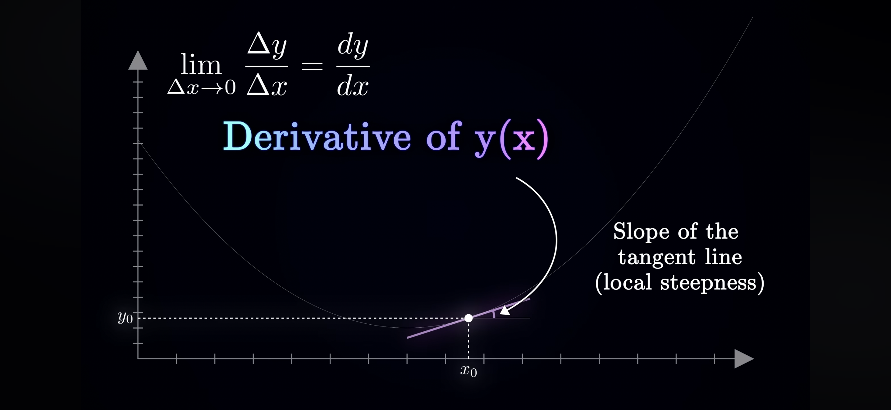

### 1.2 Mapping Functions to their Derivative Alter-Egos
Every continuous function has a corresponding "derivative alter-ego" that maps the slope of the original function at every point:

*   **S-Curve / Logistic Function (Yellow/Orange):** Starts flat (slope $\approx 0$), rises steeply in the middle (slope reaches maximum), and flattens out again (slope $\approx 0$). Its derivative maps to a **bell-shaped curve** that peaks at the steepest point.
*   **Sub-linear Growth (Red):** Starts extremely steep and slowly bends over, with its slope continuously decreasing toward zero. Its derivative is a **monotonically decaying curve** ($1/x$-like).
*   **Oscillating Wave (Blue):** Alternates between positive slopes, peaks/troughs (slope $= 0$), and negative slopes. Its derivative is a **phase-shifted wave** (cosine wave for a sine wave).

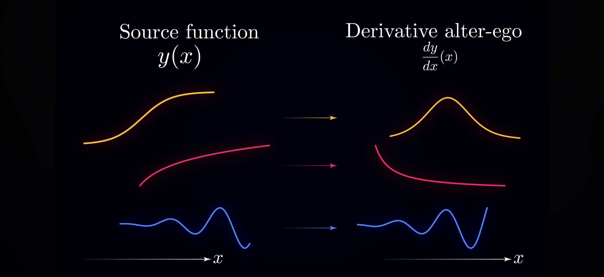

### 1.3 Derivatives as Optimization Signals
In machine learning and statistics, we define a **Loss Function** (e.g., $Loss(k_1)$) to measure how well our model fits the data. We want to find the parameter values that minimize this loss. 

Because the derivative represents slope:
1.  When the loss is decreasing, the derivative is negative.
2.  When the loss is increasing, the derivative is positive.
3.  **At the minimum point**, the loss landscape is flat, meaning the derivative is **exactly zero** ($\frac{dLoss}{dk_1} = 0$).

Thus, the derivative serves as a compass (or signal) telling us which way to adjust our parameters to reach the minimum (gradient descent).

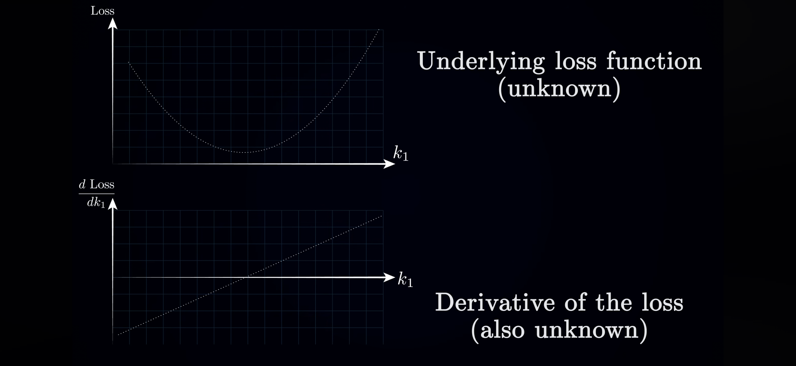

---

## 2. Fundamental Differentiation Building Blocks

To differentiate complex functions, we break them down into fundamental "building blocks" whose derivatives are already known.

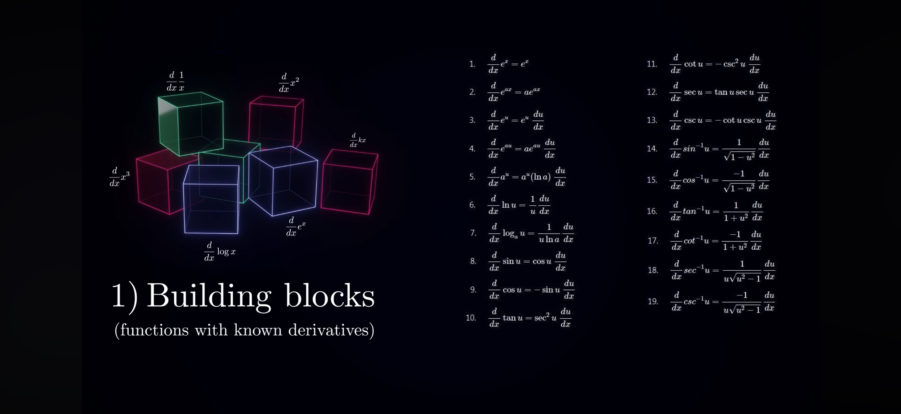

Below is the complete list of the **19 standard building block derivative rules** (using the chain rule helper variable $u$ where applicable):

| No. | Rule | No. | Rule |
| :--- | :--- | :--- | :--- |
| **1** | $\frac{d}{dx} e^x = e^x$ | **11** | $\frac{d}{dx} \cot u = -\csc^2 u \frac{du}{dx}$ |
| **2** | $\frac{d}{dx} e^{ax} = a e^{ax}$ | **12** | $\frac{d}{dx} \sec u = \tan u \sec u \frac{du}{dx}$ |
| **3** | $\frac{d}{dx} e^u = e^u \frac{du}{dx}$ | **13** | $\frac{d}{dx} \csc u = -\cot u \csc u \frac{du}{dx}$ |
| **4** | $\frac{d}{dx} e^{au} = a e^{au} \frac{du}{dx}$ | **14** | $\frac{d}{dx} \sin^{-1} u = \frac{1}{\sqrt{1-u^2}} \frac{du}{dx}$ |
| **5** | $\frac{d}{dx} a^u = a^u (\ln a) \frac{du}{dx}$ | **15** | $\frac{d}{dx} \cos^{-1} u = \frac{-1}{\sqrt{1-u^2}} \frac{du}{dx}$ |
| **6** | $\frac{d}{dx} \ln u = \frac{1}{u} \frac{du}{dx}$ | **16** | $\frac{d}{dx} \tan^{-1} u = \frac{1}{1+u^2} \frac{du}{dx}$ |
| **7** | $\frac{d}{dx} \log_a u = \frac{1}{u \ln a} \frac{du}{dx}$ | **17** | $\frac{d}{dx} \cot^{-1} u = \frac{-1}{1+u^2} \frac{du}{dx}$ |
| **8** | $\frac{d}{dx} \sin u = \cos u \frac{du}{dx}$ | **18** | $\frac{d}{dx} \sec^{-1} u = \frac{1}{u \sqrt{u^2-1}} \frac{du}{dx}$ |
| **9** | $\frac{d}{dx} \cos u = -\sin u \frac{du}{dx}$ | **19** | $\frac{d}{dx} \csc^{-1} u = \frac{-1}{u \sqrt{u^2-1}} \frac{du}{dx}$ |
| **10** | $\frac{d}{dx} \tan u = \sec^2 u \frac{du}{dx}$ | | |

### 2.1 Power Rule Visualized
*   **Quadratic ($y = x^2$):** The derivative is $\frac{dy}{dx} = 2x$, which is a straight line through the origin.
*   **General Power Rule ($y = x^n$):** Differentiating a power function yields $\frac{dy}{dx} = n x^{n-1}$.

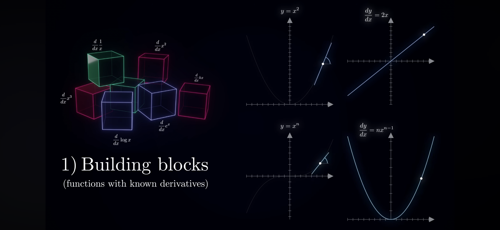

### 2.2 Exponential and Logarithmic Rules Visualized
*   **Exponential ($y = e^x$):** The derivative is $\frac{dy}{dx} = e^x$. The exponential function is unique because its slope at any point is exactly equal to its current value.
*   **Logarithmic ($y = \log x$):** The derivative is $\frac{dy}{dx} = \frac{1}{x}$, showing how the rate of increase rapidly drops as $x$ grows large.

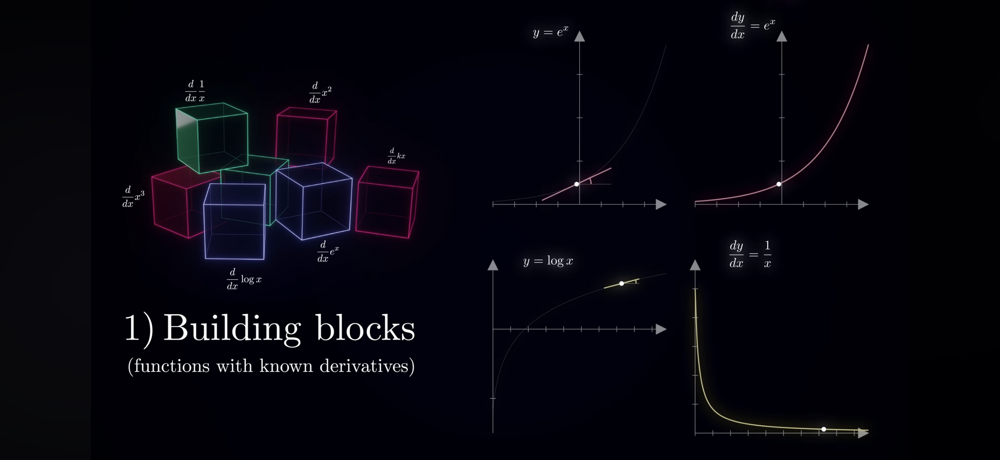

---

## 3. Rules to Combine Building Blocks

We can combine these basic building blocks using standard arithmetic combination rules.

### 3.1 Sum and Product Rules
*   **Sum Rule:** The derivative of a sum is the sum of the derivatives:
    $$\frac{d}{dx}\left( \text{Red} + \text{Blue} \right) = \frac{d}{dx}(\text{Red}) + \frac{d}{dx}(\text{Blue})$$
*   **Product Rule:** The derivative of a product requires taking the derivative of one block at a time:
    $$\frac{d}{dx}\left( \text{Red} \cdot \text{Blue} \right) = \text{Blue} \cdot \frac{d}{dx}(\text{Red}) + \text{Red} \cdot \frac{d}{dx}(\text{Blue})$$

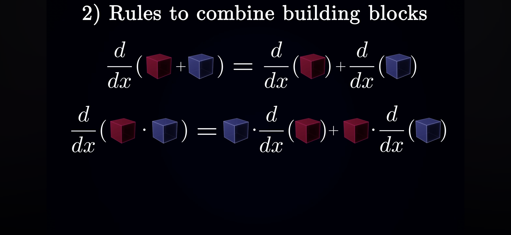

### 3.2 Linearity Combination Example
Combining the sum rule and constant multiple rule gives us **linearity**:

$$\frac{d}{dx}\left(3x^2 - e^x\right) = 3\frac{d}{dx}(x^2) - \frac{d}{dx}(e^x) = 6x - e^x$$

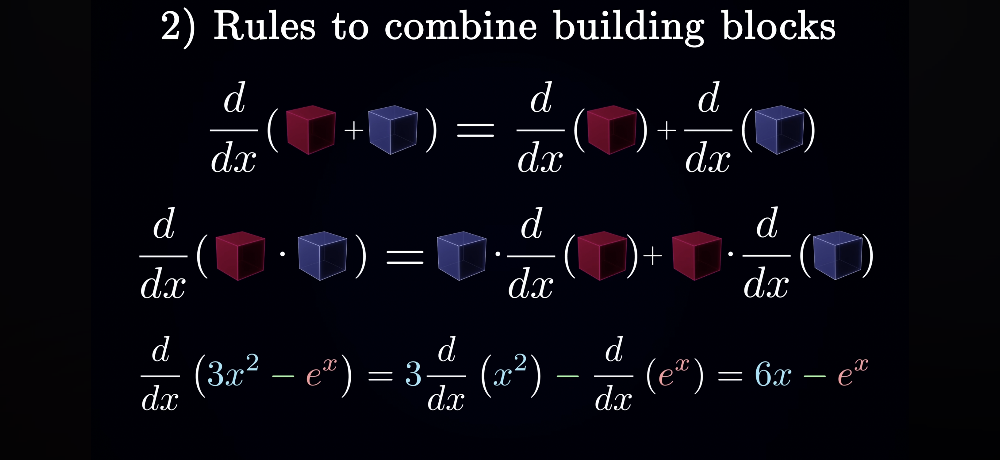

### 3.3 The Need for a Chain Rule
What happens when functions are nested inside one another rather than added or multiplied? For example, how do we differentiate:

$$y = \left(\sin \frac{e^{x^{\pi x}}}{\log \sqrt{x}}\right)^n$$

For such composite functions, we cannot use simple sum or product rules. We must use the **Chain Rule**.

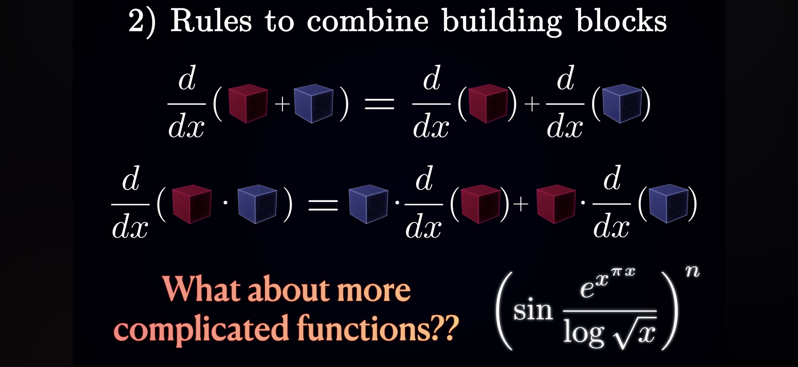

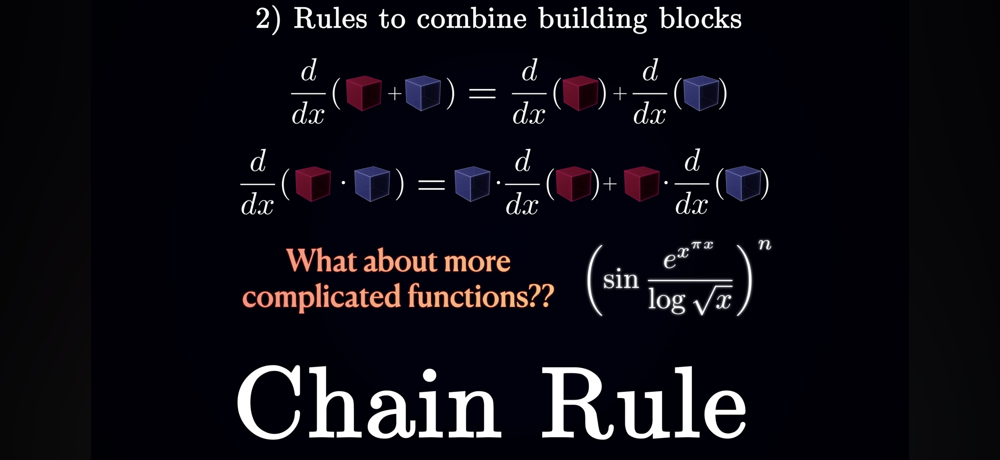

---

## 4. The Chain Rule: Step-by-Step Derivation

Our goal is to compute the rate of change of a nested composite function:

$$\frac{d}{dx}f(g(x)) = ?$$

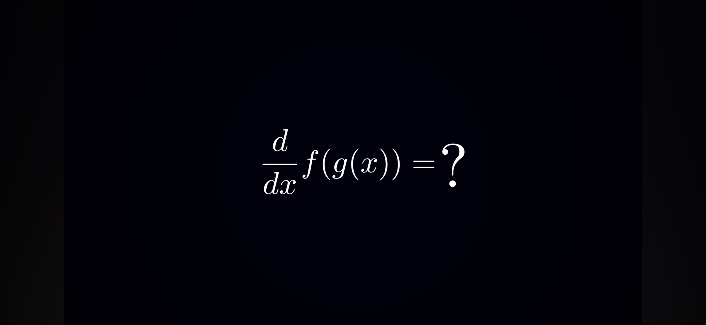

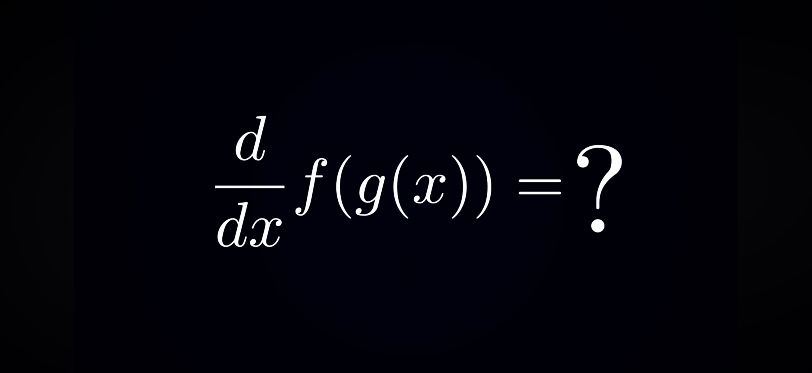

### 4.1 Chained Computer Screens (Function Machines)
Let's represent the functions $g(x)$ and $f(x)$ as computer screens/machines:
*   **Machine $g$** takes an input $x$ and outputs a value $g(x)$.
*   **Machine $f$** takes an input $u$ and outputs a value $f(u)$.

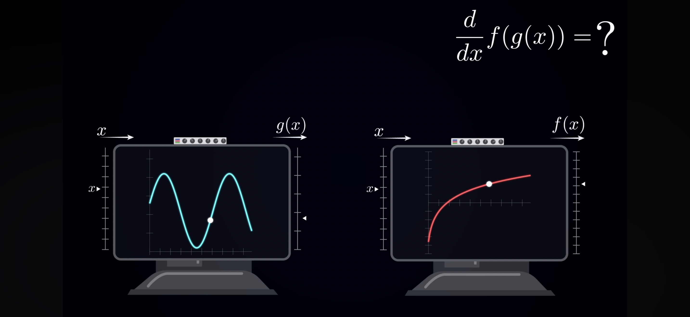

When we chain these machines together:
1.  We feed $x$ into the first machine $g$.
2.  The output $g(x)$ is fed directly as the input to the second machine $f$.
3.  The second machine outputs $f(g(x))$.

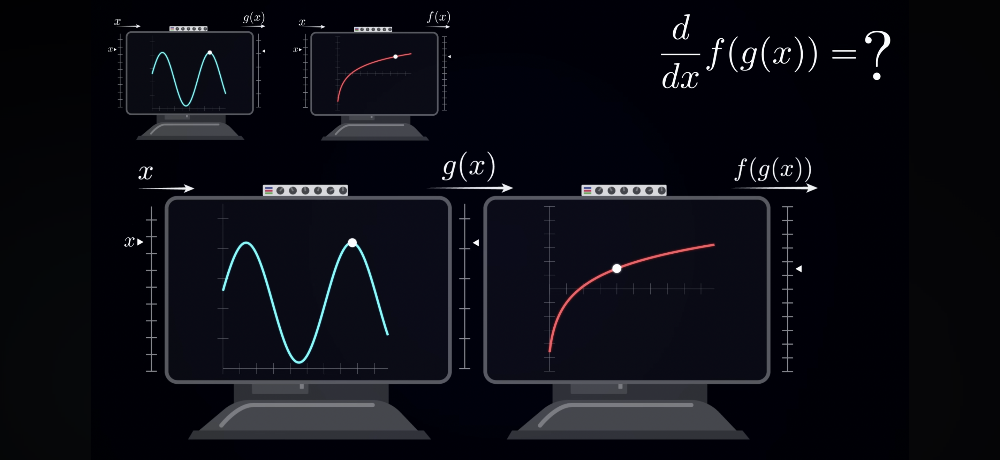

From an external perspective, this entire chained setup acts as a single, combined machine that maps $x$ directly to $f(g(x))$.

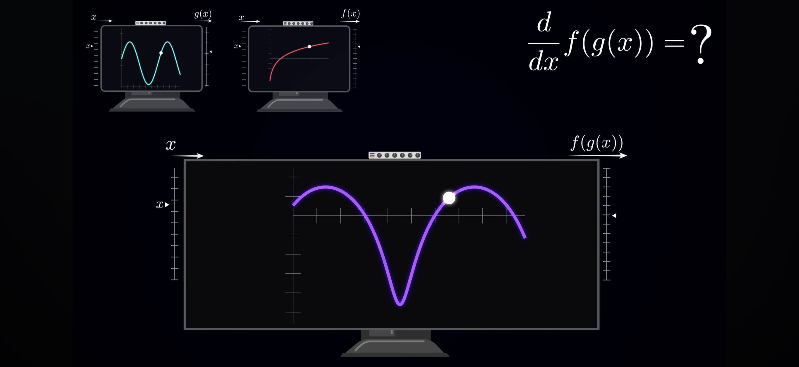

---

### 4.2 The "Nudge" Derivation Step-by-Step
To find the derivative of this combined machine, we introduce a tiny change (a "nudge") $\Delta$ to the input variable $x$, updating it to $x + \Delta$. We track how this nudge propagates through the chained system.

#### Step 1: Initial Setup
We have the two chained machines. The first has value $g(x)$ and derivative $g'(x)$. The second has value $f(g(x))$ and derivative $f'(g(x))$.

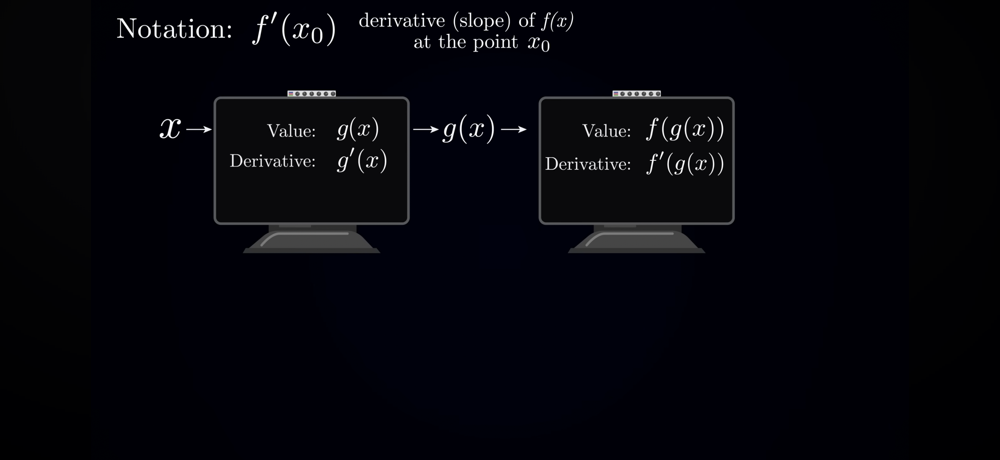

#### Step 2: Nudge the Input
We nudge the initial input $x$ by a tiny amount $\Delta$ to $x + \Delta$.

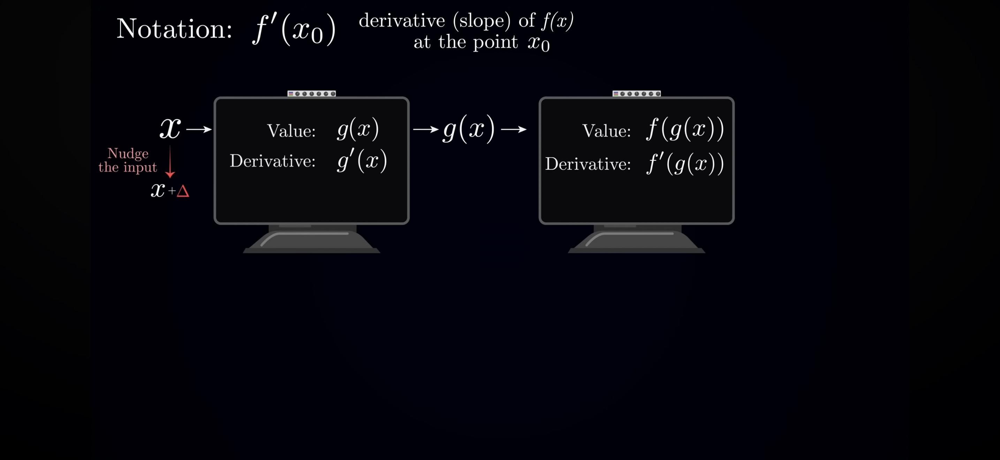

#### Step 3: Nudge Amplification by the First Machine
As the nudge passes through the first machine, it is amplified by the local derivative (rate of change) $g'(x)$.

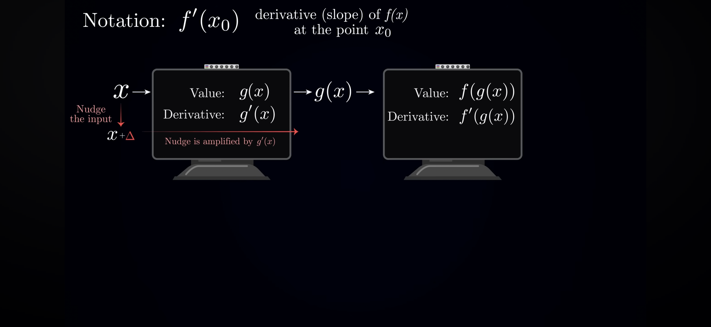

#### Step 4: First Machine Output Change
The resulting change in the output of the first machine is $g'(x) \cdot \Delta$.

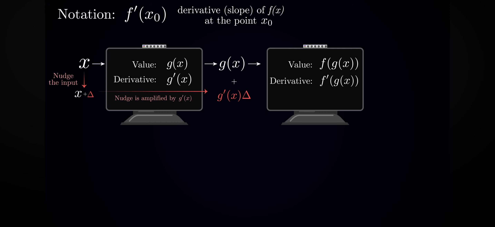

#### Step 5: Input to the Second Machine
The output nudge $g'(x)\Delta$ from the first machine acts as the input nudge to the second machine.

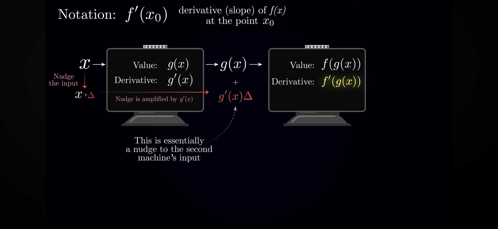

#### Step 6: Second Machine Amplification
This input nudge $g'(x)\Delta$ is further amplified by the second machine's local derivative, $f'(g(x))$.

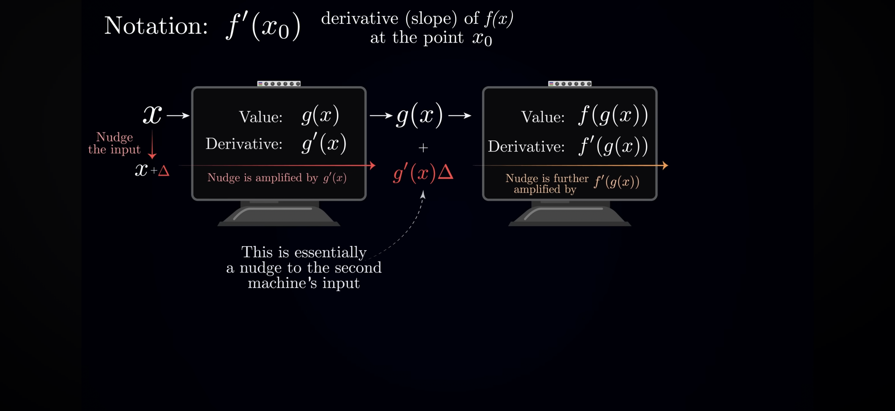

#### Step 7: Final Output Nudge
The final change in the output of the system is the product of the input nudge and the second amplification factor:
$$\text{Output Change} \approx f'(g(x)) \cdot g'(x) \cdot \Delta$$

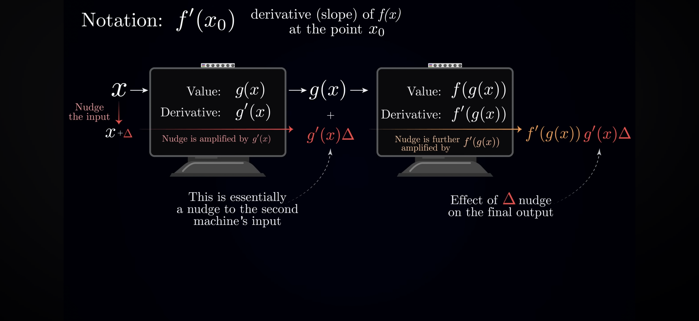

#### Step 8: Deducing the Chain Rule
Dividing the total change in the output by the initial input nudge $\Delta$ yields the derivative:
$$\frac{d}{dx}f(g(x)) = f'(g(x)) \cdot g'(x)$$

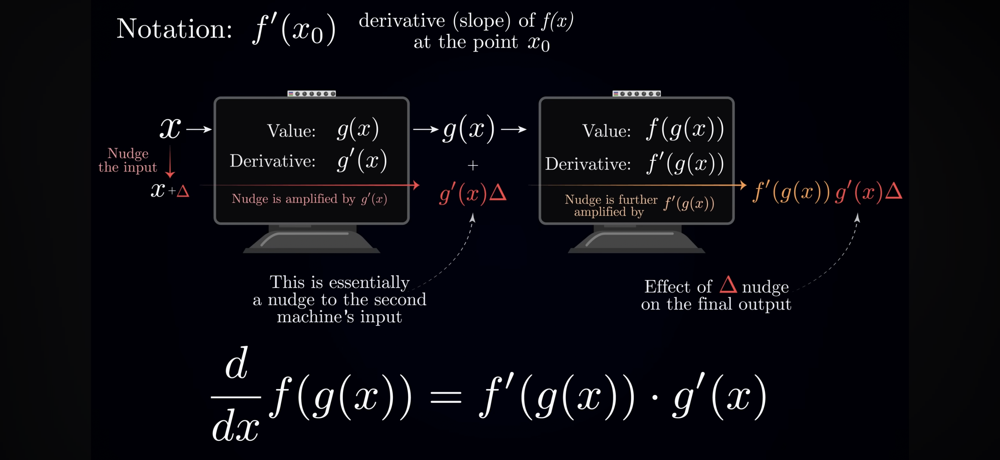

---

## 5. The Gear Train Analogy

Another powerful way to visualize the Chain Rule is through a **gear train** consisting of three interlinked gears: gear $x$, gear $g$, and gear $f$.

*   **Gear $x$** is turned by an input rotation of $\Delta$.
*   **Gear $g$** is driven by gear $x$. The ratio of rotation (local speed multiplier) is $g'(x)$.
    *   Thus, when gear $x$ turns by $\Delta$, gear $g$ turns by $g'(x)\Delta$.
*   **Gear $f$** is driven by gear $g$. The ratio of rotation (local speed multiplier) is $f'(g(x))$.
    *   Thus, when gear $g$ turns by $g'(x)\Delta$, gear $f$ turns by $f'(g(x)) \cdot g'(x)\Delta$.

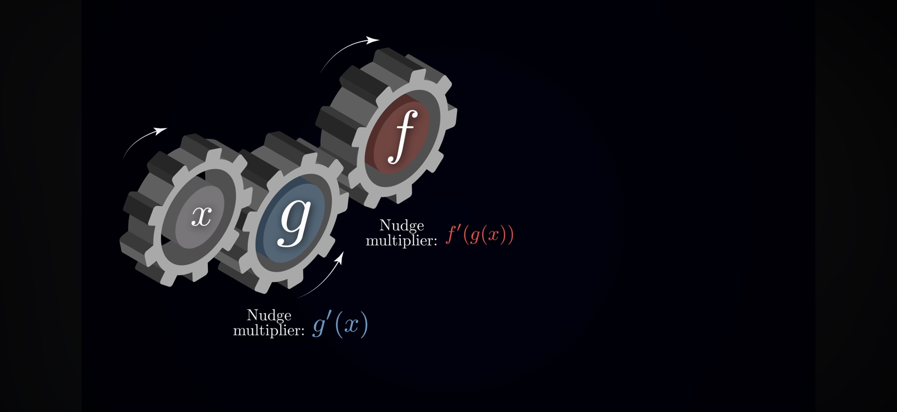

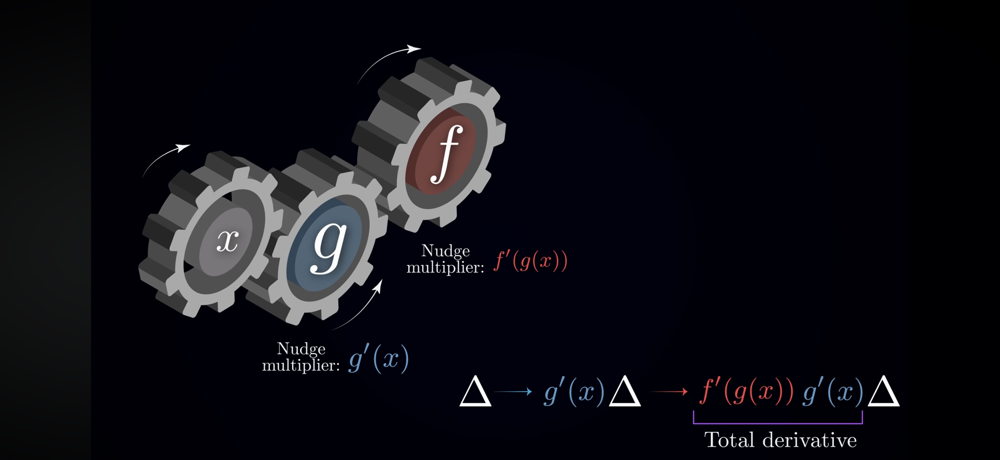

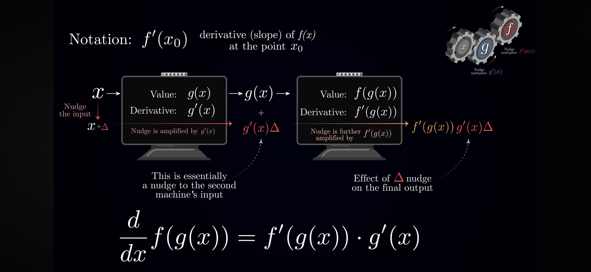

The overall gear ratio (the derivative of the final gear $f$ relative to the input gear $x$) is simply the product of the individual gear ratios:

$$\frac{d}{dx}f(g(x)) = f'(g(x)) \cdot g'(x)$$

---

## 6. Summary: Connecting Derivatives to Curve Fitting

By studying the relationships of fundamental functions and their derivatives, we can map out how inputs drive outputs across complex networks:

*   **Linear ($y = kx$):** Slope is constant ($\frac{dy}{dx} = k$).
*   **Quadratic ($y = x^2$):** Slope changes linearly ($\frac{dy}{dx} = 2x$).
*   **Exponential ($y = e^x$):** Slope grows exponentially ($\frac{dy}{dx} = e^x$).
*   **Logarithmic ($y = \log x$):** Slope decays hyperbolically ($\frac{dy}{dx} = 1/x$).

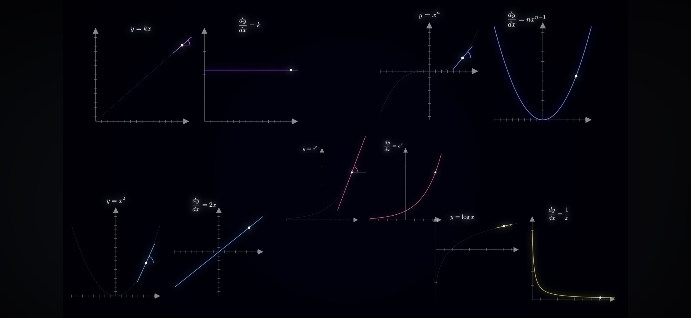

### 6.1 Finding the Best-Fitting Curve (Machine Learning Context)
How do we use this calculus to find the best-fitting curve for data?

In deep neural networks, every layer represents a mathematical function. The entire network is a massive composite function:
$$Output = f_L(f_{L-1}(\dots f_1(Input)\dots))$$

To optimize the weights of this network to fit data (minimize the loss function):
1.  We compute the local derivative of each layer (each "machine" or "gear").
2.  We apply the **Chain Rule** to propagate the error backwards from the output layer to the input layer.
3.  By multiplying these local derivatives (just like chained gear ratios), we determine how a small nudge to any weight in the network will affect the final loss.

This process is called **Backpropagation**, and it is the mathematical backbone of modern Artificial Intelligence.

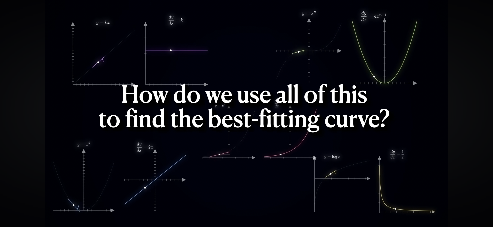
