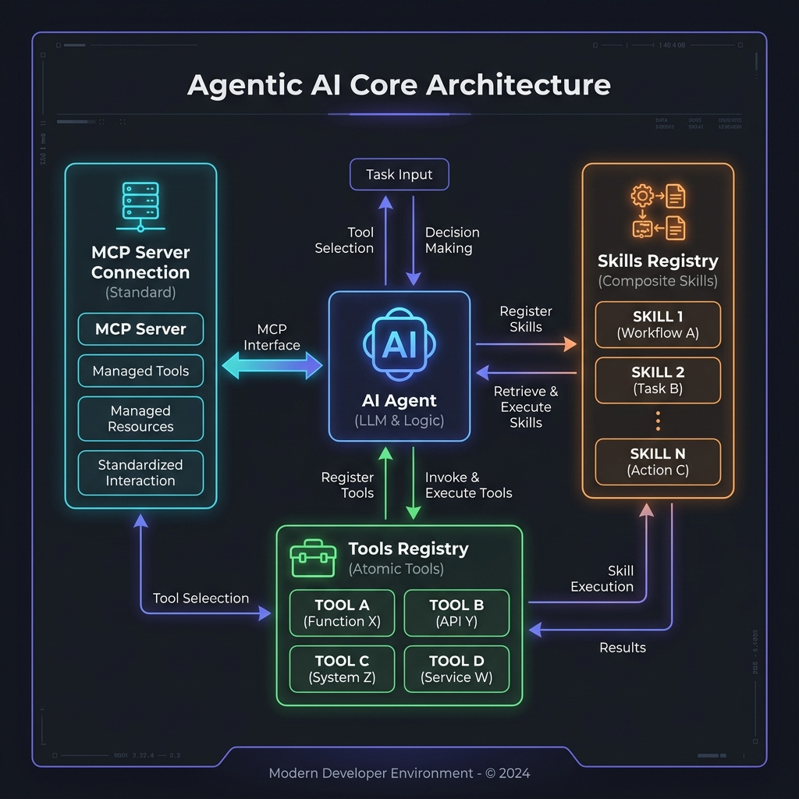
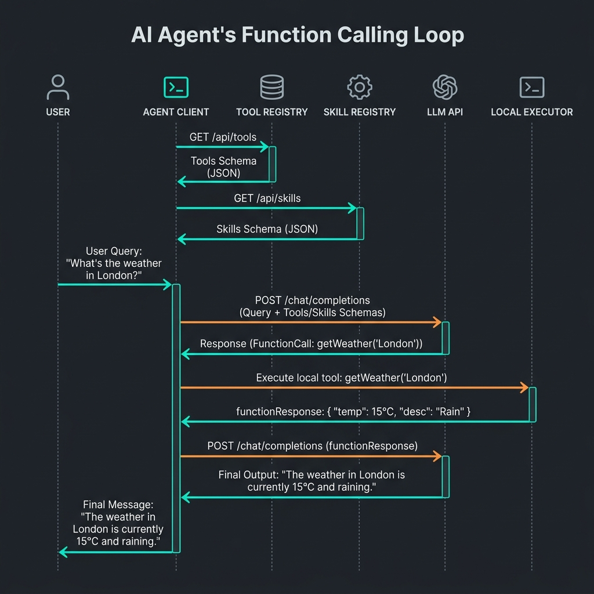
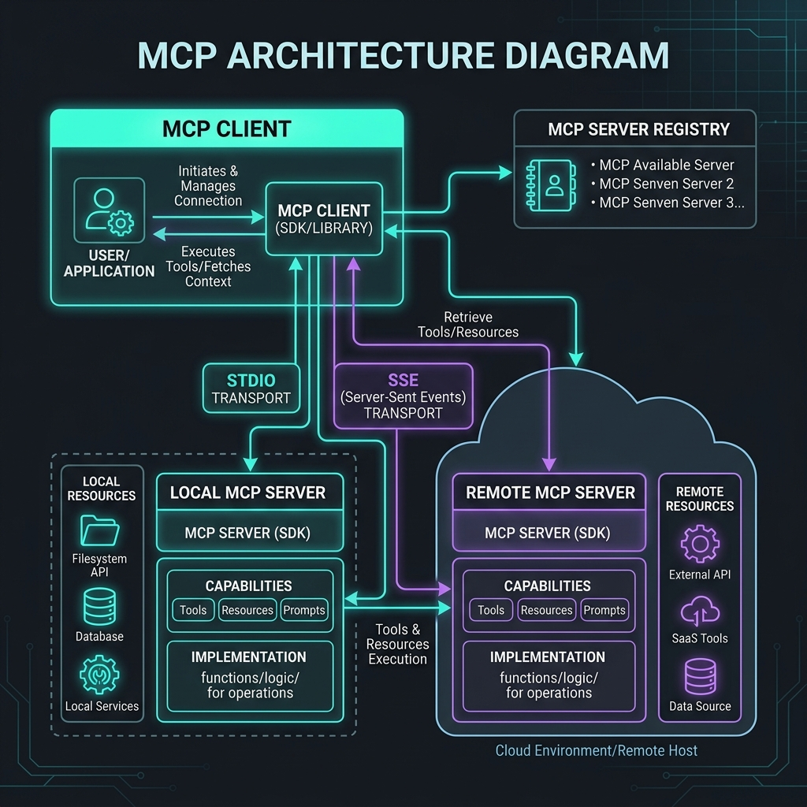

# Developer Guide: Agentic AI Systems, Tools, Skills, and MCP

This guide explains the architecture, mechanics, and communication interfaces of modern **Agentic AI systems**. It details how AI agents dynamically reason, register custom tools/skills, and connect to standard resource layers like the Model Context Protocol (MCP), using concrete design patterns and implementation examples.

---

## 1. Core Architecture & Concept Relationships

In a traditional AI interaction, a user sends a prompt, and the model returns a static text response. In an **Agentic AI** system, the AI acts as an autonomous coordinator. It operates within a reasoning loop, selecting and executing external code modules (Tools and Skills) to gather data and solve complex, multi-step queries.

### Core Definitions

- **AI Agent**: The orchestrator. It manages the conversational history (memory), system rules (behavior), and executes a reasoning cycle (e.g. *Thought ➔ Action ➔ Observation ➔ Thought*).
- **Atomic Tool**: A low-level, self-contained Python function or system execution that performs a single task (e.g. evaluating a math string, executing an HTTP request).
- **Composite Skill**: A high-level, goal-oriented workflow written in code that orchestrates multiple atomic tools internally (e.g. a city research workflow that queries weather, performs unit conversions, fetches wiki summaries, and saves reports).
- **Function Calling**: The structured message exchange protocol between the Agent and the Large Language Model (LLM). Instead of writing raw text, the LLM outputs a structured JSON block requesting a tool execution, and the client returns a structured JSON observation.
- **Model Context Protocol (MCP)**: An open-standard client-server protocol that standardizes how AI applications connect to external data sources and tools without writing custom API integrations for each platform.

### Core Concepts Architecture Mapping



---

## 2. Introspection & Tool Schema Registration

For the LLM to know a tool exists, the Agent must provide a JSON description (declaration) of the function's name, input arguments, and expected data types. Writing these schemas manually is tedious and error-prone. 

Modern agent frameworks use **runtime introspection** to automatically extract these JSON declarations directly from standard Python code.

### Code Walkthrough: `tools.py`
In this system, registering a function as an atomic tool is as simple as adding the `@tool` decorator. The registration registry analyzes the code structure on startup:

```python
import inspect
import re

class ToolRegistry:
    def __init__(self):
        self.tools = {}

    def register(self, func):
        name = func.__name__
        doc = func.__doc__ or ""
        
        # 1. Parse descriptions from docstrings using regex
        description, param_descriptions = self._parse_docstring(doc)
        
        # 2. Inspect signature for parameters and type annotations
        sig = inspect.signature(func)
        properties = {}
        required = []
        
        type_mapping = {
            str: "STRING",
            int: "INTEGER",
            float: "NUMBER",
            bool: "BOOLEAN",
            list: "ARRAY",
            dict: "OBJECT"
        }
        
        for param_name, param in sig.parameters.items():
            annotation = param.annotation
            schema_type = type_mapping.get(annotation, "STRING")  # default to STRING
            
            properties[param_name] = {
                "type": schema_type,
                "description": param_descriptions.get(param_name, f"The {param_name} parameter.")
            }
            # If there is no default value, it is a required argument
            if param.default == inspect.Parameter.empty:
                required.append(param_name)
        
        schema = {
            "name": name,
            "description": description or f"Execute {name}",
            "parameters": {
                "type": "OBJECT",
                "properties": properties
            }
        }
        if required:
            schema["parameters"]["required"] = required
            
        self.tools[name] = {
            "name": name,
            "func": func,
            "schema": schema,
            "source": inspect.getsource(func)
        }
        return func
```

### The result of registration:
When the developer writes a simple annotated function:
```python
@tool
def get_weather(city: str) -> str:
    """
    Fetches the current weather report for a given city.
    
    Args:
        city: The name of the city (e.g. "Tokyo", "London").
    """
    # implementation here...
```
The introspector automatically extracts the signature and generates this **Tool Schema JSON** to send to the LLM:
```json
{
  "name": "get_weather",
  "description": "Fetches the current weather report for a given city.",
  "parameters": {
    "type": "OBJECT",
    "properties": {
      "city": {
        "type": "STRING",
        "description": "The name of the city (e.g. \"Tokyo\", \"London\")."
      }
    },
    "required": ["city"]
  }
}
```

---

## 3. Dynamic Composite Skills Package Structure

While atomic tools perform simple operations, **Composite Skills** bundle multiple steps together, running logic locally on the host machine to minimize expensive multi-turn planning cycles over the network.

### The Skill Package Layout
In `/Users/donthireddy/code/agentic/skills/`, each skill is defined as a self-contained package folder:
```
skills/
└── research_city/
    ├── SKILL.md     # Metadata (YAML frontmatter) + human instructions
    └── script.py    # Python executable script containing local orchestration
```

#### 1. Skill Metadata (`SKILL.md`)
```yaml
---
name: research_city
description: Runs a full travel report on a city by combining weather, temp conversions, and wikipedia fetches.
parameters:
  type: OBJECT
  properties:
    city:
      type: STRING
      description: The name of the city.
  required:
    - city
---
To execute, run the local script.py workflow.
```

#### 2. Local Skill Orchestrator (`script.py`)
This script uses standard tools locally and saves intermediate results:
```python
# script.py
# Parameters are passed in the local namespace (e.g., city)
weather_report = get_weather(city)
# Extract temperature value using regex
import re
match = re.search(r'(\d+)°C', weather_report)
temp_c = float(match.group(1)) if match else 15.0

# Run a conversion local tool call
temp_f = calculator(f"({temp_c} * 9/5) + 32")

# Query info from wikipedia
wiki_data = fetch_webpage(f"https://en.wikipedia.org/wiki/{city}")

# Compile and store report
report = f"Report for {city}:\nWeather: {temp_c}°C ({temp_f}°F)\nInfo: {wiki_data}"
browser_storage("SET", f"{city.lower()}_travel_report", report)

# Assign to global variable 'result' for the executor to capture
result = report
```

### Dynamic Execution via `exec`
The `SkillRegistry` reloads these files and compiles a wrapper function dynamically:
```python
def _create_executor(self, script_code: str, name: str):
    def executor(**kwargs):
        import tools
        # Inject registered tools and parameters into exec's global scope
        exec_globals = {
            "calculator": tools.calculator,
            "get_weather": tools.get_weather,
            "browser_storage": tools.browser_storage,
            "fetch_webpage": tools.fetch_webpage,
        }
        exec_locals = kwargs.copy()  # contains arguments e.g., {'city': 'Paris'}
        
        # Execute the python script dynamically
        exec(script_code, exec_globals, exec_locals)
        
        # Capture output from the local variable
        if "result" in exec_locals:
            return exec_locals["result"]
        raise ValueError(f"Skill '{name}' did not set the 'result' variable.")
    return executor
```

---

## 4. Execution Sequences & Data Flows

Depending on the complexity of the query, the agent coordinates either sequentially (calling tools one-by-one) or via single-turn encapsulation (running composite skills).

### Sequential Atomic Tool Execution
The model receives the user prompt and registers schemas. It plans step-by-step, querying tools and feeding results back over multiple API turns.



---

## 5. Model Context Protocol (MCP) Architecture

The **Model Context Protocol (MCP)** standardizes tool integration. Instead of a developer writing custom schema parsers for each agent, tools are hosted on an **MCP Server** which exposes them using a standardized schema over local **stdio** streams or network HTTP/SSE.

### MCP Client-Server Schema Exchange

- **Stdio Transport**: Used when the MCP server runs on the same machine as a command-line process. Standard input (`stdin`) and standard output (`stdout`) are used to send JSON-RPC packages.
- **SSE Transport**: Used for remote or network connections. The client registers to a Server-Sent Events stream to receive events, and sends POST requests back to request executions.



---

## 6. Under the Hood: API Payload Handshakes

Here are the concrete payloads exchanged during the function calling reasoning loop (using standard Gemini format).

### 1. Declaring Tools to the LLM (POST Request to Gemini)
The client registers two functions (`get_weather` and `calculator`) and maps their parameters:
```json
{
  "contents": [
    {
      "role": "user",
      "parts": [{"text": "Query Tokyo weather and square the value"}]
    }
  ],
  "tools": [
    {
      "functionDeclarations": [
        {
          "name": "get_weather",
          "description": "Fetches current weather for a city.",
          "parameters": {
            "type": "OBJECT",
            "properties": {
              "city": {"type": "STRING", "description": "City name."}
            },
            "required": ["city"]
          }
        },
        {
          "name": "calculator",
          "description": "Evaluates math strings.",
          "parameters": {
            "type": "OBJECT",
            "properties": {
              "expression": {"type": "STRING", "description": "Math expression."}
            },
            "required": ["expression"]
          }
        }
      ]
    }
  ]
}
```

### 2. LLM Request for Execution (Gemini Response)
The LLM reads the tools list, outputs its chain of thought, and issues a structured `functionCall` request:
```json
{
  "candidates": [
    {
      "content": {
        "role": "model",
        "parts": [
          {
            "text": "Thought: I need to query Tokyo's current weather first."
          },
          {
            "functionCall": {
              "name": "get_weather",
              "args": {
                "city": "Tokyo"
              }
            }
          }
        ]
      }
    }
  ]
}
```

### 3. feeding the Result back to the LLM (Next POST Request)
The client intercepts the `functionCall`, executes the tool locally, and returns the output inside a `functionResponse` block, matching the call name:
```json
{
  "contents": [
    {
      "role": "user",
      "parts": [{"text": "Query Tokyo weather and square the value"}]
    },
    {
      "role": "model",
      "parts": [
        { "text": "Thought: I need to query Tokyo's current weather first." },
        { "functionCall": { "name": "get_weather", "args": { "city": "Tokyo" } } }
      ]
    },
    {
      "role": "tool",
      "parts": [
        {
          "functionResponse": {
            "name": "get_weather",
            "response": {
              "output": "Weather in Tokyo: 18°C, Rainy."
            }
          }
        }
      ]
    }
  ],
  "tools": [...]
}
```
The model will inspect the returned `18°C`, formulate the next thought, and issue a second `functionCall` to `calculator(expression="18 * 18")` to complete the loop.
