# Machine Learning Mathematics: A Comprehensive Illustrated Guide

This document provides a detailed, step-by-step mathematical and visual guide to the foundational mathematics used in typical Machine Learning (ML) and Artificial Intelligence (AI) models. It covers basic statistics, vector operations, matrix algebra, calculus gradients, regularization principles, and normalization techniques.

All illustrations are referenced from the local directory: [plots/basic_maths/](../plots/basic_maths/).

---

## 1. Basic Descriptive Statistics

Descriptive statistics summarize and describe the features of a dataset. They form the basis for data preprocessing, understanding feature distributions, and calculating loss metrics.

### 1.1 Core Statistics Definitions
*   **Mean ($\mu$):** The arithmetic average of all values in a dataset. It is calculated by summing all data points and dividing by the total count:
    
    $$\mu = \frac{\sum_{i=1}^N x_i}{N}$$

*   **Median:** The middle value in a dataset when the numbers are arranged in ascending or descending order. If the dataset has an even number of values, the median is the average of the two middle numbers.
*   **Mode:** The value that appears most frequently in a dataset. A dataset can have one mode (unimodal), multiple modes (multimodal), or no mode at all if all values are unique.
*   **Range:** The difference between the maximum and minimum values in a dataset:
    
    $$\text{Range} = \text{Max}(x) - \text{Min}(x)$$

*   **Variance ($\sigma^2$):** A measure of how spread out the values in a dataset are around their mean. It shows whether the data points are clustered closely around the average or spread far from it:
    
    $$\sigma^2 = \frac{\sum_{i=1}^N (x_i - \mu)^2}{N}$$

*   **Standard Deviation ($\sigma$):** The square root of the variance, expressing the spread in the same units as the original data points:
    
    $$\sigma = \sqrt{\frac{\sum_{i=1}^N (x_i - \mu)^2}{N}}$$

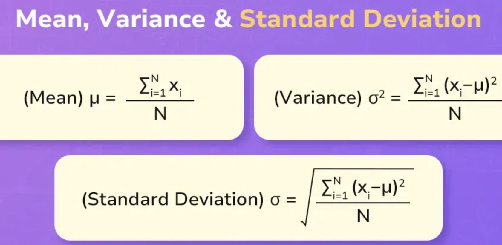

*   **Variance Interpretation:**
    *   **Small Variance:** Data points are clustered tightly around the mean (low variability).
    *   **Large Variance:** Data points are spread out widely from the mean (high variability).

---

### 1.2 Data Distributions & Skewness
Understanding the distribution of features is essential for choosing the right ML algorithms. Many algorithms (such as linear regression) assume that features are normally distributed.

*   **Normal (Gaussian) Distribution:** A symmetric, bell-shaped distribution where the mean, median, and mode are all equal and located at the exact center of the distribution.

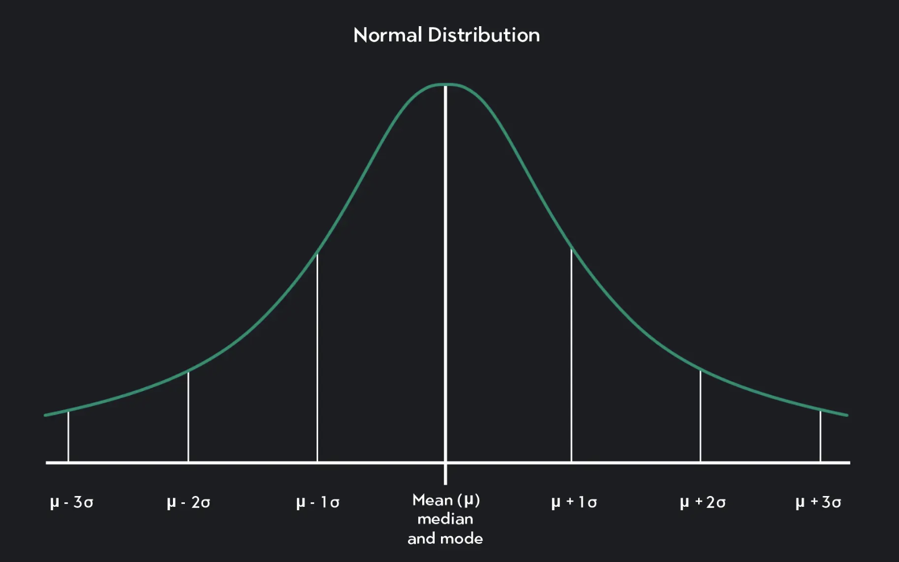

*   **Symmetric Distribution:** A distribution where the left side of the distribution is a mirror image of the right side.

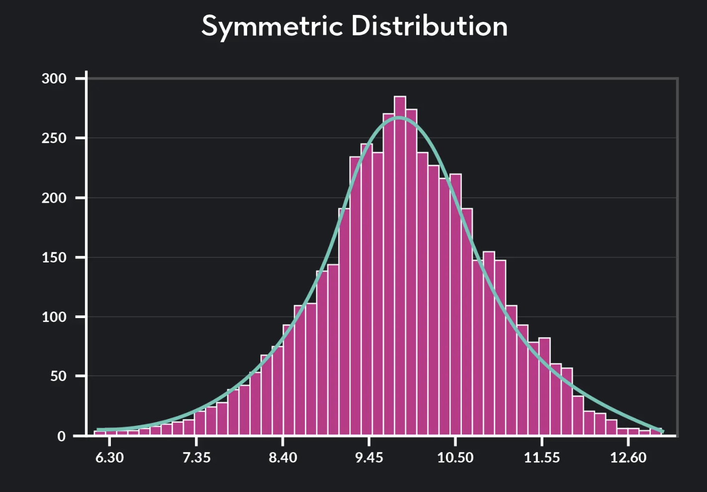

*   **Left-Skewed (Negatively Skewed) Distribution:** The tail of the distribution extends to the left, meaning there is a concentration of data points on the right side with a few exceptionally small values pulling the mean down.
    
    $$\text{Mean} < \text{Median} < \text{Mode}$$

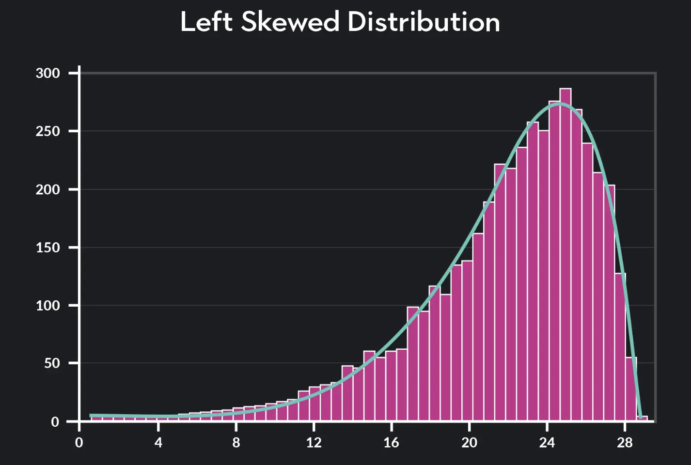

*   **Right-Skewed (Positively Skewed) Distribution:** The tail of the distribution extends to the right, meaning there is a concentration of data points on the left side with a few exceptionally large values pulling the mean up.
    
    $$\text{Mode} < \text{Median} < \text{Mean}$$

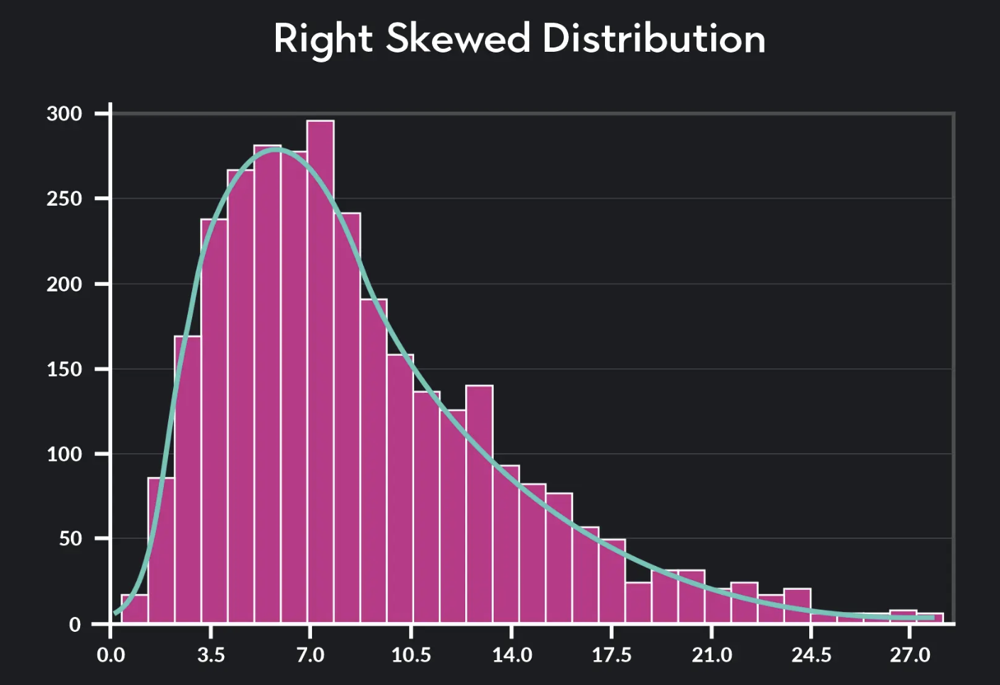

---

### 1.3 The Empirical Rule (68-95-99.7 Rule)
For normally distributed data, the spread of data points around the mean is governed by the standard deviation ($\sigma$). The **Empirical Rule** dictates that:
1.  Approximately **68%** of the data falls within one standard deviation of the mean ($\mu \pm \sigma$).
2.  Approximately **95%** of the data falls within two standard deviations of the mean ($\mu \pm 2\sigma$).
3.  Approximately **99.7%** of the data falls within three standard deviations of the mean ($\mu \pm 3\sigma$).

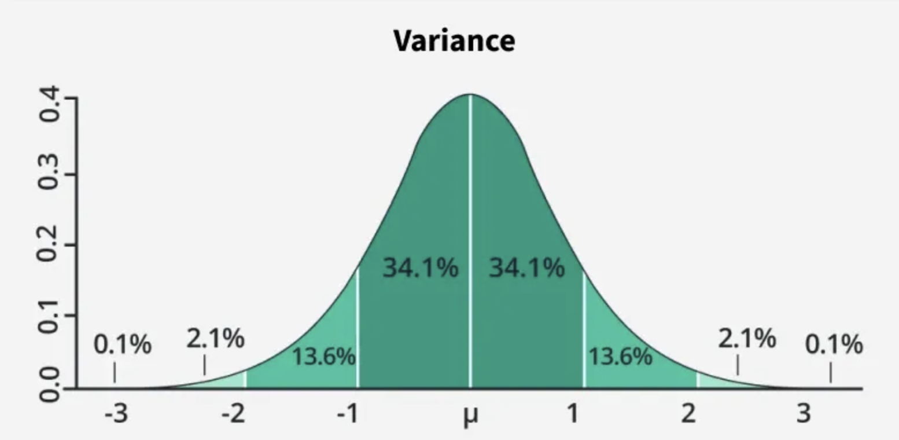

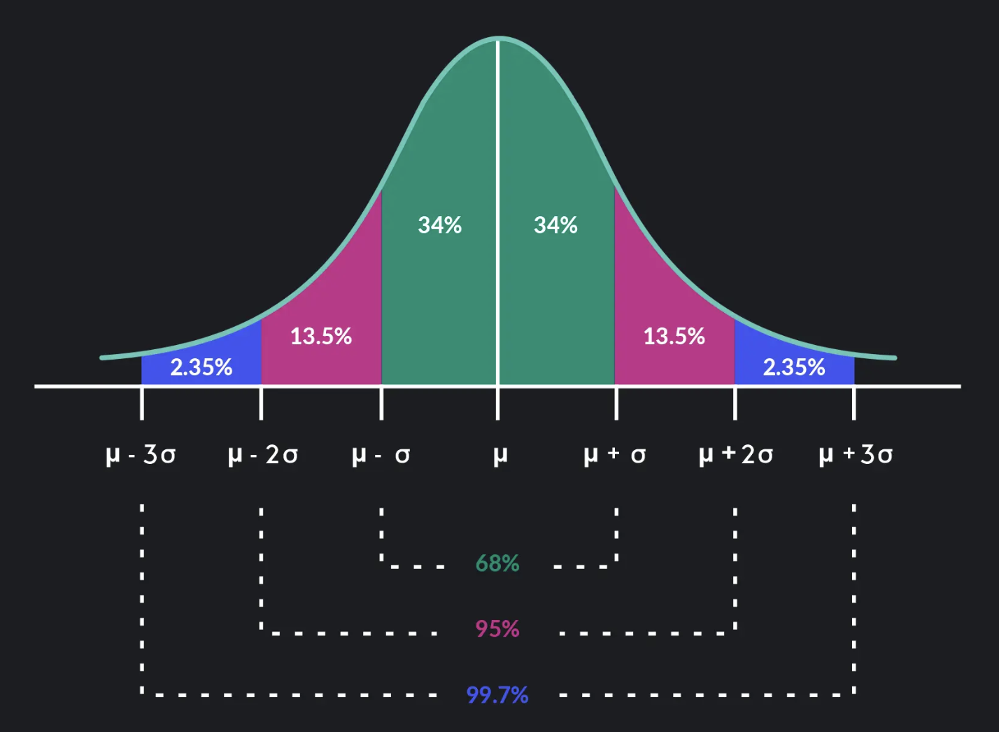

---

## 2. Vectors, Dot Products, and Cosine Similarity

Vectors represent points or directions in multi-dimensional space, and vector operations are the backbone of computing neural network activations and semantic embeddings.

### 2.1 The Vector Dot Product
The **dot product** (or scalar product) of two vectors $\vec{v}$ and $\vec{w}$ of dimension $N$ calculates a single scalar value. 

*   **Algebraic Definition:**
    
    $$\vec{v} \cdot \vec{w} = \sum_{i=1}^N v_i w_i = v_1 w_1 + v_2 w_2 + \dots + v_N w_N$$

For example, given:

$$\vec{v} = \begin{bmatrix} 1 \\ 2 \end{bmatrix}, \quad \vec{w} = \begin{bmatrix} 3 \\ 4 \end{bmatrix}$$

$$\vec{v} \cdot \vec{w} = 1 \cdot 3 + 2 \cdot 4 = 3 + 8 = 11$$

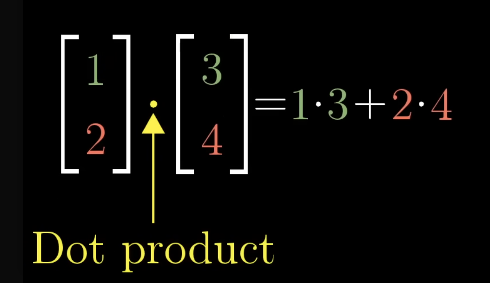

---

### 2.2 Geometric Meaning of the Dot Product
Geometrically, the dot product represents the length of the projection of vector $\vec{w}$ onto vector $\vec{v}$ multiplied by the length of vector $\vec{v}$:

$$\vec{v} \cdot \vec{w} = (\text{Length of projected } \vec{w}) \cdot (\text{Length of } \vec{v}) = \|\vec{w}\|_{\text{proj}} \cdot \|\vec{v}\|$$

Where:
*   $\|\vec{v}\|$ is the magnitude (length) of vector $\vec{v}$.
*   $\|\vec{w}\|_{\text{proj}} = \|\vec{w}\| \cos(\theta)$ is the length of the projection of $\vec{w}$ along the direction of $\vec{v}$.

This yields the geometric formula:

$$\vec{v} \cdot \vec{w} = \|\vec{v}\| \|\vec{w}\| \cos(\theta)$$

Where $\theta$ is the angle between the two vectors.

*   **Positive Projection Case:** If the angle $\theta$ between the vectors is acute ($< 90^\circ$), the projection lies in the same direction as $\vec{v}$, resulting in a positive dot product.

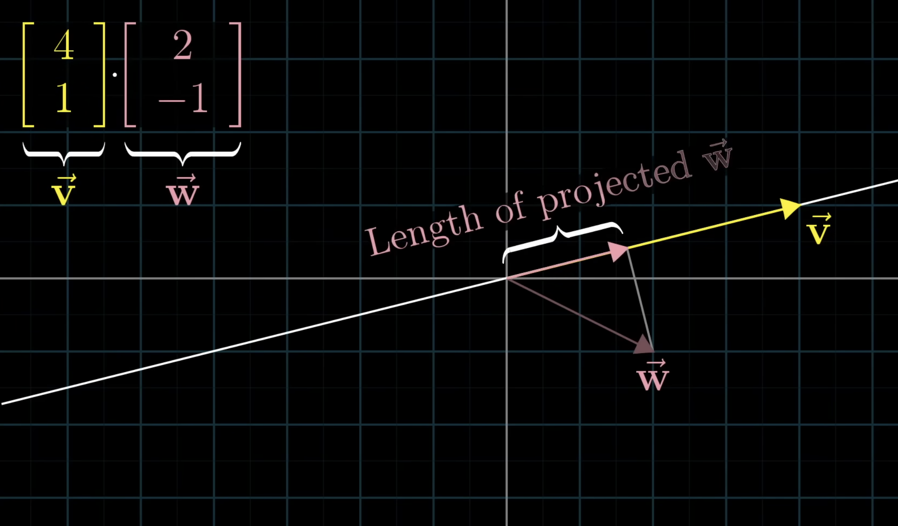

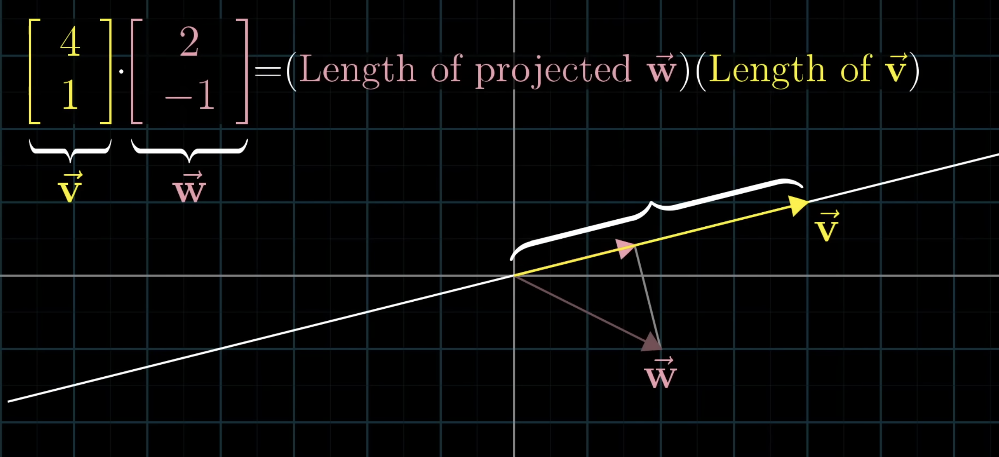

*   **Negative Projection Case:** If the angle $\theta$ is obtuse ($> 90^\circ$), the projection lies in the opposite direction of $\vec{v}$, making the dot product negative.

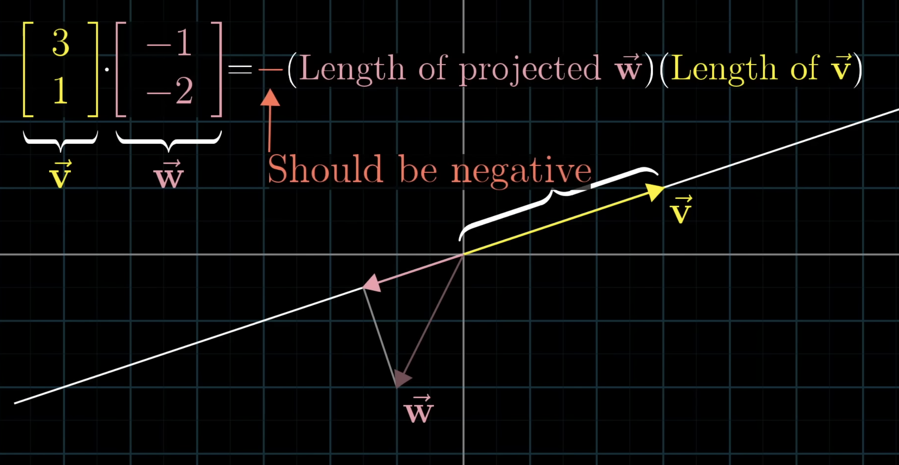

---

### 2.3 Dot Product Directional Relationships
The sign of the dot product reveals the relative direction of two vectors:

*   **Similar Directions ($\vec{v} \cdot \vec{w} > 0$):** The vectors point generally in the same half-space (angle $\theta < 90^\circ$).

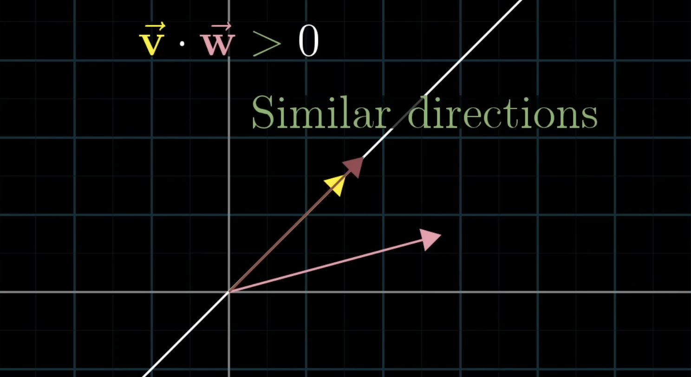

*   **Perpendicular / Orthogonal ($\vec{v} \cdot \vec{w} = 0$):** The vectors are at a right angle ($\theta = 90^\circ$). One vector has zero projection onto the other.

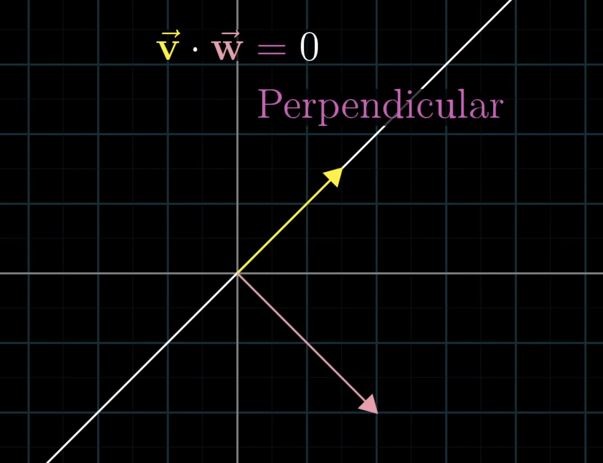

*   **Opposing Directions ($\vec{v} \cdot \vec{w} < 0$):** The vectors point generally in opposite directions (angle $\theta > 90^\circ$).

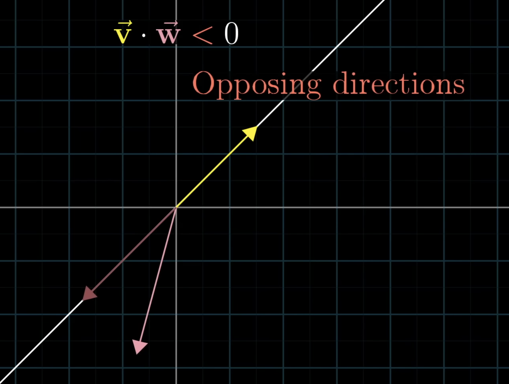

---

### 2.4 Cosine Similarity
In AI and Natural Language Processing (NLP), we use **Cosine Similarity** to measure the semantic similarity between two embedding vectors. Because cosine similarity normalizes for vector length (magnitude), it focuses purely on the direction (angle) of the vectors rather than their scale.

*   **Formula:**
    
    $$\text{Similarity}(A, B) = \cos(\theta) = \frac{A \cdot B}{\|A\| \cdot \|B\|}$$

Where:
*   $A \cdot B$ is the dot product of vectors $A$ and $B$.
*   $\|A\| = \sqrt{\sum A_i^2}$ is the Euclidean ($L_2$) norm (length) of vector $A$.
*   $\|B\| = \sqrt{\sum B_i^2}$ is the Euclidean ($L_2$) norm (length) of vector $B$.

*   **Range:** The output is bound between $[-1, 1]$:
    *   **$1$:** Vectors point in exactly the same direction ($\theta = 0^\circ$).
    *   **$0$:** Vectors are perpendicular ($\theta = 90^\circ$), meaning no similarity.
    *   **$-1$:** Vectors point in opposite directions ($\theta = 180^\circ$).

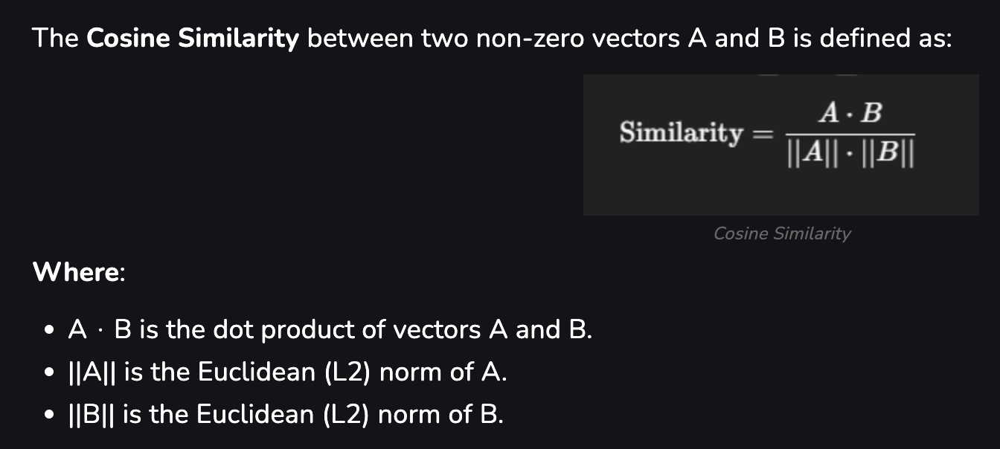

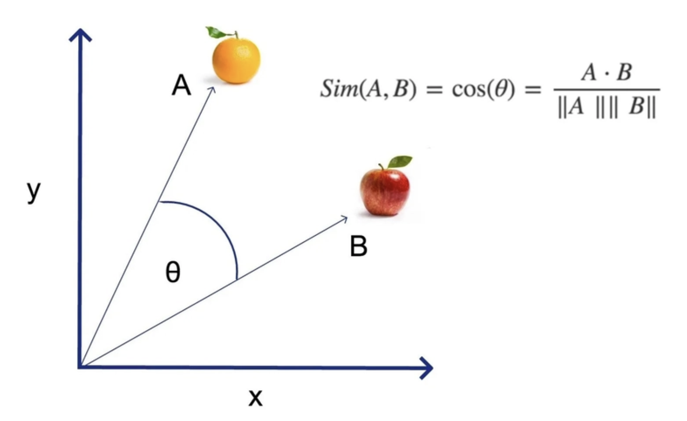

---

## 3. Matrices and Linear Algebra

Matrices represent linear transformations. In neural networks, layers are formulated as matrix multiplications, where inputs are mapped to outputs using weight matrices.

### 3.1 Matrix Multiplication
To multiply two matrices $A$ and $B$ (forming product $C = AB$), the number of columns in matrix $A$ must equal the number of rows in matrix $B$. If $A$ is of size $m \times n$ and $B$ is of size $n \times p$, the resulting matrix $C$ is of size $m \times p$.

The element at row $i$, column $j$ in the product matrix is the dot product of row $i$ of the first matrix and column $j$ of the second matrix:

$$c_{ij} = \sum_{k=1}^n a_{ik} b_{kj}$$

*   **2x2 Matrix Multiplication Example:**
    
    $$\begin{bmatrix} a_1 & b_1 \\ c_1 & d_1 \end{bmatrix} \begin{bmatrix} a_2 & b_2 \\ c_2 & d_2 \end{bmatrix} = \begin{bmatrix} a_1 a_2 + b_1 c_2 & a_1 b_2 + b_1 d_2 \\ c_1 a_2 + d_1 c_2 & c_1 b_2 + d_1 d_2 \end{bmatrix}$$

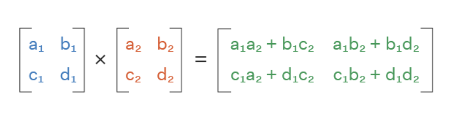

*   **3x3 Matrix Multiplication Example:**
    
    $$\begin{bmatrix} a & b & c \\ d & e & f \\ g & h & i \end{bmatrix} \begin{bmatrix} j & k & l \\ m & n & o \\ p & q & r \end{bmatrix} = \begin{bmatrix} (aj+bm+cp) & (ak+bn+cq) & (al+bo+cr) \\ (dj+em+fp) & (dk+en+fq) & (dl+eo+fr) \\ (gj+hm+ip) & (gk+hn+iq) & (gl+ho+ir) \end{bmatrix}$$

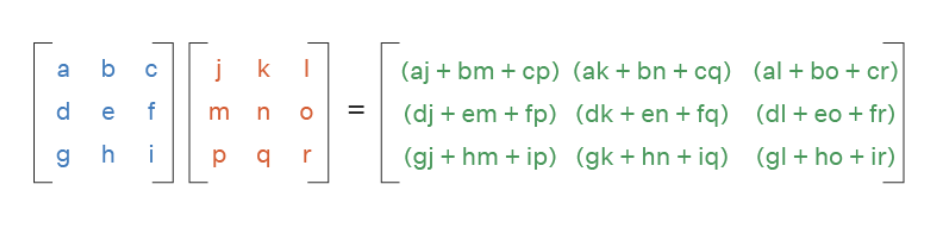

---

### 3.2 Non-Commutativity of Matrix Multiplication
Unlike scalar multiplication (where $2 \times 3 = 3 \times 2 = 6$), matrix multiplication is **not commutative**. This means that order matters:

$$AB \neq BA$$

For instance, let:

$$A = \begin{bmatrix} 1 & 2 \\ 3 & 4 \end{bmatrix}, \quad B = \begin{bmatrix} 2 & 0 \\ 1 & 2 \end{bmatrix}$$

*   Computing $AB$:
    
    $$AB = \begin{bmatrix} 1 \times 2 + 2 \times 1 & 1 \times 0 + 2 \times 2 \\ 3 \times 2 + 4 \times 1 & 3 \times 0 + 4 \times 2 \end{bmatrix} = \begin{bmatrix} 4 & 4 \\ 10 & 8 \end{bmatrix}$$

*   Computing $BA$:
    
    $$BA = \begin{bmatrix} 2 \times 1 + 0 \times 3 & 2 \times 2 + 0 \times 4 \\ 1 \times 1 + 2 \times 3 & 1 \times 2 + 2 \times 4 \end{bmatrix} = \begin{bmatrix} 2 & 4 \\ 7 & 10 \end{bmatrix}$$

Because the results are different, we confirm that $AB \neq BA$.

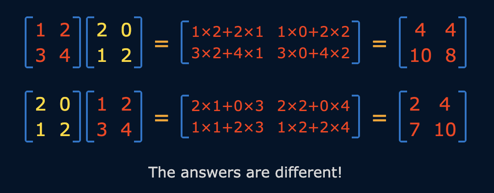

---

### 3.3 Identity Matrices
An **Identity Matrix** ($I$) is a square matrix with ones on the main diagonal and zeros elsewhere. Multiplying any matrix by the identity matrix leaves the original matrix unchanged:

$$A I = I A = A$$

Identity matrices serve as the matrix equivalent of the number $1$. Here are the identity matrices for dimensions 2, 3, and 4:

$$I_2 = \begin{bmatrix} 1 & 0 \\ 0 & 1 \end{bmatrix}, \quad I_3 = \begin{bmatrix} 1 & 0 & 0 \\ 0 & 1 & 0 \\ 0 & 0 & 1 \end{bmatrix}, \quad I_4 = \begin{bmatrix} 1 & 0 & 0 & 0 \\ 0 & 1 & 0 & 0 \\ 0 & 0 & 1 & 0 \\ 0 & 0 & 0 & 1 \end{bmatrix}$$

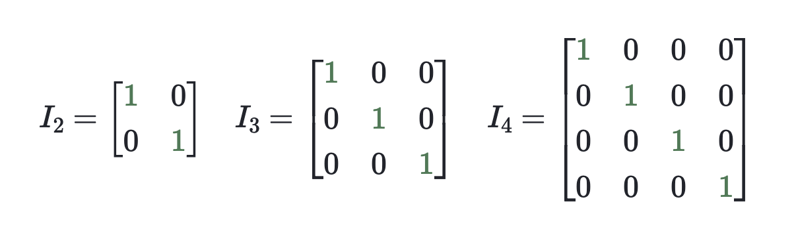

---

### 3.4 Matrix Transpose
The **transpose** of a matrix $A$ is an operation that flips the matrix over its diagonal, swapping its row and column indices. The transpose of matrix $A$ is denoted as $A^T$, $A'$, or $A^t$.

$$\left(A^T\right)_{ij} = A_{ji}$$

If $A$ is of size $m \times n$, then $A^T$ is of size $n \times m$.

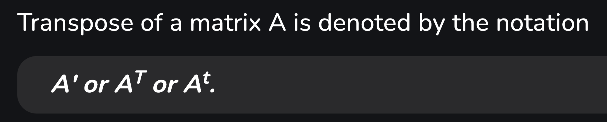

*   **Transpose Example:**
    
    $$A = \begin{bmatrix} a & b & c \\ d & e & f \end{bmatrix}_{2 \times 3} \implies A^T = \begin{bmatrix} a & d \\ b & e \\ c & f \end{bmatrix}_{3 \times 2}$$

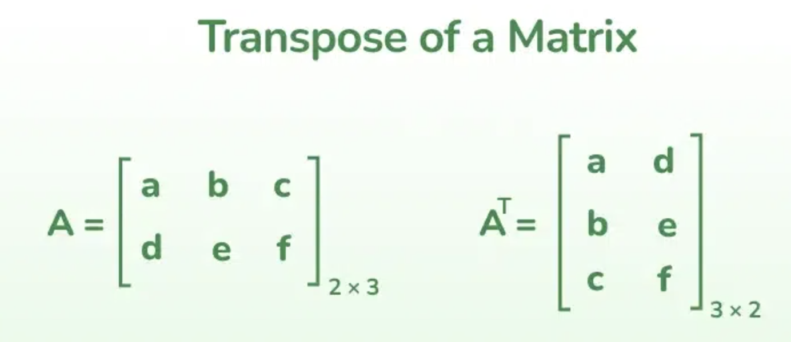

---

## 4. Calculus and Gradients

In optimization, we define a loss function that measures our model's error. We minimize this loss by taking partial derivatives with respect to each model parameter.

### 4.1 What is the Gradient?
For a single-variable function $f(x)$, the derivative represents the rate of change. For a multi-variable function $f(x_1, x_2, \dots, x_n)$, the **Gradient** (denoted by $\nabla f$ or "del $f$") is a vector of its partial derivatives:

$$\nabla f = \left( \frac{\partial f}{\partial x_1}, \frac{\partial f}{\partial x_2}, \dots, \frac{\partial f}{\partial x_n} \right)$$

Each component $\frac{\partial f}{\partial x_i}$ measures the rate of change of the function $f$ when we nudge variable $x_i$, keeping all other variables constant.

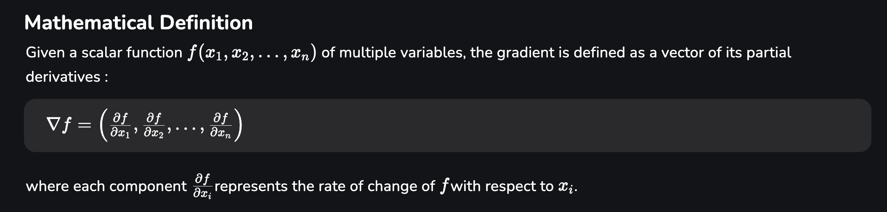

*   **2D and 3D Gradients:**
    *   For a function $f(x, y)$ of two variables, the gradient is a 2D vector:
        
        $$\nabla f = \left( \frac{\partial f}{\partial x}, \frac{\partial f}{\partial y} \right)$$

    *   For a function $f(x, y, z)$ of three variables, the gradient is a 3D vector:
        
        $$\nabla f = \left( \frac{\partial f}{\partial x}, \frac{\partial f}{\partial y}, \frac{\partial f}{\partial z} \right)$$

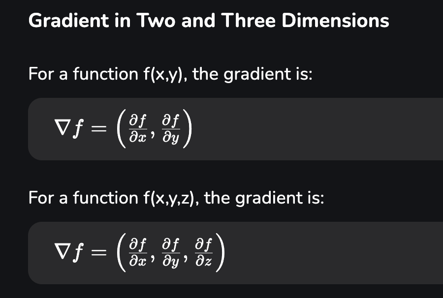

*   **Steepest Ascent:**
    The gradient vector points in the direction of **steepest ascent**—the direction in which the function value increases most rapidly. Conversely, the negative gradient ($-\nabla f$) points in the direction of steepest descent, which we follow in Gradient Descent to minimize model loss.

---

### 4.2 Gradient Field Visualization
We can plot the gradient vectors at various coordinate locations to visualize a **Gradient Field**. For example, the gradient field of the function $f(x, y) = x^2 + 3y^2$ consists of vectors that point away from the origin (where the function value is at its minimum, $0$), growing longer as the steepness increases.

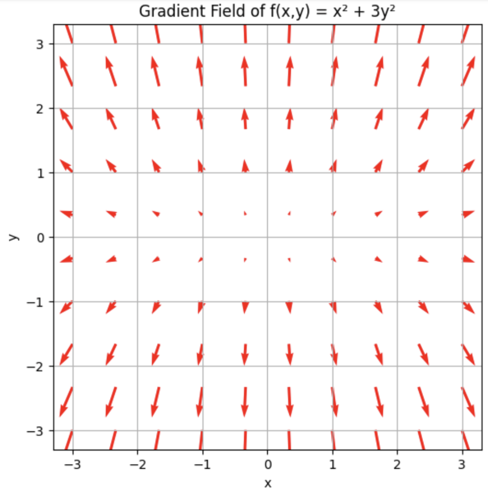

---

### 4.3 Numerical Gradient Example
Let's compute the gradient of the function:

$$f(x, y) = x^2 + 3y^2$$

1.  **Compute the Partial Derivatives:**
    *   With respect to $x$ (treating $y$ as a constant):
        
        $$\frac{\partial f}{\partial x} = 2x$$

    *   With respect to $y$ (treating $x$ as a constant):
        
        $$\frac{\partial f}{\partial y} = 6y$$

    *   This gives the gradient function:
        
        $$\nabla f = (2x, 6y)$$

2.  **Evaluate at a specific point, say $(1, 2)$:**
    
    $$\nabla f(1, 2) = (2(1), 6(2)) = (2, 12)$$

This tells us that at coordinates $(1, 2)$, the function $f(x, y)$ increases most rapidly if we move in the direction of the vector $(2, 12)$.

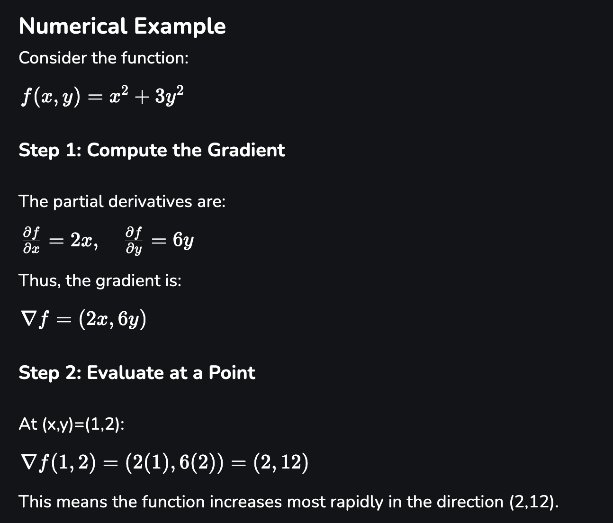

---

## 5. Regularization Techniques

Deep learning models contain millions or billions of parameters, making them highly susceptible to **overfitting** (where a model memorizes the noise in the training set and fails to generalize to new, unseen test data). **Regularization** adds constraints or noise to the training process to prevent overfitting.

### 5.1 Dropout
Dropout is a regularization technique commonly used during the training of Deep Neural Networks and Large Language Models (LLMs).

*   **How it works:** During each training iteration, dropout randomly deactivates (sets to zero) a predefined fraction of neurons (e.g., 20% or 50%) in a layer.
*   **The Co-adaptation Problem:** Without dropout, neighboring neurons can develop codependency ("co-adaptation"), where one neuron compensates for errors in another. 
*   **Benefits:** By deactivating random neurons, the network cannot rely on any single connection. Each neuron is forced to learn robust, independent features. Dropout also acts as a form of **ensemble learning**, as a different sub-network is trained in each iteration.

---

### 5.2 Weight Decay (L2 Regularization)
Weight Decay prevents overfitting by penalizing large parameters in the neural network.

*   **How it works:** It adds a penalty term to the network's loss function proportional to the sum of the squared weights:
    
    $$\text{Total Loss} = \text{Loss}_{\text{Data}} + \lambda \sum_{j} w_j^2$$

    Where $\lambda$ (lambda) is a regularization strength hyperparameter.
*   **The Bias Example:** Consider a movie review classifier predicting whether a review is positive or negative:
    *   **Without Weight Decay:** If a word like "boring" appears in many negative reviews in a small training set, the model might assign an excessively large negative weight to it. The model overfits to this word, ignoring other critical indicators (like "uninspired" or "predictable").
    *   **With Weight Decay:** The model is penalized for assigning excessively large weights to any single feature. This forces the model to distribute weight more evenly across multiple predictive words, leading to a more balanced and generalizable model.

---

## 6. Normalization Techniques

Features in real-world datasets often have completely different ranges (scales). For example, if we predict a person's height using features like **Age** (range: 0–100 years) and **Weight** (range: 50–300 pounds), the weight values will dominate calculations because of their larger scale. Normalizing features to a consistent scale (such as $[0, 1]$ or standard normal scaling) ensures all inputs contribute equally.

In deep networks, we normalize the activations between layers to stabilize training and accelerate convergence. The two most common techniques are **Batch Normalization** and **Layer Normalization**.

```
Batch Normalization (Normalizes across the batch dimension):
      Feature 1   Feature 2   Feature 3
      +---------+ +---------+ +---------+
Batch |  x11    | |  x12    | |  x13    |  <-- Sample 1
Batch |  x21    | |  x22    | |  x23    |  <-- Sample 2
Batch |  x31    | |  x32    | |  x33    |  <-- Sample 3
      +---------+ +---------+ +---------+
         Mean &      Mean &      Mean &
        Var calculated vertically

Layer Normalization (Normalizes across the feature dimension):
      Feature 1   Feature 2   Feature 3
      +---------------------------------+
Batch |  x11         x12         x13    |  <-- Sample 1 (Mean & Var calculated horizontally)
      +---------------------------------+
Batch |  x21         x22         x23    |  <-- Sample 2 (Mean & Var calculated horizontally)
      +---------------------------------+
Batch |  x31         x32         x33    |  <-- Sample 3 (Mean & Var calculated horizontally)
      +---------------------------------+
```

### 6.1 Batch Normalization (Batch Norm)
*   **Scope:** Batch normalization operates on mini-batches of data and normalizes activations across the batch dimension.
*   **Calculation:** For each feature channel in the mini-batch, it computes the mean and variance across all samples in the batch, then normalizes those activations.
*   **Effect:** It stabilizes training by reducing *internal covariate shift* (changes in the distribution of layer inputs during training), enabling higher learning rates and faster convergence.
*   **Use Cases:** Batch Norm is highly effective in Feedforward and Convolutional Neural Networks (CNNs) with large, consistent batch sizes.
*   **Limitations:** It depends on batch statistics, which can make it unstable when using very small batch sizes or during inference.

---

### 6.2 Layer Normalization (Layer Norm)
*   **Scope:** Layer normalization operates on individual samples and normalizes across the feature dimension for each layer.
*   **Calculation:** It computes the mean and variance for all features *within a single training sample*, making the normalization completely independent of the batch size.
*   **Effect:** Layer Norm is robust to changes in input distribution and batch size.
*   **Use Cases:** It is preferred for Recurrent Neural Networks (RNNs) and Transformer-based models (such as LLMs), where batch sizes vary, sequence lengths differ, and features within a single sequence are highly correlated.

---

### 6.3 Comparison of Batch Norm and Layer Norm

| Feature / Aspect | Batch Normalization | Layer Normalization |
| :--- | :--- | :--- |
| **Scope of Normalization** | Across the batch dimension (for each feature independently). | Across the feature dimension (for each sample independently). |
| **Dependency on Batch Size** | Highly dependent; requires large, stable batch sizes. | Completely independent of batch size. |
| **Primary Use Cases** | Convolutional Neural Networks (CNNs), Feedforward Networks. | Recurrent Neural Networks (RNNs), Transformers (LLMs). |
| **Handling Sequence Data** | Ineffective due to varying sequence lengths in a batch. | Very effective; handles variable sequence lengths easily. |
| **Inference Behavior** | Uses pre-calculated running statistics of the training set. | Calculates statistics on-the-fly for each test sample. |
