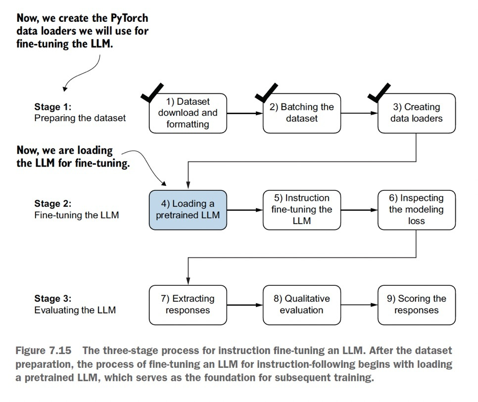

# Build a Large Language Model (from Scratch)
### An Illustrated Step-by-Step Developer & Mathematical Guide

This guide details the step-by-step mathematical, architectural, and practical workflow of building and training a generative GPT-like Large Language Model from scratch. Based on the curriculum of the LLM framework, this deep dive integrates high-resolution structural diagrams and detailed mathematical derivations.

---

## 1. Understanding Large Language Models

Building an industrial-grade Large Language Model is divided into three distinct conceptual stages: preparing data and understanding the basic mechanisms, pretraining a foundation model on unlabeled text, and fine-tuning the model to follow instructions or perform specialized tasks.


*Figure 1.1: The three stages of building a Large Language Model: from data preparation to pretraining and task-specific fine-tuning.*

### The Deep Learning Hierarchy
Modern Generative AI (GenAI) models exist inside a nested hierarchy of computer science and neural networks:
*   **Artificial Intelligence**: Systems capable of performing tasks that typically require human intelligence.
*   **Machine Learning**: Algorithms that learn rules and patterns automatically from data.
*   **Deep Learning**: Machine learning utilizing deep artificial neural networks (multilayer networks).
*   **Generative AI (GenAI)**: Deep learning subfield focused on generating new content (text, images, media).
*   **Large Language Models (LLMs)**: Deep learning networks optimized to parse, model, and generate human-like text sequences.


*Figure 1.2: Nested hierarchy of modern AI, highlighting LLMs as a specialized application of Deep Learning.*

### Pretraining vs. Fine-Tuning
An LLM is trained in two primary phases:
1.  **Pretraining**: Next-word prediction on trillions of words of raw, unlabeled text (books, web crawls, articles). This yields a **foundation model** with text completion and few-shot capabilities.
2.  **Fine-Tuning**: Supervised training on curated, labeled datasets to adapt the foundation model for specific tasks (classification, translation) or conversational instruction-following.


*Figure 1.3: Visualizing the pretraining stage (unlabeled text) and the downstream fine-tuning phase (labeled datasets).*

### Transformer Submodules: Encoder vs. Decoder
The original Transformer architecture (Vaswani et al., 2017) was designed for machine translation and utilized a two-part system:
*   **Encoder**: Processes the source input text to produce continuous embeddings containing contextual representation of the complete input sequence.
*   **Decoder**: Generates the translated target text autoregressively, one word at a time, using the encoder's output.


*Figure 1.4: Simplified depiction of the original encoder-decoder Transformer architecture for sequence translation.*

Modern architectures diverge to focus on specific submodules:
*   **Encoder-Only Models (e.g., BERT)**: Focus on masked token prediction. During training, random words in the input are masked, and the model learns to predict them. Highly optimized for text classification and sequence labeling.
*   **Decoder-Only Models (e.g., GPT, Llama)**: Focus on left-to-right next-token generation. Designed to receive incomplete text prompts and generate coherent continuations.


*Figure 1.5: Encoder-only (BERT) masking prediction vs. Decoder-only (GPT) autoregressive generation.*

### Few-Shot Capabilities and Datasets
Foundation models demonstrate emergent zero-shot, one-shot, and few-shot capabilities, executing tasks without explicit parameter updates by matching context provided in the prompt.


*Figure 1.6: Comparison of Zero-shot (no examples) and Few-shot (multiple examples inside the context window) prompts.*

The scale of modern decoders is demonstrated by pretraining datasets like GPT-3, which leverage massive corpora:

| Dataset Name | Dataset Description | Number of Tokens | Proportion in Training Data |
| :--- | :--- | :--- | :--- |
| CommonCrawl (filtered) | Web crawl data | 410 billion | 60% |
| WebText2 | Web crawl data | 19 billion | 22% |
| Books1 | Internet-based book corpus | 12 billion | 8% |
| Books2 | Internet-based book corpus | 55 billion | 8% |
| Wikipedia | High-quality text | 3 billion | 3% |


*Figure 1.7: Breakdown of the datasets used to train the GPT-3 foundation model.*

### Iterative Auto-Regressive Text Generation
GPT models generate text iteratively: the model predicts the next token, appends it to the input text, and feeds the updated sequence back into the decoder for the subsequent round.


*Figure 1.8: Iterative text generation loop showing the output of the previous round serving as input to the next.*

---

## 2. Working with Text Data

To process text, LLMs convert raw strings into numerical representations (tokens) and then project those tokens into dense continuous vector spaces (embeddings).

### Byte Pair Encoding (BPE) Tokenization
Modern tokenizers use subword tokenization algorithms like **Byte Pair Encoding (BPE)**. BPE breaks down unknown or out-of-vocabulary words into smaller subwords and individual characters, preventing the need for special out-of-vocabulary (`<|unk|>`) tokens.


*Figure 2.1: BPE tokenization example breaking down the unknown word "Akwirwier" into subwords and character IDs.*

During preprocessing, multiple independent documents or text sources are concatenated into a single flat sequence separated by a special boundary marker, `<|endoftext|>`.


*Figure 2.2: Concatenating independent texts with `<|endoftext|>` markers to allow parallel batch processing.*

### Embedding Layer Lookup Mechanics
Once tokens are converted into integer Token IDs, they pass through an Embedding Layer. The embedding layer is mathematically equivalent to a matrix multiplication with a weight lookup matrix $W_e \in \mathbb{R}^{V \times D}$, where $V$ is vocabulary size and $D$ is embedding dimension. 

Instead of executing a heavy matrix multiplication, the layer performs a fast lookup operation, retrieving the vector at the row index corresponding to the Token ID.


*Figure 2.3: The embedding layer retrieving dense vector rows corresponding to incoming token index values.*

To preserve word order information, a Positional Embedding vector $P_i \in \mathbb{R}^D$ is added element-wise to the semantic word embedding vector $E_i \in \mathbb{R}^D$:

$$X_i = E_i + P_i$$

---

## 3. Coding Attention Mechanisms

Attention mechanisms allow LLMs to weight the importance of different words in a sequence dynamically.

### Self-Attention Math
In self-attention, input vectors in the input matrix $X \in \mathbb{R}^{N \times d_{in}}$ are projected into Query ($Q$), Key ($K$), and Value ($V$) representations using three learned projection weight matrices:

$$Q = X W_q \quad \big(W_q \in \mathbb{R}^{d_{in} \times d_{out}}\big)$$
$$K = X W_k \quad \big(W_k \in \mathbb{R}^{d_{in} \times d_{out}}\big)$$
$$V = X W_v \quad \big(W_v \in \mathbb{R}^{d_{in} \times d_{out}}\big)$$


*Figure 3.1: Transforming input tokens into Query, Key, and Value matrices to compute contextual representations.*

The attention weight matrix $A \in \mathbb{R}^{N \times N}$ is computed using the dot product of Queries and Keys, scaled by the square root of the key dimension $\sqrt{d_k}$ to prevent vanishing gradients during softmax, and then multiplied by Values:

$$\text{Attention}(Q, K, V) = \text{softmax}\left(\frac{Q K^T}{\sqrt{d_k}}\right) V$$

### Causal Attention Masking
For autoregressive generation, we must prevent the model from looking at future tokens. We apply a causal mask to the raw attention scores before softmax. Future tokens are masked by setting their values to $-\infty$, which forces their softmax probability to zero:

$$A_{ij} = \begin{cases} 
\frac{q_i k_j^T}{\sqrt{d_k}} & \text{if } j \leq i \\
-\infty & \text{if } j > i 
\end{cases}$$

---

## 4. Implementing a GPT Model from Scratch

A GPT-like decoder stacks multiple Transformer blocks. Each block consists of:
1.  **Layer Normalization (LayerNorm)** applied before the Multi-Head Attention layer.
2.  **Multi-Head Attention (MHA)** to model token relationships.
3.  **Residual Connections (Skip Connections)** wrapping both the attention block and MLP block to stabilize deep gradients.
4.  **Multi-Layer Perceptron (MLP)** block consisting of linear layers, dropout, and **GELU** (Gaussian Error Linear Unit) activations:

$$\text{GELU}(x) = 0.5x \left(1 + \tanh\left(\sqrt{\frac{2}{\pi}} \left(x + 0.044715 x^3\right)\right)\right)$$

### The Text Generation Pipeline
The final linear layer (the Language Model Head) projects the output embeddings back into logits of vocabulary size. A softmax over logits converts them to token probabilities, which are sampled to generate the next token.


*Figure 4.1: Logits output from GPT model mapped to probability distributions via softmax for token selection.*

---

## 5. Pretraining on Unlabeled Data

Pretraining optimizes the parameters of the model using **Causal Language Modeling**, which is trained as next-token classification.

The model takes a context sequence, predicts the probability distribution of the next token at each step, and evaluates the prediction against the actual next token using the **Cross-Entropy Loss**:

$$\mathcal{L} = -\frac{1}{N} \sum_{i=1}^N \log P(x_i \mid x_{<i})$$

Models are evaluated during training using **Perplexity (PPL)**, which is the exponent of the cross-entropy loss:

$$\text{PPL} = e^{\mathcal{L}}$$

---

## 6. Fine-Tuning for Classification

To convert a generative foundation model into a text classifier (e.g. classifying messages as spam vs. ham), we modify its architecture and train it using supervised data.


*Figure 6.1: Input data batch formatted as uniform token IDs (padded to 120 tokens) with corresponding class labels.*

### Head Modification
We replace the vocabulary-sized language model head (decoder output projection) with a classification head $W_c \in \mathbb{R}^{D \times C}$, where $C$ is the number of target classes. 

Instead of calculating loss on all tokens, we extract the output embedding of the final token (or the pad marker) and feed it into the classification head to compute logits for class predictions.

---

## 7. Fine-Tuning to Follow Instructions

Instruction fine-tuning trains a foundation model to act as a helpful personal assistant. This process follows a structured three-stage pipeline.


*Figure 7.1: The three-stage process for instruction fine-tuning: preparing the dataset, training the LLM, and evaluating the response scores.*

During instruction fine-tuning, training batches are structured as:
```
[Instruction] + [Input Context] + [Response]
```

To prevent the model from learning to copy the instructions, **loss masking** is applied: we compute cross-entropy loss only on the target response tokens, ignoring instruction and input context tokens.
