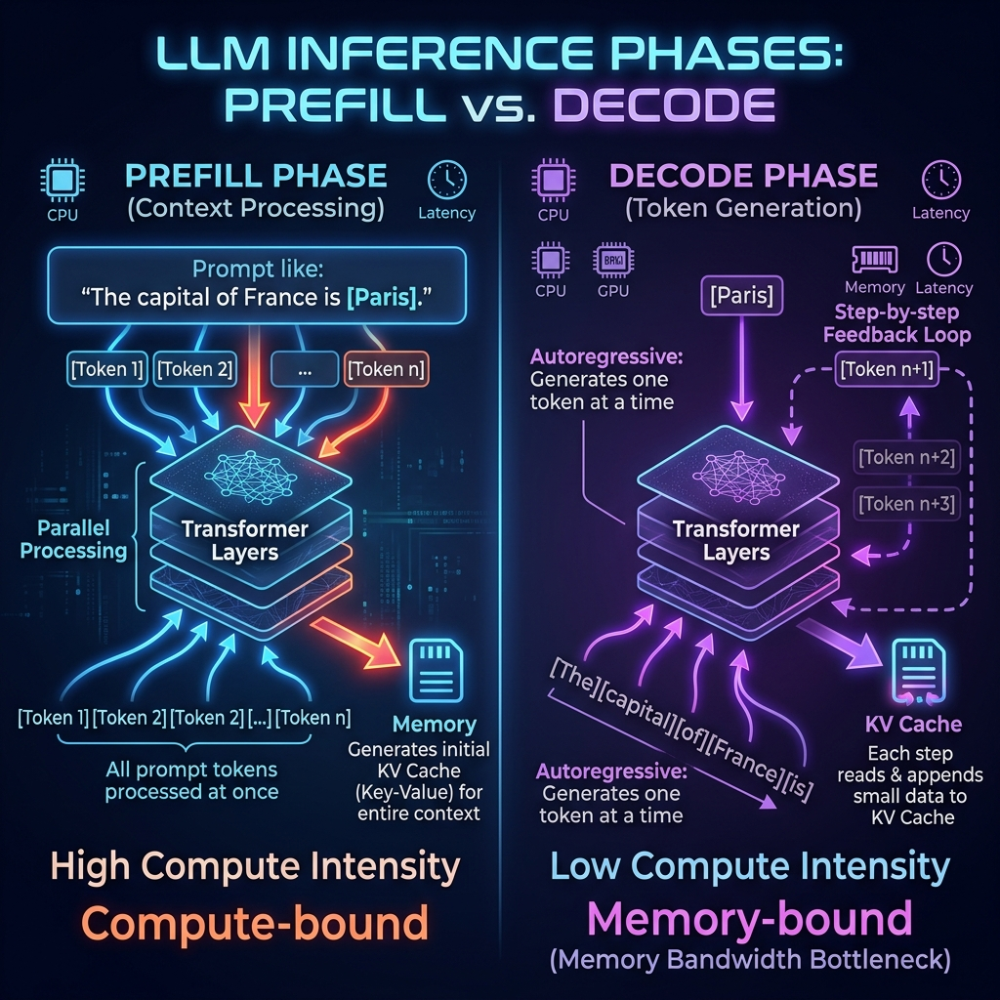
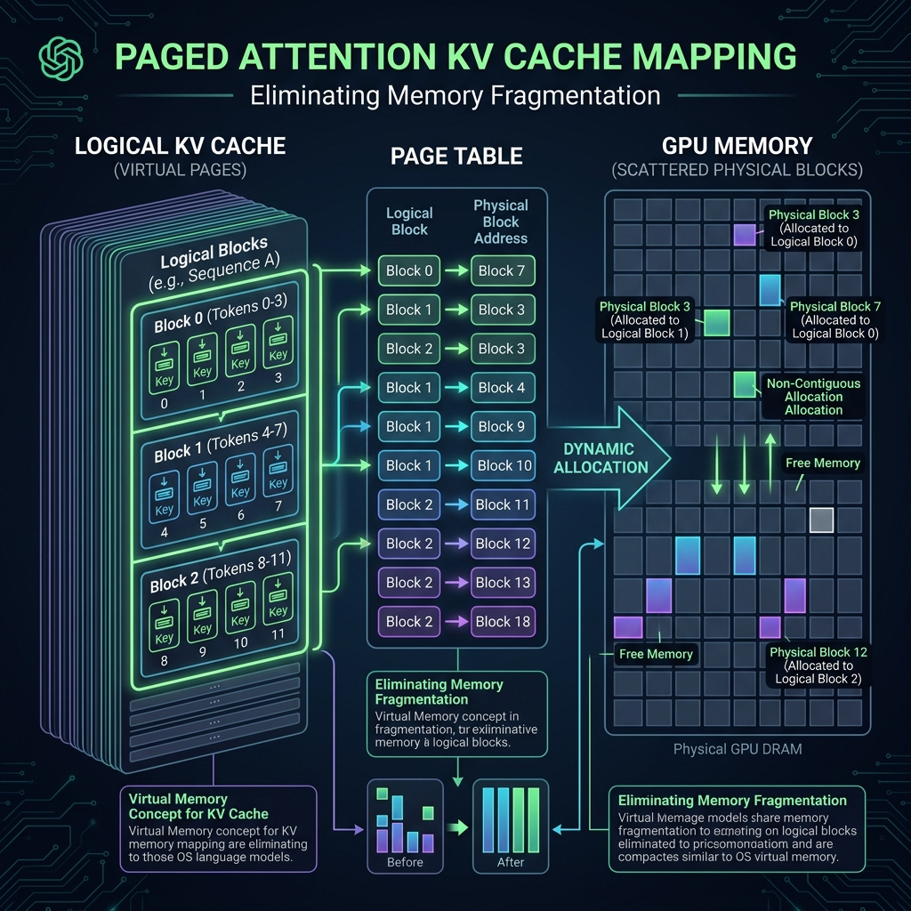
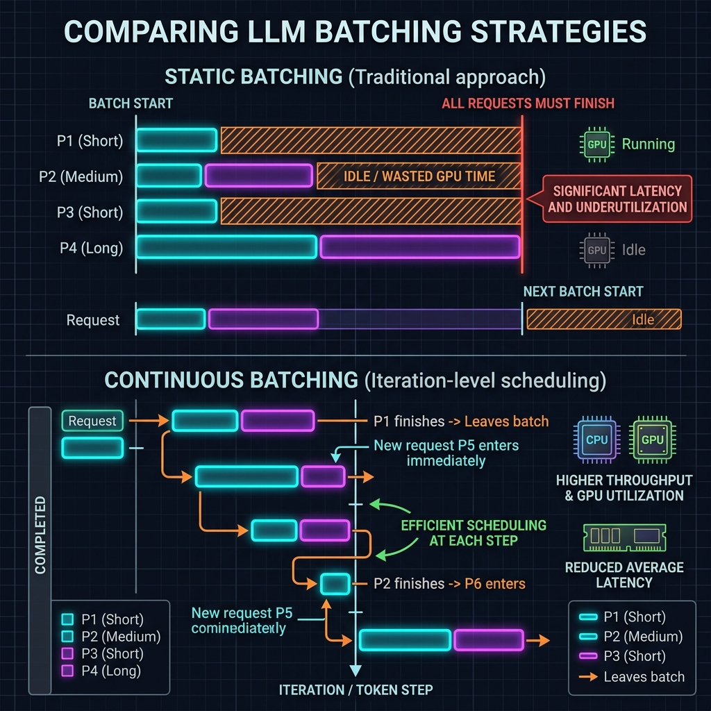
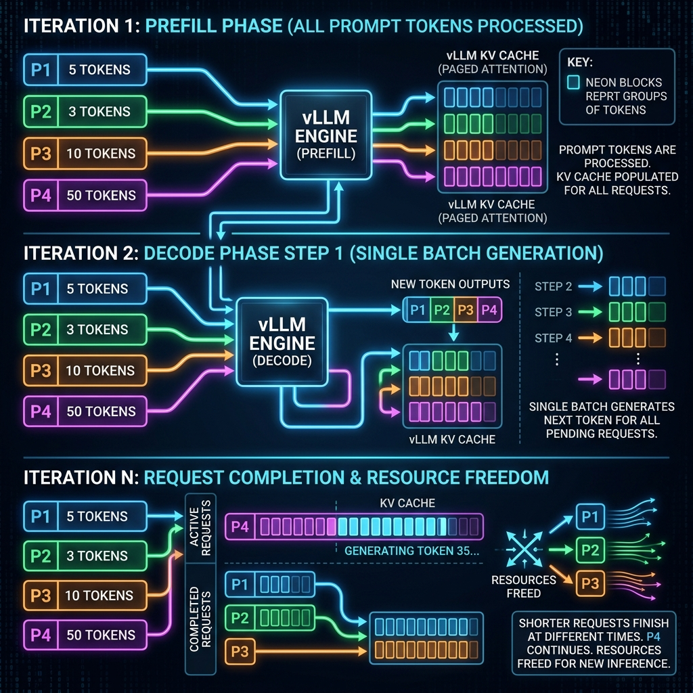

# Illustrated Guide to vLLM Inference Mechanics: Step-by-Step

This developer and educational guide provides a deep, illustrated, and mathematically rigorous walkthrough of what happens during Large Language Model (LLM) inference inside **vLLM**. By analyzing a concrete scenario of four prompts arriving almost simultaneously, we explain how vLLM handles memory bottlenecks, schedules executions, and minimizes fragmentation.

---

## 1. Introduction: The Core Bottleneck of LLM Inference

In generative language modeling, text generation is an **autoregressive process**. To generate each new token, the model must read all previous tokens in the sequence. While simple in concept, this process exhibits severe computational and memory access imbalances.

*Figure 1.1: Prefill (Compute-bound, parallel) vs. Decode (Memory-bound, step-by-step) phases.*

During inference, a request progresses through two distinct phases:
1. **Prefill Phase (Context Processing)**: The model processes the entire user prompt at once. The GPU parallelizes the computation across all prompt tokens, which saturates the GPU's tensor cores. This phase is **compute-bound**.
2. **Decode Phase (Token Generation)**: The model generates output tokens one by one. In each step, the model only processes the single, newly generated token. However, to compute the attention weights for this new token, the model needs to attend to all past tokens. Loading the entire model weights and the cached history of previous tokens from GPU High Bandwidth Memory (HBM) to its local registers (SRAM) for a single token makes this phase highly **memory-bound** (limited by memory bandwidth).

### The KV Cache & The Memory Challenge
During self-attention, for every token $i$, the model computes a Key vector $\mathbf{k}_i$ and a Value vector $\mathbf{v}_i$:
$$\mathbf{k}_i = \mathbf{x}_i \mathbf{W}_k, \quad \mathbf{v}_i = \mathbf{x}_i \mathbf{W}_v$$

When generating the next token $t$, the Query vector $\mathbf{q}_t$ is compared against all past Keys ($\mathbf{k}_{1:t-1}$) and multiplied by all past Values ($\mathbf{v}_{1:t-1}$):
$$\text{Attention}(\mathbf{q}_t, \mathbf{K}, \mathbf{V}) = \text{softmax}\left(\frac{\mathbf{q}_t \mathbf{K}^T}{\sqrt{d_k}}\right) \mathbf{V}$$

To avoid recomputing $\mathbf{k}$ and $\mathbf{v}$ vectors for every past token at every step, we cache them in the **KV Cache**. While the KV cache saves trillions of FLOPS, it grows dynamically and consumes massive amounts of GPU memory. For a Llama-3-8B model (using Grouped-Query Attention with 8 key-value heads, hidden dimension of 128 per head, and 32 layers) in 16-bit precision (2 bytes per element), the KV cache size per token is:
$$\text{KV Cache Size per Token} = 2 \times (\text{layers}) \times (\text{KV heads}) \times (\text{dim}) \times (\text{bytes}) = 2 \times 32 \times 8 \times 128 \times 2 = 131,072 \text{ bytes (128 KB)}$$

For a batch of 128 requests, each generating 2048 tokens, this requires:
$$128 \text{ requests} \times 2048 \text{ tokens} \times 128 \text{ KB} = 33,554,432 \text{ KB} \approx 33.5 \text{ GB}$$

Managing this memory efficiently is the primary challenge that vLLM solves.

---

## 2. Prefill vs. Decode Requests

The computational requirements of the Prefill and Decode phases differ by orders of magnitude. The metric that captures this difference is **Arithmetic Intensity**, defined as the number of floating-point operations (FLOPs) performed per byte of memory transferred:
$$\text{Arithmetic Intensity} = \frac{\text{FLOPs}}{\text{Bytes Transferred}}$$

| Metric / Dimension | Prefill Phase | Decode Phase |
| :--- | :--- | :--- |
| **Input Size** | Entire Prompt ($N$ tokens) | Single Token ($1$ token) |
| **Execution Mode** | Fully Parallel | Autoregressive (Sequential) |
| **Compute Complexity** | High ($O(N)$ weight operations, $O(N^2)$ attention) | Low ($O(1)$ weight operations per step) |
| **Primary Bottleneck** | **Compute-bound** (GPU FLOPs limit) | **Memory-bound** (HBM Bandwidth limit) |
| **Arithmetic Intensity** | High (Weights reused across all prompt tokens) | Low (Weights loaded from HBM for a single token) |
| **KV Cache Activity** | Computes and writes initial KV cache | Reads entire past KV cache; appends new token's KV |

---

## 3. PagedAttention & KV Cache Memory Management

### The Fragmentation Problem in Traditional Frameworks
Traditional LLM frameworks (like HuggingFace or early version vLLM competitors) allocate KV cache memory contiguously for each request. Because the final output length is unknown beforehand, they must pre-allocate memory for the **maximum sequence length** (e.g., 2048 tokens). This leads to three types of memory waste:
1. **Internal Fragmentation**: If a request terminates early (e.g., after 100 tokens out of 2048), the remaining 1948 pre-allocated token slots are wasted.
2. **External Fragmentation**: Free memory is divided into small, non-contiguous segments. Even if the total free memory is large, a new request cannot start if there is no single contiguous chunk large enough to fit its maximum length.
3. **Virtual Memory Reservation (Reservation Waste)**: Memory is reserved for future tokens. Since tokens are generated one by one, the space for token 2048 sits completely empty while tokens 1 to 2047 are being generated.

These inefficiencies cause traditional frameworks to waste **60% to 80%** of GPU memory, severely limiting batch sizes.

### The PagedAttention Solution
**PagedAttention** solves this problem by partitioning the KV cache of each sequence into **Logical Blocks** of fixed size, similar to virtual paging in operating systems.
- Each logical block contains the KV vectors for a fixed number of tokens, denoted as **Block Size** ($B$). Commonly, $B = 4$, $8$, or $16$.
- Physical GPU memory is divided into **Physical Blocks** of the same size.
- Physical blocks do not need to be contiguous.

*Figure 3.1: Page table mapping virtual logical blocks to scattered physical blocks in GPU DRAM.*

A centralized **Block Manager** maintains a **Page Table** for each request. The page table maps logical blocks to physical blocks.

#### Mathematical Formulation of PagedAttention
Let a request have logical blocks $0, 1, \dots, m$. The key cache for the sequence is divided into block-size chunks:
$$\mathbf{K} = \begin{bmatrix} \mathbf{K}^{(0)} \\ \mathbf{K}^{(1)} \\ \vdots \\ \mathbf{K}^{(m)} \end{bmatrix}$$
where each block $\mathbf{K}^{(j)}$ is a tensor of shape $[B, \text{heads}, \text{dim}]$.

During self-attention computation for Query vector $\mathbf{q}_t$, the PagedAttention kernel retrieves the keys block-by-block. The attention score $A_{t, i}$ for token $i$ (which resides in logical block $j = \lfloor i / B \rfloor$ at offset $o = i \bmod B$) is computed as:
$$A_{t, i} = \frac{\mathbf{q}_t \cdot \mathbf{K}^{(j)}[o]^T}{\sqrt{d_k}}$$

Because the GPU kernel accesses the scattered physical blocks via lookup pointers in the Page Table, memory fragmentation is virtually eliminated. The only waste is the unused slots in the final block of a request, which is bounded by $B - 1$ tokens (less than 4% memory waste for $B=16$).

---

## 4. Continuous Batching & Iteration-Level Scheduling

In standard batching (Static Batching), requests are grouped together. The model runs the forward pass on the entire batch. If one request finishes early, its slots remain idle (wasting computation) because the batch cannot finish until the longest request completes.

**Continuous Batching** (or iteration-level scheduling) schedules requests at the level of individual iterations. 

*Figure 4.1: Timeline comparison: Static Batching wastes GPU time while Continuous Batching maximizes throughput.*

At the start of each iteration:
1. The scheduler selects a set of active requests to run.
2. Completed requests are immediately removed from the batch, and their physical memory blocks are freed.
3. New incoming requests can enter the batch immediately; their Prefill phase is executed, and they transition to the Decode phase in the next iteration.
4. **Preemption**: If the GPU runs out of physical blocks because active sequences are growing, the scheduler preempts lower-priority requests. vLLM can preempt a request by:
   - **Swapping**: Transferring its physical blocks from GPU memory to CPU RAM.
   - **Recomputation**: Dropping its blocks entirely, and re-running its prefill from scratch when GPU memory becomes available.

---

## 5. Step-by-Step Scenario Walkthrough (The 4 Prompts)

To illustrate the mechanics of vLLM's Block Manager, Page Tables, and Scheduler, we trace the step-by-step execution of **four prompts** arriving almost simultaneously.

### Scenario Parameters
- **Block Size ($B$)**: 4 tokens (each physical block holds exactly 4 tokens' KV cache).
- **GPU Block Pool**: 30 physical blocks (total capacity = 120 tokens).
- **The Requests**:
  1. **Request 1 ($P_1$)**: Prompt length = 5 tokens. Generates 4 tokens.
  2. **Request 2 ($P_2$)**: Prompt length = 3 tokens. Generates 2 tokens.
  3. **Request 3 ($P_3$)**: Prompt length = 10 tokens. Generates 5 tokens.
  4. **Request 4 ($P_4$)**: Prompt length = 50 tokens. Generates 3 tokens.

Let's represent the logical blocks needed for each request:
- $P_1$ (5 tokens) needs **2 logical blocks**:
  - Logical Block 0: Tokens 0-3 (Full)
  - Logical Block 1: Token 4 (1 token slot filled, 3 empty)
- $P_2$ (3 tokens) needs **1 logical block**:
  - Logical Block 0: Tokens 0-2 (3 slots filled, 1 empty)
- $P_3$ (10 tokens) needs **3 logical blocks**:
  - Logical Block 0: Tokens 0-3 (Full)
  - Logical Block 1: Tokens 4-7 (Full)
  - Logical Block 2: Tokens 8-9 (2 slots filled, 2 empty)
- $P_4$ (50 tokens) needs **13 logical blocks**:
  - Logical Blocks 0 to 11: Tokens 0-47 (Full)
  - Logical Block 12: Tokens 48-49 (2 slots filled, 2 empty)

---

### Step-by-Step Execution Trace

Below is the chronological sequence of engine iterations.

*Figure 5.1: Execution workflow of the 4 prompts showing Prefill, Decode, and Completion states.*

---

### Iteration 1: The Prefill Phase
When the four requests arrive, they are in the **Waiting** queue. The scheduler must compute their prefills.
- Processing a prefill computes the KV cache for the entire prompt.
- **Total prompt tokens** = $5 (P_1) + 3 (P_2) + 10 (P_3) + 50 (P_4) = 68$ tokens.
- **Logical Blocks Required**:
  - $P_1$: 2 blocks
  - $P_2$: 1 block
  - $P_3$: 3 blocks
  - $P_4$: 13 blocks
  - **Total Blocks Needed** = $2 + 1 + 3 + 13 = 19$ blocks.
- Since our GPU pool has 30 physical blocks available, the scheduler has enough memory to process all 4 prompts in parallel. It allocates 19 physical blocks from the free pool.

#### Page Table State after Iteration 1 (Prefill)

| Request | Logical Block | Physical Block | Tokens Contained | Slots Remaining |
| :--- | :--- | :--- | :--- | :--- |
| **$P_1$** | Block 0 | Physical Block 1 | Tokens 0-3 | 0 (Full) |
| | Block 1 | Physical Block 2 | Token 4 | 3 |
| **$P_2$** | Block 0 | Physical Block 3 | Tokens 0-2 | 1 |
| **$P_3$** | Block 0 | Physical Block 4 | Tokens 0-3 | 0 (Full) |
| | Block 1 | Physical Block 5 | Tokens 4-7 | 0 (Full) |
| | Block 2 | Physical Block 6 | Tokens 8-9 | 2 |
| **$P_4$** | Blocks 0-11 | Physical Blocks 7-18 | Tokens 0-47 | 0 (All Full) |
| | Block 12 | Physical Block 19 | Tokens 48-49 | 2 |

- **GPU Memory Usage**: 19 blocks allocated, 11 blocks remain in the free pool.
- **Computation**: The GPU processes the 68 tokens in parallel and outputs the first generated token for each request: $T1_1, T2_1, T3_1, T4_1$.
- All 4 requests transition from the **Waiting** state to the **Running** state (Decode phase).

---

### Iteration 2: Decode Step 1
The scheduler now executes a decode iteration for the 4 requests in parallel.
- The input to the model is a batch of 4 single tokens: $[T1_1, T2_1, T3_1, T4_1]$.
- The model computes attention for these 4 tokens by querying their respective KV caches (stored in Physical Blocks 1-19).
- The newly generated KV vector for each token must be appended to its KV Cache. Let's see how the Block Manager updates the page table slots.

#### Memory Space Check:
- **$P_1$ ($T1_1$)**: Written to Logical Block 1 (mapped to Physical Block 2). Slots remaining: $3 - 1 = 2$.
- **$P_2$ ($T2_1$)**: Written to Logical Block 0 (mapped to Physical Block 3). Slots remaining: $1 - 1 = 0$ (Now Full).
- **$P_3$ ($T3_1$)**: Written to Logical Block 2 (mapped to Physical Block 6). Slots remaining: $2 - 1 = 1$.
- **$P_4$ ($T4_1$)**: Written to Logical Block 12 (mapped to Physical Block 19). Slots remaining: $2 - 1 = 1$.

- **GPU Memory Usage**: No new blocks were allocated. Still 19 blocks allocated, 11 blocks free.
- **Outputs**: The model generates the second tokens: $T1_2, T2_2, T3_2, T4_2$.

---

### Iteration 3: Decode Step 2
The scheduler runs the next decode iteration for all 4 requests.
- Input batch: $[T1_2, T2_2, T3_2, T4_2]$.
- Let's trace the KV caching:
  - **$P_1$ ($T1_2$)**: Written to Logical Block 1 (Physical Block 2). Slots remaining: $2 - 1 = 1$.
  - **$P_2$ ($T2_2$)**: Mapped to Logical Block 1. Since Logical Block 0 is full and no Logical Block 1 exists, the Block Manager allocates a new block from the free pool: **Physical Block 20**. It maps Logical Block 1 $\to$ Physical Block 20. The KV vector is written to Physical Block 20. Slots remaining: 3.
  - **$P_3$ ($T3_2$)**: Written to Logical Block 2 (Physical Block 6). Slots remaining: $1 - 1 = 0$ (Now Full).
  - **$P_4$ ($T4_2$)**: Written to Logical Block 12 (Physical Block 19). Slots remaining: $1 - 1 = 0$ (Now Full).

#### Updated Page Table State after Iteration 3

| Request | Logical Block | Physical Block | Tokens Contained | Slots Remaining |
| :--- | :--- | :--- | :--- | :--- |
| **$P_1$** | Block 0   Block 1 | Physical Block 1   Physical Block 2 | Prompt (0-3)   Prompt(4), $T1_1, T1_2$ | 0   1 |
| **$P_2$** | Block 0   Block 1 | Physical Block 3   Physical Block 20 | Prompt(0-2), $T2_1$   $T2_2$ | 0   3 |
| **$P_3$** | Block 0   Block 1   Block 2 | Physical Block 4   Physical Block 5   Physical Block 6 | Prompt(0-3)   Prompt(4-7)   Prompt(8-9), $T3_1, T3_2$ | 0   0   0 (Full) |
| **$P_4$** | Blocks 0-11   Block 12 | Physical Blocks 7-18   Physical Block 19 | Prompt(0-47)   Prompt(48-49), $T4_1, T4_2$ | 0   0 (Full) |

- **GPU Memory Usage**: 20 blocks allocated (Physical Block 20 added for $P_2$), 10 blocks free.
- **Outputs**: The model generates the third tokens: $T1_3, T2_3, T3_3, T4_3$.
- **State Change**:
  - **$P_2$ completes** after generating 2 tokens ($T2_1, T2_2$). The scheduler marks $P_2$ as **Finished**!
  - The Block Manager immediately frees $P_2$'s allocated physical blocks: **Physical Block 3** and **Physical Block 20**. They are returned to the free block pool.
  - GPU free block pool increases from 10 to 12.

---

### Iteration 4: Decode Step 3
The scheduler runs the decode iteration for the remaining active requests: $P_1, P_3, P_4$.
- Input batch size decreases to 3: $[T1_3, T3_3, T4_3]$.
- KV cache updates:
  - **$P_1$ ($T1_3$)**: Written to Logical Block 1 (Physical Block 2). Slots remaining: $1 - 1 = 0$ (Now Full).
  - **$P_3$ ($T3_3$)**: Logical Block 2 is full. Block Manager allocates **Physical Block 3** (recently freed by $P_2$) and maps Logical Block 3 $\to$ Physical Block 3. $T3_3$ is written to Physical Block 3. Slots remaining: 3.
  - **$P_4$ ($T4_3$)**: Logical Block 12 is full. Block Manager allocates **Physical Block 20** (recently freed by $P_2$) and maps Logical Block 13 $\to$ Physical Block 20. $T4_3$ is written to Physical Block 20. Slots remaining: 3.

- **GPU Memory Usage**:
  - $P_1$: 2 blocks (Physical 1, 2)
  - $P_3$: 4 blocks (Physical 4, 5, 6, 3)
  - $P_4$: 14 blocks (Physical 7-18, 19, 20)
  - **Total Allocated** = 20 blocks. Free Pool = 10 blocks.
- **Outputs**: Generates $T1_4, T3_4, T4_4$.
- **State Change**:
  - **$P_1$ completes** after generating 3 tokens ($T1_1, T1_2, T1_3$). (Wait, request requested 4 tokens. The 4th token $T1_4$ is output, marking the completion).
  - The Block Manager immediately frees $P_1$'s blocks: **Physical Block 1** and **Physical Block 2**.
  - GPU free block pool increases from 10 to 12.

---

### Chronological Block Pool Lifecycle Summary

The following table summarizes the block pool lifecycle over the course of the inference run:

| Iteration | Active Batch | Total Tokens Processed | Allocated Blocks | Free Blocks in Pool | Action Taken |
| :--- | :--- | :--- | :--- | :--- | :--- |
| **0** | None | 0 | 0 | 30 | Requests arrive; queued in Waiting pool. |
| **1** | $P_1, P_2, P_3, P_4$ | 68 (Prefills) | 19 | 11 | Prefills computed. Allocates 19 physical blocks. |
| **2** | $P_1, P_2, P_3, P_4$ | 4 (Decodes) | 19 | 11 | Decodes written to remaining slots. |
| **3** | $P_1, P_2, P_3, P_4$ | 4 (Decodes) | 20 | 10 | $P_2$ allocates Physical Block 20. $P_2$ finishes. Physical Blocks 3 and 20 freed. |
| **4** | $P_1, P_3, P_4$ | 3 (Decodes) | 20 | 10 | $P_3$ allocates Physical Block 3. $P_4$ allocates Physical Block 20. $P_1$ finishes. Physical Blocks 1 and 2 freed. |
| **5** | $P_3, P_4$ | 2 (Decodes) | 18 | 12 | Batch size falls to 2. Active blocks decrease. |

This step-by-step example demonstrates how PagedAttention dynamically recycles memory, enabling continuous throughput without memory waste.

---

## 6. Appendix: Glossary of Key Terms

### Prefill Request (Prefill Phase)
The initial phase of LLM inference where the entire prompt is processed simultaneously in a single forward pass. This computes the activations and initializes the KV cache. This phase is highly parallelized and compute-bound.

### Decoding Request (Decode Phase)
The subsequent phase of LLM inference where tokens are generated one at a time autoregressively. Each iteration processes a single input token (the output of the previous step), making the execution memory-bound due to the need to fetch large weights and KV caches for minimal computation.

### KV Cache (Key-Value Cache)
A memory buffer that stores the computed Key ($\mathbf{K}$) and Value ($\mathbf{V}$) projection vectors of all past tokens in a sequence. Caching these vectors prevents the model from re-evaluating the attention coordinates of past context at each new token step.

### PagedAttention
An attention algorithm and memory management system developed for vLLM that partitions the KV cache of a request into non-contiguous blocks. It eliminates memory fragmentation and allows the sharing of physical blocks (e.g., for parallel sampling or system prompt caching).

### Page Table
A data structure maintained by the vLLM Block Manager that translates logical block indexes (virtual pages representing sequence segments) into physical block addresses (actual locations in GPU High Bandwidth Memory).

### Block Manager
The system component inside the vLLM engine responsible for managing physical GPU and CPU block pools, allocating blocks to requests, updating page tables, and executing block swapping or preemption.

### Logical Block vs. Physical Block
- **Logical Block**: A virtual partition of a sequence's KV cache holding a fixed number of tokens (e.g., Block 0 represents tokens 0-3).
- **Physical Block**: A block of physical GPU memory allocated to hold the actual key and value vectors.

### Continuous Batching
An iteration-level scheduling algorithm that groups requests together at the level of single forward passes (individual token generations) rather than batching them statically. This allows requests to enter and leave the batch dynamically, maximizing hardware utilization.

### Arithmetic Intensity
The ratio of floating-point operations (FLOPs) to memory access bytes:
$$\text{Arithmetic Intensity} = \frac{\text{FLOPs}}{\text{Bytes Transferred}}$$
High intensity indicates a compute-bound workload, while low intensity indicates a memory-bound workload.

### Compute-bound vs. Memory-bound
- **Compute-bound**: A workload whose execution speed is limited by the processor's calculation rate (FLOPs).
- **Memory-bound**: A workload whose execution speed is limited by the rate at which data can be read from or written to memory (bandwidth).

### Preemption & Swapping
- **Preemption**: Suspending an active request's execution due to GPU memory exhaustion.
- **Swapping**: The process of copying a preempted request's physical KV cache blocks from GPU DRAM to CPU DRAM to free up GPU memory, and loading them back when scheduling resumes.
